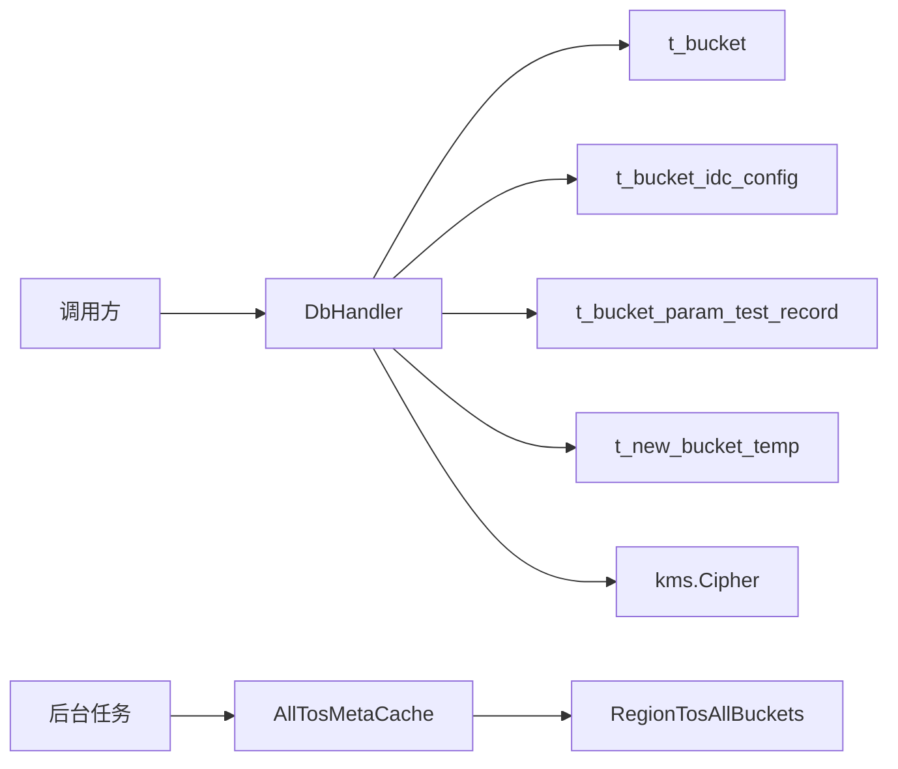

# Bucket Persistence

## 模块概览

Bucket Persistence 模块位于 `db` 包，负责 Bucket 元数据的持久化、加解密、IDC 配置维护、参数测试记录、临时建桶工单，以及 TOS 全量 Bucket 元数据缓存与跨 Region 同步。

模块主要覆盖以下存储面：

- MySQL/GORM 表：
  - `t_bucket`：主 Bucket 元数据
  - `t_bucket_idc_config`：按 IDC 覆盖的后端 Bucket 配置
  - `t_bucket_param_test_record`：Bucket 参数测试记录
  - `t_new_bucket_temp`：临时建桶/审批工单
- Bytedoc/Mongo 集合：
  - `RegionTosAllBuckets`：按 Region 保存 TOS 全量 Bucket 快照

核心设计原则是：写入前加密敏感字段，读取后按场景解密或保持密文；主 Bucket 和 IDC 配置在事务中保持一致；TOS 元数据通过后台任务定期同步到内存缓存。



## 主 Bucket 持久化

主入口定义在 `db/bucket.go`，围绕 `DbHandler` 方法实现。所有数据库操作都会通过 `util.EmitThroughput` 和 `util.EmitLatency` 上报命令吞吐和耗时，并通过 `retry.Do` 或 `retry.DoCanAbort` 包裹重试逻辑。

### 创建 Bucket

`CreateBucket(ctx, bucket)` 的流程：

1. 调用 `encryptBucket(bucket)`，加密 `meta.Bucket` 的敏感字段。
2. 开启写库事务：`db.w.Begin().Context(ctx)`。
3. 使用 `IdGenCli.Get(util.WithoutCancel(ctx))` 为 `bucket.Id` 生成 ID。
4. 写入 `t_bucket`。
5. 如果 `bucket.IdcConfigs` 非空，使用 `IdGenCli.MGet` 批量生成配置 ID，并逐条写入 `t_bucket_idc_config`。
6. 提交事务；任一步失败时调用 `RollbackTX(tx, err)`。

需要注意：`encryptBucket` 会原地修改传入的 `bucket`，调用完成后对象中的 `AccessKey`、`SecretKey`、`BackendBucket` 以及 `IdcConfigs[*].BackendBucket` 已经变为密文或重新序列化后的内容。

### 更新 Bucket

`UpdateBucket(ctx, bucket)` 用于完整更新主 Bucket 的核心字段，并重建 IDC 配置：

1. 先调用 `encryptBucket(bucket)`。
2. 在事务中按 `name` 更新 `t_bucket` 的字段，包括 `BackendBucket`、`BackendType`、`Owner`、`Providers`、`IDC`、`Category`、`AccessKey`、`SecretKey`、`TTL`、`Extra`、`HijackConf`、`GatewayConf` 等。
3. 查询并删除该 Bucket 已存在的全部 `t_bucket_idc_config`。
4. 为当前 `bucket.IdcConfigs` 重新生成 ID 并插入。

因此，`UpdateBucket` 对 IDC 配置采用“先删后建”的语义，不保留旧配置 ID。

`OverwriteBucket(ctx, bucket)` 也会调用 `encryptBucket(bucket)`，但只更新 `t_bucket` 主表，不处理 `t_bucket_idc_config`。它使用 `map[string]interface{}` 作为更新字段集合，适合只覆盖主表属性的场景。

### 删除 Bucket

`DeleteBucket(ctx, name)` 在同一事务内：

1. 从 `t_bucket` 按 `name` 读取 Bucket。
2. 删除 `t_bucket` 中该名称的记录。
3. 删除 `t_bucket_idc_config` 中同名配置。

删除逻辑以 Bucket 名称作为关联键，而不是以主键 ID 关联。

## 查询路径与解密语义

模块区分“密文读取”和“解密读取”。

### 密文读取

以下方法直接返回数据库中的密文数据，不调用 KMS 解密：

- `GetUndecryptedBucketByName(ctx, name)`
- `BatchGetUndecryptedBucket(ctx, names)`
- `GetUndecryptedAllBuckets(ctx)`
- `BatchGetUndecryptedAllBuckets(ctx, batchSize)`
- `GetAllBucketNames(ctx)`

`GetUndecryptedBucketByName` 使用 `retry.DoCanAbort`：当 GORM 返回 `gorm.ErrRecordNotFound` 时会中止重试，避免对不存在记录做无意义重试。

`BatchGetUndecryptedBucket` 和 `GetUndecryptedAllBuckets` 都会额外查询 `t_bucket_idc_config`，按 `config.Name` 分组后回填到对应 `meta.Bucket.IdcConfigs`。没有 IDC 配置时，会填充空切片，而不是保留 `nil`。

`BatchGetUndecryptedAllBuckets(ctx, batchSize)` 先通过 `GetAllBucketNames` 获取所有名称，再按批次调用 `BatchGetUndecryptedBucket`，用于避免一次性拉取过大的 Bucket 集合。

### 解密读取

`GetBucketByName(ctx, name, ignoreAkSk)` 先调用 `GetUndecryptedBucketByName`，成功后调用 `DecryptBucketWithConfig`。

`ListBucketsByProvider(ctx, provider)` 查询 `owner = provider` 的 Bucket 列表，然后逐个调用 `DecryptBucketWithConfig(ctx, bucket, false)`。该方法只查询主表，不回填 IDC 配置。

`DecryptBucketsWithConfig(ctx, buckets, ignoreAkSk)` 会并发解密列表中的每个 Bucket，内部使用 `sync.WaitGroup`，每个 Bucket 一个 goroutine。

### `ignoreAkSk` 的含义

`DecryptBucketWithConfig(ctx, bucket, ignoreAkSk)` 会处理三类数据：

- `bucket.AccessKey`
- `bucket.SecretKey`
- `bucket.BackendBucket` 以及每个 `IdcConfigs[*].BackendBucket`

当 `ignoreAkSk == false` 时，会尝试解密并回填明文 AK/SK。

当 `ignoreAkSk == true` 时：

- `bucket.AccessKey` 和 `bucket.SecretKey` 会被置空。
- 后端 Bucket 中的访问凭证字段也会被置空，例如 S3 的 `Secret`/`KeyID`、TOS 的 `AccessKey`/`SecretKey`、GCS 的 `Credential` 等。
- 非敏感配置仍会被解析、校验并重新序列化返回。

这适合面向控制台或只需要展示配置但不能暴露密钥的接口。

## 后端 Bucket 加解密

`encryptBucket` 和 `DecryptBucketWithConfig` 都会委托到后端类型相关函数：

- `encryptBackendBucket(backendType, bucketName, backendBucket)`
- `decryptBackendBucket(backendType, bucketName, backendBucket, ignoreAkSk)`

后端配置本质上是一个 JSON 字符串。代码会根据 `meta.Backend*` 类型调用 SDK 解析函数，例如：

- `meta.GetTosBucket`
- `meta.GetS3Bucket`
- `meta.GetOSSBucket`
- `meta.GetMosaicBucket`
- `meta.GetGCSBucket`
- `meta.GetP2PBucket`
- `meta.GetTobTosBucket`
- `meta.GetToBCustomerS3Bucket`
- `meta.GetHDFSBucket`

解析后会加密或解密对应敏感字段，再调用 `Validate()` 校验，最后 `json.Marshal` 回字符串。

无需加密的后端类型会直接返回原始字符串：

- `meta.BackendLarkDrive`
- `meta.BackendFS`

`meta.BackendHDFS` 会解析并校验，但没有敏感字段加解密。

TOS 解密路径还有额外逻辑：如果 `TosMetaCache.GetTosMeta(tosBkt.Name)` 命中，会用 TOS 元数据补充 `Public`、`Creator`，并在 TOS Bucket 创建超过一天后使用缓存中的 `TTL`。

## IDC 配置管理

`db/bucket_idc_config.go` 提供独立的 IDC 配置增删接口。

`CreateBucketIDCConfigs(ctx, bucketName, backendType, idcConfigs)`：

1. 调用 `encryptBucketIDCConfigs(bucketName, backendType, idcConfigs)`。
2. 开启事务。
3. 使用 `IdGenCli.MGet(util.WithoutCancel(ctx), len(idcConfigs))` 批量生成 ID。
4. 逐条插入 `t_bucket_idc_config`。

`DeleteBucketIDCConfigs(ctx, bucketName, idcList)`：

- 按 `name = bucketName and idc in (?)` 删除配置。
- 不修改主 Bucket 表。

`encryptBucketIDCConfigs` 会遍历每个 `meta.BucketIdcConfig`，只加密其 `BackendBucket` 字段，不处理主 Bucket 的 `AccessKey` 或 `SecretKey`。

## Bucket 参数测试记录

参数测试记录同样定义在 `db/bucket.go`。

`CreateBucketTestRecord(ctx, bkt)` 会构造 `meta.BucketParamTestRecord`：

- `BucketName` 来自 `bkt.Name`
- `IDC` 来自 `bkt.IDC`
- `BackendBucket`、`BackendType` 来自当前 Bucket 参数
- `TestStatus` 初始为 `meta.Bucket_Testing`
- `BucketDefaultConfig` 根据 `len(bkt.IdcConfigs) == 0` 判断
- `Validate` 初始为 `true`

事务内会先把同 Bucket、同 IDC、仍有效的旧记录置为 `validate = false`，再插入新记录。随后根据 `BucketDefaultConfig` 更新测试状态：

- 默认配置：更新 `t_bucket.test_status`
- IDC 配置：更新 `t_bucket_idc_config.test_status`

`GetBucketTestRecord(ctx, bktName, idc)` 只查询 `validate = 1` 的当前有效记录。

`UpdateBucketTestResult(ctx, record, testStatus, err)` 更新测试记录的 `TestStatus` 和 `ErrorMsg`，并同步更新主 Bucket 或 IDC 配置的 `TestStatus`。该方法不向调用方返回错误，只在数据库更新失败时通过 `logs.CtxError` 记录日志。

## 临时 Bucket 工单

`db/temp_bucket.go` 管理 `t_new_bucket_temp`，用于建桶审批或临时申请流程。

状态常量：

- `TicketWaitingForApprove = 0`
- `TicketExpired = -1`
- `TicketSuccess = 1`

主要方法：

- `CreateTempBucket(ctx, bucket)`：生成 ID 并插入临时 Bucket。
- `DeleteTempBucket(ctx, name)`：按名称删除。
- `GetAllWaitingTempBucketsFromDB(ctx)`：查询所有待审批工单。
- `GetValidTempBucketByName(ctx, name)`：查询 `ticket_status != -1` 的有效工单。
- `UpdateTicketStatusByName(ctx, name, status)`：更新工单状态。

`UpdateTicketStatusByName` 有一个重要约束：SQL 条件包含 `ticket_status != TicketSuccess`，表示工单一旦成功，不会再被覆盖成其他状态。若更新为 `TicketExpired`，会同步设置 `ExpiredAt = time.Now().Unix()`。

`tosapi.go` 中的 `scanAllTicketStatus(ctx, expireElapse)` 会周期性扫描待审批工单，超过指定分钟数后调用 `UpdateTicketStatusByName` 标记过期。

## Region TOS Bucket 快照

`db/bucket_doc.go` 抽象了 Region 维度的 TOS 全量 Bucket 快照。

核心接口是 `RegionBucketsApi`：

```go
type RegionBucketsApi interface {
	CreateRegionBuckets(ctx context.Context, doc *RegionTosAllBucketsDB) error
	QueryRegionBuckets(ctx context.Context, doc *RegionTosAllBucketsDB) error
	UpdateTosAllBucketsDB(ctx context.Context, doc *RegionTosAllBucketsDB) error
	ListAllRegionTosBuckets(ctx context.Context) ([]*RegionTosAllBucketsDB, error)
}
```

数据结构为 `RegionTosAllBucketsDB`：

- `Region`：Region 名称
- `LastUpdateTime`：版本时间，使用 UnixNano
- `AllBuckets`：`[]*rpc.AdminBucketV1`

模块提供两套实现：

- `regionBucketApiImpl`：直接访问 Mongo collection。
- `regionBucketApiRemoteImpl`：通过 Hertz HTTP 调用远端 gateway 接口。

### 本地 Mongo 实现

`regionBucketApiImpl` 直接操作 `tosAllBucketsCol`：

- `CreateRegionBuckets`：`InsertOne`
- `QueryRegionBuckets`：按 `region` 查询并 Decode
- `UpdateTosAllBucketsDB`：按 `region + lastUpdateTime` 做乐观更新，更新 `lastUpdateTime` 和 `allBuckets`
- `ListAllRegionTosBuckets`：按 `region` 排序批量读取

`UpdateTosAllBucketsDB` 的过滤条件包含旧 `LastUpdateTime`，用于避免覆盖已被其他进程更新过的版本。

### 远程实现

`regionBucketApiRemoteImpl` 通过 `DoReq` 发送 HTTP 请求：

- `CreateRegionBuckets`：`POST /gateway/v1/region_buckets/create`
- `QueryRegionBuckets`：`POST /gateway/v1/region_buckets/query`
- `UpdateTosAllBucketsDB`：`POST /gateway/v1/region_buckets/update`
- `ListAllRegionTosBuckets`：`POST /gateway/v1/region_buckets/list`

`DoReq` 会把标准 `http.Request` 转为 Hertz `protocol.Request`，设置 `X-Tt-From`，并根据配置附加服务发现参数：

- `discovery.WithSD`
- `discovery.WithDestinationCluster`
- `discovery.WithDestinationIDC`
- `discovery.WithDestinationENV`

响应状态码必须在 2xx 范围内，业务响应 `Code` 必须等于 `janus.JanusOkCode`。

`ListAllRegionTosBuckets` 在拿到远端结果后，会逐个调用 `UpsertLocalRegionBuckets` 尝试写回本地缓存集合。

### 本地写回优化

`UpsertLocalRegionBuckets(ctx, doc)` 用于把远端 Region 快照写回本地 Mongo。它有几个保护条件：

- `doc == nil` 时直接返回。
- `writeBack == false` 时跳过。
- `localTosAllBucketsCol == nil` 时跳过。

实际更新前会先做一次轻量查询，只投影 `lastUpdateTime`，避免把几十 MB 的 `allBuckets` 拉回本地。如果本地版本不旧于入参版本，则直接跳过。

真正更新时使用条件：

```go
filter := bson.M{
    "region":         doc.Region,
    "lastUpdateTime": bson.M{"$lt": doc.LastUpdateTime},
}
```

并设置 `Update().SetUpsert(true)`。这样可以避免并发场景下旧数据覆盖新数据。

## TOS 元数据缓存

`db/tosapi.go` 中的 `AllTosMetaCache` 是内存缓存结构：

- `BucketCache sync.Map`：`map[string]*rpc.AdminBucketV1`
- `BucketListCache []*meta.TosBucket`：转换后的 TOS Bucket 列表缓存
- `BucketListCacheExpireAt int64`：列表缓存过期时间
- `RegionVersionMap sync.Map`：`map[string]int64`，记录各 Region 已应用的快照版本

`InitTosMetaCache()` 初始化全局 `TosMetaCache`，并启动后台任务：

1. 立即调用 `asyncUpdateAllTosBktCache(context.Background())` 初始化缓存。
2. 每 5 分钟刷新一次 TOS Bucket 缓存。
3. 如果 `config.Conf.SyncTosBuckets` 为真，每 5 分钟执行 `asyncUpdateAllTosBucketsIntoBytedoc`。
4. 每 10 分钟执行 `scanAllTicketStatus` 扫描过期临时工单。

如果 `config.Conf.TosAPI.Disable` 为真，会跳过 TOS 元数据缓存初始化。

### 缓存刷新流程

`asyncUpdateAllTosBktCache(ctx)` 的数据来源有两个：

1. `Db.BatchGetUndecryptedAllBuckets(ctx, 300)` 读取 bktmeta 数据库中的 Bucket，用于解决重名 Bucket 的 IDC 冲突。
2. `TosRegionBucketsApi.ListAllRegionTosBuckets(ctx)` 获取所有 Region 的 TOS 快照。

每个 Region 的快照只有在 `RegionVersionMap` 中不存在，或远端 `LastUpdateTime` 更大时才会应用。

写入 `BucketCache` 前会检查 Region 与 IDC 的允许关系。`regionAllowUpdateIdcs` 定义了每个 Region 可更新的 IDC 集合。对于 `cn`、`maliva`、`sg1`、`useast2a`、`useast5` 等容易混乱的 IDC，`needCheckAllowIdc` 会要求更严格的校验。

当发现 TOS 缓存已有同名 Bucket 且 IDC 不一致时，会参考 `bktmetaBucketCache` 中的数据库记录：如果数据库中该 Bucket 的 IDC 也不等于新元数据的 IDC，则跳过这次更新。

### TOS 列表转换

`GetAllTosBuckets()` 会把 `BucketCache` 中的 `rpc.AdminBucketV1` 转成 `meta.TosBucket`。结果缓存 1 分钟，期间重复调用直接返回 `BucketListCache`。

转换时会根据 IDC 推导 Region：

- `IDC == "cn"` 时使用 `env.R_CN`
- 其他 IDC 使用 `env.GetRegionFromIDC`

生成的 `meta.TosBucket` 会填充 `Name`、`Cluster`、`IDC`、`Region`、`PSM`、`Type`、`Creator`、`Public`、`TTL` 等字段。

### 同步 TOS 快照到 Bytedoc

`asyncUpdateAllTosBucketsIntoBytedoc(ctx)` 用于把当前 Region 的 TOS 全量 Bucket 同步到 `RegionTosAllBuckets`。

流程：

1. 查询当前 Region 的已有快照：`TosRegionBucketsApi.QueryRegionBuckets`。
2. 如果快照更新时间未超过 5 分钟，则跳过。
3. 调用 `rpc.TosV3Cli.GetAllBuckets(ctx)` 获取全量 Bucket。
4. 调用 `rpc.TosV3Cli.GetAllBucketsWithCache(ctx)` 获取 TTL 信息。
5. 如果旧数据非空且新 Bucket 数量少于旧数量，则跳过更新，避免异常少量数据覆盖正常快照。
6. 使用 `getIdcFromAdminBkt` 从 `AdminBucketV1.VRegion` 解析 IDC，并合并 TTL。
7. 已有快照则调用 `UpdateTosAllBucketsDB`，否则调用 `CreateRegionBuckets`。

`getIdcFromAdminBkt` 解析 `VRegion` 的格式类似 `Singapore-Central/sg1/Default/Gcs`，取第二段作为 IDC，并对 `CN-3DC`、`CN-ZG`、`CN6-3DC` 做特殊映射。

## 事务、重试与上下文

写路径基本都采用以下模式：

```go
return retry.Do(retryInfo, db.retryTimes, db.retryTimeout, func() error {
    tx := db.w.Begin().Context(ctx)
    // 写主表或关联表
    if err != nil {
        return RollbackTX(tx, err)
    }
    return tx.Commit().Error
})
```

读路径使用 `db.r.Table(...).Context(ctx)`，写路径使用 `db.w.Begin()`。

生成 ID 的调用通常使用 `util.WithoutCancel(ctx)`，例如 `CreateBucket`、`UpdateBucket`、`CreateBucketIDCConfigs`。这表示即使外层请求上下文取消，ID 生成仍不直接跟随取消信号中断。

`GetUndecryptedBucketByName` 使用 `retry.DoCanAbort` 区分可重试错误与不可重试错误。其他查询多使用普通 `retry.Do`。

## 贡献时需要注意的点

新增后端类型时，需要同时更新：

- `encryptBackendBucket`
- `decryptBackendBucket`

并确保：

- 使用对应的 `meta.Get*Bucket` 解析函数。
- 对所有敏感字段调用 `kms.Cipher.Encrypt` / `kms.Cipher.Decrypt`。
- 调用 `Validate()` 后再序列化。
- `ignoreAkSk` 分支清空所有凭证字段。
- 不需要加密的后端类型应明确直接返回原始配置。

修改 Bucket 写路径时，需要确认是否应同步处理 IDC 配置：

- 需要重建 IDC 配置：使用或调整 `UpdateBucket`。
- 只覆盖主表：使用或调整 `OverwriteBucket`。
- 只新增/删除 IDC 配置：使用 `CreateBucketIDCConfigs` / `DeleteBucketIDCConfigs`。

调用解密读取接口时，需要根据接口暴露范围选择 `ignoreAkSk`。面向外部展示或控制台列表时，通常应避免返回明文凭证。

处理 TOS 缓存逻辑时，需要保持 `RegionVersionMap` 和 `regionAllowUpdateIdcs` 的约束，否则可能在跨 Region 同名 Bucket 场景下污染缓存。