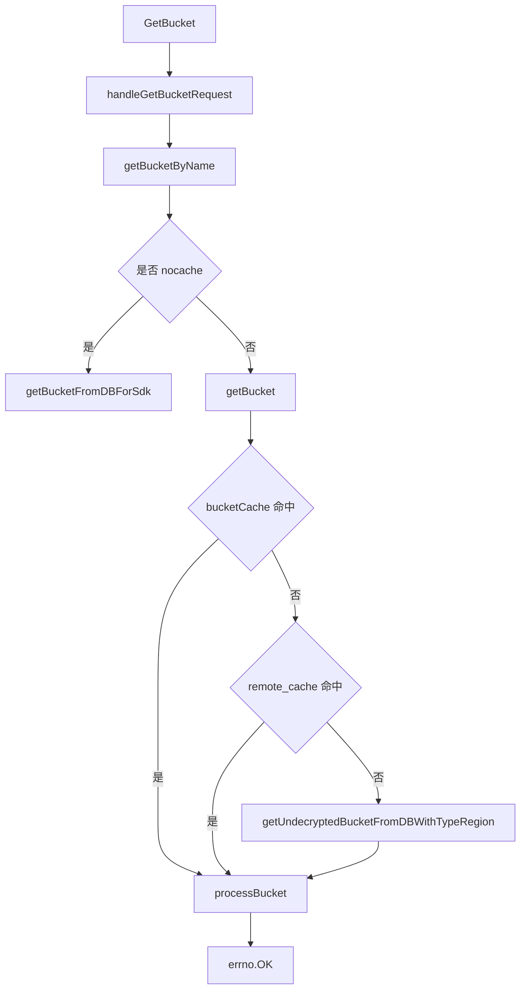

# Bucket Service

## 模块概览

Bucket Service 以 `MetaBucketApi` 为核心，负责 bucket 元数据的创建、查询、更新、删除、缓存刷新，以及 TOS、ToB TOS、Volcengine、Janus 管理端等场景的适配。模块主要位于 `service/bucket_handler.go`，并由 `async_task.go`、`bucket_simple_handler.go`、`tos_handler.go`、`tos_s3_bucket_handler.go`、`volcengine_handler.go`、`script.go` 等文件补充后台刷新、简化接口和运维脚本能力。

该模块不直接暴露裸数据结构给 HTTP 层，而是通过 `middleware.Response` / `middleware.ResponseZti` 包装 handler，例如 `GetBucket` 调用 `handleGetBucketRequest`，再进入 `getBucketByName` 和 `getBucket`。统一返回值使用 `errno.Payload`，成功响应通常由 `errno.OK` 或 `errno.OKWithETag` 构造。

## 核心对象

`MetaBucketApi` 是模块的服务对象，持有数据库句柄、缓存、IDC 代理配置、StorageGW 客户端和 ToB TOS 区域配置：

```go
type MetaBucketApi struct {
    bucketCache       sync.Map
    allBucketsCache   sync.Map
    simpleBucketCache sync.Map

    allSimpleBucketsCache   atomic.Value
    decryptedAllBucketCache atomic.Value

    tobTosBktCache         sync.Map
    bucketsByProviderCache sync.Map
    dbh                    *db.DbHandler
    idcProxySettingApi     *IdcProxySettingApi
    storageGwCli           *storagegw.Client
    dbKeyLock              util.KeyLock
    tosTobRegionEndpoints  []*TosTobRegionEndpoint
    encryptBucketsCache    bucketEncryptInfoCache
}
```

主要缓存含义如下：

| 缓存字段 | 内容 | 使用场景 |
| --- | --- | --- |
| `bucketCache` | 单个 bucket 的本地缓存，缓存未解密原始对象或空值 | `getBucket` |
| `allBucketsCache` | 全量 bucket 响应字节与 ETag，按 `idc` 和请求 IDC 分组 | `handleGetAllBucketsRequest` |
| `simpleBucketCache` | simple 单 bucket 缓存 | `GetBucketSimple` |
| `allSimpleBucketsCache` | simple 全量 bucket 响应字节与 ETag | `GetAllBucketsSimple` |
| `decryptedAllBucketCache` | 已解密但未计算单元化配置的全量 bucket | 避免新 IDC 组合穿透 DB |
| `tobTosBktCache` | ToB TOS bucket 基础信息缓存 | `GetTobTosBucketBaseInfo` |
| `bucketsByProviderCache` | provider 到 bucket 列表缓存 | `ListBucketsByProvider` |
| `encryptBucketsCache` | 加密 bucket 信息，短期缓存 1 分钟 | `GetAllEncryptionBuckets` |

`NewMetaBucketApi` 初始化这些缓存、StorageGW 客户端和 ToB TOS 区域配置，并同步执行一次 `asyncUpdateAllBktCache`。如果初始缓存构建失败，服务会 panic。随后它启动后台 goroutine，按 `tcc.GetLocalCacheRefreshInterval` 返回的间隔周期刷新全量缓存，并监听 `tcc.LocalCacheRefreshIntervalTccKey` 动态调整刷新周期。

## 查询主流程

单 bucket 查询入口是 `GetBucket`，核心路径是 `handleGetBucketRequest` → `getBucketByName` → `getBucket`。`getBucket` 的读取顺序是本地缓存、远程缓存、数据库。



`processBucket` 做两件事：

1. 调用 `db.DecryptBucketWithConfig(ctx, bkt, ignoreAkSk)` 解密 bucket 配置。
2. 调用 `calcIdcConfigs(ctx, queryIdc, requestEnvIdc, bkt)` 计算单元化配置和代理信息。

`getBucketByName` 支持通过请求头 `X-TT-From` 触发绕过缓存。当前 `nocache` 白名单包括 `toutiao.videoarch.vod` 和 `toutiao.videoarch.aether`。

## 全量查询与 ETag

`GetAllBuckets` 由 `handleGetAllBucketsRequest` 处理。请求会先经过 `util.BktMetaLocalLimiter.Allow(util.AllBucketLimiter)` 限流，然后读取查询参数 `idc` 和请求头 `client.ENV_IDC_HEADER`，生成缓存 key：

```go
func getAllBucketCacheKey(queryIdc, requestEnvIdc string) string {
    return allBktCacheKey + "_" + queryIdc + "_" + requestEnvIdc
}
```

如果 `allBucketsCache` 命中，直接返回 `errno.OKWithETag(cacheVal.cachedResp, cacheVal.etag)`。如果未命中，则优先从 `decryptedAllBucketCache` 复制全量 bucket，再按当前 IDC 组合调用 `calcIdcConfigs`，最后通过 `bucketsToCacheItem` 生成响应字节和 ETag。

只有在 `decryptedAllBucketCache` 不存在时，才会走数据库兜底。兜底逻辑用 `api.dbKeyLock.TryLock(cacheKey)` 做进程内 single-flight，最多重试 `dbRequestRetryTimes` 次，每次失败后 sleep 500ms。

## simple 查询

`GetAllBucketsSimple` 和 `GetBucketSimple` 面向轻量元数据场景。

`GetAllBucketsSimple` 使用 `allSimpleBucketsCache`，响应同样包含 ETag。缓存缺失时通过 `getAllBucketsFromDBWithTypeRegion(c, true)` 查询，并传入 `ignoreAkSk=true`，避免返回 AK/SK。

`GetBucketSimple` 先读 `simpleBucketCache`。如果本地没有注册 bucket，会从 `db.TosMetaCache.GetTosMeta(bucketName)` 构造一个未注册的 TOS bucket：

```go
func (api *MetaBucketApi) buildBktFromTosAdminBucket(ctx context.Context, tosAdminBucket *rpc.AdminBucketV1) *meta.Bucket
```

该 fallback 会设置 `Unregistered: true`，并填充 `BackendBucket` 为 `meta.TosBucket` 的 JSON。

## 缓存刷新与远程缓存

`asyncUpdateAllBktCache` 是全量缓存刷新核心。它会创建带 logid 的 tracing context，并开启 `BktMeta/AsyncUpdateAllBktCache` span。

远程缓存启用时，刷新流程优先读取 `bucketNameSetKey` 保存的 bucket name 集合，再通过 `PipelineGet` 批量获取 bucket。对于缓存 miss、空值缓存、逻辑过期的数据，会按 `cacheConfig.RefreshBatchSize` 分批调用 `batchGetUndecryptedBucketsFromDBWithTypeRegion` 回源 DB，并通过 `PipelineSet` 写回远程缓存。

如果远程缓存 name set 为空，`initRemoteCache` 会用 `setAllBucketsNxKey` 做分布式锁，只允许一个实例从 DB 初始化全量远程缓存。`syncBucketNamesWithDB` 是兜底对账逻辑，用 `syncBucketNamesWithDBNxKey` 限制单实例执行，对比 `dbh.GetAllBucketNames` 和远程缓存集合，补充缺失 name 或删除多余 name。

本地全量缓存刷新顺序：

1. 获取未解密全量 bucket。
2. 复制一份 `allSimpleBkts`，调用 `db.DecryptBucketsWithConfig(traceCtx, allSimpleBkts, true)`，构建 simple 全量和单 bucket 缓存。
3. 对原始 `allBkts` 调用 `db.DecryptBucketsWithConfig(traceCtx, allBkts, false)`，存入 `decryptedAllBucketCache`。
4. 遍历已有 `allBucketsCache` key，对不同 `queryIdc/requestEnvIdc` 组合重新计算 `calcIdcConfigs` 并更新响应缓存。
5. 调用 `syncBucketNamesWithDB` 对账远程 name set。

## 创建、更新和删除

`CreateBucket` 入口绑定 `meta.Bucket` 后调用 `createBucket`。核心步骤是：

1. 如果是 `meta.BackendTos`，解析 `bucket.GetTosBucket()`，调用 `fillTosBktInfo` 补充 PSM、Public、TTL，并尝试通过 `rpc.TosV3Cli.AppendBucketManager` 添加 `videoarch_bktmetaapi` 为管理员。
2. 如果是 `meta.BackendToBTos`，调用 `fillTobTosIDC` 根据 region 补齐 IDC。
3. 调用 `validateBkt` 校验 bucket。
4. 调用 `genAkSk` 生成 AK/SK。
5. 调用 `genEncryptionKey` 生成加密 key。
6. 未传 `IdcConfigs` 时调用 `fillDefaultIDCConfigs` 自动补默认单元化配置。
7. 调用 `api.dbh.CreateBucket` 落库。
8. 调用 `removeBucketCache` 清理本地缓存，并异步删除远程单 bucket 缓存、把 bucket name 加入远程 name set。

`UpdateBucket` 和 `OverwriteBucket` 分别进入 `updateBucket`、`overwriteBucket`，都会执行 `validateBkt`、写 DB、清理本地缓存，并在远程缓存开启时异步删除对应 key。

`DeleteBucket` 调用 `deleteBucket`，先 `api.dbh.DeleteBucket`，再清理本地缓存，并异步从远程 name set 删除 bucket name、删除远程单 bucket 缓存。

## IDC、Region 与代理计算

`calcIdcConfigs` 是 bucket 返回前的关键加工函数。它根据 `queryIdc` 选择匹配的 `BucketIdcConfig`，并把匹配配置覆盖到 bucket 的 `BackendBucket`、`IDC`、`IDCType`、`IDCRegion`、`HijackConf`、`GatewayConf` 等字段。

如果请求环境 IDC 是聚合机房，并且 bucket IDC 是 `cn` 或 `lf,hl`，函数会把 bucket IDC 调整到对应中心 IDC。之后它会基于 `getIdcMap` 返回的 IDC 代理配置，为跨 IDC 访问场景填充 `bkt.Proxies`。

`fillIdcTypeAndRegion` 和 `getIdcTypeAndRegion` 用于在 DB 读取后补齐 `IDCRegion` 和 `IDCType`。它兼容 `cn`、包含 `oss` 的老 IDC、逗号分隔多 IDC，以及聚合 IDC、中心 IDC、边缘 IDC 的类型判断。

## TOS 相关能力

`fillTosBktInfo` 会优先从 `db.TosMetaCache.GetTosMeta` 获取 TOS 管理面元数据；缓存没有时，调用 `rpc.TosV3Cli.QueryBucket` 查询 TOS，并用 `filterTOSPSM` 去掉 PSM 中的 `.service.` 后缀部分。查询失败时默认使用 `toutiao.tos.tosapi` 兜底。

Janus 管理端相关接口包括：

| 函数 | 作用 |
| --- | --- |
| `GetAllBucketsJanus` | 分页查询 bucket，使用 `pageBucketsForJanus` |
| `GetBucketJanus` | 查询单 bucket，并补充 TOS 或 ToB TOS 展示信息 |
| `UpdateBucketsIdcJanus` | 批量迁移 TOS bucket 的 IDC |
| `UpdateBucketsPsmJanus` | 批量更新 TOS bucket 的 PSM |
| `UpdateBucketsSkJanus` | 批量更新 TOS bucket 的 SecretKey |
| `GetTosBackendConfigJanus` | 返回当前 IDC 的 TOS backend 配置 |
| `GetTosServiceNodeJanus` | 查询 TOS bucket 的服务树节点 |
| `GetTosBpmJanus` | 返回修改属性和限流 BPM 地址 |

Janus 请求鉴权由 `verifyDevSreReq` 完成，它读取 `x-devsre-authorization`，通过 `parseToken` 使用 `tcc.GetDevSreToken()` 校验 JWT。

## TOS S3 与 CreateBucketWithAkSk

`GetTosBucketS3Info` 通过 `handleGetTosBucketS3InfoRequest` 返回 `meta.TosS3Bucket`。它先调用 `getBucket` 获取 bktmeta 中的 AK/SK，再从 `db.TosMetaCache` 获取 S3 endpoint 和 region，最后调用 `fillDesTosS3Info` 补充 DES 访问所需的 `TLSPSM`、`RouterPSM` 和 `RouterCluster`。

`fillDesTosS3Info` 的配置来源是 `config.Conf.TosS3Router`。PSM 查找顺序是先使用 `IDCRegion-PSM` 精确匹配，再使用 `IDCRegion` 兜底。

`CreateBucketWithAkSk` 用于在请求中显式传入 AK/SK 创建 bucket。它会先检查 bucket 是否已存在；已存在则返回已有 AK/SK。不存在时，从 `db.TosMetaCache` 获取 TOS 元数据，构造 `meta.Bucket` 和 `meta.TosBucket`，通过 `getProviderByServiceNode` 推导 owner，最后复用 `createBucket`。

## ToB TOS 与 Volcengine

Volcengine IAM 的 CRUD 入口包括 `CreateVolc`、`UpdateVolc`、`GetVolc`、`GetVolcs`、`DeleteVolc`，底层分别调用 `api.dbh.CreateVolc`、`UpdateVolc`、`GetVolc`、`GetAllVolcs`、`DeleteVolc`。

ToB TOS bucket 基础信息入口是 `GetTobTosBucketBaseInfo`。它从请求头读取 `client.AccessKeyHeader`、`client.SecretKeyHeader`、`client.SessionTokenHeader`，先查 `tobTosBktCache`，未命中时调用 `getTobTsBucketInfo`。

`getTobTsBucketInfo` 优先从 bktmeta DB 读取已注册的 `meta.BackendToBTos` bucket。若未注册，则遍历 `api.tosTobRegionEndpoints`，调用 `listVolcBuckets` 使用火山 TOS SDK 查询当前 credential 下所有 bucket，并把结果写入 `tobTosBktCache`。对于已经注册到 `simpleBucketCache` 的 ToB TOS bucket，不会用火山侧结果覆盖缓存。

## 加密 bucket 查询

`GetAllEncryptionBuckets` 由 `handleGetAllEncryptionBucketsRequest` 实现。它读取 `decryptedAllBucketCache` 中的全量 bucket，调用 `bkt.GetEncryptionInfo()` 找出开启加密的 bucket，并使用 `kms.Decrypt` 解密 encryption key。结果缓存在 `encryptBucketsCache` 中，过期时间为 1 分钟。

## 参数测试

`BucketObjStorageParamTest` 会通过 `getBucketFromDBForSdk` 确认 bucket 和测试 IDC 匹配，然后调用 `api.dbh.CreateBucketTestRecord` 创建测试记录，并异步执行 `executeBucketTest`。

`executeBucketTest` 使用 `storagegw.Client` 对目标 bucket 执行完整对象链路测试：put、get、内容校验、head、delete。任一步失败都会调用 `api.dbh.UpdateBucketTestResult` 写入 `meta.Bucket_Test_Fail`；全部成功则写入 `meta.Bucket_Test_Success`。

## 脚本与批处理接口

`script.go` 提供面向修复和批量操作的接口：

| 函数 | 作用 |
| --- | --- |
| `FixBucketExtra` | 根据 account storage 配置修复 bucket 的 `Extra` 字段 |
| `CreateBucketIDCConfigBatch` | 批量为 bucket 创建 IDC 配置 |
| `DeleteBucketIDCConfigBatch` | 批量删除 bucket 的 IDC 配置 |

`FixBucketExtra` 会读取 `FixBucketExtraReq`，通过 `accountCli.GetConfigByName` 获取账号存储配置，将 `VodBucketConfigExtra` 转换为 `BucketExtra` 后写回 bucket。批量 IDC 配置创建通过 `buildBucketIDCConfigsToCreate` 和 `buildDefaultIDCConfig` 构造 `BucketIdcConfig`，再调用 `api.dbh.CreateBucketIDCConfigs`。

## 区域 bucket 文档接口

`bucket_doc_api.go` 对 `db.TosRegionBucketsApi` 做薄封装，提供 region bucket 的创建、查询、更新和列表能力：

| 函数 | DB 调用 |
| --- | --- |
| `CreateRegionBuckets` | `db.TosRegionBucketsApi.CreateRegionBuckets` |
| `QueryRegionBuckets` | `db.TosRegionBucketsApi.QueryRegionBuckets` |
| `UpdateTosAllBucketsDB` | `db.TosRegionBucketsApi.UpdateTosAllBucketsDB` |
| `ListAllRegionTosBuckets` | `db.TosRegionBucketsApi.ListAllRegionTosBuckets` |

这些接口都绑定 `db.RegionTosAllBucketsDB`，错误统一转为 `errno.CodeBadRequest` 或 `errno.CodeInternalErr`。

## 开发注意事项

新增查询路径时，应优先复用 `getBucket`、`getBucketFromDBForSdk`、`getAllBucketsFromDBWithTypeRegion`，避免绕过解密、IDC 类型补齐和 `calcIdcConfigs`。

修改 bucket 写路径时，需要同时考虑本地缓存和远程缓存。当前创建、更新、覆盖、删除都会调用 `removeBucketCache`，远程缓存开启时还会异步删除单 bucket key 或维护 `bucketNameSetKey`。

全量接口返回的是预序列化响应字节和 ETag，不是每次请求重新 marshal。修改响应结构或 `errno.OK` 格式时，需要确认 `bucketsToCacheItem` 的行为仍然符合客户端预期。

`decryptedAllBucketCache` 是避免全量接口因新 IDC 组合穿透 DB 的关键缓存。涉及 `asyncUpdateAllBktCache` 或全量查询逻辑时，应保持“先构建未计算单元化配置的全量缓存，再按请求计算视图”的模式。