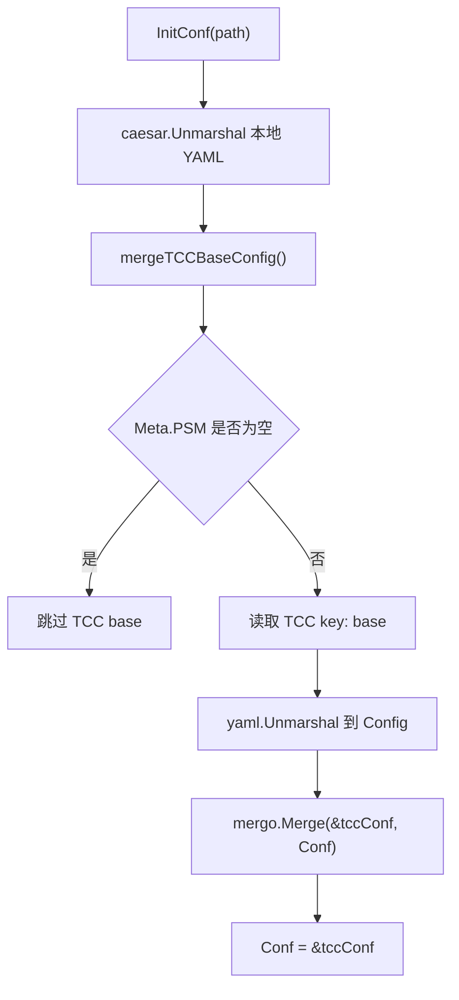
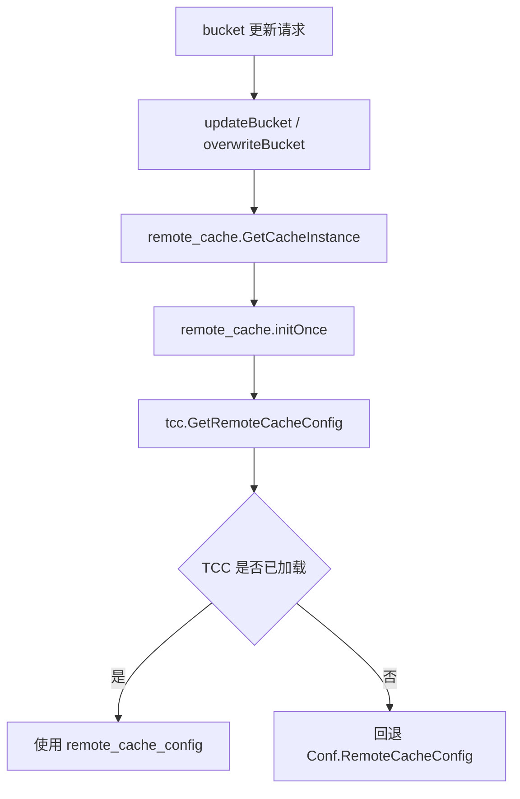

# Configuration Management

## 模块概览

配置管理模块负责加载本地 YAML 配置、合并 TCC 基础配置、初始化 TCC 客户端，并持续刷新部分运行时配置。它覆盖两个包：

- `config`：定义全局配置结构、MySQL 连接配置、本地配置加载和 TCC `base` 配置合并。
- `tcc`：封装 TCC 客户端、TCC key 常量、动态配置解析、缓存和定时刷新逻辑。

模块的核心全局入口是 `config.Conf`。大多数业务代码通过 `config.Conf` 读取静态配置，通过 `tcc.GetRemoteCacheConfig()`、`tcc.GetTccClient()`、`tcc.CheckAuthV2()` 等函数读取动态配置。

## 配置加载流程

服务启动时通常先调用 `config.InitConf(path)`：

```go
func InitConf(path string) {
	Conf = new(Config)
	if err := caesar.Unmarshal(Conf, path); err != nil {
		logs.Fatal("load config error: %v", err)
		panic(err)
	}

	mergeTCCBaseConfig()

	pretty.Println(Conf)
}
```

执行顺序如下：

1. 创建新的 `Config` 实例并赋值给全局变量 `config.Conf`。
2. 使用 `caesar.Unmarshal(Conf, path)` 从本地配置文件加载 YAML。
3. 调用 `mergeTCCBaseConfig()` 尝试从 TCC 读取 `base` 配置并合并。
4. 使用 `pretty.Println(Conf)` 输出最终配置内容。

`mergeTCCBaseConfig()` 是可降级逻辑：如果 `Conf` 为空、`Meta.PSM` 为空、TCC 客户端初始化失败、读取失败、内容为空或解析失败，都会记录 warning 并保留本地配置继续运行。



## 本地配置与 TCC base 的合并规则

`mergeTCCBaseConfig()` 从 TCC 读取 key `base`，解析成临时变量 `tccConf Config`，然后执行：

```go
mergo.Merge(&tccConf, Conf)
Conf = &tccConf
```

这表示最终配置以 TCC `base` 为基础，再用本地 `Conf` 中的非零值补充或覆盖缺失字段。实际效果是：

- TCC `base` 可以提供公共默认配置。
- 本地 YAML 可以保留环境、服务或测试场景的差异化配置。
- 合并失败时不会中断启动，只记录日志并保留原始本地配置。

TCC `base` 客户端使用 `Conf.Meta.PSM` 作为服务名，并启用鉴权：

```go
tccCfg := tccclient.NewConfigV2()
tccCfg.Auth = true
tccCfg.SetFirstGetTimeout(5 * time.Second)
```

如果 `Conf.TccInfo.ConfigSpace` 非空，会设置到 `tccCfg.Confspace`。

## `Config` 结构

`config.Config` 是模块的主配置结构，字段通过 YAML tag 映射到配置文件：

```go
type Config struct {
	Meta       Meta   `yaml:"Meta"`
	WriteDB    *Mysql `yaml:"WriteDB"`
	ReadDB     *Mysql `yaml:"ReadDB"`
	RetryTimes int    `yaml:"RetryTimes" validate:"min=1"`

	TosAPI          TosAPI          `yaml:"TosAPI"`
	BytedocSetting  BytedocSetting  `yaml:"BytedocSetting"`
	IdGenerator     IdGenerator     `yaml:"IdGenerator"`
	TccInfo         TccInfo         `yaml:"Tcc"`
	RedisConfig     RedisConfig     `yaml:"RedisConfig"`
	RemoteCacheConfig RemoteCacheConfig `yaml:"RemoteCacheConfig"`

	RateLimiter          RateLimiter                `yaml:"RateLimiter"`
	InterfaceRateLimiter InterfaceRateLimiterConfig `yaml:"InterfaceRateLimiter"`
}
```

重要字段包括：

- `Meta.PSM`：服务 PSM，既用于配置校验，也用于读取 TCC `base`。
- `WriteDB` / `ReadDB`：MySQL 写库和读库配置。
- `TccInfo.ServiceName` / `TccInfo.ConfigSpace`：运行时 TCC 客户端使用的服务名和配置空间。
- `RemoteCacheConfig`：远程缓存默认配置，TCC 未加载成功时作为兜底。
- `InterfaceRateLimiter`：接口级限流默认配置，启动时先从 YAML 初始化，再允许 TCC 热更新。
- `TosAPI`、`BytedocSetting`、`ByteTreeConfig`、`AGWConfig`、`ModifyTOSBucketBpmConfig` 等：提供外部系统、审批流、服务树和网关相关配置。

## MySQL 配置

`config.Mysql` 描述数据库连接参数：

```go
type Mysql struct {
	DSNTemplate  string `yaml:"DSNTemplate"`
	Username     string `yaml:"Username"`
	Password     string `yaml:"Password"`
	DBName       string `yaml:"DBName"`
	ConsulName   string `yaml:"ConsulName"`
	Timeout      string `yaml:"Timeout"`
	ReadTimeout  string `yaml:"ReadTimeout"`
	WriteTimeout string `yaml:"WriteTimeout"`
	MaxIdle      int    `yaml:"MaxIdle"`
	MaxOpen      int    `yaml:"MaxOpen"`
}
```

`GetDSN()` 根据当前环境生成连接串：

- 如果 `IsCodebaseCIEnvironment()` 返回 true，直接返回固定 CI 测试 DSN。
- 否则使用 `fmt.Sprintf(m.DSNTemplate, ...)` 填充用户名、密码、Consul 名称、数据库名和超时参数。

```go
func IsCodebaseCIEnvironment() bool {
	return len(os.Getenv("CI_REPO_NAME")) > 0
}
```

`NewDB()` 使用 `gorm.Open("mysql2", m.GetDSN())` 创建连接，并设置连接池参数：

```go
db.DB().SetMaxIdleConns(m.MaxIdle)
db.DB().SetMaxOpenConns(m.MaxOpen)
db.SingularTable(true)
```

因此，任何依赖数据库初始化的路径都会间接依赖 `config.Conf.WriteDB`、`config.Conf.ReadDB` 和 `Mysql.GetDSN()`。

## TCC 客户端

`tcc.GetTccClient()` 使用 `sync.Once` 懒加载单例客户端：

```go
var (
	tccOnce sync.Once
	client  *tccclient.ClientV2
)
```

首次调用时，它读取：

```go
config.Conf.TccInfo.ServiceName
config.Conf.TccInfo.ConfigSpace
```

并调用：

```go
tccclient.NewClientV2(config.Conf.TccInfo.ServiceName, tccConfigV2)
```

如果创建失败会直接 `panic(err)`。因此，调用 `GetTccClient()` 前必须确保 `config.InitConf()` 已经成功执行，并且 `config.Conf.TccInfo` 已正确配置。

## 动态配置初始化与刷新

`tcc.InitConfig()` 是动态配置入口，主要做三件事：

1. 调用 `initInterfaceRateLimiterFromConfig()`，先用 YAML 中的 `config.Conf.InterfaceRateLimiter` 初始化接口限流。
2. 注册各个 TCC key 对应的 parser。
3. 调用 `refreshTccConfigs()` 立即刷新一次，成功后启动后台 goroutine 每分钟刷新。

```go
parsers[RemoteCacheConfigTccKey] = remoteCacheConfigParser
parsers[DefaultIDCConfigsTccKey] = defaultIDCConfigsParser
parsers[PSMAuthV2ConfigsTccKey] = psmAuthV2Parser
parsers[DevSreToken] = devSreTokenParser
parsers[AGWTenant] = agwTenantParser
parsers[InterfaceRateLimiterTccKey] = interfaceRateLimiterParser
```

刷新逻辑由 `refreshTccConfigs()` 执行。它会创建带 `logid` 的 context，并通过 `bytedtracer.StartCustomSpan()` 上报异步刷新 span，然后遍历 `parsers`：

```go
for key, parse := range parsers {
	if e := parse(GetTccClient().Get(ctx, key)); e != nil {
		logs.CtxWarn(ctx, "refresh tcc key: %s error, %s", key, e)
		err = e
	}
}
```

这里 parser 的签名是：

```go
type parser func(value string, err error) error
```

这使 parser 可以同时处理 TCC 返回值和读取错误。

## 运行时配置项

### 远程缓存配置

`remoteCacheConfigParser()` 解析 TCC key `remote_cache_config`：

```go
c := &config.RemoteCacheConfig{}
json.Unmarshal([]byte(value), c)
c.TTL = c.TTL * time.Second
c.LockReleaseTTL = c.LockReleaseTTL * time.Second
remoteCacheConfig.Store(c)
```

配置保存在 `atomic.Value` 中。读取时使用 `GetRemoteCacheConfig()`：

```go
func GetRemoteCacheConfig() *config.RemoteCacheConfig {
	if v, ok := remoteCacheConfig.Load().(*config.RemoteCacheConfig); ok {
		return v
	}
	return &config.Conf.RemoteCacheConfig
}
```

这意味着 TCC 配置存在时优先使用 TCC；否则回退到 YAML 中的 `RemoteCacheConfig`。业务写入、覆盖、删除 bucket 时会通过 `remote_cache.GetCacheInstance()` 间接读取该配置，例如 `updateBucket()` 和 `overwriteBucket()` 相关流程。

### 接口级限流配置

接口限流有两层来源：

- 启动时：`initInterfaceRateLimiterFromConfig()` 调用 `util.InitInterfaceRateLimiterConfig(config.Conf.InterfaceRateLimiter)`。
- 运行时：`interfaceRateLimiterParser()` 解析 TCC key `interface_rate_limiter` 后调用 `util.UpdateInterfaceRateLimiterConfig(c)`。

解析器使用 `json.Decoder.DisallowUnknownFields()`，因此 TCC JSON 中出现未知字段会返回错误，避免配置拼写错误被静默忽略。

### 默认 IDC 配置

`defaultIDCConfigsParser()` 解析 TCC key `default_idc_configs` 到包级变量：

```go
defaultIDCConfigs = map[string]config.DefaultIDCConfigs{}
```

查询入口是：

```go
func GetDefaultIDCConfigs(idc string, backendType uint16) (config.DefaultIDCConfigs, bool) {
	return defaultIDCConfigs[fmt.Sprintf("%s_%d", idc, backendType)]
}
```

调用方需要按 `idc_backendType` 的组合键读取默认后端字段配置。

### PSM Auth V2

`psmAuthV2Parser()` 解析 TCC key `psm_auth_v2_configs` 到：

```go
psmAuthV2 = map[string]map[string]bool{}
```

检查入口是 `CheckAuthV2(ctx, psm, method)`。当指定 PSM 对应 method 为 true，或允许 `"all"` 时返回 true：

```go
if allowMethods, ok := psmAuthV2[psm]; ok && (allowMethods[method]) || allowMethods["all"] {
	return true
}
```

维护这段逻辑时要注意布尔表达式优先级。当前表达式依赖 `&&` 高于 `||` 的规则，但当 `psm` 不存在时仍会访问 `allowMethods["all"]`，需要结合 Go 作用域和测试覆盖谨慎修改。

### AGW 租户配置

`agwTenantParser()` 解析 TCC key `agw_tenant` 到：

```go
type AGWTCCConfig struct {
	UseTCC  bool                      `json:"use_tcc"`
	Tenants []*config.AGWTenantConfig `json:"tenants"`
}
```

解析成功后通过 `agwTenantConfig.Store(c)` 原子替换。读取入口是 `GetAGWTenantConfigs()`，未加载时返回空的 `AGWTCCConfig{}`。

### DevSreToken 与内存限制

`devSreTokenParser()` 将 TCC key `dev_sre_token` 写入包级变量 `devSreToken`，读取入口为 `GetDevSreToken()`。

`GetMemLimitPercent(ctx)` 不参与定时刷新，而是在调用时直接读取 TCC key `mem_limit_percent`。读取失败时记录错误并返回空字符串。

### 本地缓存刷新间隔

`GetLocalCacheRefreshInterval(ctx)` 直接读取 TCC key `local_cache_refresh_interval`，并用 `time.ParseDuration()` 解析：

```go
if interval, err := time.ParseDuration(val); err == nil {
	return interval, val
}
return config.DefaultTTL, ""
```

读取失败或解析失败时回退到 `config.DefaultTTL`，也就是 5 分钟。

## 与业务代码的连接

配置模块位于启动链路和运行时热更新链路的交界处：

- 测试入口如 `util/base_test.go`、`tcc/base_test.go`、`rpc/base_test.go`、`service/base_test.go` 等会调用 `config.InitConf()` 初始化全局配置。
- `service/bucket_handler.go` 的 bucket 更新、覆盖、删除流程会通过 `remote_cache.GetCacheInstance()` 间接使用 `tcc.GetRemoteCacheConfig()`。
- `remote_cache/remote_cache.go` 初始化缓存时会读取远程缓存配置，并可能进一步触发数据库连接配置。
- `service/tos_handler.go` 的 `InitThirdPartyClient()` 依赖 `config.Config` 中的第三方服务配置。
- `util/interface_limiter.go` 通过 `InitInterfaceRateLimiterConfig()` 和 `UpdateInterfaceRateLimiterConfig()` 接收 YAML 与 TCC 中的接口限流配置。

典型运行路径如下：



## 失败处理与降级策略

该模块区分启动关键配置和运行时可降级配置：

- 本地 YAML 加载失败：`InitConf()` 记录 fatal 并 panic，服务不能继续启动。
- TCC `base` 加载失败：仅 warning，继续使用本地 YAML。
- `GetTccClient()` 初始化失败：panic，因为动态配置客户端无法创建。
- 动态配置单个 key 刷新失败：记录 warning 或 error，不清空已有配置。
- `GetRemoteCacheConfig()` 未加载 TCC：回退到 `config.Conf.RemoteCacheConfig`。
- `GetLocalCacheRefreshInterval()` 失败：回退到 `config.DefaultTTL`。
- `remote_cache_config`、`interface_rate_limiter` 等 key 为空：parser 通常忽略，不覆盖当前配置。

这种设计保证了启动配置必须明确可用，而运行时配置可以在 TCC 短暂异常时继续使用最近一次成功加载的值或 YAML 兜底值。

## 贡献注意事项

新增配置字段时，应先判断它属于静态启动配置还是运行时动态配置：

- 静态配置：添加到 `config.Config` 或相关子结构体，并补充 YAML tag。
- 动态配置：在 `tcc/keys.go` 增加 key 常量，在 `tcc_config.go` 添加 parser，并在 `InitConfig()` 注册。
- 需要热更新且被并发读取的配置，应优先使用 `atomic.Value` 或明确的同步机制。
- JSON 类型的 TCC 配置建议像 `interfaceRateLimiterParser()` 一样使用严格解析，避免未知字段静默生效失败。
- 涉及时间单位时要保持一致；当前 `RemoteCacheConfig.TTL` 和 `LockReleaseTTL` 会把 TCC 中的数值按秒转换为 `time.Duration`。
- 调用 `tcc.GetTccClient()` 前必须确保 `config.Conf` 已初始化，否则会读取空全局配置并导致异常。