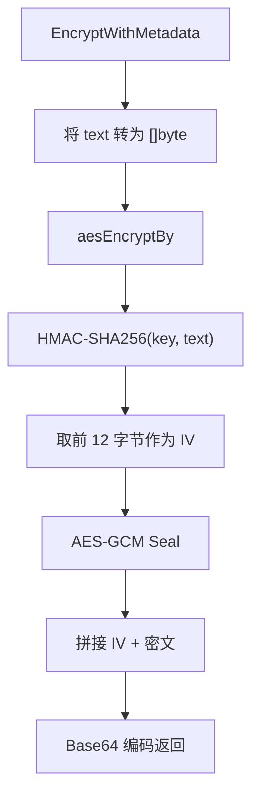
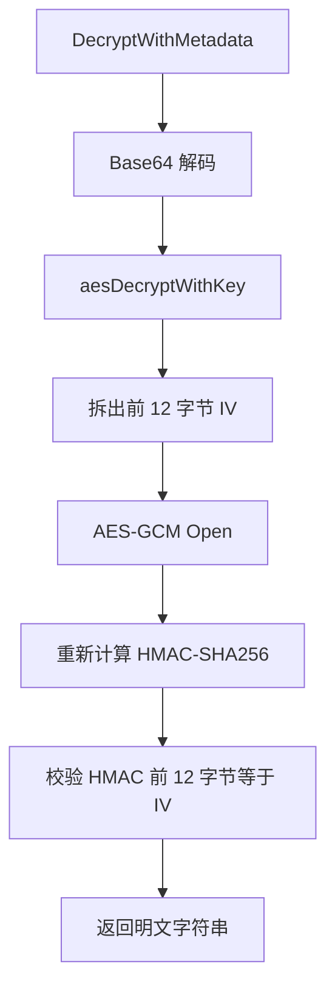

# Cryptographic Utilities

## 模块概览

该模块位于 `util` 包中，提供两类低层工具：

- `EncryptWithMetadata` / `DecryptWithMetadata`：对字符串进行 AES-GCM 加解密，并使用 Base64 作为外部传输格式。
- `MD5ETag`：对字节内容计算 MD5 摘要，并以 Base64 字符串形式返回，用作 ETag 类标识。

当前模块没有依赖项目内其他包，属于基础工具层。项目内主要调用点包括：

- `middleware/base.go` 中的 `encryptOpenapiData` 调用 `EncryptWithMetadata` 加密 OpenAPI 响应数据。
- `middleware/base_test.go` 和 `util/aes_test.go` 使用 `DecryptWithMetadata` 验证加密结果。
- `service/bucket_handler.go` 中的 `bucketsToCacheItem` 调用 `MD5ETag` 生成缓存项的内容标识。

## AES 加密格式

`EncryptWithMetadata(key []byte, text string) (string, error)` 是对外暴露的加密入口。

执行流程：



最终返回值格式为：

```text
base64(IV || AES-GCM密文与认证标签)
```

其中：

- `IV` 固定为 12 字节。
- `IV` 不是随机生成的，而是 `HMAC-SHA256(key, text)` 的前 12 字节。
- `AES-GCM` 的输出包含密文和 GCM 认证标签。
- 没有使用 AAD，`Seal` 的第四个参数为 `nil`。

内部实现由 `aesEncryptBy(key, text []byte) ([]byte, error)` 完成：

```go
block, err := aes.NewCipher(key)
mac := hmac.New(sha256.New, key)
mac.Write(text)
calculatedMac := mac.Sum(nil)
iv = calculatedMac[0:12]

aesgcm, err := cipher.NewGCM(block)
crypted := aesgcm.Seal(nil, iv, text, nil)
crypted = append(iv, crypted...)
```

`key` 必须满足 `aes.NewCipher` 的要求，即长度为 16、24 或 32 字节，分别对应 AES-128、AES-192、AES-256。长度不合法时，函数会直接返回 `aes.NewCipher` 的错误。

## AES 解密格式

`DecryptWithMetadata(key []byte, crypted string) (string, error)` 是对外暴露的解密入口。

执行流程：



解密输入必须是 `EncryptWithMetadata` 生成的 Base64 字符串。解码后的二进制结构为：

```text
IV(12字节) || AES-GCM密文与认证标签
```

内部实现由 `aesDecryptWithKey(key, crypted []byte) ([]byte, error)` 完成：

```go
iv = crypted[0:12]
cryBlob = crypted[12:]

origData, err := aesgcm.Open(nil, iv, cryBlob, nil)

mac := hmac.New(sha256.New, key)
mac.Write(origData)
calculatedMac := mac.Sum(nil)

if bytes.Compare(calculatedMac[0:12], iv) != 0 {
    return []byte{}, errors.New("[kms] hmac of data doesn't match IV (is data corrupted?)")
}
return origData, err
```

解密阶段有几类校验：

- Base64 格式错误会由 `base64.StdEncoding.DecodeString` 返回。
- 解码后的数据长度小于 12 字节时，返回 `"[kms] length of decrypted data smaller than block size, please check data"`。
- 去掉 IV 后的密文长度小于 12 字节时，返回 `"crypto/cipher: input error"`。
- AES-GCM 认证失败后，代码仍会对 `origData` 计算 HMAC，并通常返回 `"[kms] hmac of data doesn't match IV (is data corrupted?)"`，因此上层不应依赖具体错误文本区分 GCM 失败和 HMAC 校验失败。

## IV 生成策略的影响

该实现使用 `HMAC-SHA256(key, plaintext)` 的前 12 字节作为 AES-GCM 的 IV。这意味着同一个 `key` 和同一个 `text` 会生成完全相同的密文。

这个行为适合需要稳定加密结果的场景，例如测试断言或对相同明文得到可重复输出。但它也意味着该函数不是常见的随机 nonce 加密接口。调用方需要注意：

- 不要把它当作“每次加密结果都不同”的接口使用。
- 相同明文会暴露“内容相等”这一事实。
- 更换密钥会改变 HMAC、IV 和最终密文。
- 该格式与标准的“随机 nonce + 密文”AES-GCM 输出不兼容，必须使用本模块的 `DecryptWithMetadata` 解密。

## `MD5ETag`

`MD5ETag(resp []byte) string` 对输入字节计算 MD5 摘要，并返回 Base64 编码后的摘要字符串：

```go
func MD5ETag(resp []byte) string {
    h := md5.New()
    h.Write(resp)
    return base64.StdEncoding.EncodeToString(h.Sum(nil))
}
```

返回值不是常见的十六进制 MD5 字符串，而是原始 16 字节 MD5 digest 的 Base64 编码。

示例形态：

```text
base64(md5(resp))
```

该函数当前由 `service/bucket_handler.go` 中的 `bucketsToCacheItem` 调用，用于根据 bucket 数据内容生成缓存项标识。它适合作为内容变化检测值，不适合作为安全签名或防篡改机制。

## 使用示例

```go
package util

func example() error {
    key := []byte("12345678901234567890123456789012") // 32 字节 AES-256 key

    encrypted, err := EncryptWithMetadata(key, "metadata text")
    if err != nil {
        return err
    }

    plain, err := DecryptWithMetadata(key, encrypted)
    if err != nil {
        return err
    }

    _ = plain
    return nil
}
```

## 贡献注意事项

修改该模块时需要保持加密格式兼容性。`DecryptWithMetadata` 当前假设前 12 字节一定是 IV，剩余部分是 AES-GCM 输出；如果调整 IV 生成、拼接顺序、Base64 编码方式或 AAD 参数，已有密文将无法解密。

`MD5ETag` 的返回格式也属于调用方契约。若改为十六进制 MD5，会影响 `bucketsToCacheItem` 生成的缓存标识。