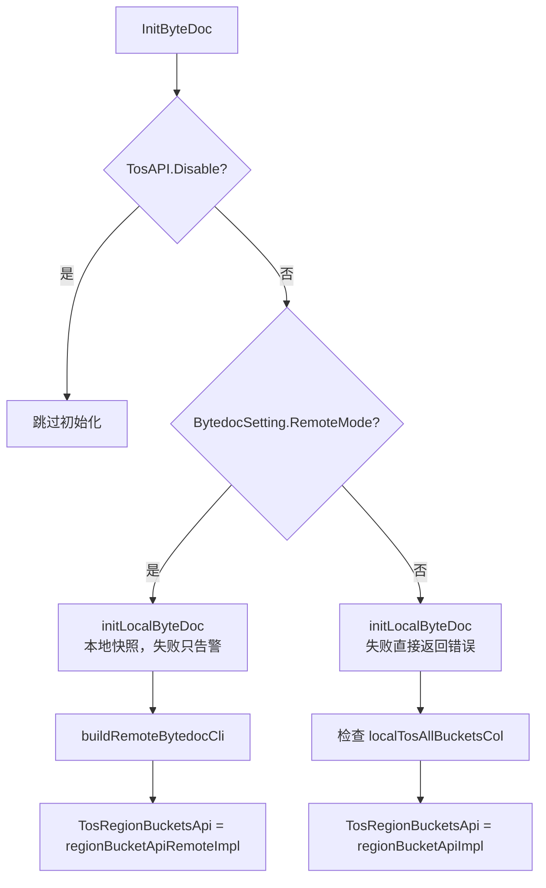

# Database Layer

## 数据库层概览

`db` 包负责初始化和封装项目的持久化依赖，包括 MySQL、ByteDoc/MongoDB、ID 生成器，以及事务回滚辅助逻辑。它不是一个纯 DAO 层，而是整个数据访问层的基础设施入口：`main.go` 和测试入口会先调用 `InitDb()`、`InitByteDoc()`，后续各业务文件再复用包级全局对象。

核心文件：

- `db/db.go`：MySQL、ByteDoc/MongoDB、ID 生成器初始化。
- `db/utils.go`：事务回滚错误合并工具。
- `db/types.go`：数据库层共享数据结构。

## 初始化入口

### `InitDb()`

`InitDb()` 初始化 MySQL 读写连接和 ID 生成器。

执行过程：

1. 调用 `mysql.OpenInterpolation(OpenMysqlPSM)` 开启指定 PSM 的 MySQL 插值能力。
2. 通过 `config.Conf.WriteDB.NewDB()` 创建写库连接。
3. 通过 `config.Conf.ReadDB.NewDB()` 创建读库连接。
4. 构造全局 `Db *DbHandler`：
   - `r`：读库连接。
   - `w`：写库连接。
   - `retryTimes`：来自 `config.Conf.RetryTimes`。
   - `retryTimeout`：固定为 `5 * time.Second`。
5. 根据 `config.Conf.IdGenerator.Switch` 初始化 `IdGenCli`：
   - 开启时调用 `idgenerator.New(...)`。
   - 关闭时使用 `EmptyIdGen{}`。

写库或读库初始化失败时，`InitDb()` 会记录错误并 `panic`。因此它适合作为服务启动阶段的强依赖初始化逻辑。

### `DbHandler`

```go
type DbHandler struct {
	r            *gorm.DB
	w            *gorm.DB
	retryTimes   int
	retryTimeout time.Duration
}
```

`DbHandler` 保存读写分离的 GORM 连接和重试配置。当前文件只负责构造该结构，具体查询、写入和事务逻辑分布在同一 `db` 包的其他文件中，例如 `bucket.go`、`temp_bucket.go`、`volc.go`、`idc_proxy.go` 等。

调用关系上，`main.go`、`db/base_test.go`、`service/base_test.go` 都会调用 `InitDb()`，说明它是运行服务和测试的共同前置条件。

## ID 生成器

数据库层通过 `IdGenWrapper` 抽象 ID 生成能力：

```go
type IdGenWrapper interface {
	Get(ctx context.Context) (uint64, error)
	MGet(ctx context.Context, count int) ([]uint64, error)
}
```

生产环境在配置开启时使用 `idgenerator.New(...)` 返回的客户端。配置关闭时使用 `EmptyIdGen`：

```go
type EmptyIdGen struct{}

func (e EmptyIdGen) Get(ctx context.Context) (uint64, error) {
	return 0, nil
}

func (e EmptyIdGen) MGet(ctx context.Context, count int) ([]uint64, error) {
	return make([]uint64, count), nil
}
```

`EmptyIdGen` 的语义是“占位实现”：它不报错，但返回 `0` 或全 `0` 切片。调用方如果依赖 ID 唯一性，不能把 `0` 当作有效业务 ID 使用；它主要用于关闭 ID 生成器的环境、测试场景或兼容路径。

## ByteDoc / MongoDB 初始化

ByteDoc 相关初始化由 `InitByteDoc()` 负责。它根据配置决定使用本地 MongoDB 存储，还是远程 ByteDoc API。

### 总体流程



### `InitByteDoc()`

`InitByteDoc()` 的第一层开关是 `config.Conf.TosAPI.Disable`。如果禁用 TOS API，会直接跳过 ByteDoc 初始化并返回 `nil`。

未禁用时，根据 `config.Conf.BytedocSetting.RemoteMode` 分成两种模式。

远程模式：

- 调用 `initLocalByteDoc()` 初始化本地快照。
- 本地快照初始化失败只记录 `Warn`，不会阻塞启动。
- 调用 `buildRemoteBytedocCli(config.Conf.BytedocSetting.RemoteSetting)` 创建远程实现。
- 将结果赋给全局 `TosRegionBucketsApi`。

本地模式：

- 调用 `initLocalByteDoc()`，失败直接返回错误。
- 检查 `localTosAllBucketsCol` 是否完成初始化。
- 使用 `&regionBucketApiImpl{tosAllBucketsCol: localTosAllBucketsCol}` 作为 `TosRegionBucketsApi`。

这里的 `regionBucketApiImpl`、`regionBucketApiRemoteImpl`、`RegionBucketsApi`、`TosRegionBucketsApi` 和 `TosAllBucketsColName` 定义在同一 `db` 包的其他文件中。从初始化逻辑可以看出，`InitByteDoc()` 只负责选择实现和注入依赖，不直接处理 bucket 业务读写。

### `initLocalByteDoc()`

`initLocalByteDoc()` 负责连接本地 ByteDoc/MongoDB：

1. 读取 `config.Conf.BytedocSetting.ConnectURI`。
2. 如果 URI 为空，记录告警并跳过本地初始化。
3. 使用 `mongo.NewClient(options.Client().ApplyURI(uri))` 创建客户端。
4. 创建 bytedtrace server span：`bytedtracer.StartServerSpan(context.Background(), "spontaneous_call")`。
5. 使用 `context.WithTimeout(ctx, timeout)` 控制 `Connect` 和 `Ping`，其中 `timeout` 为 `10 * time.Second`。
6. 初始化全局对象：
   - `MongoDBClient`
   - `MongoDB`
   - `localTosAllBucketsCol`
7. 对 `localTosAllBucketsCol` 调用 `ensureIndices(...)` 创建索引。

本地集合会创建一个索引：

```go
mongo.IndexModel{
	Keys:    bson.D{{Key: "region", Value: 1}},
	Options: options.Index().SetUnique(true),
}
```

这表示 `region` 字段在 `TosAllBucketsColName` 集合中必须唯一。索引创建失败只记录告警，不会让 `initLocalByteDoc()` 返回错误；连接和 ping 失败才会返回错误。

### `buildRemoteBytedocCli()`

`buildRemoteBytedocCli(remoteSetting config.ByteDocRemoteSetting)` 构造远程 ByteDoc API 客户端：

- 使用 `byted.NewClient(...)` 创建 Hertz client。
- 通过 `client.WithResponseBodyStream(true)` 开启响应体流式读取。
- 如果 `remoteSetting.Timeout == 0`，默认设置为 `10 * time.Second`。
- 返回 `&regionBucketApiRemoteImpl{...}`。

远程实现的配置字段来自 `config.ByteDocRemoteSetting`：

- `Host`
- `WithSD`
- `Idc`
- `Cluster`
- `Env`
- `Timeout`
- `WriteBack`

这些字段原样注入到 `regionBucketApiRemoteImpl`，由远程实现负责具体请求行为。

## 索引创建

`ensureIndices(ctx, col, indices)` 是一个很小的 MongoDB 索引校验辅助函数：

```go
func ensureIndices(ctx context.Context, col *mongo.Collection, indices []mongo.IndexModel) error {
	created, err := col.Indexes().CreateMany(ctx, indices)
	if err != nil {
		return err
	}
	if len(created) != len(indices) {
		return errorIndex
	}
	return nil
}
```

它不仅检查 `CreateMany` 是否返回错误，也检查返回的已创建索引数量是否与请求数量一致。如果数量不足，返回包内错误 `errorIndex`，错误内容为 `"Not enough indices."`。

当前只有 `initLocalByteDoc()` 调用它，用于保证 `region` 唯一索引存在。

## 事务回滚工具

`RollbackTX(tx *gorm.DB, err error) error` 用于统一处理事务回滚时的错误合并。

调用方通常是在事务失败路径中传入当前业务错误：

```go
if err != nil {
	return RollbackTX(tx, err)
}
```

它的处理规则是：

1. 先调用 `tx.Rollback()`。
2. 如果 `tx.Error == nil`，说明回滚本身没有错误，返回原始 `err`。
3. 如果原始 `err == nil`，但回滚有错误，返回 `tx.Error`。
4. 如果原始 `err` 是 `gorm.Errors`，调用 `errs.Add(tx.Error)` 追加回滚错误。
5. 否则返回 `gorm.Errors([]error{err, tx.Error})`，同时保留业务错误和回滚错误。

该函数被多个写操作使用，包括 `CreateBucket`、`UpdateBucket`、`DeleteBucket`、`CreateTempBucket`、`DeleteTempBucket`、`CreateVolc`、`UpdateVolc`、`DeleteVolc`、`CreateIdc`、`UpdateIdcProxies` 等。它的价值在于避免回滚失败覆盖原始业务错误。

## 共享数据结构

`InternalToBTos` 定义在 `db/types.go`：

```go
type InternalToBTos struct {
	Name      string `json:"name"`
	AccessKey string `json:"access_key,omitempty"`
	Region    string `json:"region"`
	Endpoint  string `json:"endpoint"`
}
```

它是数据库层可复用的数据传输结构，字段通过 JSON tag 暴露：

- `Name`：名称。
- `AccessKey`：访问密钥，使用 `omitempty`，为空时不会出现在 JSON 中。
- `Region`：地域。
- `Endpoint`：访问端点。

## 与代码库其他部分的关系

`db` 包的初始化入口由服务启动和测试共同调用：

- `main.go` 调用 `InitDb()` 和 `InitByteDoc()`。
- `db/base_test.go`、`service/base_test.go` 在测试入口调用初始化函数。
- `db/db_test.go` 覆盖 `EmptyIdGen`、`InitByteDoc()` 和 `buildRemoteBytedocCli()`。
- `db/utils_test.go` 覆盖 `RollbackTX()`。

业务数据操作分散在同一包的其他文件中，并依赖这里初始化出的全局状态：

- MySQL 操作依赖 `Db *DbHandler`。
- TOS bucket 区域数据依赖 `TosRegionBucketsApi`。
- 本地 ByteDoc 模式依赖 `MongoDBClient`、`MongoDB` 和 `localTosAllBucketsCol`。
- 需要生成 ID 的逻辑依赖 `IdGenCli`。
- 事务写操作失败路径复用 `RollbackTX()`。

因此，修改这个模块时需要特别注意启动路径和测试路径的一致性。`InitDb()` 是强依赖初始化，失败会 `panic`；`InitByteDoc()` 则按模式区分强弱依赖，远程模式下本地快照失败不会阻塞，局部模式下本地存储失败会阻塞。