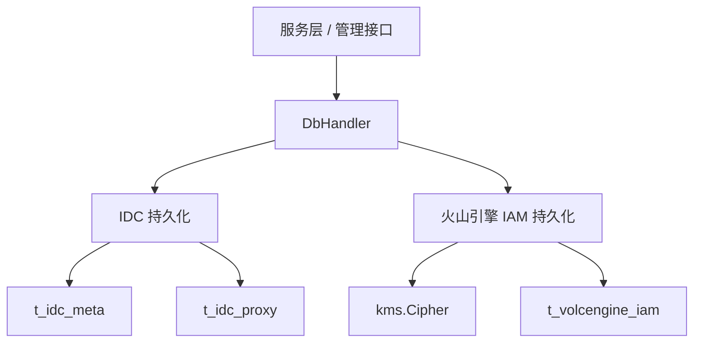

# IDC and Volcengine Persistence

## 模块概览

`db/idc_proxy.go` 和 `db/volc.go` 负责两类持久化数据：

- IDC 元数据与代理配置：写入 `t_idc_meta`、`t_idc_proxy`
- 火山引擎 IAM 账号：写入 `t_volcengine_iam`

这两个文件都挂在 `DbHandler` 上，遵循相同的数据库访问模式：

- 读操作使用 `db.r`
- 写操作使用 `db.w`
- 所有数据库调用包在 `retry.Do(...)` 中
- 每个公开方法都会上报 `util.EmitThroughput` 和 `util.EmitLatency`
- 多表写入或删除使用事务，并通过 `RollbackTX(tx, err)` 回滚



## IDC 持久化

IDC 模块围绕 `meta.IdcWithProxies` 组织数据。一个 IDC 由一条 `meta.IdcMeta` 记录和零到多条 `meta.IdcProxy` 记录组成：

```go
const (
	TableIdcProxy = "t_idc_proxy"
	TableIdcMeta  = "t_idc_meta"
)
```

`t_idc_meta` 保存 IDC 自身属性，例如 `IDC`、`Type`、`Region`、`BillingRegion`、`Description`。  
`t_idc_proxy` 保存该 IDC 下的代理配置，并通过 `idc` 字段关联 IDC。

### `CreateIdc`

`CreateIdc(ctx, idcProxiesDTO)` 创建一组 IDC 元数据和代理配置。

执行流程：

1. 上报 `CreateIdc` 吞吐与耗时指标。
2. 开启写事务。
3. 通过 `IdGenCli.Get(util.WithoutCancel(ctx))` 生成 IDC 元数据主键。
4. 写入 `t_idc_meta`。
5. 如果 `idcProxiesDTO.Proxies` 非空：
   - 通过 `IdGenCli.MGet(util.WithoutCancel(ctx), len(...))` 批量生成代理主键。
   - 逐条写入 `t_idc_proxy`。
6. 提交事务。

这里使用 `util.WithoutCancel(ctx)` 获取 ID，表示即使外层请求上下文取消，ID 生成仍不跟随取消信号中断。

贡献时需要注意：`CreateIdc` 的代理写入分支中，`conn.Create(proxy).Error` 出错后当前代码传给 `RollbackTX` 的是之前的 `res.Error`，不是局部变量 `err`。如果修改这里，应确认回滚错误传递是否符合预期。

### `GetIdcProxies`

`GetIdcProxies(ctx, idc)` 根据 IDC 名称读取完整配置。

执行流程：

1. 从 `t_idc_meta` 查询 `idc = ?` 的第一条记录。
2. 从 `t_idc_proxy` 查询同一 IDC 的所有代理。
3. 返回 `meta.IdcWithProxies`。
4. 如果没有代理，`Proxies` 会被置为空切片 `[]*meta.IdcProxy{}`，而不是 `nil`。

该方法会先查 IDC 元数据，再查代理；如果元数据不存在或查询失败，直接返回错误。

### `GetIdcProxiesByProgramEnvIdc`

`GetIdcProxiesByProgramEnvIdc(ctx, idc, programEnvIdc)` 只读取代理配置，不读取 `t_idc_meta`。

查询条件是：

```sql
idc = ? and (program_env_idc = ? or program_env_idc = '')
```

也就是说，返回结果包含：

- 精确匹配 `program_env_idc` 的代理
- `program_env_idc` 为空字符串的默认代理

返回的 `meta.IdcWithProxies` 只设置 `IDC` 和 `Proxies`，不会补全 `Type`、`Region` 等 IDC 元数据字段。

### `UpdateIdcProxies`

`UpdateIdcProxies(ctx, idcProxiesDTO)` 更新 IDC 元数据，并用新的代理列表整体替换旧代理列表。

执行流程：

1. 开启写事务。
2. 在 `t_idc_meta` 中按 `idc` 更新以下字段：
   - `Type`
   - `Region`
   - `BillingRegion`
   - `Description`
3. 查询 `t_idc_proxy` 中当前 IDC 的已有代理。
4. 如果已有代理非空，先全部删除。
5. 如果新的 `Proxies` 非空：
   - 通过 `IdGenCli.MGet(util.WithoutCancel(ctx), len(...))` 生成新代理 ID。
   - 逐条插入新代理。
6. 提交事务。

这个方法不是按代理 ID 做增量更新，而是“先删后插”的替换语义。因此调用方必须传入完整的目标代理列表；遗漏的代理会被删除。

### `GetAllIdcProxies`

`GetAllIdcProxies(ctx)` 读取所有 IDC 元数据和所有代理，然后在内存中按 `IDC` 字段分组。

执行流程：

1. 查询所有 `t_idc_meta`。
2. 查询所有 `t_idc_proxy`。
3. 构造 `map[string][]*meta.IdcProxy`。
4. 遍历所有 `meta.IdcMeta`，为每个 IDC 组装 `meta.IdcWithProxies`。
5. 没有代理的 IDC 返回空切片。

这个方法会一次性加载两张表，适合配置规模可控的场景。如果 IDC 或代理数量明显增长，需要评估分页或按需查询。

### `DeleteIdcProxies`

`DeleteIdcProxies(ctx, idc)` 删除一个 IDC 的代理配置和元数据。

执行顺序：

1. 删除 `t_idc_proxy` 中 `idc = ?` 的所有代理。
2. 删除 `t_idc_meta` 中 `idc = ?` 的元数据。
3. 提交事务。

删除代理在前、删除元数据在后，避免留下依赖元数据已不存在的代理记录。

## 火山引擎 IAM 持久化

火山引擎 IAM 数据存储在 `t_volcengine_iam`：

```go
const volcTable = "t_volcengine_iam"
```

数据库层使用内部 DTO `VolcIAMDTO` 映射表字段，外部接口使用 SDK 类型 `meta.VolcengineIAM`。

```go
type VolcIAMDTO struct {
	Id          uint64
	AccountId   uint64
	AccessKey   string
	SecretKey   string
	Region      string
	Host        string
	Schema      string
	AssumeRole  string
	Description string
	CreatedAt   time.Time
	UpdatedAt   time.Time
}
```

字段映射中需要特别注意：

- `Schema` 对应数据库列 `proto_schema`
- `Description` 对应数据库列 `detail`
- `SecretKey` 在数据库中保存密文
- `AccessKey` 明文保存，并作为查询和更新的主要条件

### 加密与解密

火山引擎 IAM 模块通过 `kms.Cipher` 保护 `SecretKey`。

`encryptVolc(volc, encryptsk)` 将 `meta.VolcengineIAM` 转成 `VolcIAMDTO`：

- 总是复制 `AccountId`、`AccessKey`、`Region`、`Host`、`Schema`、`AssumeRole`、`Description`
- 当 `encryptsk == true` 时调用 `kms.Cipher.Encrypt(volc.Credentials.SecretKey)`
- 当 `encryptsk == false` 时不设置 `dto.SecretKey`

`decryptVolc(dto)` 将 `VolcIAMDTO` 转回 `meta.VolcengineIAM`：

- 设置 `meta.VolcCredentials.AccessKey`
- 调用 `kms.Cipher.Decrypt(dto.SecretKey)` 解密密钥
- 回填 `Region`、`Host`、`Schema`、`AssumeRole`、`Description`

因此，所有返回 `meta.VolcengineIAM` 的读取方法都会尝试解密 `SecretKey`。

### `CreateVolc`

`CreateVolc(ctx, volc)` 创建火山引擎 IAM 账号。

执行流程：

1. 调用 `encryptVolc(volc, true)`，加密 `Credentials.SecretKey`。
2. 开启事务。
3. 写入 `t_volcengine_iam`。
4. 提交事务。

如果加密失败，方法会在进入数据库事务前直接返回错误。

### `UpdateVolc`

`UpdateVolc(ctx, volc)` 按 `access_key` 更新已有账号。

执行流程：

1. 调用 `encryptVolc(volc, volc.Credentials.SecretKey != "")`。
2. 构造 `attrs map[string]interface{}`。
3. 只把非空字段加入更新集合。
4. 在事务中执行：

```go
tx.Where("access_key = ?", dto.AccessKey).Update(attrs)
```

更新语义是“非空字段更新”：

- `Region` 非空才更新 `region`
- `Host` 非空才更新 `host`
- `Schema` 非空才更新 `proto_schema`
- `AssumeRole` 非空才更新 `assume_role`
- `Description` 非空才更新 `detail`
- `SecretKey` 非空才更新 `secret_key`

这意味着调用方不能通过传空字符串清空字段；空字符串会被解释为“不更新”。`SecretKey` 为空时也不会重新加密或覆盖数据库中的密钥。

### `GetVolc`

`GetVolc(ctx, ak)` 根据 `access_key` 查询单个火山引擎 IAM 账号。

执行流程：

1. 查询 `t_volcengine_iam where access_key = ?`。
2. 如果返回 DTO 的 `AccessKey` 不等于传入 `ak`，返回 `(nil, nil)`。
3. 调用 `decryptVolc(dto)` 解密并返回。

当前实现使用 `Find(dto)`，而不是 `First(dto)`。因此未命中时不会直接返回 GORM 的未找到错误，而是依赖 `dto.AccessKey != ak` 判断空结果。

### `GetVolcByAccountId`

`GetVolcByAccountId(ctx, accountId)` 查询某个账号 ID 下的所有火山引擎 IAM 配置。

执行流程：

1. 查询 `account_id = ?` 的全部 DTO。
2. 如果没有记录，返回空切片。
3. 逐条调用 `decryptVolc`。
4. 任意一条解密失败都会使整个方法返回错误。

注意参数 `accountId` 是 `string`，而 `VolcIAMDTO.AccountId` 是 `uint64`。调用方需要保证传入值符合数据库查询预期。

### `ListAllPlatformVolcAccounts`

`ListAllPlatformVolcAccounts(ctx)` 查询平台级火山引擎账号。

查询条件固定为：

```sql
account_id = 0
```

返回逻辑与 `GetVolcByAccountId` 相同：无记录返回空切片，有记录则逐条解密。这里的 `account_id = 0` 是平台账号的约定。

### `GetAllVolcs`

`GetAllVolcs(ctx)` 查询表中所有火山引擎 IAM 记录。

与其他批量读取方法不同，`GetAllVolcs` 对解密错误的处理是跳过：

```go
for _, dto := range allDTOs {
	volc, err := decryptVolc(dto)
	if err == nil {
		volcs = append(volcs, volc)
	}
}
```

因此如果某条记录的密文损坏或 KMS 解密失败，该记录不会出现在返回结果中，方法也不会返回错误。贡献时需要确认这种“跳过坏记录”的语义是否符合上层调用预期。

### `DeleteVolc`

`DeleteVolc(ctx, ak)` 根据 `access_key` 删除火山引擎 IAM 账号。

执行流程：

1. 开启事务。
2. 执行 `where access_key = ?` 删除。
3. 提交事务。

删除对象使用 `VolcIAMDTO{}`，与表结构映射保持一致。

## 横切机制

### 指标上报

每个公开方法都会使用类似模式上报指标：

```go
retryInfo := "CreateVolcengineIAM"
util.EmitThroughput(util.CommandThroughput, metrics.T{
	Name:  util.TagCommand,
	Value: retryInfo,
})
defer util.EmitLatency(util.CommandLatency, time.Now(), metrics.T{
	Name:  util.TagCommand,
	Value: retryInfo,
})
```

`retryInfo` 同时作为：

- 指标标签值
- `retry.Do` 的操作名称

新增方法时应保持这个模式，便于按命令维度观察吞吐、延迟和重试行为。

### 重试

数据库操作统一通过：

```go
retry.Do(retryInfo, db.retryTimes, db.retryTimeout, func() error {
	// 数据库操作
})
```

读写方法都会重试。事务型写入也在 `retry.Do` 内部创建事务，因此每次重试都会开启新的事务。

### 事务与回滚

写入和删除方法通常使用：

```go
tx := db.w.Table(...).Begin().Context(ctx)
if res := tx.Create(dto); res.Error != nil {
	return RollbackTX(tx, res.Error)
}
return tx.Commit().Error
```

IDC 的多表写入、更新、删除必须在单个事务内完成，否则可能出现元数据和代理记录不一致。火山引擎 IAM 当前虽然大多是单表操作，也使用事务保持一致的写入模式。

### 空切片返回约定

多个查询方法在无数据时返回空切片，而不是 `nil`：

- `GetIdcProxies` 的 `Proxies`
- `GetIdcProxiesByProgramEnvIdc` 的 `Proxies`
- `GetAllIdcProxies` 中每个 IDC 的 `Proxies`
- `GetVolcByAccountId`
- `ListAllPlatformVolcAccounts`

这个约定对 JSON 输出友好，调用方通常可以直接遍历结果。