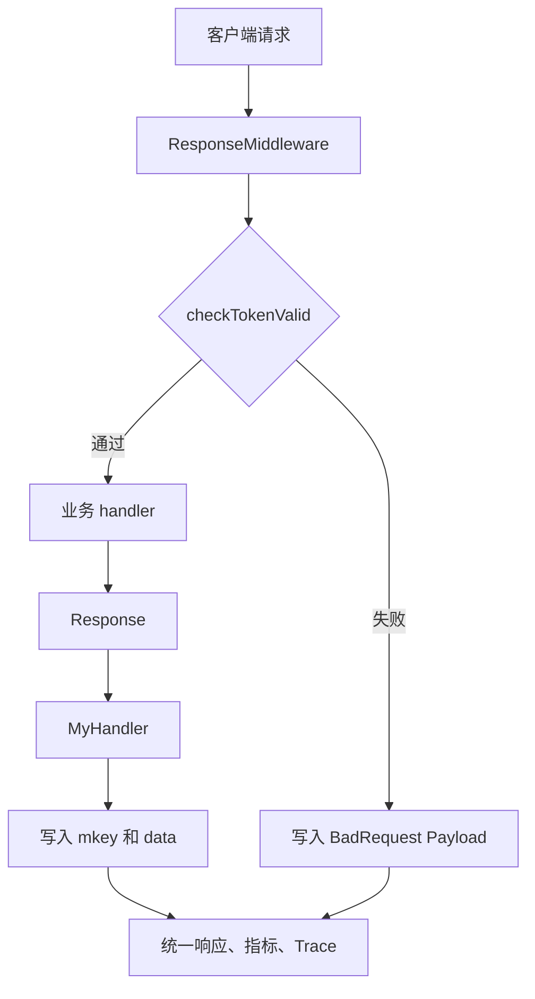
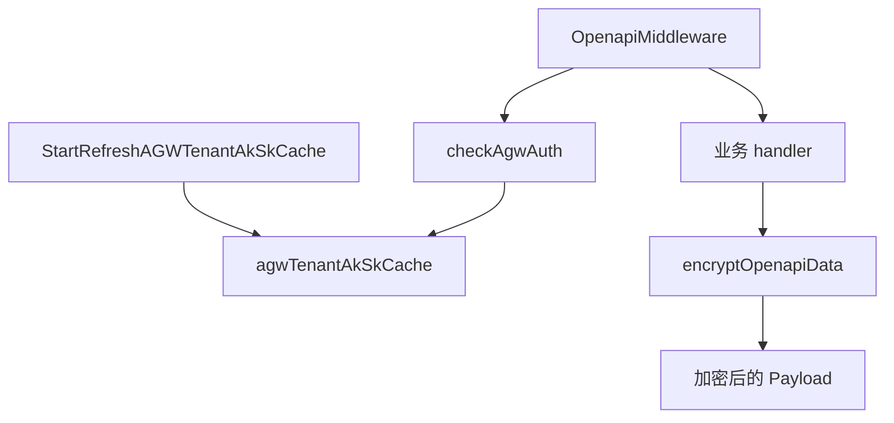

# Middleware

## 模块职责

`middleware` 包负责 Gin 请求的统一入口和出口处理：认证、限流、标准响应写出、缓存协商、指标上报、Trace 标记，以及 OpenAPI 场景下的 AGW 租户密钥管理和响应加密。

业务 handler 通常不直接写 HTTP 响应，而是调用 `Response(c, mkey, f)` 或 `ResponseZti(c, mkey, f)`，把业务结果以 `errno.Payload` 写入 Gin context。外层的 `ResponseMiddleware`、`OpenapiMiddleware`、`ZtiResponseMiddleware` 等再统一完成序列化和观测逻辑。

## 核心数据约定

模块通过 Gin context 传递处理结果：

- `MKeyContextKey = "mkey"`：当前接口的业务方法名，用于限流、指标、Trace 名称。
- `ResultDataContextKey = "data"`：业务返回的 `errno.Payload`。
- `CallerPSMKey = "CALLER_PSM"`：调用方 PSM。
- `"bucket"`：部分 handler 设置的 bucket 名，用于吞吐指标维度。

`MyHandler` 是业务处理函数签名：

```go
type MyHandler func(c *gin.Context) errno.Payload
```

`errno.Payload` 中被中间件直接使用的字段包括 `Code`、`Message`、`Data`、`ETag`。

## 标准响应流程



`Response(c, mkey, f)` 是普通业务接口的 handler 包装器。它本身不写 HTTP 响应，只负责限流和设置 context：

1. 根据请求方法生成限流 key。
   - `GET` 请求使用 `X-Tt-From:mkey`，读接口按调用方隔离。
   - 非 `GET` 请求使用 `mkey`，写/删操作走接口级全局限流。
2. 先检查 `util.AllowInterface(mkey)` 本地接口限流。
3. 再检查 `util.GetDistributedRateLimiter().Allow(rateLimitKey)` 分布式限流。
4. 限流通过时执行 `f(c)`，否则返回 `errno.ErrTooManyRequests`。
5. 将 `mkey` 和 `errno.Payload` 写入 `MKeyContextKey`、`ResultDataContextKey`。

使用该模式的 handler 必须保证最终设置了 `ResultDataContextKey`，否则外层中间件中的 `dataRet.(errno.Payload)` 会 panic。

## `ResponseMiddleware`

`ResponseMiddleware()` 是带 SDK request token 校验的标准响应中间件。

请求进入时，它读取 `X-Tt-From` 作为调用方 PSM，空值降级为 `"unknown"`，并写入 `CallerPSMKey`。随后从 `client.REQUEST_TOKEN_HEADER` 读取请求 token，并通过 `checkTokenValid` 校验。

`checkTokenValid` 的规则是：

- 在 `env.DC_SGCOMM1` 且 token 为空时允许通过，返回 `SdkVersion: "unknown"`。
- 其他环境下 token 不能为空。
- 使用 `kms.DecryptRequestToken` 解密 token。
- 解密后的 JSON 必须能反序列化为 `client.RequestToken`。
- `ClientPSM`、`RequestTimestamp`、`InterfaceName` 必须有效。
- 请求时间与当前时间差不能超过 `ValidRequestTimeInterval`，即 300 秒。

token 校验失败时，中间件会 `Abort` 请求，并设置 `errno.CodeBadRequest`。如果能从 token 中解析出 `InterfaceName`，则使用它作为 `mkey`；否则按请求方法和路径推断，例如 `PATCH` 对应 `client.InterfaceUpdateBucket`，`POST` 对应 `client.InterfaceCreateBucket`，`/bktmeta-api/v1/signature` 对应 `"buckets.signature"`。

响应阶段统一处理：

- 设置 CORS header。
- 设置 `Cache-Control`、`Pragma`、`Expires` 禁用缓存。
- 如果 `data.Data` 是 `[]byte`，按缓存响应处理：
  - `If-None-Match` 等于 `data.ETag` 时返回 `304 Not Modified`。
  - 否则设置 `ETag` 并用 `c.Data` 输出原始 JSON 字节。
- 如果 `data.Data` 不是 `[]byte`，用 `c.JSON(http.StatusOK, data)` 序列化。
- 调用 `util.EmitLatency`、`util.EmitThroughput`、必要时 `util.EmitError`。
- 通过 `bytedtracer` 设置 span name、from service、业务状态码和错误信息。

## `ResponseMiddlewareWithoutAuthCheck`

`ResponseMiddlewareWithoutAuthCheck()` 保留标准响应写出、ETag、指标和 Trace 逻辑，但不校验 request token。

它使用：

- `X-TT-From` 获取调用方 PSM。
- `X-TT-Bkt-Simple-Sdk-Version` 获取 SDK 版本。

该中间件适合不需要 SDK token 校验的轻量接口或 simple API。业务 handler 仍应通过 `Response(c, mkey, f)` 写入 `mkey` 和 `data`。

## `BPMMiddleware`

`BPMMiddleware()` 面向 BPM 调用场景，调用方 PSM 固定为 `"bpm.bpm.bpm"`。

它在业务 handler 执行后调用 `toBPMPayload` 转换响应：

- `errno.CodeOK` 会被转换为 `errno.CodeOKZero`。
- 非成功 code 保持原值。
- `Message` 和 `Data` 原样保留。

转换后的 payload 通过 `json.Marshal` 后由 `c.Data(http.StatusOK, "application/json", bytes)` 输出。该中间件会上报 `EmitLatency` 和 `EmitThroughput`，但不像 `ResponseMiddleware` 那样设置完整错误 Trace。

## OpenAPI 与 AGW 鉴权

`OpenapiMiddleware()` 用于 AGW/OpenAPI 暴露接口，核心差异是请求鉴权依赖 AGW 租户 AK/SK，成功响应会被加密。



`checkAgwAuth(c)` 读取并校验：

- `Agw-Auth`：格式注释为 `auth-协议版本/$access_key/$timestamp/$expiretime/$signature`。
- `Agw-Auth-Ak`：必须与 `Agw-Auth` 中解析出的 AK 一致。
- `GetAGWTenantSk(ak)`：必须能从本地缓存找到 SK。

当前实现只校验 AK 参数一致性以及 AK 是否存在于缓存中；时间戳、过期时间和签名内容没有在该函数内校验。

鉴权失败时，中间件设置 `errno.CodeForbidden`。鉴权成功时执行后续业务 handler。响应阶段会将 `mkey` 加上 `".openapi"` 后缀，用于指标和 Trace 区分。

`encryptOpenapiData(ctx, agwTenantSk, payload)` 只处理 `payload.Code == errno.CodeOK` 的成功响应：

1. 如果 `payload.Data` 是 `[]byte`，说明可能是 allBuckets 缓存的完整响应体，先反序列化回 `errno.Payload`。
2. 将 `payload.Data` 序列化为 JSON。
3. 使用 `util.EncryptWithMetadata([]byte(agwTenantSk), string(v))` 加密。
4. 将加密结果写回 `payload.Data`。

OpenAPI 响应也支持 ETag。如果客户端 `If-None-Match` 命中，直接返回 `304`，不会执行加密。否则加密后输出 JSON；如果原 payload 带 `ETag`，会写入 HTTP header，并从 JSON payload 中清空 `ETag` 字段。

## AGW 租户 AK/SK 缓存

`agw.go` 维护全局 `agwTenantAkSkCache sync.Map`，结构是：

```go
ak -> sk
```

`StartRefreshAGWTenantAkSkCache()` 在进程启动时由 `main` 调用，负责初始化和周期刷新：

1. 读取 `config.Conf.AGWConfig`。
2. 如果 `AGWConfig.Switch` 关闭，记录日志后直接返回。
3. 从 KMS 读取 `OpenapiPasswordConfigKey` 对应的 AGW OpenAPI 密码。
4. 调用 `asyncUpdateAGWTenantCache` 做首次同步；首次失败会 panic。
5. 启动 goroutine，每 30 分钟刷新一次缓存；周期刷新失败不会清空已有缓存。

`asyncUpdateAGWTenantCache(agwConfig, password)` 有两种数据源：

- 当 `tcc.GetAGWTenantConfigs().UseTCC` 为 true 时，调用 `refreshAGWTenantFromTCC`，从 TCC 配置写入 AK/SK。
- 否则请求 AGW OpenAPI：`GET {OpenapiHost}/tenant/all{ServerId}`，使用 BasicAuth 传入 `OpenapiUserName` 和 KMS 中读取的密码，然后将响应反序列化为 `AkSkRsp`。

`AkSkRsp` 的响应结构是：

```go
type AkSkRsp struct {
    Data []config.AGWTenantConfig `json:"data"`
}
```

`refreshAGWTenantFromTCC(ctx, tccCfg)` 和 HTTP 刷新逻辑都会遍历 `tenantConfig.AkSks`，将每组 `Ak`、`Sk` 写入 `agwTenantAkSkCache`。

`GetAGWTenantSk(ak)` 是 OpenAPI 鉴权读取缓存的唯一公开入口，返回 `(sk, true)` 或 `("", false)`。

需要注意：当前刷新逻辑只会新增或覆盖 AK/SK，不会删除已经从远端配置移除的旧 AK。

## ZTI 响应路径

`zti_middleware.go` 提供基于 `JWT-Sec-Token` 的 ZTI 鉴权路径。

`ResponseZti(c, mkey, f)` 是 ZTI 场景的 handler 包装器：

1. 从 header 读取 `JWT-Sec-Token`。
2. 调用 `tk.VerifyToken(token, c.ClientIP(), "")` 校验 token。
3. 校验成功后取 `identity.PSM`。
4. 调用 `tcc.CheckAuthV2(c, psm, mkey)` 做 PSM 到接口的授权校验。
5. 授权通过后调用普通 `Response(c, mkey, f)`，因此仍会走 `Response` 内的本地限流和分布式限流。
6. 失败时设置 `errno.CodeForbidden`，并写入 `mkey` 和 `data`。

`ResponseZti` 还会设置 Trace span 的名称、调用方和业务状态码。错误响应会记录日志，并将 span 标记为错误。

`ZtiResponseMiddleware()` 是 ZTI 路由的响应写出中间件。它只负责 CORS、禁用缓存、ETag 和 JSON 输出，不负责鉴权，也不负责指标上报。ZTI 路由应组合使用 `ZtiResponseMiddleware()` 和 `ResponseZti(...)`。

## 与其他模块的连接

`middleware` 模块连接了多个基础设施模块：

- `kms`：`checkTokenValid` 使用 `kms.DecryptRequestToken` 解密 SDK token；AGW 初始化使用 `kms.Client.GetConfigV2` 获取 OpenAPI 密码。
- `tcc`：AGW 缓存可从 `tcc.GetAGWTenantConfigs` 加载；ZTI 鉴权使用 `tcc.CheckAuthV2`。
- `util`：提供接口限流、分布式限流、指标上报和 OpenAPI 响应加密。
- `errno`：统一业务响应结构和错误码。
- `bytedtracer`：为请求设置 span name、from service、业务状态码和错误标记。
- `service` 包：`GetVolc`、`Signature`、`CreateVolc`、`GetTosBucketS3Info` 等业务入口通过 `Response` 接入统一响应模型。
- `main`：启动阶段调用 `StartRefreshAGWTenantAkSkCache` 初始化 AGW 租户密钥缓存。

## 新增接口时的约定

新增普通 SDK 接口时，handler 应使用 `Response(c, mkey, f)`，并挂在带 `ResponseMiddleware()` 的路由组下。

新增无需 token 校验的 simple 接口时，可使用 `ResponseMiddlewareWithoutAuthCheck()`，但 handler 仍应通过 `Response` 设置标准 payload。

新增 OpenAPI 接口时，应使用 `OpenapiMiddleware()`。业务 handler 返回明文 `errno.Payload`，中间件会在成功响应时调用 `encryptOpenapiData` 加密 `Data`。

新增 ZTI 接口时，应使用 `ResponseZti(c, mkey, f)`，并确保路由组包含 `ZtiResponseMiddleware()`。

如果接口返回可缓存的原始 JSON，`payload.Data` 可以是 `[]byte`，并设置 `payload.ETag`。标准中间件会自动处理 `If-None-Match` 和 `304 Not Modified`。