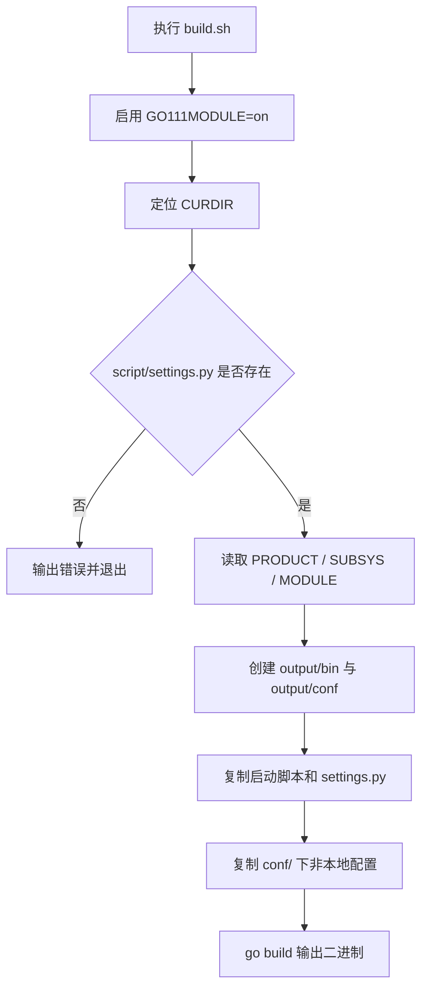

# Other — build.sh

## 模块概览

`build.sh` 是仓库根目录下的构建入口脚本，用于生成 Go 服务二进制并整理运行所需的部署产物。脚本会读取 `script/settings.py` 中的 `PRODUCT`、`SUBSYS`、`MODULE`，拼接出最终可执行文件名：

```bash
${PRODUCT}.${SUBSYS}.${MODULE}
```

构建结果写入 `output/` 目录，主要包括：

- `output/bin/${RUN_NAME}`：Go 编译出的服务二进制
- `output/conf/`：从 `conf/` 复制出的配置文件，排除 `*_local.*`
- `output/bootstrap.sh`、`output/pre_nginx.sh`、`output/settings.py`：运行或部署阶段需要的脚本和配置元信息

## 执行流程



## 关键步骤

### 1. 启用 Go Modules

```bash
export GO111MODULE=on
```

脚本强制启用 Go Modules，确保 `go build` 使用模块化依赖解析。这对依赖 `go.mod` 的构建流程是必要的。

### 2. 解析脚本所在目录

```bash
CURDIR=$(cd $(dirname $0); pwd)
```

`CURDIR` 表示 `build.sh` 所在目录，后续用于检查和读取 `script/settings.py`。

需要注意的是，脚本并没有在开头执行 `cd "$CURDIR"`。因此 `mkdir`、`cp`、`find conf/`、`go build` 等命令仍然依赖当前工作目录。实际使用时应在仓库根目录执行：

```bash
./build.sh
```

如果从其他目录通过绝对路径或相对路径执行该脚本，可能会把 `output/` 创建到错误位置，或找不到 `script/`、`conf/`、Go 源码入口。

### 3. 校验 `script/settings.py`

```bash
if [ ! -f $CURDIR/script/settings.py ]; then
    echo "there is no settings.py exist."
    exit -1
fi
```

`script/settings.py` 是构建命名的必需输入。缺失时脚本立即退出，不会创建构建产物。

### 4. 生成运行名 `RUN_NAME`

```bash
PRODUCT=$(cd $CURDIR/script; python -c "import settings; print(settings.PRODUCT)")
SUBSYS=$(cd $CURDIR/script; python -c "import settings; print(settings.SUBSYS)")
MODULE=$(cd $CURDIR/script; python -c "import settings; print(settings.MODULE)")
RUN_NAME=${PRODUCT}.${SUBSYS}.${MODULE}
```

脚本通过 Python 动态导入 `settings.py`，读取三个字段并拼接二进制文件名。例如：

```bash
output/bin/${PRODUCT}.${SUBSYS}.${MODULE}
```

这意味着 `settings.py` 中的 `PRODUCT`、`SUBSYS`、`MODULE` 不只是部署元信息，也直接影响构建产物名称。修改这些字段会改变 `output/bin/` 下生成的文件名。

### 5. 准备输出目录

```bash
mkdir -p output/bin output/conf
```

`output/` 是部署包目录。`-p` 允许重复执行构建脚本，不会因为目录已存在而失败。

### 6. 复制部署脚本

```bash
cp script/bootstrap.sh script/pre_nginx.sh script/settings.py output 2>/dev/null
chmod +x output/bootstrap.sh output/pre_nginx.sh
```

脚本复制三个文件到 `output/`：

- `script/bootstrap.sh`：通常作为服务启动入口
- `script/pre_nginx.sh`：通常用于 Nginx 前置处理或部署前钩子
- `script/settings.py`：保留构建和运行环境需要的模块元信息

`cp` 的错误输出被重定向到 `/dev/null`，因此如果某个文件缺失，终端不会显示具体错误。但紧随其后的 `chmod` 仍可能失败。

### 7. 复制配置文件

```bash
find conf/ -type f ! -name "*_local.*" | xargs -I{} cp {} output/conf/
```

该命令会复制 `conf/` 目录下所有普通文件，但排除名称匹配 `*_local.*` 的本地配置文件。

这体现了构建产物的约定：

- `conf/*_local.*` 只用于开发者本地环境
- 非本地配置会进入 `output/conf/`，供部署或运行环境使用

配置文件会被平铺复制到 `output/conf/`，不会保留原始子目录结构。如果 `conf/` 下存在不同子目录中的同名文件，后复制的文件会覆盖先复制的文件。

### 8. 构建 Go 二进制

```bash
go build -a -o output/bin/${RUN_NAME}
```

`go build` 在当前工作目录执行，输出到 `output/bin/${RUN_NAME}`。

参数含义：

- `-a`：强制重新构建所有依赖包
- `-o output/bin/${RUN_NAME}`：指定输出文件路径和名称

由于没有显式指定包路径，`go build` 默认构建当前目录对应的 Go 包。因此该脚本假设仓库根目录就是服务主包所在位置，或至少当前目录是可构建的 Go 包目录。

## 与代码库的关系

`build.sh` 本身不被其他代码调用，也不调用项目内部函数。它是一个外部构建入口，连接了三个代码库约定：

1. Go 构建约定：当前目录必须能通过 `go build` 构建。
2. 部署元信息约定：`script/settings.py` 必须定义 `PRODUCT`、`SUBSYS`、`MODULE`。
3. 配置发布约定：`conf/` 下非 `*_local.*` 文件会进入发布产物。

因此，修改服务名称、部署模块名、配置布局或主包位置时，都需要同步检查 `build.sh` 的行为是否仍然符合预期。

## 维护注意事项

- 保持 `script/settings.py` 中 `PRODUCT`、`SUBSYS`、`MODULE` 可被 `python -c "import settings"` 正常读取。
- 如果仓库切换到只支持 `python3` 的环境，需要调整脚本中的 `python` 命令。
- 如果希望脚本支持从任意目录执行，应在解析 `CURDIR` 后显式切换工作目录。
- 如果需要保留 `conf/` 子目录结构，当前的 `cp {} output/conf/` 需要改为保留路径的复制方式。
- 被注释的 `ln -s` 行说明历史上可能存在 `boe.test.yml` 指向 `boe.staging.yml` 的兼容需求；恢复前应确认部署环境是否仍依赖这些配置别名。