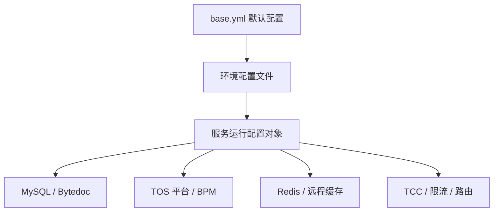

# Other — conf

## conf 配置模块

`conf/` 模块保存 `bktmeta-api` 的静态 YAML 配置。它不包含 Go 函数、类或可执行逻辑，因此调用图中没有内部调用、外部调用或执行流；它通过配置键被服务启动、数据库初始化、缓存、TOS 接入、BPM 审批、TCC、Redis、限流等代码读取。

核心模式是：



## 文件组织

`base.yml` 是主默认配置，定义大部分公共字段和默认值。其他 `*.prod.yml`、`*.staging.yml`、`*.test.yml`、`*.ut.yml` 文件按机房、区域、业务形态或环境覆盖其中一部分字段。

常见命名含义：

- `boe.*.yml`：BOE 环境配置。
- `boei18n.*.yml`、`boettp.yml`：BOE 国际化或 TTP 相关配置。
- `my*`、`sg1`、`sgcomm1`、`alisg`、`jpsaas`：新加坡、马来西亚、SaaS 或国际化部署配置。
- `useast*`、`no1a`、`ie`、`maliva`：海外区域配置。
- `hl`、`lf`、`lq`、`gl`、`gl2`、`jj`、`xh`、`zb`、`zjg`、`hj`：国内不同机房或业务部署配置。
- `*.default_tob*`、`*.default_tob_bp*`、`*.default_tob_imagex*`：ToB、BytePlus 或 ImageX 相关配置空间。
- `test.staging.yml`、`lf.staging.yml`、`-.prod.yml`：测试或特殊环境数据库配置。
- `toutiao_videoarch_bktmetaapi.yaml`：服务运行形态配置，按 `Develop` 和 `Product` 区分端口、日志、pprof、metrics、tracing 等开关。

## 配置加载语义

这些文件本身只声明键值，不执行逻辑。实际生效方式取决于代码中的配置加载器，但从结构上看，`base.yml` 提供完整默认字段，环境文件只覆盖差异项。例如：

```yaml
ReadDB:
  DSNTemplate: "%s:%s@tcp(%s)/%s?charset=utf8&parseTime=True&loc=Local&timeout=%s&readTimeout=%s&writeTimeout=%s"
  Timeout: "500ms"
  ReadTimeout: "1s"
  WriteTimeout: "2s"
  MaxIdle: 100
  MaxOpen: 1000
```

环境文件通常只覆盖：

```yaml
ReadDB:
  Username: ""
  Password: ""
  DBName: "videoarch_account"
  ConsulName: "consul:toutiao.mysql.videoarch_account_read"
```

因此新增环境配置时，应优先复用 `base.yml` 中已有字段，只在环境文件中声明环境差异，避免复制整份默认配置。

## 数据库配置

`ReadDB` 和 `WriteDB` 是读写 MySQL 连接配置，字段结构一致：

- `DSNTemplate`：MySQL DSN 模板，默认在 `base.yml` 中定义。
- `Username` / `Password`：数据库账号密码。多个生产配置中为空，通常表示由服务发现、密钥系统或运行环境补齐。
- `DBName`：数据库名，例如 `videoarch_account`、`videoarch_vcloud`、`videoarch_bktmeta`、`videoarch_account_nontt`、`vbkttest`。
- `ConsulName`：数据库地址或 Consul 服务名，例如 `consul:toutiao.mysql.videoarch_account_write`。
- `Timeout`、`ReadTimeout`、`WriteTimeout`：连接与读写超时。
- `MaxIdle`、`MaxOpen`：连接池参数。

需要注意，部分配置的读写库并不完全对称。例如 `maliva.prod.yml` 中 `WriteDB.DBName` 是 `videoarch_vcloud`，但 `ReadDB.DBName` 是 `videoarch_account`。修改数据库配置时不要假设读写库名一定一致。

## TOS 平台配置

`TosAPI` 描述服务访问 TOS 平台所需的信息。常见字段包括：

- `Disable`：关闭 TOS 平台能力，ToB / BytePlus 部分环境使用 `true`。
- `Creator`：默认创建人。
- `PSM`：TOS 平台服务名，例如 `toutiao.tos.tos_platform`、`bytedance.tos.tos_platform`。
- `Cluster`：TOS 平台集群，例如 `default`、`sg`、`va`、`ie`、`euttp2`。
- `JwtHost`：JWT 或云平台地址。
- `IamSecret`：IAM secret 配置键。
- `ModifyPropertyBpmUri` / `ModifyLimitBpmUri`：跳转式 BPM 申请链接前缀。
- `PlatformHost`：TOS 平台 API 域名。
- `CallbackHost`：回调域名。

当 `TosAPI.Disable: true` 时，调用方需要按代码实现确认是否跳过 TOS 同步、桶属性修改或审批入口生成。配置层只表达开关，不保证所有业务路径自动禁用。

## BPM 审批配置

`ModifyTOSBucketBPMConfig` 用于桶属性、限额、公有级别修改的 BPM API 配置：

- `AuthNodeID`：审批授权节点 ID，部分环境存在。
- `BpmApiUrl`：BPM API 地址。
- `SecretKey`：BPM 调用密钥。
- `Partition`：分区，例如 `cn`、`i18n`、`us`、`tx`。
- `ModifyPropsBpmID`：修改属性流程 ID。
- `ModifyLimitsBpmID`：修改限额流程 ID。
- `ModifyPublicLevelBpmID`：修改公有级别流程 ID。

字段名需要严格保持一致。`base.yml` 和绝大多数环境使用 `ModifyTOSBucketBPMConfig`；`boe.staging.default_tob.yml` 中出现了 `ModifyTOSBucketBpmConfig`，大小写与主配置不一致。如果配置反序列化依赖精确字段名，这一项可能不会覆盖默认值。

## Bytedoc 配置

`BytedocSetting` 支持两种形态：

直接连接：

```yaml
BytedocSetting:
  ConnectURI: "mongodb+consul+token://..."
  DbName: "bktmeta"
```

远程模式：

```yaml
BytedocSetting:
  RemoteMode: true
  RemoteSetting:
    Host: "toutiao.videoarch.bktmetaapi"
    Cluster: "default"
    WithSD: true
    Idc: "my"
    Timeout: 30s
```

国内多机房配置通常使用 `RemoteMode`，通过 `Host`、`Cluster`、`Idc` 指向远端服务；国际化或 SaaS 配置更常见 `ConnectURI` 直连。部分 ToB 配置将 `ConnectURI` 和 `DbName` 置空，表示该环境不使用本地 Bytedoc 存储或由其他机制提供。

## ToB TOS 区域与 S3 Endpoint 映射

`TobTosRegionInfo` 是字符串形式的 JSON 数组，例如：

```yaml
TobTosRegionInfo: "[{\"Region\":\"cn-beijing\",\"Endpoint\":\"tos-cn-beijing-inner.ivolces.com\"}]"
```

`TobTosEndpointToS3Endpoint` 是 TOS endpoint 到 S3 endpoint 的映射：

```yaml
TobTosEndpointToS3Endpoint:
  "tos-cn-beijing.ivolces.com": "tos-s3-cn-beijing-inner.ivolces.com"
```

这里 `TobTosRegionInfo` 不是 YAML 列表，而是字符串。读取方如果需要结构化数据，应先从配置中取字符串，再按 JSON 解析。

## 路由、集群与缓存

`TosS3Router` 在 `base.yml` 中定义 S3 访问路由，包含三组映射：

- `TLSPSM`：不同区域的 TLS PSM。
- `RouterPSM`：代理或目标 PSM。
- `RouterCluster`：区域到 cluster 的映射。

键名中既有纯区域名，如 `BOE`、`MALIVA`、`ALISG`、`I18N`、`EU-TTP`，也有组合键，如 `US-TTP-toutiao.tos.tosapi`。修改路由时需要确认调用方使用的是哪种 key 生成规则。

缓存相关配置包括：

- `CacheSize`：本地缓存容量。
- `CacheRefreshTime`：本地缓存刷新间隔。
- `RedisConfig`：Redis 集群与超时配置。
- `RemoteCacheConfig`：远程缓存开关、TTL、批量大小、逻辑过期与锁释放 TTL。
- `RateLimiter`：分布式限流配置。
- `InterfaceRateLimiter`：接口级限流配置，默认 `Enable: false` 且 `Limits: {}`。

`RemoteCacheConfig.Enable` 默认是 `false`，所以仅声明 Redis 不等于启用远程缓存，具体仍取决于代码中的开关判断。

## 外部系统配置

`VcloudControlConfig` 配置 Vcloud 控制面访问凭据：

```yaml
VcloudControlConfig:
  AccessKey: "..."
  SecretKey: "..."
```

`ByteTreeConfig` 配置 ByteTree 地址、分区和密钥：

```yaml
ByteTreeConfig:
  Domain: "https://bytetree.byted.org"
  Partition: "cn"
  SecretKey: "..."
  JwtHost: "https://cloud-i18n.bytedance.net"
```

`AGWConfig` 控制 AGW OpenAPI 集成：

- `Switch`：是否启用。
- `OpenapiHost`：OpenAPI 地址。
- `ServiceId`：服务 ID 查询串，包含 `boe`、`publish_online` 等参数。
- `OpenapiUserName`：用户名。
- `OpenapiPasswordConfigKey`：密码配置键。

国内和部分国际化环境启用 `AGWConfig.Switch: true`；ToB、BytePlus、部分 TTP 环境关闭该开关。

## TCC、ID 生成与业务集群

`Tcc` 指定 TCC 配置空间：

```yaml
Tcc:
  ServiceName: "toutiao.videoarch.bktmetaapi"
  ConfigSpace: "default"
```

多个 ToB / BytePlus 环境覆盖 `ConfigSpace`，例如 `default_tob`、`default_tob_bp`、`gl`。服务代码读取 TCC 时应以该字段决定配置空间，而不是从文件名推断。

`IdGenerator` 控制 ID 生成器：

```yaml
IdGenerator:
  Switch: true
  NameSpace: "global"
  CounterSpace: "videoarch"
```

`jpsaas.prod.yml` 将 `IdGenerator.Switch` 设置为 `false`。如果新增依赖 ID 生成器的逻辑，需要考虑该开关关闭时的行为。

`AccountCluster` 和 `SGWCluster` 用于区分账户或网关集群，默认是 `default`，BytePlus 相关配置会设置为 `default_tob_bp`。

## 服务运行配置

`toutiao_videoarch_bktmetaapi.yaml` 与业务配置文件不同，它按运行模式划分为 `Develop` 和 `Product`：

- `ServicePort`：服务端口，当前为 `8789`。
- `DebugPort`：调试端口，当前为 `6790`。
- `EnableTracing`：开启 tracing。
- `EnablePprof`：开启 pprof。
- `EnableMetrics`：生产为 `true`，开发为 `false`。
- `LogLevel`：开发为 `debug`，生产为 `info`。
- `ConsoleLog`：开发为 `true`，生产为 `false`。
- `FileLog`、`DatabusLog`、`AgentLog`：日志输出开关。
- `Mode`：开发为 `debug`，生产为 `release`。
- `ServiceVersion`：当前为 `0.1.0`。

这份文件更偏向服务框架启动参数，而 `base.yml` 和环境 YAML 更偏向业务依赖配置。

## 新增或修改环境配置的注意事项

新增环境文件时，优先从最接近的现有文件复制，再只修改差异字段：数据库 `DBName` / `ConsulName`、`TosAPI` 域名、`ByteTreeConfig.Partition`、`Tcc.ConfigSpace`、`RedisConfig.Cluster`、`AGWConfig.Switch` 等。

修改字段名时要谨慎。YAML 反序列化通常依赖结构体 tag 或字段名匹配，`ModifyTOSBucketBPMConfig`、`TobTosEndpointToS3Endpoint`、`UseDistributedRateLimiter` 这类长字段名一旦大小写不一致，可能表现为“配置存在但不生效”。

不要把 `TobTosRegionInfo` 改成 YAML 数组，除非同步修改读取代码；当前配置把它作为 JSON 字符串保存。

不要从文件名推断业务行为。比如 `SyncTosBuckets`、`TosAPI.Disable`、`AGWConfig.Switch`、`RemoteCacheConfig.Enable` 都是显式开关，业务代码应读取配置值。

该目录包含数据库密码、访问密钥、BPM secret 等敏感信息。提交或复制配置时应按仓库现有密钥治理方式处理，避免在文档、日志和测试输出中展开具体值。