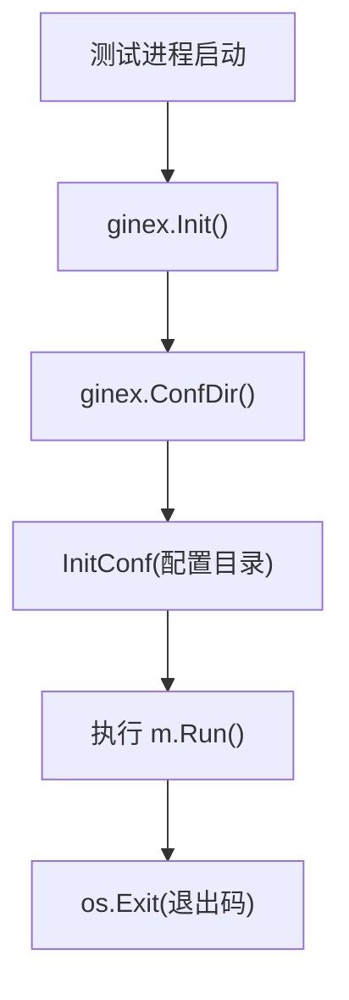

# Other — config

## config 模块

`config` 包负责应用配置的初始化、数据库连接配置读取，以及从 TCC 合并基础配置。当前测试文件覆盖了三个关键行为：测试进程初始化、MySQL 配置能力、TCC 基础配置合并。

## 初始化流程

测试入口定义在 `config/base_test.go`：

```go
func TestMain(m *testing.M) {
	ginex.Init()
	InitConf(ginex.ConfDir())
	code := m.Run()
	os.Exit(code)
}
```

所有 `config` 包测试都会先执行这段初始化逻辑：

1. `ginex.Init()` 初始化 `ginex` 运行环境。
2. `ginex.ConfDir()` 返回配置目录。
3. `InitConf(...)` 加载配置并填充全局配置对象 `Conf`。
4. `m.Run()` 执行测试用例。
5. 使用 `os.Exit(code)` 保留测试退出码。

这意味着依赖 `Conf` 的测试，例如 `Conf.ReadDB.GetDSN()` 和 `Conf.ReadDB.NewDB()`，默认都运行在已经完成配置加载的环境中。



## 全局配置对象 `Conf`

`Conf` 是 `config` 包的全局配置入口。测试中直接访问或替换它，用于验证配置行为：

```go
dsn := Conf.ReadDB.GetDSN()
db, err := Conf.ReadDB.NewDB()
```

TCC 合并测试也会临时覆盖 `Conf`：

```go
oldConf := Conf
defer func() { Conf = oldConf }()

Conf = &Config{
	Meta: Meta{
		PSM: "test.psm",
	},
	TccInfo: TccInfo{
		ConfigSpace: "default",
	},
	SyncTosBuckets: false,
	TosAPI: TosAPI{
		Cluster: "local-cluster",
		Creator: "local",
	},
}
```

从这些使用方式可以看出，`Config` 至少包含以下配置区域：

- `Meta.PSM`：服务 PSM，用于创建 TCC 客户端。
- `TccInfo.ConfigSpace`：TCC 配置空间，会传递给 `tccclient.ConfigV2.Confspace`。
- `ReadDB`：读数据库配置，提供 `GetDSN()` 和 `NewDB()`。
- `SyncTosBuckets`：是否同步 TOS bucket。
- `TosAPI`：TOS API 配置，包含 `Disable`、`Cluster`、`Creator` 等字段。

## MySQL 配置

`config/mysql_test.go` 验证 MySQL 相关能力。

`IsCodebaseCIEnvironment()` 用于判断当前是否处于 Codebase CI 环境：

```go
func TestIsCodebaseCIEnvironment(t *testing.T) {
	assert.True(t, IsCodebaseCIEnvironment())
}
```

`Conf.ReadDB.GetDSN()` 根据当前环境返回数据库 DSN：

```go
dsn := Conf.ReadDB.GetDSN()
assert.True(t, len(dsn) > 0)
```

测试覆盖了两种路径：

- CI 环境：直接调用 `Conf.ReadDB.GetDSN()`，断言返回非空 DSN。
- 非 CI 环境：通过 `gomonkey.ApplyFunc` 将 `IsCodebaseCIEnvironment` patch 为 `false`，再断言返回非空 DSN。

```go
patches := gomonkey.ApplyFunc(IsCodebaseCIEnvironment, func() bool {
	return false
})
defer patches.Reset()

dsn := Conf.ReadDB.GetDSN()
assert.True(t, len(dsn) > 0)
```

`Conf.ReadDB.NewDB()` 会基于当前数据库配置创建数据库连接对象：

```go
db, err := Conf.ReadDB.NewDB()
assert.Nil(t, err)
assert.NotNil(t, db)
```

测试文件通过空白导入注册 MySQL driver：

```go
import _ "code.byted.org/gopkg/mysql-driver"
```

因此维护 `NewDB()` 时需要注意：它依赖驱动注册副作用，测试环境中必须保留该导入。

## TCC 基础配置合并

`mergeTCCBaseConfig()` 负责把 TCC 中 key 为 `"base"` 的基础配置合并进全局 `Conf`。

测试覆盖了三个行为边界。

### `Conf == nil` 时不处理

```go
Conf = nil
mergeTCCBaseConfig()
assert.Nil(t, Conf)
```

当全局配置不存在时，`mergeTCCBaseConfig()` 应直接返回，不创建新的 `Config`，也不触发 TCC 请求。

### `Meta.PSM` 为空时不处理

```go
Conf = &Config{}
mergeTCCBaseConfig()
assert.Equal(t, "", Conf.Meta.PSM)
```

当 `Conf.Meta.PSM` 为空时，函数不具备创建 TCC 客户端所需的服务标识，应保持配置不变。

### 成功合并时保留本地未覆盖字段

成功路径中，测试 patch 了 `tccclient.NewClientV2` 和 `ClientV2.Get`：

```go
patches.ApplyFunc(tccclient.NewClientV2, func(psm string, cfg *tccclient.ConfigV2) (*tccclient.ClientV2, error) {
	assert.Equal(t, "test.psm", psm)
	assert.NotNil(t, cfg)
	assert.Equal(t, "default", cfg.Confspace)
	return client, nil
})
```

这里验证了两个契约：

- `mergeTCCBaseConfig()` 使用 `Conf.Meta.PSM` 创建 TCC 客户端。
- `Conf.TccInfo.ConfigSpace` 会传递到 `tccclient.ConfigV2.Confspace`。

随后从 TCC 读取 `"base"` 配置：

```go
patches.ApplyMethod(reflect.TypeOf(client), "Get", func(_ *tccclient.ClientV2, _ context.Context, key string) (string, error) {
	assert.Equal(t, "base", key)
	return baseConfigYAML, nil
})
```

测试中的 TCC YAML 只覆盖部分字段：

```yaml
SyncTosBuckets: true
TosAPI:
  Disable: true
```

合并后断言：

```go
assert.True(t, Conf.SyncTosBuckets)
assert.True(t, Conf.TosAPI.Disable)

assert.Equal(t, "local-cluster", Conf.TosAPI.Cluster)
assert.Equal(t, "local", Conf.TosAPI.Creator)
```

这说明 `mergeTCCBaseConfig()` 的合并语义不是简单替换整个 `Conf`，而是用 TCC base 配置覆盖明确提供的字段，同时保留 TCC 未提供的本地字段。

## 维护注意事项

修改 `InitConf`、`Conf` 结构或配置文件格式时，需要保证 `TestMain` 仍能完成初始化，否则依赖 `Conf.ReadDB` 的测试会失败。

修改 MySQL 配置逻辑时，需要同时验证 `IsCodebaseCIEnvironment()` 为 `true` 和 `false` 两条路径，确保 `GetDSN()` 在两种环境下都返回可用 DSN。

修改 `mergeTCCBaseConfig()` 时，重点保持这几个行为不变：

- `Conf == nil` 时安全返回。
- `Conf.Meta.PSM == ""` 时不访问 TCC。
- 使用 `Conf.Meta.PSM` 和 `Conf.TccInfo.ConfigSpace` 创建 `tccclient.ClientV2`。
- 从 TCC 读取 key `"base"`。
- TCC base 配置只覆盖提供的字段，未提供字段保留本地值。