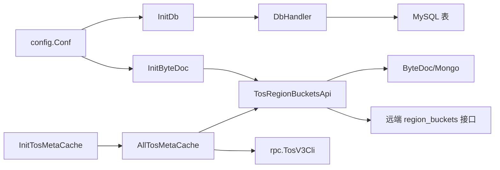

# Other — db

## db 模块

`db` 包是 bktmeta-api 的持久化与缓存聚合层，负责 Bucket 元数据、IDC 配置、临时建桶工单、IDC 代理、火山 IAM 账号，以及 TOS 全量 Bucket 快照的读写。它同时连接 MySQL、ByteDoc/Mongo、TOS 管理 RPC、KMS 和指标系统。



## 初始化流程

测试入口 `TestMain` 展示了典型启动顺序：`ginex.Init()`、`config.InitConf()`、`util.InitMetrics()`、`kms.Init()`、`rpc.InitRpc()`、`InitDb()`、`InitByteDoc()`、`InitTosMetaCache()`。

`InitDb()` 初始化全局 `Db *DbHandler`。`DbHandler` 内部维护读写分离的 `*gorm.DB`：`r` 用于读库，`w` 用于写库；重试参数来自 `config.Conf.RetryTimes`，写入事务默认使用 `5 * time.Second` 的重试间隔。若 `config.Conf.IdGenerator.Switch` 开启，`IdGenCli` 使用 `idgenerator.New()`；否则退化为 `EmptyIdGen`，其 `Get()` 返回 `0`，`MGet()` 返回指定长度的零值切片。

`InitByteDoc()` 根据 `config.Conf.TosAPI.Disable` 和 `config.Conf.BytedocSetting.RemoteMode` 决定 ByteDoc 模式：

- 本地模式：`initLocalByteDoc()` 必须成功，`TosRegionBucketsApi = &regionBucketApiImpl{tosAllBucketsCol: localTosAllBucketsCol}`。
- 远端模式：本地 ByteDoc 快照是 best-effort；主接口通过 `buildRemoteBytedocCli()` 构造 `regionBucketApiRemoteImpl`。
- 禁用 TOS API：跳过 ByteDoc 初始化。

`initLocalByteDoc()` 使用 `config.Conf.BytedocSetting.ConnectURI` 连接 Mongo，初始化 `RegionTosAllBuckets` 集合，并通过 `ensureIndices()` 为 `region` 创建唯一索引。

## 通用数据库写法

大多数 `DbHandler` 方法遵循同一模式：

1. 通过 `util.EmitThroughput()` 和 `util.EmitLatency()` 上报命令指标。
2. 使用 `retry.Do()` 或 `retry.DoCanAbort()` 包裹数据库操作。
3. 写操作通过 `db.w.Begin().Context(ctx)` 开启事务。
4. 失败时调用 `RollbackTX(tx, err)`，该函数会合并业务错误与 rollback 错误。
5. 主键通过 `IdGenCli.Get()` 或 `IdGenCli.MGet()` 生成，部分写路径使用 `util.WithoutCancel(ctx)` 避免上游取消影响 ID 获取。

相关表名常量包括：

- `TableBuckets = "t_bucket"`
- `TableBucketsIdcConfig = "t_bucket_idc_config"`
- `TableBucketTestRecord = "t_bucket_param_test_record"`
- `TableTempBuckets = "t_new_bucket_temp"`
- `TableIdcProxy = "t_idc_proxy"`
- `TableIdcMeta = "t_idc_meta"`
- `volcTable = "t_volcengine_iam"`

## Bucket 元数据

Bucket 主数据存储在 `t_bucket`，多 IDC 后端配置存储在 `t_bucket_idc_config`。代码直接持久化 SDK 类型 `meta.Bucket` 和 `meta.BucketIdcConfig`。

核心写接口：

- `CreateBucket(ctx, bucket)`：写入前调用 `encryptBucket()`，然后在同一事务中插入主 Bucket 和 `bucket.IdcConfigs`。
- `UpdateBucket(ctx, bucket)`：加密后更新主表字段，删除该 Bucket 的所有旧 IDC 配置，再插入当前配置列表。
- `OverwriteBucket(ctx, bucket)`：只覆盖主表字段，不重建 `t_bucket_idc_config`。
- `DeleteBucket(ctx, name)`：先查询 Bucket，再删除主表记录和关联 IDC 配置。
- `CreateBucketIDCConfigs()` / `DeleteBucketIDCConfigs()`：单独维护 `t_bucket_idc_config`。

读接口分为“原始密文”和“解密后”两类：

- `GetUndecryptedBucketByName()`、`BatchGetUndecryptedBucket()`、`GetUndecryptedAllBuckets()`、`BatchGetUndecryptedAllBuckets()` 返回数据库中的加密字段。
- `GetBucketByName()` 和 `ListBucketsByProvider()` 会调用 `DecryptBucketWithConfig()` 解密。
- `PageBucketsForJanus()` 返回 `dto.PageBucketsResponse`，用于分页展示简化 Bucket 信息。
- `GetAllBucketNames()` 只查询 `name` 字段，常用于批量扫描。

注意：`encryptBucket()`、`encryptBucketIDCConfigs()` 和 `DecryptBucketWithConfig()` 都会原地修改传入对象。调用者如果需要保留明文对象，应自行复制。

## 后端 Bucket 加解密

`encryptBackendBucket()` 和 `decryptBackendBucket()` 根据 `backendType` 解析并处理 `BackendBucket` JSON。支持的后端类型包括：

- `meta.BackendTos`
- `meta.BackendS3`
- `meta.BackendOss`
- `meta.BackendMosaic`
- `meta.BackendGCS`
- `meta.BackendP2P`
- `meta.BackendLarkDrive`
- `meta.BackendToBTos`
- `meta.BackendFS`
- `meta.BackendToBCustomerS3`
- `meta.BackendHDFS`

敏感字段通过 `kms.Cipher.Encrypt()` 和 `kms.Cipher.Decrypt()` 处理。`ignoreAkSk=true` 时，`DecryptBucketWithConfig()` 会清空 AK/SK 或等价凭证字段，适合对外返回不含密钥的元数据。

TOS 类型有额外行为：`decryptBackendBucket()` 会尝试从 `TosMetaCache.GetTosMeta()` 补充 `Public`、`Creator` 和 `TTL`。其中 `TTL` 只在 TOS Bucket 创建时间超过一天时采用缓存中的值。

## Bucket 参数测试记录

Bucket 参数测试记录存储在 `TableBucketTestRecord`：

- `CreateBucketTestRecord(ctx, bkt)` 会将同名同 IDC 的旧有效记录置为 `validate=false`，插入新的 `meta.BucketParamTestRecord`，并把主 Bucket 或 IDC 配置的 `TestStatus` 更新为 `meta.Bucket_Testing`。
- `GetBucketTestRecord(ctx, bktName, idc)` 查询当前 `validate=1` 的记录。
- `UpdateBucketTestResult(ctx, record, testStatus, err)` 更新测试记录状态和错误信息，同时同步更新 `t_bucket` 或 `t_bucket_idc_config` 上的测试状态。

## RegionBucketsApi 与 ByteDoc

`RegionBucketsApi` 抽象了 TOS 全量 Bucket 快照的存储接口：

```go
type RegionBucketsApi interface {
    CreateRegionBuckets(ctx context.Context, doc *RegionTosAllBucketsDB) error
    QueryRegionBuckets(ctx context.Context, doc *RegionTosAllBucketsDB) error
    UpdateTosAllBucketsDB(ctx context.Context, doc *RegionTosAllBucketsDB) error
    ListAllRegionTosBuckets(ctx context.Context) ([]*RegionTosAllBucketsDB, error)
}
```

`RegionTosAllBucketsDB` 是 ByteDoc 文档结构，包含 `Region`、`LastUpdateTime` 和 `AllBuckets []*rpc.AdminBucketV1`。

本地实现 `regionBucketApiImpl` 直接操作 Mongo 集合：

- `CreateRegionBuckets()` 使用 `InsertOne()`。
- `QueryRegionBuckets()` 按 `region` 查询。
- `UpdateTosAllBucketsDB()` 使用 `FindOneAndUpdate()`，条件包含当前 `lastUpdateTime`，用于避免覆盖并发更新。
- `ListAllRegionTosBuckets()` 按 `region` 排序批量读取。

远端实现 `regionBucketApiRemoteImpl` 使用 Hertz 客户端访问：

- `POST /gateway/v1/region_buckets/create`
- `POST /gateway/v1/region_buckets/query`
- `POST /gateway/v1/region_buckets/update`
- `POST /gateway/v1/region_buckets/list`

`DoReq()` 会设置服务发现选项：`withSD`、`cluster`、`idc`、`env`，并保证上下文中存在 log id。响应 HTTP 状态码非 2xx 时返回错误；业务响应要求 `Code == janus.JanusOkCode`。

远端 `ListAllRegionTosBuckets()` 读取成功后，会对每个文档调用 `UpsertLocalRegionBuckets()`。该方法只有在 `writeBack=true` 且 `localTosAllBucketsCol` 已初始化时才写本地快照；写入前先只投影查询 `lastUpdateTime`，若本地版本更新或相等则跳过，否则使用带版本条件的 `UpdateOne(..., SetUpsert(true))` 写入，避免旧大文档覆盖新数据。

## TOS 元数据缓存

`AllTosMetaCache` 是进程内缓存：

- `BucketCache sync.Map`：`bucket name -> *rpc.AdminBucketV1`
- `BucketListCache []*meta.TosBucket`：`GetAllTosBuckets()` 的 1 分钟列表缓存
- `RegionVersionMap sync.Map`：`region -> lastUpdateTime`

`InitTosMetaCache()` 会先同步一次 `asyncUpdateAllTosBktCache()`；如果失败会 panic。随后启动后台任务：

- 每 5 分钟刷新 `AllTosMetaCache`。
- 当 `config.Conf.SyncTosBuckets` 为真时，每 5 分钟执行 `asyncUpdateAllTosBucketsIntoBytedoc()`。
- 每 10 分钟执行 `scanAllTicketStatus()`，将超时的临时建桶工单置为过期。

`asyncUpdateAllTosBktCache()` 先通过 `Db.BatchGetUndecryptedAllBuckets(ctx, 300)` 构建 `bktmetaBucketCache`，再从 `TosRegionBucketsApi.ListAllRegionTosBuckets()` 读取所有区域快照。只有远端 `LastUpdateTime` 比本地 `RegionVersionMap` 更新时才处理该区域。处理 Bucket 时会结合 `regionAllowUpdateIdcs` 和 `needCheckAllowIdc()` 过滤 IDC，并在重名冲突时优先尊重 bktmeta MySQL 中的 IDC。

`asyncUpdateAllTosBucketsIntoBytedoc()` 用于把当前区域的 TOS 管理面数据同步到 ByteDoc。它先查询当前区域文档，版本超过 5 分钟才刷新；随后调用 `rpc.TosV3Cli.GetAllBuckets()` 和 `rpc.TosV3Cli.GetAllBucketsWithCache()`。如果新数量小于旧数量，直接跳过更新，避免异常空洞数据覆盖旧快照。`getIdcFromAdminBkt()` 从 `AdminBucketV1.VRegion` 解析 IDC，并特殊映射 `CN-3DC`、`CN-ZG`、`CN6-3DC`。

## 临时建桶工单

临时 Bucket 存储在 `t_new_bucket_temp`，使用 `dto.TempBucket`。状态常量为：

- `TicketWaitingForApprove = 0`
- `TicketExpired = -1`
- `TicketSuccess = 1`

`CreateTempBucket()` 插入工单；`GetAllWaitingTempBucketsFromDB()` 查询待审批工单；`GetValidTempBucketByName()` 查询未过期工单；`DeleteTempBucket()` 删除记录。

`UpdateTicketStatusByName()` 有一个重要保护：一旦工单已经是 `TicketSuccess`，后续不会被更新为其他状态。更新为 `TicketExpired` 时会设置 `ExpiredAt`。后台 `scanAllTicketStatus(ctx, expireElapse)` 会将创建时间超过 `expireElapse` 分钟的待审批工单标记为过期。

## IDC 代理配置

IDC 元数据和代理地址分别存储在 `t_idc_meta` 与 `t_idc_proxy`：

- `CreateIdc(ctx, idcProxiesDTO)` 插入 `meta.IdcMeta` 和代理列表。
- `GetIdcProxies(ctx, idc)` 查询 IDC 元数据及所有代理。
- `GetIdcProxiesByProgramEnvIdc(ctx, idc, programEnvIdc)` 只查询匹配 `program_env_idc` 或空值的代理。
- `UpdateIdcProxies(ctx, idcProxiesDTO)` 更新 IDC 元数据，并删除后重建全部代理。
- `GetAllIdcProxies(ctx)` 一次读取所有 IDC 元数据和代理，在内存中按 IDC 分组。
- `DeleteIdcProxies(ctx, idc)` 删除代理和 IDC 元数据。

## 火山 IAM 账号

火山 IAM 信息通过 `meta.VolcengineIAM` 对外暴露，数据库 DTO 是 `VolcIAMDTO`，表名为 `t_volcengine_iam`。

- `CreateVolc()` 调用 `encryptVolc(volc, true)` 加密 `SecretKey` 后插入。
- `UpdateVolc()` 只有在 `volc.Credentials.SecretKey != ""` 时才更新并加密 secret；其他字段按非空值构造更新 map。
- `GetVolc(ctx, ak)` 按 access key 查询，未命中时返回 `nil, nil`。
- `GetVolcByAccountId()` 按 `account_id` 查询，未命中返回空切片。
- `ListAllPlatformVolcAccounts()` 查询 `account_id = 0` 的平台账号。
- `GetAllVolcs()` 返回所有可成功解密的账号。
- `DeleteVolc()` 按 access key 删除。

## 贡献注意事项

新增写接口时应沿用现有模式：指标埋点、`retry.Do()`、事务、`RollbackTX()` 和 `IdGenCli`。涉及密钥、secret、credential 的字段必须走 `kms.Cipher`，并确认 `ignoreAkSk` 场景不会泄露凭证。

修改 TOS 缓存逻辑时需要同时考虑 MySQL 中的 bktmeta Bucket、ByteDoc 区域快照和 TOS 管理面 RPC。`asyncUpdateAllTosBktCache()` 中的 IDC 白名单和重名冲突处理是避免跨区域错误覆盖的关键逻辑。

测试依赖 `TestMain` 初始化配置、KMS、RPC、数据库和缓存。部分测试是集成测试，会访问真实配置中的 DB/TOS/ByteDoc；远端 ByteDoc 与本地写回路径则大量使用 `gomonkey` patch `DoReq()`、Mongo 方法或 `rpc.TosV3Cli`。