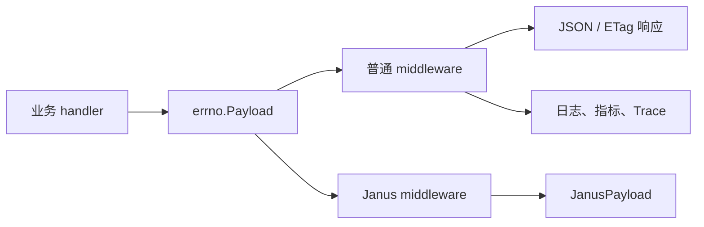

# Other — errno

## errno 模块

`errno` 定义了项目内统一的业务响应结构和错误码。业务 handler 通常返回 `errno.Payload`，再由 `middleware.ResponseMiddleware`、`middleware.ZtiResponseMiddleware`、`middleware.OpenapiMiddleware` 或 `janus.ResponseMiddleware` 统一序列化、记录指标和设置 Trace 状态。



## 核心结构

`Payload` 是所有业务响应的基础结构：

```go
type Payload struct {
	Code    int         `json:"code"`
	Message string      `json:"message"`
	Data    interface{} `json:"data,omitempty"`
	ETag    string      `json:"etag,omitempty"`
	Alert   bool        `json:"-"`
}
```

字段含义：

- `Code`：业务状态码，不直接等同 HTTP 状态码。多数 middleware 最终仍以 `http.StatusOK` 返回。
- `Message`：业务提示或错误信息。
- `Data`：响应数据，`omitempty` 表示为 `nil` 时不会出现在 JSON 中。
- `ETag`：缓存响应使用的 ETag。`ResponseMiddleware` 在 `Data` 是 `[]byte` 时会结合 `If-None-Match` 处理 `304 Not Modified`。
- `Alert`：内部字段，`json:"-"`，不会序列化到响应体。

`Payload` 有一个方法：

```go
func (p *Payload) Error() error
```

它返回 `errors.New(p.Message)`。注意这个方法签名不是 Go 标准 `error` 接口需要的 `Error() string`，因此 `*Payload` 本身不实现内置 `error` 接口。

## 响应构造函数

### `OK`

```go
func OK(data interface{}) Payload
```

构造成功响应：

```go
errno.OK(result)
```

返回：

```go
Payload{
	Code:    CodeOK,
	Message: "ok",
	Data:    result,
}
```

其中 `CodeOK` 为 `2000`。

### `OKWithETag`

```go
func OKWithETag(data interface{}, etag string) Payload
```

用于需要缓存协商的成功响应。调用方把预序列化的响应或普通数据放入 `Data`，并设置 `ETag`：

```go
errno.OKWithETag(bytes, "etag-value")
```

普通 middleware 在 `Data` 类型为 `[]byte` 时会直接写出字节流，并设置响应头 `ETag`；如果请求头 `If-None-Match` 与 `Payload.ETag` 相同，则返回 `304`。

### `Error`

```go
func Error(err error) Payload
```

将普通 `error` 转成业务错误响应：

- `err == nil` 时返回 `OK(nil)`
- `err != nil` 时返回 `Code: 600`，`Message: err.Error()`

`600` 是该函数内部硬编码的默认错误码。需要明确业务错误类型时，应优先使用 `ErrorWithCode` 或预定义错误变量。

### `ErrorWithCode`

```go
func ErrorWithCode(code int, err error) Payload
```

使用指定业务码和 `err.Error()` 构造错误响应：

```go
return errno.ErrorWithCode(errno.CodeBadRequest, err)
```

该函数没有处理 `err == nil`，传入 `nil` 会触发 panic。

### `ErrorWithCodeAndData`

```go
func ErrorWithCodeAndData(code int, err error, data interface{}) Payload
```

在错误响应中附带 `Data`，常用于部分成功、批量操作失败明细等场景：

```go
return errno.ErrorWithCodeAndData(errno.CodeInternalErr, err, ret)
```

同样要求 `err` 非空。

## 错误码

`errno/error.go` 中集中定义业务码：

```go
const (
	CodeOKZero         = 0
	CodeOK             = 2000
	CodeCreated        = 2001
	CodePartialContent = 2006

	CodeBadRequest      = 4000
	CodeUnauthorized    = 4001
	CodeForbidden       = 4003
	CodeNotFound        = 4004
	CodeTooManyRequests = 4029

	CodeInternalErr        = 5000
	CodeServiceUnavailable = 5003
	CodeVsreErr            = 5004
	CodeGetDataErr         = 5012
	CodeParseDataErr       = 5013
	CodeDbErr              = 5014
)
```

代码中的约定是：

- `CodeOK == 2000` 表示普通接口成功。
- `CodeOKZero == 0` 用于 BPM、Janus 等外部协议适配成功码。
- `4xxx` 表示请求、鉴权、资源不存在、限流等客户端侧业务错误。
- `5xxx` 表示内部错误、服务不可用、数据获取或解析失败等服务侧错误。

middleware 会用 `Code` 判断日志级别和 Trace 状态：非 `CodeOK` 会记录错误指标；`Code >= CodeInternalErr` 通常按 error 级别记录，否则按 warn 级别记录。

## 预定义错误

模块提供了一组可直接返回的 `Payload` 变量，例如：

```go
errno.ErrUnauthorized
errno.ErrTooManyRequests
errno.ErrBucketNotFound
errno.ErrBucketAkInvalid
errno.ErrSignatureInvalid
errno.ErrVsreContentInvalid
```

这些变量适合固定错误语义，例如鉴权失败、bucket 不存在、签名参数非法等：

```go
if bucket == nil {
	return errno.ErrBucketNotFound
}
```

如果错误消息需要包含动态上下文，使用 `ErrorWithCode`：

```go
return errno.ErrorWithCode(errno.CodeBadRequest, errors.New("missing access_key"))
```

## 与 middleware 的关系

业务层 handler 的常见签名来自 middleware：

```go
type MyHandler func(c *gin.Context) errno.Payload
```

handler 返回 `errno.Payload` 后，middleware 负责：

- 写入 `gin.Context` 的 `ResultDataContextKey`
- 统一输出 JSON 或缓存字节响应
- 设置 CORS、缓存控制、ETag 等响应头
- 上报吞吐、错误和延迟指标
- 设置 BytedTrace 的业务状态码
- 根据 `Payload.Code` 判断是否标记 Trace error

普通 API 中成功响应通常直接返回：

```go
return errno.OK(resp)
```

参数错误或内部错误通常返回：

```go
return errno.ErrorWithCode(errno.CodeBadRequest, err)
return errno.ErrorWithCode(errno.CodeInternalErr, err)
```

限流场景会直接使用：

```go
data = errno.ErrTooManyRequests
```

## 协议适配

`errno.Payload` 是内部统一响应，但不同入口会做协议转换。

`middleware.toBPMPayload` 会把成功码从 `CodeOK` 转为 `CodeOKZero`：

```go
if p.Code == errno.CodeOK {
	jp.Code = errno.CodeOKZero
}
```

`janus.toJanusPayload` 会把 `Payload` 转成 `JanusPayload`：

```go
type JanusPayload struct {
	Code      int         `json:"code"`
	Message   string      `json:"message"`
	RequestId string      `json:"trace_id"`
	Response  interface{} `json:"response"`
}
```

其中：

- `Payload.Code == errno.CodeOK` 时，Janus 响应码为 `0`
- `Payload.Data` 会映射到 `JanusPayload.Response`
- `Payload.Message` 会保留为 `JanusPayload.Message`

## 测试覆盖

`errno/response_test.go` 覆盖了响应构造函数的基础行为：

- `Error(nil)` 返回 `CodeOK` 和 `"ok"`
- `Error(errors.New("ut error"))` 返回 `Code: 600`
- `ErrorWithCode` 使用传入 code 和错误消息
- `ErrorWithCodeAndData` 会保留 `Data`
- `OK` 返回 `CodeOK` 和传入数据
- `OKWithETag` 返回 `CodeOK`、数据和 ETag
- `Payload.Error()` 返回由 `Message` 构造出的 `error`

新增或修改 `errno` 行为时，应优先补充这些构造函数和协议适配路径的测试，因为该模块是服务层、middleware、Janus/BPM/OpenAPI 响应格式的共同基础。