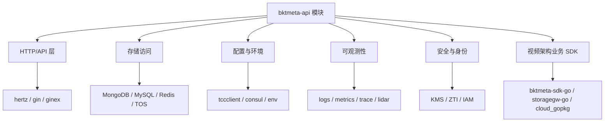

# Other — go.mod

## 模块概览

`go.mod` 定义了 `code.byted.org/videoarch/bktmeta-api` 这个 Go 模块的身份、Go 版本和完整依赖入口。它不包含运行时代码，因此没有函数、类、内部调用或执行流；它的作用是约束整个仓库的构建、测试、依赖解析和版本复现。

该模块使用：

```go
module code.byted.org/videoarch/bktmeta-api

go 1.21
```

这表示仓库内所有 Go 包都属于 `code.byted.org/videoarch/bktmeta-api` 模块，并以 Go 1.21 的模块语义和标准库能力作为基线。

## 在代码库中的作用

`go.mod` 是本仓库的依赖根。开发者执行以下命令时，Go 工具链都会读取它：

```bash
go test ./...
go build ./...
go mod tidy
go list -m all
```

它与 `go.sum` 一起保证依赖版本可复现。`go.mod` 负责声明模块需要哪些依赖和版本，`go.sum` 负责记录这些模块版本的校验和。

本文件没有调用图，因为它不是可执行代码；它通过 Go module 机制连接到所有源码包。

## 依赖结构

依赖分为两个 `require` 块：

- 第一个 `require` 块是当前代码直接依赖的模块，通常会在源码中被 `import`。
- 第二个 `require` 块带有 `// indirect`，表示这些模块主要由直接依赖传递引入，或曾经由源码间接使用后被 Go 工具链保留。



## 主要直接依赖

### HTTP 与服务框架

模块同时声明了 Hertz 和 Gin 相关依赖：

- `code.byted.org/middleware/hertz v1.13.5`
- `github.com/gin-gonic/gin v1.7.7`
- `code.byted.org/gin/ginex v1.8.1-0.20220524130704-969507f01e62`

这说明仓库中可能存在基于 Hertz 的服务入口，也可能保留 Gin 或 Gin 扩展组件。贡献代码时应以实际源码中的路由注册、middleware 和 handler 风格为准，不要仅凭 `go.mod` 判断当前主框架。

### 存储与缓存

直接依赖覆盖了多种存储后端：

- `code.byted.org/bytedoc/mongo-go-driver v1.2.9`
- `code.byted.org/gopkg/gorm v1.0.9`
- `code.byted.org/gopkg/mysql-driver v1.2.7`
- `code.byted.org/kv/goredis/v5 v5.7.3`
- `github.com/volcengine/ve-tos-golang-sdk/v2 v2.4.5`
- `code.byted.org/videoarch/storagegw-go v1.1.56`

这些依赖表明该服务可能同时访问 MongoDB、MySQL、Redis、TOS 或内部存储网关。新增数据访问代码时，应优先复用仓库中已有的连接初始化、DAO、repository 或 client 封装，避免在业务逻辑中直接散落新建连接的代码。

### 配置、环境与服务发现

相关依赖包括：

- `code.byted.org/gopkg/tccclient v1.4.15`
- `code.byted.org/gopkg/consul v1.2.6`
- `code.byted.org/gopkg/env v1.7.15`
- `code.byted.org/videoarch/env v1.1.5`
- `code.byted.org/videoarch/caesar_config v1.0.9`

这些模块通常用于运行环境识别、动态配置读取、服务发现或业务配置接入。修改配置项时，需要同步检查配置加载路径、默认值、线上 TCC/Consul 配置和降级行为。

### 可观测性

直接依赖包括：

- `code.byted.org/gopkg/logs v1.2.25`
- `code.byted.org/gopkg/logid v0.0.0-20241008043456-230d03adb830`
- `code.byted.org/gopkg/metrics/v3 v3.1.35`
- `code.byted.org/bytedtrace/interface-go v1.0.20`
- `code.byted.org/lidar/agent v0.2.43`

这些依赖支撑日志、LogID、指标、链路追踪和性能诊断。新增入口、外部调用或关键状态变更时，应沿用现有日志字段和 metrics 维度，避免创建无法聚合的新命名风格。

### 安全、身份与权限

相关直接依赖包括：

- `code.byted.org/security/kms-v2-sdk-golang v1.2.100`
- `code.byted.org/security/zti-jwt-golang v1.0.46`
- `code.byted.org/videoarch/iamsdk v1.0.43`
- `code.byted.org/videoarch/account-sdk v1.0.12`
- `code.byted.org/videoarch/harden-sdk v1.1.4`

这说明模块可能处理密钥管理、JWT、零信任身份、账号体系或权限校验。涉及认证、鉴权、加解密、token 解析的改动，应优先查找已有封装，避免绕过统一安全组件。

### 视频架构平台能力

与业务平台强相关的直接依赖包括：

- `code.byted.org/videoarch/bktmeta-sdk-go v1.0.56-0.20260303081253-5e192687fdee`
- `code.byted.org/videoarch/cloud_gopkg v1.0.182`
- `code.byted.org/videoarch/event_center-sdk v1.1.5`
- `code.byted.org/videoarch/go-remote-cache v0.0.5`
- `code.byted.org/videoarch/vfastcache v1.0.10`
- `code.byted.org/videoarch/vsre-client v0.0.1`
- `code.byted.org/videoarch-sre/change_platform_sdk v1.4.2`

这些依赖是该服务连接视频架构内部平台能力的核心入口。由于其中包含 `bktmeta-sdk-go`，当前仓库很可能既提供 bktmeta API 服务，也复用对应 SDK 中的数据结构、客户端或协议定义。

## 版本管理注意事项

`go.mod` 中存在多类版本格式：

- 普通语义化版本，例如 `github.com/stretchr/testify v1.10.0`
- 内部模块版本，例如 `code.byted.org/videoarch/cloud_gopkg v1.0.182`
- 伪版本，例如 `v1.0.56-0.20260303081253-5e192687fdee`
- `+incompatible` 版本，例如部分旧模块仍未完全采用 Go modules 的主版本路径规范

升级依赖时需要特别注意传递依赖变化。比如 HTTP 框架、trace、metrics、Kitex/Hertz、Redis、GORM 或安全 SDK 的升级，可能影响初始化逻辑、middleware、连接池、上下文传递或错误类型。

推荐的维护流程是：

```bash
go get 模块名@版本
go mod tidy
go test ./...
```

如果只是清理无用依赖，应单独提交 `go.mod` 和 `go.sum` 变化，避免和业务逻辑改动混在一起。

## 贡献代码时的判断原则

新增 import 后，如果该依赖是源码直接使用的业务依赖，应出现在第一个 `require` 块；如果只是传递依赖，通常由 `go mod tidy` 标记为 `// indirect`。

不要手工随意移动大量依赖或批量重排版本。Go 工具链会维护必要的格式，但依赖升级本身应有明确原因，例如修复漏洞、兼容新 API、解决构建失败或接入新的平台能力。

当新增功能需要引入第三方库时，优先检查本文件中是否已有同类内部 SDK。例如缓存优先看 `code.byted.org/videoarch/vfastcache`、`code.byted.org/videoarch/go-remote-cache`、`code.byted.org/kv/goredis/v5`；配置优先看 `tccclient`、`caesar_config`；HTTP 客户端或平台访问优先看现有 `videoarch` 相关 SDK。