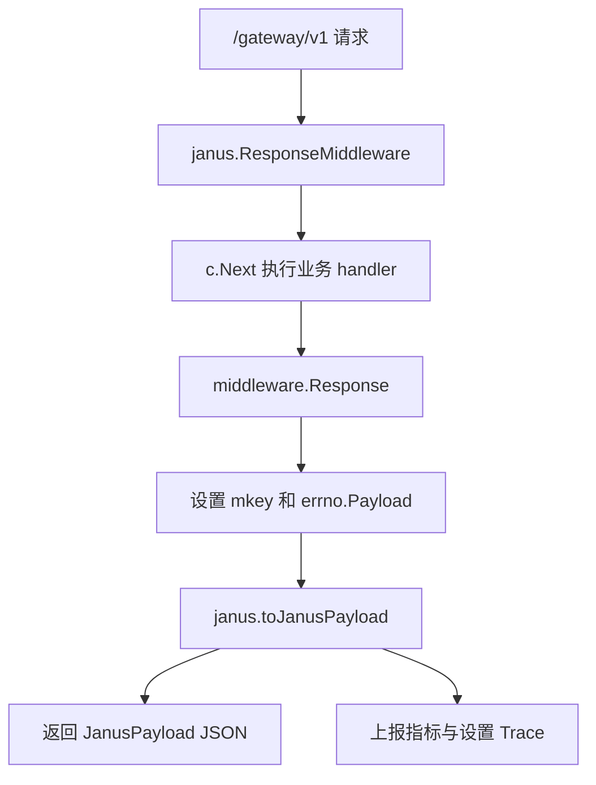

# Other — janus

## 模块概览

`janus` 包负责把服务内部统一的 `errno.Payload` 响应转换为 Janus 网关期望的响应格式。它只处理 `/gateway/v1` 路由组的响应封装、指标上报、链路追踪标记和错误日志，不直接实现业务逻辑。

在 `main.go` 中，该中间件通过以下方式挂载：

```go
jns := r.Group("/gateway/v1")
jns.Use(janus.ResponseMiddleware())
```

业务 handler 仍然沿用 `middleware.Response(c, mkey, handler)` 模式执行，例如 `service.MetaBucketApi.GetBucketJanus`：

```go
func (api *MetaBucketApi) GetBucketJanus(c *gin.Context) {
	middleware.Response(c, "buckets.getbucket.janus", api.handleGetBucketJanusRequest)
}
```

也就是说，Janus 响应链路分为两层：

1. `middleware.Response` 执行业务函数，并把 `mkey` 与 `errno.Payload` 写入 `gin.Context`。
2. `janus.ResponseMiddleware` 在 `c.Next()` 后读取上下文结果，转换为 `JanusPayload` 并输出 JSON。

## 响应格式

Janus 对外响应结构由 `JanusPayload` 定义：

```go
type JanusPayload struct {
	Code      int         `json:"code"`
	Message   string      `json:"message"`
	RequestId string      `json:"trace_id"`
	Response  interface{} `json:"response"`
}
```

字段语义：

- `Code`：Janus 语义下的业务状态码。只有 `0` 表示成功。
- `Message`：来自内部 `errno.Payload.Message`。
- `RequestId`：JSON 字段名为 `trace_id`，当前实现未写入该字段。
- `Response`：来自内部 `errno.Payload.Data`，承载真正的业务响应体。

内部成功码是 `errno.CodeOK`，值为 `2000`。Janus 成功码由常量 `JanusOkCode` 定义，值为 `0`：

```go
const (
	PSM         = "PSM"
	JanusOkCode = 0
)
```

转换逻辑集中在 `toJanusPayload(c *gin.Context, p errno.Payload)`：

```go
func toJanusPayload(c *gin.Context, p errno.Payload) JanusPayload {
	jp := JanusPayload{}
	if p.Code == errno.CodeOK {
		jp.Code = JanusOkCode
	} else {
		jp.Code = p.Code
	}

	jp.Message = p.Message
	jp.Response = p.Data
	return jp
}
```

关键点：

- `errno.CodeOK` 会被转换成 `0`。
- 非成功码保持原值，例如 `4000`、`5000` 等。
- `errno.Payload.Data` 被移动到 `response` 字段，而不是内部接口常用的 `data` 字段。
- 参数 `c *gin.Context` 当前未被使用，保留了未来从请求上下文补充字段的可能性。

## 执行流程



`ResponseMiddleware()` 返回一个 `gin.HandlerFunc`，核心流程如下：

1. 调用 `c.Next()`，让后续业务 handler 先执行。
2. 从 `gin.Context` 读取 `PSM`，为空时使用 `"unknown"`。
3. 从 `middleware.MKeyContextKey` 读取接口指标名 `mkey`。
4. 从 `middleware.ResultDataContextKey` 读取业务结果，并断言为 `errno.Payload`。
5. 设置禁用缓存相关响应头。
6. 使用 `c.JSON(http.StatusOK, toJanusPayload(c, data))` 输出 Janus 响应。
7. 上报延迟、吞吐和错误指标。
8. 更新 BytedTrace span 信息。

## 与 `middleware` 包的协作约定

`janus.ResponseMiddleware` 依赖 `middleware.Response` 写入的上下文键：

```go
middleware.MKeyContextKey       // "mkey"
middleware.ResultDataContextKey // "data"
```

典型业务入口模式是：

```go
func (api *MetaBucketApi) GetAllBucketsJanus(c *gin.Context) {
	middleware.Response(c, "buckets.allbuckets", api.handleGetAllBucketsJanusRequest)
}
```

`middleware.Response` 会负责：

- 执行业务函数 `handleGetAllBucketsJanusRequest`
- 获得 `errno.Payload`
- 写入 `MKeyContextKey`
- 写入 `ResultDataContextKey`

`janus.ResponseMiddleware` 不做空值保护：

```go
dataRet, _ := c.Get(middleware.ResultDataContextKey)
data := dataRet.(errno.Payload)
```

因此所有挂在 `/gateway/v1` 下、使用该中间件的 handler 都必须通过 `middleware.Response` 或等价逻辑设置 `ResultDataContextKey`，否则会发生 panic。

## 指标、日志与链路追踪

`ResponseMiddleware` 会围绕 `mkey` 和来源 PSM 上报监控信息。

来源 PSM 从上下文键 `PSM` 读取：

```go
psm := c.GetString(PSM)
if psm == "" {
	psm = "unknown"
}
```

注意这里不是直接读取请求头。调用方如果希望指标中带上真实调用方，需要提前在 `gin.Context` 中设置 `janus.PSM`。

延迟指标通过 defer 上报：

```go
defer util.EmitLatency(mkey, time.Now(), metrics.T{Name: "from", Value: psm})
```

吞吐指标包含业务码和来源：

```go
util.EmitThroughput(
	mkey,
	metrics.T{Name: "code", Value: strconv.Itoa(data.Code)},
	metrics.T{Name: "from", Value: psm},
)
```

错误处理规则：

- `data.Code == errno.CodeOK`：不记录错误。
- `data.Code >= errno.CodeInternalErr`：使用 `logs.CtxError`。
- 其他非成功码：使用 `logs.CtxWarn`。
- 所有非成功码都会调用 `util.EmitError`，并设置 trace error 标记。

BytedTrace 相关字段：

```go
bytedtracer.SetSpanName(sp, mkey)
bytedtracer.SetFromService(sp, psm)
bytedtracer.SetBusinessStatusCode(sp, int32(data.Code))
```

错误时额外设置：

```go
bytedtracer.SetIsError(sp, true)
bytedtracer.SetErrorMessage(sp, data.Message)
```

## 与其他响应中间件的区别

仓库里还有 `middleware.ResponseMiddleware()` 和 `middleware.ResponseMiddlewareWithoutAuthCheck()`。它们直接返回内部 `errno.Payload` 格式，成功码仍是 `2000`，数据字段是 `data`。

`janus.ResponseMiddleware()` 的主要差异是：

- 成功码从 `errno.CodeOK` 转换为 `0`。
- 响应数据字段从 `data` 转换为 `response`。
- 不处理 SDK token 校验。
- 不处理 ETag 或字节缓存响应。
- 不设置 CORS 响应头。
- 面向 `/gateway/v1` 的 Janus 网关接口。

## 测试支持

`janus/base_test.go` 提供测试初始化：

```go
func createTestContext() (*gin.Context, *httptest.ResponseRecorder)
```

`TestMain` 初始化 GinEx、配置和指标：

```go
ginex.Init()
config.InitConf(ginex.ConfDir())
util.InitMetrics()
```

`janus/response_test.go` 覆盖两个核心行为：

- `TestResponseMiddleware`：构造 Gin context，写入 `middleware.ResultDataContextKey`，验证中间件可执行。
- `Test_toJanusPayload`：验证 `errno.OK("ok")` 会转换成 `JanusOkCode`，且 `Response == "ok"`。

当前测试没有断言完整 JSON 响应体、错误码转换、缓存头、指标和 trace 行为。修改该模块时，至少应保留成功码转换和 `response` 字段映射的兼容性。