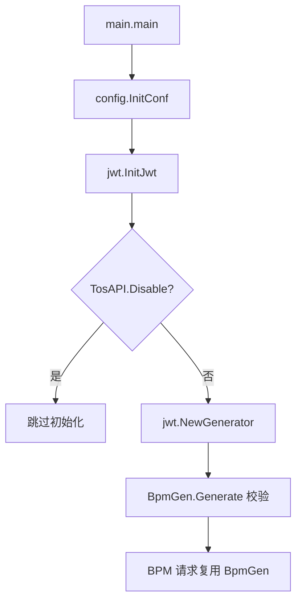

# Other — jwt

## 模块职责

`jwt` 包负责初始化用于 BPM 请求鉴权的 JWT 生成器。它不解析入站 JWT，也不负责 TOS 平台自身的 JWT 获取；本模块只维护一个包级全局变量 `BpmGen`，供 BPM 相关 HTTP 调用在发请求前生成 `X-JWT-Token`。

核心代码位于 `jwt/jwt.go`：

```go
var BpmGen jwt.Generator

func InitJwt() {
	if config.Conf.TosAPI.Disable {
		logs.Warn("skip init jwt because of tos api disabled")
		return
	}
	BpmGen = jwt.NewGenerator(jwt.WithRegion(config.Conf.ModifyTOSBucketBpmConfig.Partition))
	_, err := BpmGen.Generate(context.Background(), config.Conf.ModifyTOSBucketBpmConfig.SecretKey)
	if err != nil {
		logs.CtxError(context.TODO(), "init bpm jwt error, err: %v", err)
	}
}
```

这里导入的外部 JWT SDK 是 `code.byted.org/paas/cloud-sdk-go/jwt`，包内变量类型为 `jwt.Generator`。

## 初始化流程

`InitJwt()` 依赖 `config.Conf`，因此必须在 `config.InitConf(...)` 之后调用。主进程启动时的顺序在 `main.go` 中是：

1. `ginex.Init()`
2. `config.InitConf(ginex.ConfDir())`
3. `kms.Init()`
4. `rpc.InitRpc()`
5. `db.InitDb()`
6. `jwt.InitJwt()`

`InitJwt()` 的行为分两支：

- 当 `config.Conf.TosAPI.Disable == true` 时，记录 `skip init jwt because of tos api disabled`，然后直接返回。
- 否则根据 `config.Conf.ModifyTOSBucketBpmConfig.Partition` 创建 `BpmGen`，再用 `config.Conf.ModifyTOSBucketBpmConfig.SecretKey` 调一次 `Generate` 做初始化期校验。

需要注意：初始化期 `Generate` 失败只会记录错误日志，不会 panic，也不会阻止服务继续启动。此时 `BpmGen` 已经被赋值，后续调用方仍会再次执行 `BpmGen.Generate(...)` 并处理返回错误。



## 配置依赖

本模块读取两个配置区域：

`config.Conf.TosAPI.Disable`

该开关来自 `TosAPI.Disable`。当它为 true 时，`InitJwt()` 不会初始化 `BpmGen`。这个开关通常用于禁用 TOS API 相关能力。

`config.Conf.ModifyTOSBucketBpmConfig`

结构体定义为 `ModifyTOSBucketBpmConfig`，对应 YAML 字段 `ModifyTOSBucketBPMConfig`：

```go
type ModifyTOSBucketBpmConfig struct {
	AuthNodeID             uint64 `yaml:"AuthNodeID"`
	BpmApiUrl              string `yaml:"BpmApiUrl"`
	SecretKey              string `yaml:"SecretKey"`
	Partition              string `yaml:"Partition"`
	ModifyPropsBpmID       string `yaml:"ModifyPropsBpmID"`
	ModifyLimitsBpmID      string `yaml:"ModifyLimitsBpmID"`
	ModifyPublicLevelBpmID string `yaml:"ModifyPublicLevelBpmID"`
}
```

`jwt` 包只直接使用其中两个字段：

- `Partition`：传给 `jwt.WithRegion(...)`，用于创建区域相关的 JWT 生成器。
- `SecretKey`：传给 `BpmGen.Generate(...)`，用于生成 BPM 请求 token。

例如 `conf/base.yml` 中的默认配置包含：

```yaml
ModifyTOSBucketBPMConfig:
  BpmApiUrl: "https://BPM.bytedance.net/api"
  SecretKey: "..."
  Partition: "cn"
```

## 对外暴露的组件

### `BpmGen`

`BpmGen` 是包级全局变量：

```go
var BpmGen jwt.Generator
```

调用方直接通过它生成 token。当前代码没有提供封装函数，因此调用方需要自己传入 `context.Context` 和 `SecretKey`，并处理生成错误。

主要使用点：

- `rpc.BpmClient.getJwtToken(ctx)`
- `service.createGeneralAccount(ctx, req)`

### `InitJwt()`

`InitJwt()` 是唯一初始化入口。它没有返回值，错误只通过日志暴露。

贡献代码时要保持这个启动契约：调用方假设只要进程初始化过 `jwt.InitJwt()`，`jwt.BpmGen` 就可以用于 BPM 相关请求。若引入新的 BPM 调用路径，应复用现有 `BpmGen`，不要在业务代码里重复创建 `jwt.NewGenerator(...)`。

## 与 BPM 请求的关系

`rpc/bpm.go` 中的 `BpmClient` 会在每次请求前生成 JWT：

```go
func (cli *BpmClient) getJwtToken(ctx context.Context) (string, error) {
	return jwt.BpmGen.Generate(ctx, config.Conf.ModifyTOSBucketBpmConfig.SecretKey)
}
```

`doReq` 会把生成结果写入请求头：

```go
req.Header.Set("X-JWT-Token", token)
```

因此 `jwt` 包的职责边界是“提供 BPM token 生成器”，而不是发送 BPM 请求。BPM API 地址、workflow ID、请求体和响应解析都由 `rpc` 或 `service` 层处理。

`service/tos_handler.go` 中的 `createGeneralAccount` 也直接使用同一个生成器：

```go
token, err := jwt.BpmGen.Generate(ctx, config.Conf.ModifyTOSBucketBpmConfig.SecretKey)
if err != nil {
	return err
}
r.Header.Set("X-JWT-Token", token)
```

这意味着 `BpmGen` 是跨 `rpc` 和 `service` 的共享基础设施。

## 测试结构

`jwt/base_test.go` 提供测试入口：

```go
func TestMain(m *testing.M) {
	ginex.Init()
	config.InitConf(ginex.ConfDir())
	code := m.Run()
	os.Exit(code)
}
```

这保证 `Test_InitJwt` 执行前 `config.Conf` 已加载。

`jwt/jwt_test.go` 覆盖了两个分支：

```go
func Test_InitJwt(t *testing.T) {
	InitJwt()
	assert.NotNil(t, BpmGen)

	config.Conf.TosAPI.Disable = true
	InitJwt()
	config.Conf.TosAPI.Disable = false
}
```

测试确认正常初始化后 `BpmGen` 非空，并执行了 `TosAPI.Disable == true` 的跳过分支。不过该测试没有断言跳过分支是否保持或清空 `BpmGen`。按当前实现，跳过分支不会修改已有的 `BpmGen`。

## 维护注意事项

`InitJwt()` 必须在 `config.InitConf(...)` 之后执行，否则会访问未初始化的 `config.Conf`。

`TosAPI.Disable == true` 时不会设置 `BpmGen`。如果某个代码路径在禁用 TOS API 后仍调用 `jwt.BpmGen.Generate(...)`，可能出现空生成器调用风险；新增调用点时需要确认业务路径是否受同一开关保护。

初始化期 token 生成失败不会中断启动。若后续业务要求“JWT 不可用时服务不可启动”，需要调整 `InitJwt()` 的签名，让它返回 `error`，并在 `main.go` 中显式处理。

当前包名 `jwt` 与外部 SDK 包名相同，阅读 `jwt/jwt.go` 时要区分：文件顶部的 `package jwt` 是本项目包，import 中的 `code.byted.org/paas/cloud-sdk-go/jwt` 是 SDK 包。