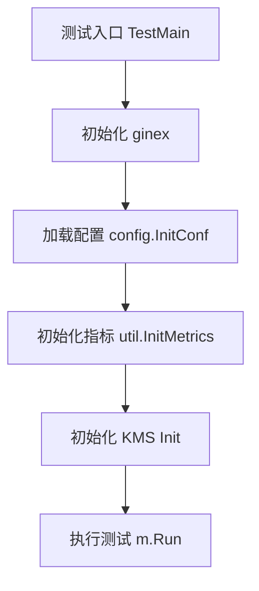

# Other — kms

## 模块概览

`kms` 模块封装了服务侧使用 KMS 的加解密能力，当前测试覆盖了两类核心路径：

- 数据密钥路径：`NewEncryptedKey` 生成加密后的密钥，`Decrypt` 将其解密回明文密钥。
- 请求令牌路径：`ReqTokenCipher.EncryptWithMetadata` 生成加密请求令牌，`DecryptRequestToken` 解密并还原原始字符串。

该模块依赖全局初始化流程，测试通过 `TestMain` 统一完成运行环境准备。

## 测试初始化流程

`kms/base_test.go` 中的 `TestMain` 是整个 `kms` 包测试的入口。它在执行任何测试用例前依次初始化基础设施：

```go
func TestMain(m *testing.M) {
	ginex.Init()
	config.InitConf(ginex.ConfDir())
	util.InitMetrics()
	err := Init()
	if err != nil {
		panic(err)
	}
	code := m.Run()
	os.Exit(code)
}
```

初始化顺序很重要：

1. `ginex.Init()` 初始化 Gin 扩展运行环境。
2. `config.InitConf(ginex.ConfDir())` 基于 `ginex.ConfDir()` 加载服务配置。
3. `util.InitMetrics()` 初始化指标系统。
4. `Init()` 初始化 `kms` 模块自身。
5. `m.Run()` 执行包内测试。

这说明 `kms` 的测试不是完全隔离的纯单元测试，而是依赖配置、指标和 KMS 客户端状态的集成型测试。



## 数据密钥加解密路径

`kms/client_test.go` 中的 `TestNewEncryptedKeyAndDecrypt` 验证了数据密钥的完整生命周期：

```go
func TestNewEncryptedKeyAndDecrypt(t *testing.T) {
	ek, err := NewEncryptedKey(meta.KeySize128)
	assert.Nil(t, err)
	assert.True(t, len(ek) > 0)

	dk, err := Decrypt(ek)
	assert.Nil(t, err)
	assert.True(t, len(dk) > 0)
}
```

该测试确认了两个行为：

- `NewEncryptedKey(meta.KeySize128)` 能够生成非空的加密密钥。
- `Decrypt(ek)` 能够成功解密该密钥，并返回非空明文结果。

`meta.KeySize128` 来自 `code.byted.org/videoarch/bktmeta-sdk-go/meta`，表示生成 128 位规格的数据密钥。测试没有校验明文密钥长度或内容，只验证 KMS 调用链可用、返回值非空且没有错误。

贡献者修改 `NewEncryptedKey` 或 `Decrypt` 时，需要保证以下兼容性：

- `NewEncryptedKey` 仍接受 `meta.KeySize128` 这类 SDK 定义的密钥规格。
- 返回的 encrypted key 可以被同模块的 `Decrypt` 正常处理。
- 错误必须通过 `error` 返回，而不是吞掉后返回空数据。

## 请求令牌加解密路径

`TestDecryptRequestToken` 验证请求令牌的加解密：

```go
func TestDecryptRequestToken(t *testing.T) {
	ek, err := ReqTokenCipher.EncryptWithMetadata("ut_test")
	assert.Nil(t, err)
	assert.True(t, len(ek) > 0)

	dk, err := DecryptRequestToken(ek)
	assert.Nil(t, err)
	assert.Equal(t, dk, "ut_test")
}
```

这里有两个关键组件：

- `ReqTokenCipher`：请求令牌使用的加密器。
- `DecryptRequestToken`：请求令牌专用解密函数。

测试先使用 `ReqTokenCipher.EncryptWithMetadata("ut_test")` 加密字符串，再通过 `DecryptRequestToken` 解密，最后断言结果等于原始值 `"ut_test"`。

这条路径强调的是语义正确性，而不仅是返回值非空：请求令牌解密后必须精确还原原始字符串。

## 与代码库其他部分的连接

`kms` 测试直接依赖以下包：

- `code.byted.org/gin/ginex`：提供运行环境初始化和配置目录。
- `code.byted.org/videoarch/bktmeta-api/config`：加载服务配置。
- `code.byted.org/videoarch/bktmeta-api/util`：初始化指标能力。
- `code.byted.org/videoarch/bktmeta-sdk-go/meta`：提供密钥规格，例如 `meta.KeySize128`。

从调用关系看，`kms` 模块暴露给外部使用的关键函数包括：

- `Init`
- `NewEncryptedKey`
- `Decrypt`
- `DecryptRequestToken`

测试文件本身没有被其他模块调用，但它们定义了 `kms` 模块对外行为的最低契约：初始化必须成功，生成的加密密钥必须可解密，请求令牌必须能完整往返。

## 修改建议

修改 `kms` 模块时优先保持以下约束：

- 不要绕过 `Init()` 的初始化职责；测试和运行时都依赖它建立 KMS 客户端或相关全局状态。
- 修改请求令牌逻辑时，同时验证 `ReqTokenCipher.EncryptWithMetadata` 和 `DecryptRequestToken` 的兼容性。
- 修改数据密钥格式时，确保旧的 `NewEncryptedKey` 输出仍能被 `Decrypt` 正确识别，或者明确处理迁移兼容。
- 如果新增密钥规格，建议补充类似 `meta.KeySize128` 的往返测试，覆盖生成和解密两个步骤。