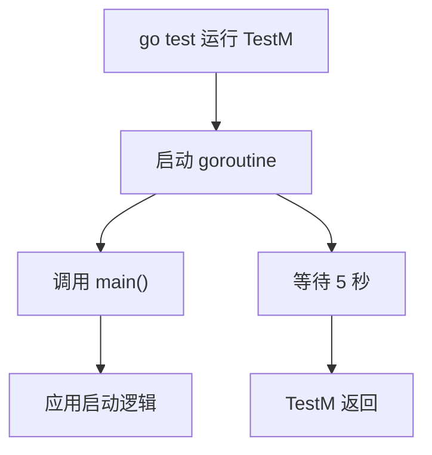

# Other — main_test.go

## 模块概述

`main_test.go` 是 `main` 包中的启动冒烟测试模块。它只包含一个测试函数 `TestM(t *testing.T)`，用于在 `go test` 环境中异步调用应用入口函数 `main()`，并让进程保持运行 5 秒。

该模块的核心目的不是验证业务逻辑，而是检查应用在启动阶段是否会出现即时崩溃，例如 `panic`、初始化失败、配置加载失败或 `log.Fatal` 触发的进程退出。

## 代码结构

```go
func TestM(t *testing.T) {
	go main()
	time.Sleep(5 * time.Second)
}
```

`TestM` 是普通 Go 测试函数，符合 `testing` 包的测试命名约定：

- 函数名以 `Test` 开头
- 参数为 `*testing.T`
- 由 `go test` 自动发现并执行

需要注意，`TestM` 不是 Go 测试框架中的特殊入口 `TestMain(m *testing.M)`。它只是一个名为 `TestM` 的普通测试用例。

## 执行流程

测试执行时会发生以下步骤：

1. `go test` 发现并运行 `TestM`
2. `TestM` 通过 `go main()` 在新的 goroutine 中启动应用入口
3. 当前测试 goroutine 调用 `time.Sleep(5 * time.Second)`
4. 如果 5 秒内 `main()` 或其启动逻辑触发 `panic`，测试进程会失败
5. 如果 5 秒结束后没有致命错误，`TestM` 返回，测试结束



## 与代码库的连接

`main_test.go` 与主程序的连接点只有一个：

```go
go main()
```

也就是说，该测试直接覆盖 `main.go` 中的 `main()` 启动路径。它不会调用其他本地函数，也没有被其他测试或生产代码调用。

从依赖关系看：

- 内部调用：无
- 对外调用：`TestM` 调用 `main`
- 被调用方：无

这使它更像一个最小启动验证，而不是单元测试。

## 行为特点

`TestM` 的测试语义非常宽松：它没有断言，也没有检查服务是否真正 ready。测试通过只代表应用在 5 秒观察窗口内没有导致测试进程失败。

这种模式通常用于发现以下问题：

- 应用入口函数启动时发生 `panic`
- 初始化依赖时崩溃
- 配置或环境变量缺失导致立即退出
- 服务监听端口、日志、后台任务初始化时出现致命错误

但它不能证明：

- 服务已经成功监听端口
- HTTP/RPC 接口可用
- 下游依赖连接正常
- 后台 goroutine 没有静默失败
- 应用在 5 秒后仍然健康

## 维护注意事项

`TestM` 会真实执行 `main()`，因此它可能受到运行环境影响。维护或扩展该测试时，需要重点关注：

- `main()` 是否依赖本地配置文件、环境变量或密钥
- `main()` 是否会绑定固定端口，导致测试环境端口冲突
- `main()` 是否会连接外部服务
- `main()` 是否会产生不可控副作用，例如写数据库、注册服务、启动定时任务
- 固定的 `5 * time.Second` 是否会导致测试变慢或不稳定

如果需要增强这个测试，优先考虑把 `main()` 内部的启动逻辑拆成可测试函数，例如 `run()`、`initServer()` 或类似已有模式，然后在测试中验证明确的返回值、错误和可观测状态。当前实现适合做启动冒烟检查，不适合作为精确的功能验证。