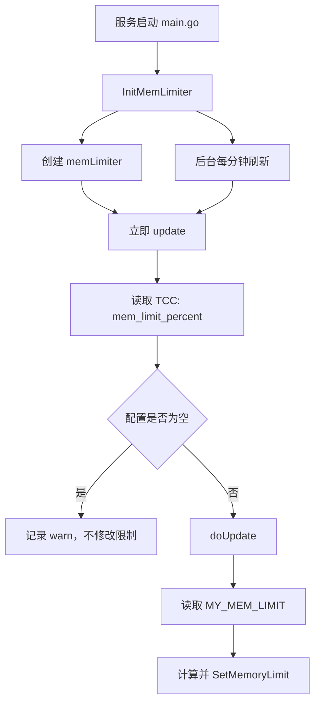

# Other — mem_limit

## 模块概览

`mem_limit` 模块负责按 TCC 配置动态设置 Go runtime 的软内存上限。它读取运行环境中的 `MY_MEM_LIMIT` 作为 Pod 总内存，再读取 TCC key `mem_limit_percent` 作为百分比，最终通过 `runtime/debug.SetMemoryLimit` 设置进程内存限制。

该模块在服务启动流程中由 `main.go` 调用：

```go
// init mem limiter
mem_limit.InitMemLimiter()
```

初始化后，模块会立即尝试更新一次内存限制，并启动后台协程每分钟刷新一次。

## 核心组件

### `InitMemLimiter`

`InitMemLimiter` 是模块唯一对外入口。

它完成三件事：

1. 创建包级变量 `l = &memLimiter{}`。
2. 调用 `l.update()` 立即拉取并应用一次配置。
3. 启动后台 goroutine，每分钟调用一次 `l.update()`。

```go
func InitMemLimiter() {
	l = &memLimiter{}
	if err := l.update(); err != nil {
		logs.Errorf("init memlimiter fail, %s", err.Error())
		return
	}
	go func() {
		for range time.Tick(1 * time.Minute) {
			if err2 := l.update(); err2 != nil {
				logs.Errorf("update memlimiter fail, %s", err2.Error())
			}
		}
	}()
}
```

注意：当前 `memLimiter.update` 对配置缺失和 `doUpdate` 失败都返回 `nil`，因此 `InitMemLimiter` 中的错误分支通常不会触发；实际错误主要通过日志暴露。

### `memLimiter`

`memLimiter` 是模块内部状态对象。

```go
type memLimiter struct {
	memLimit int64
}
```

`memLimit` 保存最近一次成功设置到 runtime 的内存上限，单位是字节。它主要用于日志记录和测试观察，不对外暴露。

### `memLimiter.update`

`update` 从 TCC 读取 `mem_limit_percent`：

```go
if val := tcc.GetMemLimitPercent(context.Background()); val != "" {
	...
	if err := l.doUpdate(val); err != nil {
		...
		return nil
	}
	...
	return nil
} else {
	logs.CtxWarn(context.Background(), "mem limit percent is empty")
}
```

行为要点：

- 通过 `tcc.GetMemLimitPercent(context.Background())` 读取配置。
- 如果 TCC 返回空字符串，只记录 `"mem limit percent is empty"`，不修改当前内存限制。
- 如果读取到非空配置，则交给 `doUpdate` 解析并设置。
- 如果 `doUpdate` 返回错误，`update` 记录 warn 日志并返回 `nil`，避免后台刷新协程因为单次错误退出。

### `memLimiter.doUpdate`

`doUpdate` 是实际计算和应用内存上限的函数。

输入参数 `value` 是 TCC 配置中的百分比字符串。函数还会读取环境变量：

```go
myMemLimit := os.Getenv("MY_MEM_LIMIT")
podMem, err := strconv.ParseInt(myMemLimit, 10, 64)
```

处理规则：

- `MY_MEM_LIMIT` 必须能解析成非负 `int64`。
- TCC 百分比 `value` 必须能解析成 `int64`。
- 百分比大于 `100` 会返回错误。
- 百分比小于 `0` 表示关闭自定义限制，调用 `debug.SetMemoryLimit(math.MaxInt64)`。
- 百分比在 `0..100` 内时，调用 `getMemBytes(podMem, percent)` 计算字节数，并设置到 `debug.SetMemoryLimit`。

计算逻辑：

```go
func getMemBytes(total int64, percent int64) int64 {
	return total * percent / 100
}
```

例如：

- `MY_MEM_LIMIT=8589934592`
- `mem_limit_percent=80`

最终限制为：

```text
8589934592 * 80 / 100 = 6871947673
```

## 执行流程



## 与 TCC 的关系

`mem_limit` 不直接管理 TCC client，而是依赖 `tcc.GetMemLimitPercent`：

```go
func GetMemLimitPercent(ctx context.Context) string {
	if value, err := GetTccClient().Get(ctx, MemLimitPercent); err != nil {
		logs.CtxError(ctx, "get mem limit percent error, %s", err)
		return ""
	} else {
		return value
	}
}
```

对应 key 定义在 `tcc/keys.go`：

```go
MemLimitPercent = "mem_limit_percent"
```

因此模块的动态行为由两个外部输入共同决定：

- 环境变量 `MY_MEM_LIMIT`：Pod 或容器总内存，单位是字节。
- TCC key `mem_limit_percent`：要应用的百分比字符串。

## 与服务启动顺序的关系

`main.go` 中 `InitMemLimiter` 的调用发生在以下初始化之后：

- `ginex.Init`
- `config.InitConf`
- `kms.Init`
- `rpc.InitRpc`
- `db.InitDb`
- `jwt.InitJwt`
- `tcc.InitConfig`
- `remote_cache.Init`

这意味着 `mem_limit` 启动时 TCC client 已经完成初始化，可以通过 `tcc.GetMemLimitPercent` 拉取动态配置。

## 错误处理语义

`doUpdate` 会对非法输入返回错误：

- `MY_MEM_LIMIT` 不是整数。
- `MY_MEM_LIMIT` 小于 `0`。
- TCC 百分比不是整数。
- TCC 百分比大于 `100`。

但 `update` 会吞掉 `doUpdate` 的错误，只写 warn 日志并保留当前 runtime 内存限制。这种设计避免了错误配置导致服务启动失败或后台协程中断，但也意味着配置错误需要通过日志或监控发现。

## 测试覆盖

`memlimit_test.go` 直接测试 `doUpdate` 的主要边界：

```go
os.Setenv("MY_MEM_LIMIT", "8589934592")

err := l.doUpdate("80")    // 合法，设置为 80%
err = l.doUpdate("110ab")  // 非数字，返回错误
err = l.doUpdate("110")    // 超过 100，返回错误
err = l.doUpdate("-1")     // 小于 0，重置为 math.MaxInt64
```

`base_test.go` 中的 `TestMain` 初始化 `ginex` 和 `config`，但当前代码是在 `m.Run()` 之后调用 `InitMemLimiter()`。因此现有单测主要覆盖 `doUpdate`，不会实际覆盖初始化时的 TCC 拉取和每分钟刷新逻辑。