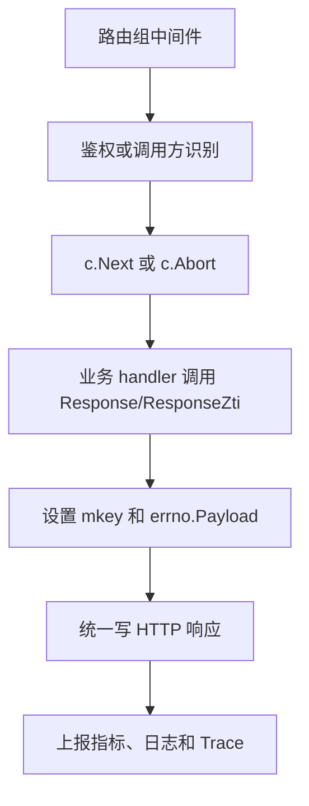

# Other — middleware

## 模块概览

`middleware` 模块负责把 Gin handler 的返回值统一转换为 HTTP 响应，并在响应前后处理鉴权、限流、缓存协商、OpenAPI 加密、指标上报和 Trace 标记。

业务 handler 通常不直接写 `c.JSON`，而是使用如下模式：

```go
middleware.Response(c, "buckets.getbucket", api.handleGetBucketRequest)
```

`Response` 执行业务函数并把结果写入 Gin context；外层的 `ResponseMiddleware`、`OpenapiMiddleware`、`BPMMiddleware` 等再统一完成 HTTP 输出。

## 核心上下文约定

模块通过 Gin context 在 handler 和中间件之间传递数据：

- `MKeyContextKey = "mkey"`：接口标识，用于限流、指标、日志和 Trace。
- `ResultDataContextKey = "data"`：业务返回的 `errno.Payload`。
- `CallerPSMKey = "CALLER_PSM"`：调用方 PSM，由 `X-Tt-From` 或 `X-TT-From` 解析。
- `MyHandler`：统一业务函数签名，类型为 `func(c *gin.Context) errno.Payload`。

如果某个路由挂载了这些响应中间件，它的 handler 必须最终设置 `ResultDataContextKey`，通常通过 `Response` 或 `ResponseZti` 完成。否则中间件在读取 `dataRet.(errno.Payload)` 时会出现类型断言风险。

## 请求处理流程



## `Response`：业务执行与限流入口

`Response(c, mkey, f)` 是多数业务接口的入口包装器。它不会直接写 HTTP 响应，只负责：

1. 生成限流 key。
2. 执行本地接口限流 `util.AllowInterface(mkey)`。
3. 执行分布式限流 `util.GetDistributedRateLimiter().Allow(rateLimitKey)`。
4. 通过 `f(c)` 执行业务逻辑。
5. 将 `mkey` 和 `errno.Payload` 写入 Gin context。

限流 key 规则：

- `GET` 请求：使用 `X-Tt-From:mkey`，读接口按调用方隔离。
- 非 `GET` 请求：只使用 `mkey`，写/删操作走全局接口限流。

本地接口限流由 `config.InterfaceRateLimiterConfig` 或 TCC 的 `interface_rate_limiter` 配置驱动，底层使用 `golang.org/x/time/rate.Limiter`。未配置的 `mkey` 默认放行。

## 标准 SDK 响应中间件

`ResponseMiddleware()` 用于普通 SDK/API 路由组，例如 `/bktmeta-api/v1`、`/volcengine-iam/v1`、`/bktmeta-tob/v1`。

它在 `c.Next()` 前校验 SDK 请求 token：

- token header 名来自 SDK 常量 `client.REQUEST_TOKEN_HEADER`，实际为 `x-tt-reqToken`。
- `checkTokenValid` 使用 `kms.DecryptRequestToken` 解密 token。
- 解密后反序列化为 `client.RequestToken`。
- 必须包含 `ClientPSM`、`InterfaceName`、`RequestTimestamp`。
- 请求时间与当前时间差不能超过 `ValidRequestTimeInterval`，即 300 秒。
- 在 `env.DC_SGCOMM1` 且 token 为空时，允许返回 `SdkVersion: "unknown"` 的降级 token。

鉴权失败时，中间件会 `c.Abort()`，并设置 `errno.CodeBadRequest`。如果 token 中没有可用的 `InterfaceName`，会根据 HTTP 方法和路径推断 `mkey`，例如 `PATCH` 映射到 `client.InterfaceUpdateBucket`，`/bktmeta-api/v1/signature` 映射到 `buckets.signature`。

响应阶段会统一设置：

- CORS header。
- 禁用缓存的 `Cache-Control`、`Pragma`、`Expires`。
- `Data` 为 `[]byte` 时按缓存响应处理，支持 `If-None-Match` 与 `ETag`，命中时返回 `304 Not Modified`。
- 其他数据走 `c.JSON(http.StatusOK, data)`。

随后上报 `util.EmitLatency`、`util.EmitThroughput`、`util.EmitError`，并通过 `bytedtracer` 设置 span 名称、调用方服务和业务状态码。

## 免 token 的 simple API 中间件

`ResponseMiddlewareWithoutAuthCheck()` 用于 `/bktmeta-s/v1`。它不校验 `x-tt-reqToken`，但仍复用标准响应逻辑：

- 调用方来自 `X-TT-From`，为空时为 `unknown`。
- SDK 版本来自 `X-TT-Bkt-Simple-Sdk-Version`，为空时为 `unknown`。
- 支持 `[]byte` 缓存响应与 ETag。
- 上报同样的延迟、吞吐、错误和 Trace 信息。

业务 handler 仍需要通过 `Response` 设置 `mkey` 和 `errno.Payload`。

## ZTI 路径

ZTI 相关逻辑拆成两层：

- `ResponseZti(c, mkey, f)`：handler 内调用，负责校验 `JWT-Sec-Token`。
- `ZtiResponseMiddleware()`：路由组中间件，负责统一写 HTTP 响应。

`ResponseZti` 使用 `token.VerifyToken(token, c.ClientIP(), "")` 校验 JWT，并取出 `identity.PSM`。随后调用 `tcc.CheckAuthV2(c, psm, mkey)` 判断该 PSM 是否允许访问当前接口。校验失败时写入 `errno.CodeForbidden`；成功时委托 `Response` 执行业务和限流。

`ZtiResponseMiddleware` 本身不做鉴权，只在 `c.Next()` 后按标准逻辑输出 JSON 或 ETag 缓存响应。

## BPM 响应中间件

`BPMMiddleware()` 用于 `/bpm/v1`。它不读取调用方 header，而是固定使用：

```go
psm := "bpm.bpm.bpm"
```

BPM 响应通过 `toBPMPayload` 做兼容转换：当内部成功码为 `errno.CodeOK` 时，对外返回 `errno.CodeOKZero`；其他错误码保持不变。响应体通过 `json.Marshal(toBPMPayload(data))` 后使用 `c.Data(http.StatusOK, "application/json", bytes)` 输出。

## OpenAPI 中间件与 AGW 鉴权

`OpenapiMiddleware()` 用于 `/bktmeta-openapi/v1` 和 `/bktmeta-openapi-s/v1`。它在执行业务 handler 前调用 `checkAgwAuth`：

- 必须存在 `Agw-Auth`。
- `Agw-Auth` 按 `/` 拆分，第二段作为 AK。
- `Agw-Auth-Ak` 必须与 `Agw-Auth` 中的 AK 一致。
- AK 必须能通过 `GetAGWTenantSk` 从 AGW 租户缓存中找到 SK。

当前实现只校验 AK 一致性和本地缓存是否存在，并未校验 `Agw-Auth` 中的时间戳、过期时间或签名字段。

OpenAPI 响应的 `mkey` 会追加 `.openapi` 后缀，例如 `buckets.getbucket.openapi`。成功响应会调用 `encryptOpenapiData(c, agwTenantSk, &data)`：

- 仅加密 `errno.CodeOK` 的响应。
- 如果 `payload.Data` 是 `[]byte`，先反序列化为完整 `errno.Payload`，用于处理 allBuckets 这类缓存响应。
- 对 `payload.Data` 做 `json.Marshal`。
- 使用 `util.EncryptWithMetadata([]byte(agwTenantSk), string(v))` 加密。
- 加密失败或序列化失败时改写为 `errno.CodeInternalErr`，并清空 `Data`。

如果请求的 `If-None-Match` 与响应 `ETag` 相等，OpenAPI 直接返回 `304 Not Modified`，不会执行加密。

## AGW 租户 AK/SK 缓存

`agw.go` 维护进程内的 `sync.Map`：`agwTenantAkSkCache`。键为 AK，值为 SK。

`StartRefreshAGWTenantAkSkCache()` 在服务启动时由 `main.go` 调用：

1. 读取 `config.Conf.AGWConfig`。
2. 如果 `AGWConfig.Switch` 关闭，直接返回。
3. 通过 `kms.Client.GetConfigV2(AGWConfig.OpenapiPasswordConfigKey)` 获取 AGW OpenAPI 密码。
4. 先同步执行一次 `asyncUpdateAGWTenantCache` 初始化缓存。
5. 启动 goroutine，每 30 分钟刷新一次。

`asyncUpdateAGWTenantCache` 有两种数据源：

- 当 `tcc.GetAGWTenantConfigs().UseTCC` 为 true 时，使用 `refreshAGWTenantFromTCC` 从 TCC 配置写入缓存。
- 否则请求 `AGWConfig.OpenapiHost + "/tenant/all" + AGWConfig.ServerId`，用 BasicAuth 拉取 `AkSkRsp`，再写入缓存。

缓存刷新只执行 `Store`，不会清理已经移除的 AK。修改租户生命周期逻辑时需要注意这一点。

## 路由接入关系

`main.go` 中的主要挂载关系如下：

- `/bktmeta-api/v1`：`ResponseMiddleware`
- `/bktmeta-api/v2`：`ZtiResponseMiddleware`
- `/volcengine-iam/v1`：`ResponseMiddleware`
- `/bktmeta-tob/v1`：`ResponseMiddleware`
- `/bktmeta-s/v1`：`ResponseMiddlewareWithoutAuthCheck`
- `/bpm/v1`：`BPMMiddleware`
- `/bktmeta-openapi/v1`：`OpenapiMiddleware`
- `/bktmeta-openapi-s/v1`：`OpenapiMiddleware`

各 `service/*_handler.go` 文件中的导出 handler 负责选择合适的 `mkey`，并通过 `Response` 或 `ResponseZti` 包装内部处理函数。

## 测试覆盖重点

`middleware/base_test.go` 和 `middleware/agw_test.go` 覆盖了主要行为：

- `Response` 是否写入 `MKeyContextKey` 与 `ResultDataContextKey`。
- 本地接口限流命中时是否返回 `errno.ErrTooManyRequests`，并阻止业务 handler 再执行。
- 未配置限流的接口是否默认放行。
- `checkTokenValid` 是否能解密并解析 SDK token。
- `ResponseMiddleware`、`ResponseMiddlewareWithoutAuthCheck`、`ZtiResponseMiddleware` 是否能处理普通 JSON 和 ETag 缓存响应。
- `ResponseZti` 在 token 缺失时是否返回 `errno.CodeForbidden`。
- `toBPMPayload` 是否把内部成功码转换为 BPM 期望的 `0`。
- `OpenapiMiddleware` 的 AGW header 校验路径。
- `encryptOpenapiData` 的成功加密、序列化失败、错误 payload 跳过加密、加密失败。
- `GetAGWTenantSk` 与 `refreshAGWTenantFromTCC` 的缓存读写。

## 贡献注意事项

新增接口时，优先复用已有模式：路由组挂载合适的响应中间件，handler 内调用 `Response(c, mkey, handler)`。`mkey` 是限流、监控和 Trace 的核心维度，应保持稳定且能表达接口语义。

新增 OpenAPI 接口时，需要确认返回数据可以被 `json.Marshal`，并能被调用方用 AGW SK 解密。返回 `[]byte` 缓存体时，内容必须是可反序列化的 `errno.Payload`。

修改鉴权逻辑时要区分三条路径：SDK token 鉴权在 `ResponseMiddleware`，ZTI JWT 鉴权在 `ResponseZti`，AGW AK/SK 校验在 `OpenapiMiddleware`。这些路径的失败码分别影响客户端兼容性和监控口径，不应混用。