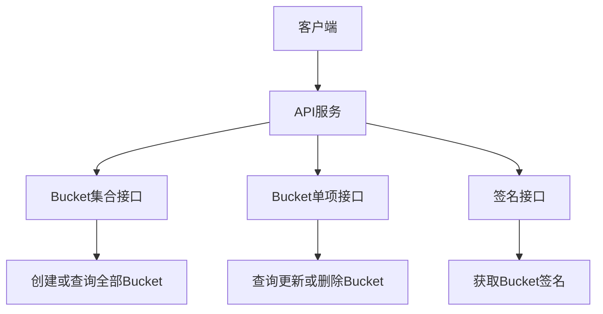

# Other — README.md

## README.md 模块说明

`README.md` 是 `bucket meta api` 项目的接口入口文档，用来快速说明服务暴露的 HTTP API。该文件本身不包含可执行代码，因此没有函数、类、内部调用、外部调用或执行流；它的作用是记录对外 API 约定，帮助开发者理解 bucket 元数据服务的基础能力。

## 接口能力

该模块记录了 6 个 HTTP 接口，围绕 bucket 的创建、查询、更新、删除和签名获取展开。

| 方法 | 路径 | 说明 |
| --- | --- | --- |
| `POST` | `/v1/buckets` | 创建 bucket |
| `GET` | `/v1/buckets` | 获取所有 bucket 信息 |
| `GET` | `/v1/buckets/{name}` | 获取指定 bucket 信息 |
| `DELETE` | `/v1/buckets/{name}` | 删除指定 bucket |
| `PATCH` | `/v1/buckets/{name}` | 更新指定 bucket |
| `GET` | `/v1/signatures/{bucketname}` | 获取指定 bucket 的签名 |

## 资源模型

README 中体现了两个主要资源概念：

`bucket`：核心业务资源，通过 `/v1/buckets` 和 `/v1/buckets/{name}` 管理。

`signature`：与 bucket 相关的签名资源，通过 `/v1/signatures/{bucketname}` 获取。

这些路径暗示服务采用 REST 风格设计：集合资源使用 `/v1/buckets`，单个资源使用 `/v1/buckets/{name}`，并通过 HTTP 方法区分操作语义。

## 请求流程概览

## 与代码库的关系

该 README 是代码库的顶层说明文档，不直接参与运行时逻辑。调用图显示它没有内部调用、外部调用或被调用关系，因此它不会影响编译、服务启动或请求处理。

开发者维护接口实现时，应确保实际路由、参数名称和行为与 README 中的 API 约定保持一致。尤其需要关注：

`/v1/buckets/{name}` 中路径参数名为 `name`。

`/v1/signatures/{bucketname}` 中路径参数名为 `bucketname`。

`PATCH /v1/buckets/{name}` 当前说明为 `update bucket`，建议后续统一为中文描述，并补充请求体字段、返回结构和错误码。

## 维护建议

当前 README 只提供了接口列表，适合作为快速索引。若要支持新开发者接入，建议继续补充每个接口的请求示例、响应示例、状态码、鉴权要求、错误格式，以及 bucket 对象的数据结构定义。