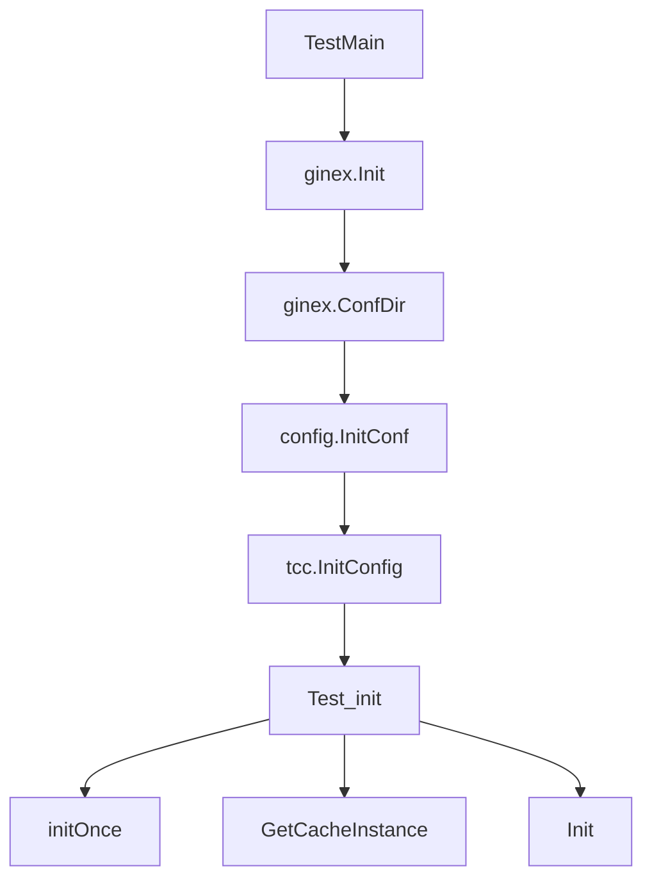

# Other — remote_cache

## remote_cache 模块

`remote_cache` 模块负责提供远程缓存相关的初始化与实例获取能力。当前可见代码主要是测试入口，验证了模块的初始化链路能够在完整配置环境下正常执行，并且 `GetCacheInstance()` 能返回非空缓存实例。

## 对外入口

模块实现位于 `remote_cache/remote_cache.go`，测试中直接使用了以下函数：

- `initOnce()`：执行一次性初始化，测试期望返回 `nil` 错误。
- `GetCacheInstance()`：获取缓存实例，测试期望返回值非空且错误为 `nil`。
- `Init()`：模块级初始化入口，测试期望可重复调用且返回 `nil`。

从测试行为看，`initOnce()` 更偏内部初始化逻辑，`Init()` 是更适合业务代码调用的公开初始化入口，`GetCacheInstance()` 用于拿到初始化后的缓存对象。

## 测试初始化流程

`remote_cache/base_test.go` 中定义了 `TestMain(m *testing.M)`，所有测试运行前都会先初始化运行环境：

```go
func TestMain(m *testing.M) {
	ginex.Init()
	config.InitConf(ginex.ConfDir())
	tcc.InitConfig()
	code := m.Run()
	os.Exit(code)
}
```

初始化顺序很重要：

1. `ginex.Init()` 初始化 GinEx 运行环境。
2. `config.InitConf(ginex.ConfDir())` 从 GinEx 配置目录加载项目配置。
3. `tcc.InitConfig()` 初始化 TCC 配置。
4. `m.Run()` 执行 `remote_cache` 包内测试。

这说明 `remote_cache` 的初始化依赖项目配置和 TCC 配置已就绪；如果在业务代码或新测试中绕过这些前置步骤，`Init()`、`initOnce()` 或 `GetCacheInstance()` 可能无法按预期工作。



## 核心测试用例

`remote_cache/remote_cache_test.go` 中的 `Test_init` 覆盖了模块最基本的生命周期：

```go
func Test_init(t *testing.T) {
	err := initOnce()
	assert.Nil(t, err)

	i, err := GetCacheInstance()
	assert.Nil(t, err)
	assert.NotNil(t, i)

	err = Init()
	assert.Nil(t, err)
}
```

该测试验证三件事：

- `initOnce()` 可以在完整配置环境下成功初始化。
- 初始化后 `GetCacheInstance()` 可以返回可用实例。
- `Init()` 可以成功执行，且不会因为此前已调用过 `initOnce()` 而失败。

这也暗示 `remote_cache` 初始化逻辑应具备幂等性，至少在测试覆盖的调用顺序中，直接调用 `initOnce()` 后再调用 `Init()` 是合法的。

## 与代码库其他模块的关系

`remote_cache` 测试依赖以下模块完成环境准备：

- `code.byted.org/gin/ginex`
  - 提供 `ginex.Init()` 和 `ginex.ConfDir()`。
  - 用于建立运行时配置目录上下文。

- `code.byted.org/videoarch/bktmeta-api/config`
  - 通过 `config.InitConf(ginex.ConfDir())` 加载项目配置。

- `code.byted.org/videoarch/bktmeta-api/tcc`
  - 通过 `tcc.InitConfig()` 初始化 TCC 配置。

调用图中没有发现其他模块调用 `remote_cache` 的测试函数；业务侧对 `remote_cache` 的实际调用应集中在 `remote_cache.go` 提供的 `Init()` 和 `GetCacheInstance()` 等入口上。

## 贡献注意事项

修改 `remote_cache` 初始化逻辑时，需要保持以下行为：

- `Init()` 应作为稳定入口，适合外部模块调用。
- `initOnce()` 的一次性初始化语义不能破坏。
- `GetCacheInstance()` 在初始化完成后必须返回非空实例。
- 初始化逻辑应兼容测试中的调用顺序：`initOnce()` → `GetCacheInstance()` → `Init()`。
- 新增测试时应复用 `TestMain` 中的环境初始化方式，避免在未加载 `config` 和 `tcc` 的情况下直接测试远程缓存逻辑。