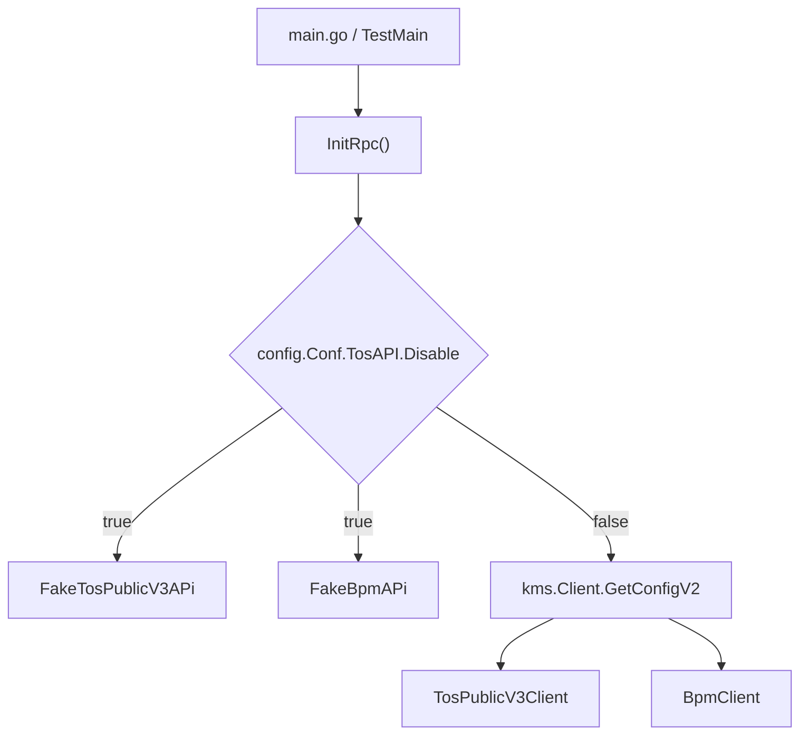
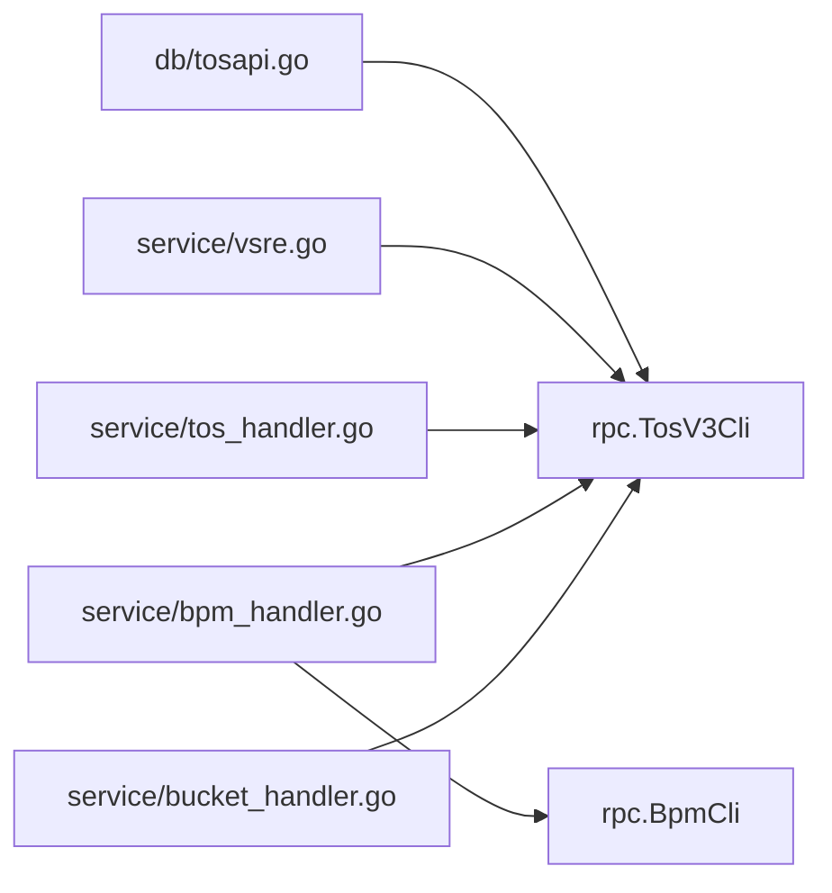

# Other — rpc

## 模块概览

`rpc` 包封装了本服务对外部系统的 HTTP/RPC 调用，主要包含两类客户端：

- `TosV3Cli`：访问 TOS Platform Public V3 API，用于查询 bucket、拉取全量 bucket、创建 bucket、追加 bucket 管理员。
- `BpmCli`：访问 BPM workflow API，用于创建和取消审批流。

模块通过接口变量暴露能力：

```go
var TosV3Cli TosPublicV3Api
var BpmCli BpmApi
```

业务层不直接构造 HTTP 请求，而是依赖这两个全局客户端。`InitRpc()` 根据配置初始化真实客户端或 fake 客户端。

## 初始化流程

`InitRpc()` 是模块入口，服务启动和测试初始化都会调用它：

- `main.go` 调用 `rpc.InitRpc()` 完成运行时初始化。
- `rpc/base_test.go` 的 `TestMain` 在测试前依次初始化配置、JWT、指标、KMS 和 RPC。
- `db/base_test.go`、`service/base_test.go` 也会在测试环境中调用 `rpc.InitRpc()`。



当 `config.Conf.TosAPI.Disable == true` 时，模块不会访问外部 TOS/BPM 服务，而是将：

```go
TosV3Cli = &FakeTosPublicV3APi{}
BpmCli = &FakeBpmAPi{}
```

fake 客户端的所有方法都会返回：

```go
var MethodNotSupported = errors.New("method not supported in this region")
```

当配置未禁用时，`InitRpc()` 会从 KMS 读取 `config.Conf.TosAPI.IamSecret` 对应的密钥。如果 KMS 读取失败，函数会记录错误并 `panic`，因此 KMS 初始化必须早于 `InitRpc()`。

真实客户端初始化字段来自配置：

- `TosPublicV3Client.JwtHost`
- `TosPublicV3Client.IamSecret`
- `TosPublicV3Client.TosPlatPSM`
- `TosPublicV3Client.TosPlatCluster`
- `TosPublicV3Client.TosPlatHost`
- `BpmClient.BpmApiUrl`

## TOS Public V3 客户端

`TosPublicV3Api` 定义了业务层可使用的 TOS 能力：

```go
type TosPublicV3Api interface {
    QueryBucket(ctx context.Context, name string) (*PublicBucket, error)
    GetAllBuckets(ctx context.Context) ([]*AdminBucketV1, error)
    GetAllBucketsWithCache(ctx context.Context) ([]*AdminBucketV1, error)
    CreateBucket(ctx context.Context, createRequest *CreateBucketRequest) (*CreateBucketResponse, error)
    AppendBucketManager(ctx context.Context, appendRequest *AppendBucketManagerRequest) error
}
```

真实实现是 `TosPublicV3Client`。

### `QueryBucket`

`QueryBucket(ctx, name)` 查询单个 TOS bucket：

```go
GET http://{TosPlatPSM}/public/v3/query/bucket?name={name}
```

响应中的 `data` 会反序列化为 `PublicBucket`。业务侧常用于判断 TOS bucket 是否已存在或补齐 TOS 元信息，例如：

- `service/bucket_handler.go`
- `service/tos_handler.go`
- `service/vsre.go`
- `service/bpm_handler.go`

### `GetAllBuckets`

`GetAllBuckets(ctx)` 拉取 TOS 全量 bucket 列表：

```go
GET http://{TosPlatPSM}/public/v3/buckets/all
```

响应中的 `data` 先反序列化为 `AllBucketsData`，再返回其中的 `Buckets []*AdminBucketV1`。

`db/tosapi.go` 中的同步逻辑会调用它把 TOS bucket 信息同步到本服务的数据视图中。

### `GetAllBucketsWithCache`

`GetAllBucketsWithCache(ctx)` 调用 TOS Today+1 缓存接口：

```go
GET http://{TosPlatPSM}/public/v3/bucketmeta
```

该接口直接返回 `[]*AdminBucketV1`，并且注释说明缓存结果中的 `TTL` 字段不为空。`rpc/tos_test.go` 也用测试断言体现了这个差异：

- `GetAllBuckets` 返回的 bucket 不期望出现 `TTL > 0`
- `GetAllBucketsWithCache` 返回的 bucket 期望至少存在 `TTL > 0`

测试中对 `"Failed to fetch data"` 做了兼容处理，用于绕过 TOS platform BOE 请求 Redis 超时的情况。

### `CreateBucket`

`CreateBucket(ctx, createRequest)` 创建 TOS bucket：

```go
POST http://{TosPlatPSM}/public/v3/bucketbu
```

请求体是 `CreateBucketRequest` 的 JSON。

方法内部有两个默认化逻辑：

```go
if createRequest.Qos == nil {
    createRequest.Qos = &Qos{
        GetQps:    2000,
        PutQps:    2000,
        HeadQps:   2000,
        DeleteQps: 1000,
        PutRate:   3000,
        GetRate:   3000,
    }
}

if createRequest.Public == "everyone" {
    createRequest.SecurityLevel = "L1"
}
```

因此调用方如果不传 `Qos`，会默认使用固定的读写 QPS 和带宽配置；公开 bucket 会被强制设置为 `SecurityLevel == "L1"`。

响应中的 `data` 会反序列化为：

```go
type CreateBucketResponse struct {
    BucketID    uint64 `json:"bucket_id"`
    AccessKey   string `json:"ak"`
    SecretKey   string `json:"sk"`
    SysMsg      string `json:"sys_msg"`
    SysTicketID uint64 `json:"sys_ticket_id"`
}
```

### `AppendBucketManager`

`AppendBucketManager(ctx, appendRequest)` 给 bucket 追加管理员：

```go
PUT http://{TosPlatPSM}/public/v3/bucket/bucketmanager
```

请求体是 `AppendBucketManagerRequest`：

```go
type AppendBucketManagerRequest struct {
    ServiceAccounts []string      `json:"service_accounts"`
    UserAccounts    []UserAccount `json:"user_accounts"`
    BucketId        int32         `json:"bucket_id"`
    LoginUserEmail  string        `json:"login_user_email"`
}
```

业务层常在创建 bucket 后或审批回调中调用该方法，为服务账号或用户账号补充管理权限。

## TOS 请求公共逻辑

所有 `TosPublicV3Client` 方法最终都会调用 `doReq(ctx, req, objPtr)`。

`doReq` 会统一设置请求头：

```go
req.Header.Set("X-TT-FROM", "toutiao.videoarch.bktmetaapi")
req.Header.Set("X-TT-LOGID", logID)
req.Header.Add("x-jwt-token", token)
```

`logID` 优先从 `ctx.Value("K_LOGID")` 获取；如果上下文没有该值，则使用 `logid.GenLogID()` 生成。

JWT token 由 `getJwtToken()` 通过 IAM secret 向 JWT 服务申请：

```go
GET {JwtHost}/auth/api/v1/jwt
Authorization: Bearer {IamSecret}
```

token 从响应头 `X-Jwt-Token` 读取。

TOS 请求通过 consul HTTP 客户端发送：

```go
chttp.DefaultClient.Do(req, chttp.WithCluster(cli.TosPlatCluster))
```

这意味着 `TosPlatPSM` 和 `TosPlatCluster` 必须与服务发现配置匹配。

响应统一由 `handleRes(rd, objPtr)` 处理。TOS 标准响应结构是：

```go
type PublicBucketResponse struct {
    Status int             `json:"status"`
    Msg    string          `json:"msg"`
    Data   json.RawMessage `json:"data"`
}
```

处理规则：

- `Status == 0`：认为成功。
- `Status == 404`：返回 `errors.New("not found")`。
- 其他非零状态：返回 `fmt.Errorf("res status:%d, msg:%s", res.Status, res.Msg)`。
- `objPtr != nil` 时，将 `Data` 反序列化到目标结构。

## BPM 客户端

`BpmApi` 定义审批流相关能力：

```go
type BpmApi interface {
    CreateWorkflow(ctx context.Context, workflowConfigID string, config interface{}) (*CreateWorkflowResponse, error)
    CancelWorkflow(ctx context.Context, workflowID string) error
}
```

真实实现是 `BpmClient`。

### `CreateWorkflow`

`CreateWorkflow(ctx, workflowConfigID, config)` 创建审批流记录：

```go
POST {BpmApiUrl}/inf/v1/workflow/record
```

请求体结构固定为：

```go
map[string]interface{}{
    "workflow_config_id": workflowConfigID,
    "config":             config,
}
```

响应中的 `data` 反序列化为 `CreateWorkflowResponse`。`service/bpm_handler.go` 中修改 TOS bucket 配置、权限、公开级别等流程会通过 `rpc.BpmCli.CreateWorkflow` 发起 BPM 审批。

### `CancelWorkflow`

`CancelWorkflow(ctx, workflowID)` 取消审批流：

```go
POST {BpmApiUrl}/inf/v1/workflow/record/{workflowID}/cancel
```

该方法不需要响应数据，成功时只依赖公共响应码判断。

## BPM 请求公共逻辑

`BpmClient.doReq(ctx, req, objPtr)` 会统一设置请求头：

```go
req.Header.Set("X-TT-FROM", "toutiao.videoarch.bktmetaapi")
req.Header.Set("X-TT-LOGID", logID)
req.Header.Set("X-JWT-Token", token)
req.Header.Set("Content-Type", "application/json")
```

BPM 的 JWT token 不是通过 HTTP 获取，而是由本服务的 JWT 组件生成：

```go
jwt.BpmGen.Generate(ctx, config.Conf.ModifyTOSBucketBpmConfig.SecretKey)
```

请求通过 `http.DefaultClient.Do(req)` 发送。

BPM 标准响应结构是：

```go
type PublicBpmResponse struct {
    Code    int             `json:"code"`
    Message string          `json:"message"`
    Data    json.RawMessage `json:"data"`
}
```

处理规则与 TOS 类似：

- `Code == 0`：成功。
- `Code == 404`：返回 `errors.New("not found")`。
- 其他非零状态：返回 `fmt.Errorf("res code:%d, message:%s", res.Code, res.Message)`。
- `objPtr != nil` 时，将 `Data` 反序列化到目标结构。

## IDL 与数据结构

`rpc/tos_idl.go` 集中定义 TOS/BPM 交互结构体。重要类型包括：

- `PublicBucket`：单 bucket 查询结果，包含 `BucketID`、`BucketName`、`TTL`、`BackendID`、`Writable`、`Qos`、`Properties`、`SecurityLevel`、`ServiceNode`、`PSM` 等字段。
- `AdminBucketV1`：全量 bucket 列表项，包含 `ID`、`Name`、`Region`、`Creator`、`ServiceNode`、`BackendID`、`Public`、`TTL`、`S3Info`、`VRegion` 等字段。
- `CreateBucketRequest`：创建 bucket 请求，包含 `Name`、`Creator`、`ServiceNode`、`TTL`、`VRegion`、`BackendID`、`CacheControl`、`SecurityLevel`、`Public`、`Headers`、`Qos` 等字段。
- `Qos`：TOS bucket 的限流配置。
- `AppendBucketManagerRequest`：追加 bucket 管理员请求。
- `CreateBucketResponse`：创建 bucket 的返回结果，包含 `BucketID`、`AccessKey`、`SecretKey`、`SysTicketID`。
- `CreateWorkflowResponse`：BPM 创建审批流返回结果，定义在 `rpc/bpm.go`。

`BackendInfo` 和 `XFlowBPMJob` 也定义在该文件中，但当前 `rpc` 包实现没有直接使用它们。

## fake 客户端

`rpc/fake_client.go` 提供两个 fake 实现：

```go
type FakeTosPublicV3APi struct{}
type FakeBpmAPi struct{}
```

它们分别实现 `TosPublicV3Api` 和 `BpmApi`，但所有方法都返回 `MethodNotSupported`。

这些 fake 客户端主要用于：

- TOS API 被配置禁用的区域或环境。
- 避免不支持的区域误调用外部 TOS/BPM 服务。
- 在测试中验证禁用模式下的行为。

需要注意，fake 客户端不是 mock 数据源，不会返回伪造 bucket 或 workflow 数据；它们只表达“当前区域不支持该方法”。

## 与业务模块的连接

`rpc` 包是业务服务访问外部系统的边界层。主要调用关系如下：



典型使用场景：

- `service/bucket_handler.go`：创建或批量创建 bucket 时查询 TOS bucket，并调用 `AppendBucketManager` 补充权限。
- `service/bpm_handler.go`：BPM 创建 bucket、审批回调、修改 TOS bucket 配置时调用 `CreateWorkflow`、`CancelWorkflow`、`QueryBucket`、`AppendBucketManager`。
- `service/tos_handler.go`：查询 TOS bucket 信息。
- `service/vsre.go`：创建 VSRE 相关 bucket 时调用 `CreateBucket`、`QueryBucket`、`AppendBucketManager`。
- `db/tosapi.go`：异步同步 TOS 全量 bucket 数据时调用 `GetAllBuckets` 和 `GetAllBucketsWithCache`。

## 测试覆盖

`rpc/base_test.go` 的 `TestMain` 建立集成测试环境：

```go
ginex.Init()
config.InitConf(ginex.ConfDir())
jwt.InitJwt()
util.InitMetrics()
kms.Init()
InitRpc()
```

`rpc/f_client_test.go` 验证 fake 客户端的所有方法都会返回 `MethodNotSupported`。

`rpc/tos_test.go` 覆盖真实 TOS 客户端方法：

- `TestTosPublicV3Client_QueryBucket`
- `TestTosPublicV3Client_GetAllBuckets`
- `TestTosPublicV3Client_GetAllBucketsWithCache`
- `TestTosPublicV3Client_CreateBucket`
- `TestTosPublicV3Client_AppendManagerBucket`
- `TestInitRpc`

这些测试依赖真实配置、KMS、JWT 和外部 TOS 环境，因此更接近集成测试，不是纯单元测试。

`rpc/bpm_test.go` 调用 `BpmCli.CreateWorkflow`，并断言错误中包含 `"not exist"`，用于验证不存在 workflow 配置时的错误路径。

## 开发注意事项

新增外部 RPC 能力时，优先遵循现有模式：

1. 在接口中增加方法，例如 `TosPublicV3Api` 或 `BpmApi`。
2. 在真实客户端中实现 HTTP 请求构造。
3. 复用 `doReq` 和 `handleRes`，不要在业务方法中重复处理公共响应格式。
4. 在 fake 客户端中补齐同名方法，并返回 `MethodNotSupported`。
5. 在调用方使用 `rpc.TosV3Cli` 或 `rpc.BpmCli`，不要绕过接口直接构造客户端。

修改响应结构时要特别注意 `handleRes` 的二段式反序列化：外层公共响应先解析到 `PublicBucketResponse` 或 `PublicBpmResponse`，内层 `data` 再解析到具体结构。如果外部接口返回的 `data` 形状变化，错误通常会表现为 `"unmarshal res data"`。