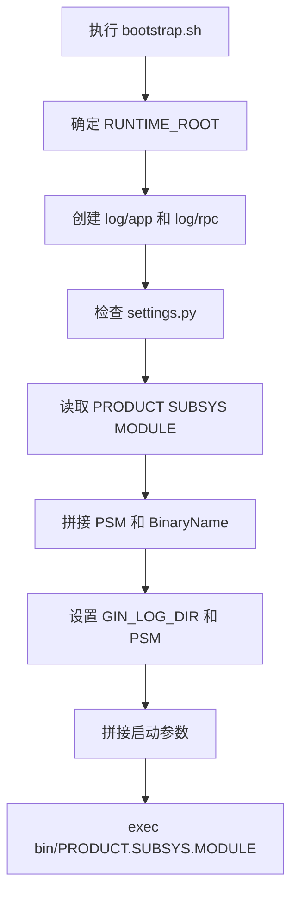

# Other — script

## script 模块

`script` 模块负责服务运行时启动配置。它不包含业务逻辑，主要由 `bootstrap.sh` 读取 `settings.py` 中的服务标识，准备日志目录，拼装启动参数，并最终执行二进制文件。

核心文件：

- `bootstrap.sh`：服务启动入口脚本。
- `settings.py`：定义产品线、子系统、模块名等部署元信息。
- `pre_nginx.sh`：当前为空文件，作为可选 nginx 前置脚本占位。

## 启动流程

`bootstrap.sh` 的执行入口格式为：

```bash
./bootstrap.sh <RUNTIME_ROOT> [PORT]
```

如果未传入 `RUNTIME_ROOT`，脚本会默认使用 `bootstrap.sh` 所在目录作为运行时根目录。

启动流程如下：



## `settings.py` 配置

当前配置内容：

```python
PRODUCT="toutiao"
SUBSYS="videoarch"
MODULE="bktmetaapi"

APP_TYPE="binary"
```

这三个字段会共同组成服务名和二进制文件名：

```bash
SVC_NAME=${PRODUCT}.${SUBSYS}.${MODULE}
BinaryName=${PRODUCT}.${SUBSYS}.${MODULE}
```

因此当前服务标识为：

```text
toutiao.videoarch.bktmetaapi
```

脚本最终会执行：

```bash
script/bin/toutiao.videoarch.bktmetaapi
```

并传入：

```bash
-psm=toutiao.videoarch.bktmetaapi
-conf-dir=<script目录>/conf/
-log-dir=<RUNTIME_ROOT>/log
```

如果启动时传入第二个参数 `PORT`，还会追加：

```bash
-port=<PORT>
```

## 运行时目录

`bootstrap.sh` 会根据 `RUNTIME_ROOT` 派生两个目录：

```bash
RUNTIME_CONF_ROOT=$RUNTIME_ROOT/conf
RUNTIME_LOG_ROOT=$RUNTIME_ROOT/log
```

其中 `RUNTIME_CONF_ROOT` 当前只被定义，没有在后续逻辑中使用。实际传给二进制的配置目录是：

```bash
CONF_DIR=$CURDIR/conf/
```

日志目录会被初始化为：

```text
<RUNTIME_ROOT>/log/app
<RUNTIME_ROOT>/log/rpc
```

并通过环境变量传给进程：

```bash
export GIN_LOG_DIR=$RUNTIME_LOG_ROOT
export PSM=$SVC_NAME
```

## nginx 与端口处理

`settings.py` 中保留了 nginx 相关配置注释：

```python
# REQUIRE_NGINX = True
# PRENGINX_SCRIPT = "pre_nginx.sh"
```

`bootstrap.sh` 会尝试读取：

```bash
REQUIRE_NGINX=$(cd $CURDIR; python -c "import settings; print(settings.REQUIRE_NGINX)" 2>/dev/null)
```

当前 `settings.py` 没有定义 `REQUIRE_NGINX`，因此该变量会为空，脚本不会按 nginx 模式处理端口。

如果环境变量 `REQUIRE_HTTP_MESH=True`，脚本会强制：

```bash
REQUIRE_NGINX=False
```

在 `IS_HOST_NETWORK=1` 时，脚本会根据是否需要 nginx 设置运行时端口环境变量：

```bash
if [ "$REQUIRE_NGINX" == "True" ]; then
    export RUNTIME_SERVICE_PORT=$PORT1
    export RUNTIME_DEBUG_PORT=$PORT2
else
    export RUNTIME_SERVICE_PORT=$PORT0
    export RUNTIME_DEBUG_PORT=$PORT1
fi
```

这里的 `PORT0`、`PORT1`、`PORT2` 需要由外部部署环境提供。注意这些环境变量只用于导出 `RUNTIME_SERVICE_PORT` 和 `RUNTIME_DEBUG_PORT`，不会自动成为二进制启动参数；真正传入二进制的 `-port` 仍来自 `bootstrap.sh` 的第二个命令行参数。

## `pre_nginx.sh`

`pre_nginx.sh` 当前为空。`bootstrap.sh` 没有直接调用它。

`settings.py` 中的注释展示了一个可能的部署约定：

```python
# PRENGINX_SCRIPT = "pre_nginx.sh"
```

这说明该文件可能供外部部署系统或运行时框架在 nginx 启动前执行，但在当前模块代码中没有实际接入逻辑。

## 与代码库其他部分的连接

`script` 模块通过约定连接服务二进制和运行时环境：

- 二进制文件必须位于 `script/bin/` 下。
- 二进制名称必须等于 `${PRODUCT}.${SUBSYS}.${MODULE}`。
- 配置目录固定传为 `script/conf/`。
- 日志根目录通过 `GIN_LOG_DIR` 和 `-log-dir` 同时提供。
- 服务标识通过 `PSM` 环境变量和 `-psm` 参数同时提供。

因此，修改 `settings.py` 中的 `PRODUCT`、`SUBSYS` 或 `MODULE` 会同时影响：

- `PSM`
- `BinaryName`
- 启动目标路径
- `-psm` 参数

修改这些字段时，需要确保 `script/bin/` 下存在对应名称的可执行文件。