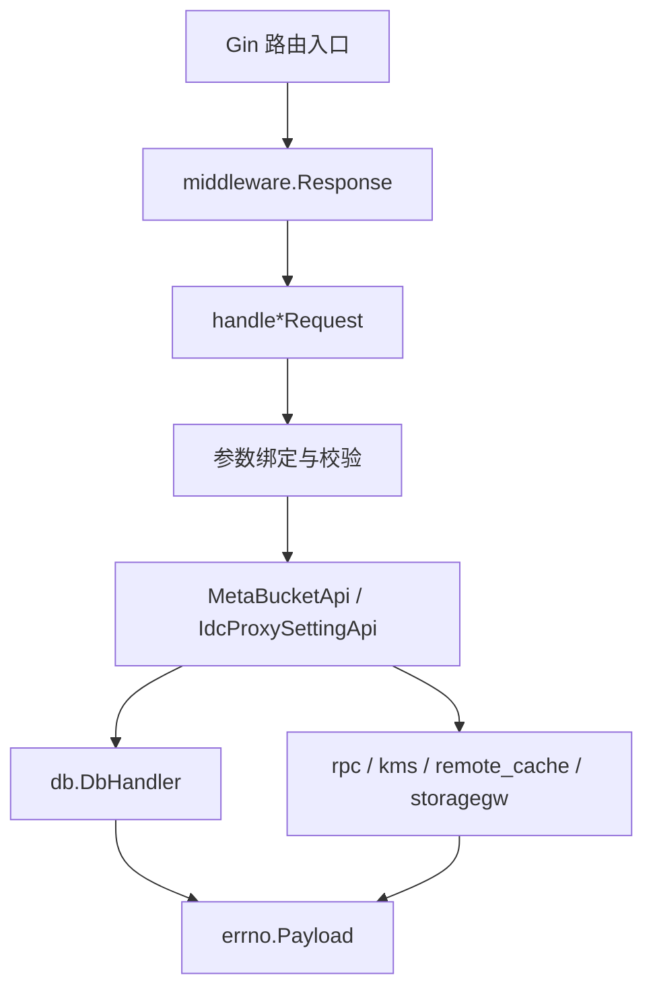

# Other — service

## service 服务模块

`service` 包是 `bktmeta-api` 的业务编排层。它把 Gin 请求转换成 `errno.Payload`，并协调 `db.DbHandler`、`rpc.TosV3Cli`、`rpc.BpmCli`、`remote_cache`、`kms`、`storagegw`、TCC 配置、账号系统和 VSRE/BPM 工单系统。

### 核心对象

`MetaBucketApi` 是桶元数据主服务，负责桶创建、查询、更新、删除、缓存刷新、TOS/ToB TOS 补全、BPM/VSRE 回调、签名、加密桶查询和 Volcengine IAM 管理。`NewMetaBucketApi` 会初始化本地缓存、`storagegw.Client`、ToB TOS region endpoint 配置，并立即调用 `asyncUpdateAllBktCache` 预热缓存；随后通过 ticker 和 TCC listener 周期刷新全量缓存。

`IdcProxySettingApi` 管理 IDC 元数据与代理配置。它用 `vfast_cache.VFastCache` 缓存单 IDC 代理和全量代理列表，供 `MetaBucketApi.calcIdcConfigs` 计算桶的单元化视图和跨 IDC 代理信息。

公开接口通常采用固定模式：`CreateBucket(c *gin.Context)` 只调用 `middleware.Response(c, "buckets.create", api.handleCreateBucketRequest)`，实际逻辑放在 `handleCreateBucketRequest`、`createBucket` 等内部函数中。新增接口应保持这个模式，避免在路由入口里直接写业务逻辑。

### 桶生命周期

创建主路径是 `handleCreateBucketRequest -> createBucket`。`createBucket` 会根据后端类型做不同补全：

- `meta.BackendTos`：通过 `GetTosBucket` 解析 `BackendBucket`，调用 `fillTosBktInfo` 补 PSM、Public、TTL，并尝试用 `rpc.TosV3Cli.AppendBucketManager` 添加 `videoarch_bktmetaapi` 管理员。
- `meta.BackendToBTos`：调用 `fillTobTosIDC`，根据 `constant.TobTosRegionIDCMap` 从 region 反推 IDC。
- 所有后端：调用 `validateBkt` 和 `checkBackendBucketBkt` 校验主桶与 `IdcConfigs` 的 `BackendBucket` JSON。
- 密钥：`genAkSk` 对 TOS 复用后端桶 AK/SK，对非 TOS 自动生成；`genEncryptionKey` 使用 `kms.NewEncryptedKey` 生成加密 key，并禁止调用方预置 `EncryptionInfo.Key`。
- 单元化：若请求没有带 `IdcConfigs`，`fillDefaultIDCConfigs` 会从 `tcc.GetDefaultIDCConfigs` 生成默认配置，目前支持 TOS、S3、ToB TOS。
- 落库后调用 `removeBucketCache`，并在开启远程缓存时异步删除单桶缓存、更新 `bucketNameSetKey`。

更新路径包括 `updateBucket` 和 `overwriteBucket`。两者都会先 `validateBkt`，区别在于分别调用 `dbh.UpdateBucket` 与 `dbh.OverwriteBucket`。删除路径 `deleteBucket` 调用 `dbh.DeleteBucket` 后清理本地和远程缓存。

批量维护接口包括 `handleCreateBucketBatchRequest`、`handleUpdateBucketsIdcJanusRequest`、`handleUpdateBucketsPsmJanusRequest` 和 `handleUpdateBucketsSkJanusRequest`，返回值统一按 `success`、`failed`、`skip` 分组。

### 查询与缓存

单桶查询入口是 `handleGetBucketRequest -> getBucketByName -> getBucket`。`getBucket` 的读取顺序是本地 `bucketCache`、远程 `remote_cache`、DB。DB 命中后先缓存未解密原始对象，再由 `processBucket` 调用 `db.DecryptBucketWithConfig` 和 `calcIdcConfigs` 生成请求视图。DB 未命中会缓存空值 30 秒，降低穿透风险。

全量查询入口是 `handleGetAllBucketsRequest`。缓存 key 由 `getAllBucketCacheKey(queryIdc, requestEnvIdc)` 生成，格式为 `all_<queryIdc>_<requestEnvIdc>`。如果 `decryptedAllBucketCache` 已存在，会复制全量桶并重新执行 `calcIdcConfigs`，再用 `bucketsToCacheItem` 生成带 ETag 的响应。只有缓存缺失时才用 `dbKeyLock` 控制 DB 回源。

`asyncUpdateAllBktCache` 是全量缓存的核心后台任务。它优先读取远程缓存中的 `bucketNameSetKey`，批量拉取桶对象，对逻辑过期或缺失的桶分批回源 DB 并刷新远程缓存；失败时回退到 DB 全量查询。刷新完成后同时更新 `allSimpleBucketsCache`、`simpleBucketCache`、`decryptedAllBucketCache` 和已有的 `allBucketsCache` key，并通过 `syncBucketNamesWithDB` 对账远程桶名集合。

`GetAllBucketsSimple` 和 `GetBucketSimple` 是轻量查询接口。它们使用忽略 AK/SK 的缓存；`handleGetBucketRequestSimple` 在 bktmeta 未注册但 `db.TosMetaCache` 有 TOS 元数据时，会用 `buildBktFromTosAdminBucket` 构造 `Unregistered: true` 的临时 `meta.Bucket`。

### 单元化与 IDC 代理

`calcIdcConfigs` 根据请求里的 `idc` 和 `client.ENV_IDC_HEADER` 计算返回视图。如果目标 IDC 命中 `IdcConfigs`，会把桶的 `BackendBucket`、`IDC`、`IDCType`、`IDCRegion`、`HijackConf`、`GatewayConf` 覆盖为该配置；如果没有命中，则清空 `IdcConfigs`。随后它会结合 `IdcProxySettingApi.getAllIdcProxiesFromCache` 为跨 IDC 请求填充 `Proxies`。

`fillIdcTypeAndRegion` 和 `getIdcTypeAndRegion` 负责给桶和 `IdcConfigs` 标注 region/type。优先使用 IDC 代理表中的 `Region`、`Type`，否则根据 `env.GetRegionFromIDC`、`venv.IsAggregateIdc`、`venv.IsCentralIdc` 做兜底判断。

### BPM 工单流程

`handleCreateBucketBPMRequest` 用于 BPM 注册桶。若桶已存在，它只合并 `Category` 和 `Providers` 后调用 `updateBucket`；若不存在，则根据 `BackendType` 构造后端桶。TOS 场景由 `fillBPMTosBucketInfo` 处理：已存在 TOS 元数据时补齐 IDC、服务树、PSM 和默认 provider；需要创建 TOS 桶时，使用 `categoryShortNameMap`、`sceneTosVRegionMap`、`shortCategoryServiceTreeNodeIdMap` 生成 `TosBucketCreateReq`，再进入 `createAndUpdateTosBucket`。

`handleCreateTOSBucketsBPMRequest` 是按账号和类目批量创建 TOS 桶的 BPM 入口。它根据 `bucketNamePattern` 和类目短码生成桶名，调用 `createAndUpdateTosBucket` 创建真实 TOS 桶，再调用 `createBucket` 注册 bktmeta。返回 `CreateTosBucketBPMResp`，其中 `AsyncCreate` 表示 TOS 创建走了异步审批。

`createAndUpdateTosBucket` 定义在 `vsre.go`，但同时被 BPM 和 VSRE 使用。`TosBucketCreateReq.ServiceNode != 0` 表示创建 TOS 桶：如果 `rpc.TosV3Cli.CreateBucket` 直接返回 AK/SK，则同步写回 `BackendBucket`；如果返回 `SysMsg == "Accepted"` 且没有 AK/SK，则写入 `dto.TempBucket`，状态为 `db.TicketWaitingForApprove`。`handleCreateBucketCallBackRequest` 收到回调后把临时工单更新为 `db.TicketSuccess`，补齐 AK/SK 并正式注册桶。

修改类 BPM 入口包括 `handleModifyTOSBucketLimitsBPMRequest`、`handleModifyTOSBucketPropsBPMRequest`、`handleModifyTOSBucketPublicLevelBPMRequest`，它们最终调用 `rpc.BpmCli.CreateWorkflow`。`handleAppendTOSBucketManagerBPMRequest` 根据 `Type` 选择添加用户账号或服务账号，并调用 `rpc.TosV3Cli.AppendBucketManager`。

### VSRE 变更流程

`handleVsreTriggerRequest` 通过 `vsreCli.GetTicket` 拉取 V1 工单，然后由 `executeVsreBucketAction` 执行 `CreateAction`、`UpdateAction`、`DeleteAction`。创建和更新 TOS 桶时会先走 `createAndUpdateTosBucket` 或同步 TOS TTL；更新 ToB TOS 时会调用 `fillTobTosBucketCredential`，从 DB 中保留已有 credentials，避免前端变更覆盖密钥。

`handleVsreIdcTriggerRequest` 处理 IDC 代理变更，最终调用 `createIdc` 或 `updateIdcProxies`。`handleVsreVolcTriggerRequest` 处理 Volcengine IAM 的创建、更新、删除。

V2 工单入口是 `handleCreateVsreV2TicketRequest`。它只接受 `module=bktmeta-api` 或 `module=idc-proxy`；若请求头 `X-VA-Change-Degrade` 为 `1`，则降级为直接执行 V1 工单。正常情况下通过 `convertV1TicketToV2` 生成 `models.Ticket` 并调用 `vsreV2Cli.CreateTicketV2`。回调入口 `handleCallbackVsreV2TicketRequest` 会拉取 V2 工单、用 `convertV2TicketToV1` 转回旧结构、执行对应模块逻辑，并用 `sendChangeSystemEvent` 上报变更事件。

### TOS、ToB TOS 与第三方依赖

`InitThirdPartyClient` 初始化 Passport、ByteTree 和 account client。`getProviderByServiceNode` 使用服务树节点路径查询 TopAccount，再从 account 系统推导 provider；对 `data.ti.cdn_domain_procedure` 和 `bytedance.videoarch.des_api` 调用方，会按固定命名生成 provider，并在不存在时通过 `createGeneralAccount` 调用 general_console 创建账号。

`handleGetTosBackendConfigRequest` 返回当前 IDC 的 `allBackends` 配置。`handleGetBucketDefaultProviderRequest` 优先从 `db.TosMetaCache` 取 TOS 元数据，失败再调用 `rpc.TosV3Cli.QueryBucket`，最后用 `getProviderByServiceNode` 推导默认 provider。

`handleGetTosBucketS3InfoRequest` 返回 TOS 桶的 S3 协议信息。它从 `db.TosMetaCache` 读取 `S3Info.Endpoint` 和 `S3Info.Region`，再由 `fillDesTosS3Info` 根据 `config.Conf.TosS3Router` 补充 `TLSPSM`、`RouterPSM` 和 `RouterCluster`。

`volcengine_handler.go` 管理 `meta.VolcengineIAM` 的 CRUD。`handleGetTobTosBucketBaseInfo` 通过请求头 `client.AccessKeyHeader`、`client.SecretKeyHeader`、`client.SessionTokenHeader` 查询 ToB TOS 桶基础信息：先查 bktmeta 已注册桶，再用 `listVolcBuckets` 遍历 `tosTobRegionEndpoints`，并把结果缓存到 `tobTosBktCache`。

### 辅助接口与安全边界

`GetAllEncryptionBuckets` 从 `decryptedAllBucketCache` 中筛选已加密桶，使用 `kms.Decrypt` 解密 `EncryptionInfo.Key`，并缓存 1 分钟。该接口通过 `middleware.ResponseZti` 暴露。

`Signature` 支持两种签名：`buildSignature` 基于 `duration` 生成 deadline 签名，`buildSignature2` 基于 `encodeBody` 生成 body 签名。若 `accessKey` 不在本地 `keyMap` 中，会先查桶并校验 AK。

Janus 查询入口如 `handleGetAllBucketsJanusRequest`、`handleGetBucketJanusRequest` 使用 `verifyDevSreReq` 校验 `x-devsre-authorization` JWT。返回 ToB TOS 桶给 Janus 时，`fillTobTosInfoJanus` 会清空 credentials；返回 TOS 桶时，`fillTosInfoJanus` 会补充 VPaaS 需要的 TOS 元数据。

### 维护和测试

`script.go` 提供运维类批处理：`handleFixBucketExtraRequest` 从 account storage 配置回填 `Bucket.Extra`；`handleCreateBucketIDCConfigBatchRequest` 和 `handleDeleteBucketIDCConfigBatchRequest` 批量创建或删除 IDC 配置。

测试初始化集中在 `TestMain`：依次初始化 `ginex`、配置、指标、KMS、JWT、RPC、DB、TCC、ByteDoc、TOS 元数据缓存和第三方 client，然后创建全局 `proxySettingApi` 与 `bucketApi`。单元测试大量使用 `gomonkey` patch `rpc.TosV3Cli`、`rpc.BpmCli`、`db.DbHandler` 等外部依赖；新增测试应优先复用 `createTestContext` 和 `buildNewTestBucket`。

修改此模块时需要特别注意缓存一致性：任何会改变桶内容、IDC 配置、Volc IAM 或 IDC 代理的路径，都应同步清理对应本地缓存；桶变更还需要考虑远程缓存中的单桶 key 和 `bucketNameSetKey`。新增后端类型时，至少要补齐 `checkBackendBucketBkt`、`validateBkt`、创建/更新路径、Janus 脱敏逻辑，以及必要的默认 IDC 配置生成逻辑。