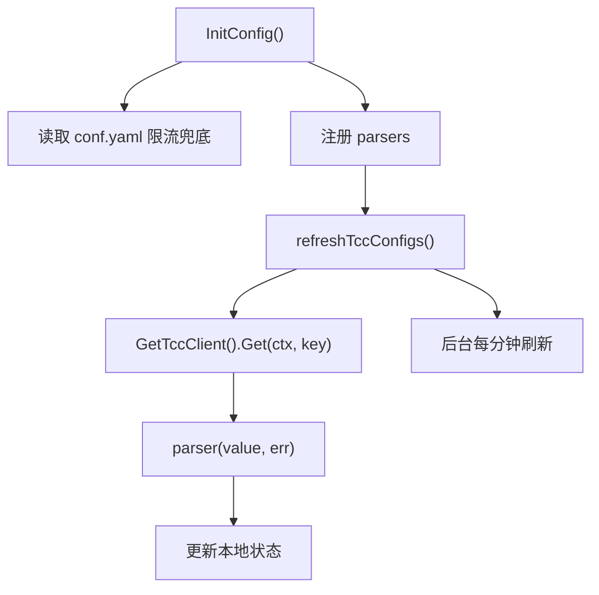

# Other — tcc

## tcc 模块

`tcc` 包负责从 TCC 拉取运行期动态配置，并把这些配置发布到本进程内的缓存、鉴权、AGW、远程缓存、接口限流和内存限制等模块。它不是业务处理模块，而是一个“配置同步层”：启动时初始化一次，之后按分钟级周期刷新配置。

核心入口是 `InitConfig()`；核心客户端入口是 `GetTccClient()`。

## 启动位置

服务启动流程中，`main.go` 在数据库、RPC、JWT、KMS、三方客户端初始化之后调用：

```go
if err = tcc.InitConfig(); err != nil {
	panic(err)
}
```

随后 `middleware.StartRefreshAGWTenantAkSkCache()`、`remote_cache.Init()`、`mem_limit.InitMemLimiter()` 都会读取 `tcc` 已加载的配置。因此，`tcc.InitConfig()` 的执行顺序会影响 AGW 租户来源、远程缓存开关和本地接口限流初始状态。

测试环境中，`tcc/base_test.go` 的 `TestMain()` 会先执行：

```go
ginex.Init()
config.InitConf(ginex.ConfDir())
```

确保 `config.Conf` 已经可用，再运行 `tcc` 包测试。

## TCC 客户端

`GetTccClient()` 位于 `tcc/tcc_client.go`，使用 `sync.Once` 懒加载 `*tccclient.ClientV2`：

```go
func GetTccClient() *tccclient.ClientV2
```

初始化时会：

1. 调用 `tccclient.NewConfigV2()` 创建配置。
2. 从 `config.Conf.TccInfo.ConfigSpace` 设置 `Confspace`。
3. 使用 `config.Conf.TccInfo.ServiceName` 调用 `tccclient.NewClientV2()`。
4. 如果创建失败，直接 `panic(err)`。
5. 后续调用复用同一个 `client`。

这意味着 `GetTccClient()` 依赖 `config.Conf` 已初始化。调用者不应该在 `config.InitConf()` 之前访问它。

## 配置键

`tcc/keys.go` 定义了当前模块使用的 TCC key：

```go
const (
	RemoteCacheConfigTccKey         = "remote_cache_config"
	LocalCacheRefreshIntervalTccKey = "local_cache_refresh_interval"
	DefaultIDCConfigsTccKey         = "default_idc_configs"
	PSMAuthV2ConfigsTccKey          = "psm_auth_v2_configs"
	DevSreToken                     = "dev_sre_token"
	AGWTenant                       = "agw_tenant"
	MemLimitPercent                 = "mem_limit_percent"
	InterfaceRateLimiterTccKey      = "interface_rate_limiter"
)
```

其中 `remote_cache_config`、`default_idc_configs`、`psm_auth_v2_configs`、`dev_sre_token`、`agw_tenant`、`interface_rate_limiter` 会被 `InitConfig()` 注册到周期刷新流程；`local_cache_refresh_interval` 和 `mem_limit_percent` 是按需读取。

## 初始化与刷新流程

`InitConfig()` 位于 `tcc/tcc_config.go`，负责配置初始加载和后台刷新：

```go
func InitConfig() error
```

执行步骤：

1. 调用 `initInterfaceRateLimiterFromConfig()`，先用 `conf.yaml` 中的 `config.Conf.InterfaceRateLimiter` 初始化接口限流，作为 TCC 配置缺失时的兜底。
2. 将 TCC key 和解析函数注册到全局 `parsers`：
   - `RemoteCacheConfigTccKey` → `remoteCacheConfigParser`
   - `DefaultIDCConfigsTccKey` → `defaultIDCConfigsParser`
   - `PSMAuthV2ConfigsTccKey` → `psmAuthV2Parser`
   - `DevSreToken` → `devSreTokenParser`
   - `AGWTenant` → `agwTenantParser`
   - `InterfaceRateLimiterTccKey` → `interfaceRateLimiterParser`
3. 调用 `refreshTccConfigs()` 做一次同步刷新。
4. 启动后台 goroutine：
   - 先 `time.Sleep(util.RandomWaitTime(time.Minute))` 错峰等待。
   - 再刷新一次。
   - 之后每分钟执行一次 `refreshTccConfigs()`。

`refreshTccConfigs()` 会为本轮刷新创建带 `K_LOGID` 的 context，并启动 BytedTrace custom span：

```go
sp, ctx := bytedtracer.StartCustomSpan(ctx, "BktMeta", "AsyncRefreshTccConfigs",
	bytedtracer.EnableEmitSpanMetrics, bytedtracer.EnableEmitSpanLog)
```

之后遍历 `parsers`，对每个 key 执行：

```go
parse(GetTccClient().Get(ctx, key))
```

如果某个 parser 返回错误，会记录 warn，并把该错误作为最终返回值；其他 key 仍会继续刷新。



## 本地状态存储方式

`tcc` 包中的动态配置主要保存在进程内变量中：

```go
var (
	remoteCacheConfig atomic.Value
	defaultIDCConfigs = map[string]config.DefaultIDCConfigs{}
	psmAuthV2         = map[string]map[string]bool{}
	devSreToken       = ""
	agwTenantConfig   atomic.Value
)
```

`remoteCacheConfig` 和 `agwTenantConfig` 使用 `atomic.Value` 发布完整对象，读取方通过 `Load()` 拿快照。

`defaultIDCConfigs`、`psmAuthV2`、`devSreToken` 是普通包级变量。刷新时 parser 会直接替换或更新它们，读取方通过对应 getter 访问。

接口限流配置不保存在 `tcc` 包内，而是通过 `util.UpdateInterfaceRateLimiterConfig()` 发布到 `util/interface_limiter.go` 的 `atomic.Value` 快照中。

## 远程缓存配置

### `GetRemoteCacheConfig()`

```go
func GetRemoteCacheConfig() *config.RemoteCacheConfig
```

读取远程缓存配置。优先返回 TCC 中通过 `remoteCacheConfigParser()` 成功发布的配置；如果还没有 TCC 配置，则返回 `&config.Conf.RemoteCacheConfig` 作为兜底。

相关配置结构在 `config/config.go`：

```go
type RemoteCacheConfig struct {
	Enable              bool          `yaml:"Enable" json:"enable""`
	TTL                 time.Duration `yaml:"TTL" json:"ttl"`
	PipelineBatchSize   int           `yaml:"PipelineBatchSize" json:"pipeline_batch_size"`
	IgnoreLogicalExpire bool          `yaml:"IgnoreLogicalExpire" json:"ignore_logical_expire"`
	LockReleaseTTL      time.Duration `yaml:"LockReleaseTTL" json:"lock_release_ttl"`
	RefreshBatchSize    int           `yaml:"RefreshBatchSize"json:"refresh_batch_size"`
}
```

### `remoteCacheConfigParser(value string, err error)`

当 `value == ""` 或 TCC `Get` 返回错误时，parser 返回 `nil`，不会覆盖当前配置。

当 `value` 非空且无读取错误时，会按 JSON 反序列化到 `config.RemoteCacheConfig`。解析成功后会把 TCC 中的秒级数值转换为 `time.Duration`：

```go
c.TTL = c.TTL * time.Second
c.LockReleaseTTL = c.LockReleaseTTL * time.Second
```

然后通过 `remoteCacheConfig.Store(c)` 发布。

### 使用方

`remote_cache.Init()` 会根据 `tcc.GetRemoteCacheConfig().Enable` 决定是否初始化 Redis 远程缓存。创建 remote cache 时，默认 TTL 来自：

```go
c.WithDefaultTTL(tcc.GetRemoteCacheConfig().TTL)
```

`service/bucket_handler.go` 和 `service/async_task.go` 也会读取 `GetRemoteCacheConfig()`，用于判断缓存启用状态、批量刷新配置等行为。

## 本地缓存刷新间隔

`GetLocalCacheRefreshInterval(ctx)` 按需从 TCC 读取 `local_cache_refresh_interval`：

```go
func GetLocalCacheRefreshInterval(ctx context.Context) (time.Duration, string)
```

行为：

1. 调用 `GetTccClient().Get(ctx, LocalCacheRefreshIntervalTccKey)`。
2. 如果读取成功，再调用 `time.ParseDuration(val)`。
3. 解析成功时返回解析后的 `time.Duration` 和原始字符串。
4. 读取失败或解析失败时返回 `config.DefaultTTL` 和空字符串。

默认值 `config.DefaultTTL` 是 `5 * time.Minute`。

该函数在 `service/bucket_handler.go` 中用于本地缓存刷新判断，同时保留 TCC 原始值用于比较当前配置值。

## 默认 IDC 配置

### `defaultIDCConfigsParser(value string, err error)`

解析 `default_idc_configs`。当 `value == ""` 或读取出错时，记录错误日志但返回 `nil`，不会中断整体刷新。

解析成功后写入包级变量：

```go
defaultIDCConfigs = map[string]config.DefaultIDCConfigs{}
```

其 JSON 结构对应：

```go
type DefaultIDCConfigs []DefaultIDCConfig

type DefaultIDCConfig struct {
	IDC                  string         `yaml:"IDC" json:"idc"`
	DefaultBackendFields []BackendField `yaml:"DefaultBackendFields" json:"default_backend_fields"`
}
```

实际 TCC value 会被反序列化为 `map[string]config.DefaultIDCConfigs`。查询 key 由 `GetDefaultIDCConfigs()` 组合：

```go
fmt.Sprintf("%s_%d", idc, backendType)
```

### `GetDefaultIDCConfigs(idc string, backendType uint16)`

```go
func GetDefaultIDCConfigs(idc string, backendType uint16) (config.DefaultIDCConfigs, bool)
```

用于按 `idc_backendType` 查询默认后端字段。`service/response.go` 会在构造响应时调用它，把默认 IDC 字段合入桶响应数据。

## PSM Auth V2 配置

### `psmAuthV2Parser(value string, err error)`

解析 `psm_auth_v2_configs`，目标结构是：

```go
map[string]map[string]bool
```

第一层 key 是 PSM，第二层 key 是接口方法名或 `"all"`。

读取失败或 value 为空时只记录错误并返回 `nil`；JSON 反序列化失败时返回错误。

### `CheckAuthV2(ctx, psm, method)`

```go
func CheckAuthV2(ctx context.Context, psm, method string) bool
```

鉴权逻辑：

```go
if allowMethods, ok := psmAuthV2[psm]; ok && (allowMethods[method]) || allowMethods["all"] {
	return true
}
return false
```

含义是：

- 指定 PSM 配置了当前 `method`，允许。
- 或者该 PSM 配置了 `"all": true`，允许。
- 否则拒绝。

使用方是 `middleware.ResponseZti()`。当请求携带 `JWT-Sec-Token` 且 ZTI token 校验通过后，会使用 token 中的 `identity.PSM` 和当前接口 `mkey` 调用 `tcc.CheckAuthV2()`。不通过时返回 forbidden。

## Dev SRE Token

### `devSreTokenParser(value string, err error)`

解析 `dev_sre_token`。当 value 为空或读取失败时记录错误并返回 `nil`；成功时直接赋值给包级变量 `devSreToken`。

### `GetDevSreToken()`

```go
func GetDevSreToken() string
```

返回当前进程内保存的 dev SRE token。

`service/bucket_handler.go` 中的 token 解析逻辑会调用 `tcc.GetDevSreToken()`，用于额外的 token 校验路径。

## AGW 租户配置

### `AGWTCCConfig`

`tcc` 包定义了 TCC 版本的 AGW 租户配置：

```go
type AGWTCCConfig struct {
	UseTCC  bool                      `json:"use_tcc"`
	Tenants []*config.AGWTenantConfig `json:"tenants"`
}
```

其中 `config.AGWTenantConfig` 定义在 `config/config.go`：

```go
type AGWTenantConfig struct {
	Name        string       `json:"name"`
	IpAllowlist []string     `json:"ip_allowlist"`
	AkSks       []AkSkConfig `json:"ak_sks"`
}
```

### `agwTenantParser(value string, err error)`

解析 `agw_tenant`。和多数 parser 不同，value 为空或读取失败时会返回：

```go
errors.New("invalid agw tenant config")
```

因此该 key 失败会让 `refreshTccConfigs()` 返回错误，并在 `InitConfig()` 首次同步刷新阶段导致启动失败。

解析成功后通过 `agwTenantConfig.Store(c)` 发布。

### `GetAGWTenantConfigs()`

```go
func GetAGWTenantConfigs() AGWTCCConfig
```

如果已有 TCC 配置，则返回其值；否则返回空的 `AGWTCCConfig{}`。

`middleware.asyncUpdateAGWTenantCache()` 会先读取该配置：

```go
if tccCfg := tcc.GetAGWTenantConfigs(); tccCfg.UseTCC {
	refreshAGWTenantFromTCC(ctx, tccCfg)
	return nil
}
```

当 `UseTCC` 为 `true` 时，AGW AK/SK 缓存直接从 TCC 租户配置构建；否则走 AGW OpenAPI `/tenant/all` 拉取。

## 接口限流配置

接口限流是该模块里测试覆盖最细的一条配置链路。

### 配置结构

`config.InterfaceRateLimiterConfig` 定义如下：

```go
type InterfaceRateLimiterConfig struct {
	Enable bool                          `yaml:"Enable" json:"enable"`
	Limits map[string]InterfaceRateLimit `yaml:"Limits" json:"limits"`
}

type InterfaceRateLimit struct {
	QPS   float64 `yaml:"QPS" json:"qps"`
	Burst int     `yaml:"Burst" json:"burst"`
}
```

TCC JSON 示例：

```json
{
  "enable": true,
  "limits": {
    "buckets.get": {
      "qps": 1,
      "burst": 1
    },
    "buckets.create": {
      "qps": 2,
      "burst": 2
    }
  }
}
```

### 初始化兜底

`InitConfig()` 首先执行：

```go
initInterfaceRateLimiterFromConfig()
```

该函数在 `config.Conf != nil` 时调用：

```go
util.InitInterfaceRateLimiterConfig(config.Conf.InterfaceRateLimiter)
```

因此，TCC 配置尚未成功拉取前，接口限流可以先使用 `conf.yaml` 中的 `InterfaceRateLimiter`。

### `interfaceRateLimiterParser(value string, err error)`

解析 `interface_rate_limiter`。行为：

- `value == ""` 或 TCC 读取错误：返回 `nil`，不覆盖当前限流快照。
- JSON 解析使用 `json.Decoder` 并启用 `DisallowUnknownFields()`。
- 解析成功后调用 `util.UpdateInterfaceRateLimiterConfig(c)`。
- 如果存在未知字段、旧格式、非法 QPS 或非法 burst，会返回错误，并保留当前限流快照。

这个“失败不发布”的语义由 `util.UpdateInterfaceRateLimiter()` 保证：它先构造新的 limiter map，只有所有配置都合法时才 `Store()` 新快照。

### 运行时判断

`middleware.Response()` 中会调用：

```go
if !util.AllowInterface(mkey) {
	logs.CtxWarn(c, "trigger local interface rate limit : %s", mkey)
	data = errno.ErrTooManyRequests
}
```

注意这里传入的是 `mkey`，不是前面组装的 `rateLimitKey`。因此本地接口限流按接口维度生效；读接口中基于 `psm:mkey` 的细粒度限流由后续的分布式限流器处理。

`util.AllowInterface(mkey)` 的行为是：

- 没有快照或没有该 `mkey` 的 limiter：放行。
- 找到 limiter：调用 `limiter.Allow()`。
- `Enable == false` 时，`UpdateInterfaceRateLimiterConfig()` 会传入 `nil`，相当于清空所有本地接口限流。

测试覆盖了这些关键语义：

- `initInterfaceRateLimiterFromConfig()` 支持 `conf.yaml` 兜底。
- TCC `enable: true` 会覆盖当前快照。
- TCC `enable: false` 会清空当前快照。
- 空值和读取错误不覆盖当前快照。
- 非法发布不覆盖当前快照。

## 内存限制配置

`GetMemLimitPercent(ctx)` 按需读取 `mem_limit_percent`：

```go
func GetMemLimitPercent(ctx context.Context) string
```

读取失败时记录错误并返回空字符串；成功时返回 TCC 原始值。

`mem_limit.InitMemLimiter()` 每分钟调用内部 `update()`，再通过：

```go
tcc.GetMemLimitPercent(context.Background())
```

获取百分比。`mem_limit` 模块会结合环境变量 `MY_MEM_LIMIT` 计算字节数，并调用 `debug.SetMemoryLimit()` 更新 Go runtime memory limit。

该配置没有被注册到 `parsers`，因此不是由 `refreshTccConfigs()` 统一刷新，而是由 `mem_limit` 模块按需定时读取。

## Parser 约定

`tcc` 包用统一签名描述所有 TCC 配置解析器：

```go
type parser func(value string, err error) error
```

`refreshTccConfigs()` 直接把 `GetTccClient().Get(ctx, key)` 的两个返回值传给 parser：

```go
parse(GetTccClient().Get(ctx, key))
```

当前 parser 的错误处理分为三类：

| parser | value 为空或读取失败 | JSON 或发布失败 |
| --- | --- | --- |
| `remoteCacheConfigParser` | 忽略，保留当前配置 | 返回错误 |
| `interfaceRateLimiterParser` | 忽略，保留当前快照 | 返回错误，保留当前快照 |
| `defaultIDCConfigsParser` | 记录错误，返回 nil | 返回错误 |
| `psmAuthV2Parser` | 记录错误，返回 nil | 返回错误 |
| `devSreTokenParser` | 记录错误，返回 nil | 不涉及 JSON |
| `agwTenantParser` | 返回错误 | 返回错误 |

新增 TCC key 时应遵循同样模式：解析失败不要写入半成品状态；只有完整解析并校验成功后再发布。

## 与 `config` 包的关系

`tcc` 包依赖 `config.Conf` 中的两类信息：

1. TCC 客户端配置：

```go
config.Conf.TccInfo.ServiceName
config.Conf.TccInfo.ConfigSpace
```

2. 本地兜底配置：

```go
config.Conf.RemoteCacheConfig
config.Conf.InterfaceRateLimiter
```

另外，`config.InitConf()` 自身会调用 `mergeTCCBaseConfig()`，从 TCC 的 `"base"` key 加载基础 YAML 配置并与本地配置合并。这个逻辑在 `config` 包中实现，不属于 `tcc.InitConfig()` 的 parser 刷新体系，但会影响 `config.Conf` 最终内容，也间接影响 `GetTccClient()` 和限流兜底配置。

## 贡献注意事项

新增动态配置时，通常需要改动以下位置：

1. 在 `tcc/keys.go` 增加 TCC key 常量。
2. 在 `tcc/tcc_config.go` 增加 parser。
3. 在 `InitConfig()` 中注册到 `parsers`。
4. 选择合适的发布方式：
   - 完整对象快照优先用 `atomic.Value`。
   - 配置发布到其他模块时，优先提供一个原子更新函数，例如 `util.UpdateInterfaceRateLimiterConfig()`。
5. 为以下场景补测试：
   - 空 value。
   - TCC 读取错误。
   - JSON 解析失败。
   - 合法配置成功发布。
   - 非法配置不能破坏当前可用配置。

如果配置会影响启动关键路径，需要明确 parser 失败是否应该让 `InitConfig()` 返回错误。当前 `agwTenantParser()` 会在缺失或读取失败时返回错误，而多数其他 parser 会保留旧值并返回 `nil`。新增配置时要谨慎选择这一行为，因为它会直接影响服务是否能启动。