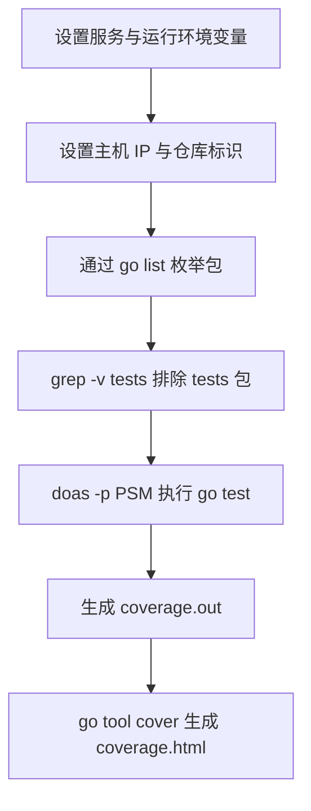

# Other — test.sh

## test.sh

`test.sh` 是仓库根目录下的本地测试入口脚本，用于在固定运行环境变量下执行 Go 单元测试，并生成覆盖率报告。它不定义 Shell 函数，也没有被代码中的其他模块调用；它更像一个开发/CI 辅助脚本，通过外部命令驱动整个测试流程。

### 执行流程



脚本按顺序完成两件事：

1. 导出测试运行所需的环境变量。
2. 执行 `go test` 并把 `coverage.out` 转换成 HTML 覆盖率报告。

核心命令如下：

```sh
doas -p ${PSM} go test -gcflags="all=-l -N" -v -cover -coverprofile coverage.out $(go list ./... | grep -v tests)
go tool cover -html=coverage.out -o coverage.html
```

### 环境变量

脚本在执行测试前显式导出多组变量，使测试进程可以按接近 BOE/UT 的方式启动。

| 变量 | 值 | 作用 |
| --- | --- | --- |
| `PSM` | `toutiao.videoarch.bktmetaapi` | 服务标识，同时传给 `doas -p ${PSM}`。 |
| `GIN_LOG_DIR` | `/Users/bytedance/go/src/code.byted.org/videoarch/bktmeta-api/output/` | Gin 日志目录。 |
| `GIN_CONF_DIR` | `$(pwd)/conf` | 配置目录，依赖脚本从仓库根目录执行。 |
| `GIN_MODE` | `release` | Gin 运行模式。 |
| `RUNTIME_IDC_NAME` | `boe` | 运行 IDC 标识。 |
| `TCE_ENV` | `ut` | 测试环境标识。 |
| `CGO_ENABLED` | `1` | 启用 CGO。 |
| `CI_REPO_NAME` | `toutiao.videoarch.bktmetaapi` | CI 仓库名。 |
| `BYTED_HOST_IP` / `MY_HOST_IP` | `10.37.27.106` | IPv4 主机地址。 |
| `BYTED_HOST_IPV6` / `MY_HOST_IPV6` | `fdbd:dc01:ff:306:58c5:890d:bb35:79a5` | IPv6 主机地址。 |

`GIN_CONF_DIR=$(pwd)/conf` 是这个脚本最重要的路径假设：如果从非仓库根目录执行，测试会读取错误的配置目录。

### 测试命令

`go test` 的参数含义如下：

- `-gcflags="all=-l -N"`：关闭内联和优化，便于调试测试过程。
- `-v`：输出详细测试日志。
- `-cover`：启用覆盖率统计。
- `-coverprofile coverage.out`：将覆盖率数据写入 `coverage.out`。
- `$(go list ./... | grep -v tests)`：枚举当前模块下所有 Go 包，并排除路径中包含 `tests` 的包。

`doas -p ${PSM}` 包裹 `go test` 执行。这里脚本只负责传入 `PSM`，具体的鉴权、环境注入或服务身份行为取决于本地 `doas` 实现。

### 覆盖率报告

测试完成后，脚本执行：

```sh
go tool cover -html=coverage.out -o coverage.html
```

这会把 `coverage.out` 转换成 `coverage.html`。开发者可以直接打开 `coverage.html` 查看每个文件和代码行的覆盖情况。

生成文件：

- `coverage.out`：Go 覆盖率原始数据。
- `coverage.html`：HTML 格式覆盖率报告。

### 与代码库的关系

这个模块不参与业务代码运行时调用链，也没有内部函数、类或导出 API。它通过 Go 工具链连接整个代码库：

- 通过 `go list ./...` 发现仓库中的 Go 包。
- 通过 `go test` 执行这些包的测试。
- 通过 `go tool cover` 生成覆盖率视图。
- 通过环境变量让测试进程读取本仓库的 `conf` 配置，并以指定服务标识运行。

### 使用注意事项

从仓库根目录执行：

```sh
sh test.sh
```

执行前需要确认：

- 本机已安装 Go。
- 本机可用 `doas` 命令。
- 当前目录下存在 `conf` 目录。
- 当前用户有权限写入 `coverage.out` 和 `coverage.html`。
- 硬编码的 IP、IPv6、日志目录适合当前测试环境。

如果只想调整测试范围，应修改 `$(go list ./... | grep -v tests)` 这一段；如果要调整运行环境，应优先修改前面的 `export` 变量，而不是在业务代码中写死测试配置。