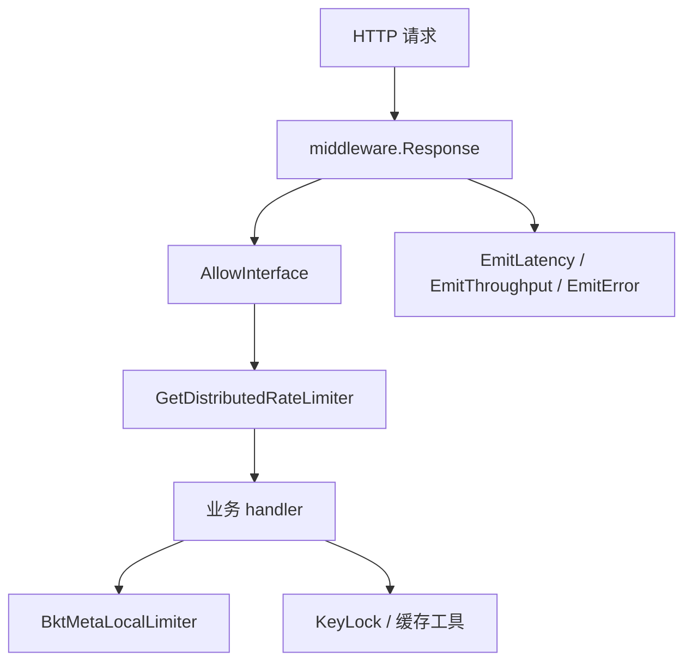

# Other — util

## 模块概览

`util` 包提供 bktmeta-api 中复用的横切工具：限流、指标上报、缓存时间抖动、加密、上下文处理、按 key 加锁、一次性初始化和 ETag 生成。它不承载具体业务模型，但被 `middleware`、`service`、`db`、`tcc`、`remote_cache` 等包广泛调用。

核心定位是：

- 在请求入口执行接口级限流和分布式限流。
- 为 handler、DB 操作和中间件统一上报吞吐、延迟、错误指标。
- 减少缓存同时过期或定时任务同时启动造成的流量尖峰。
- 支持缓存击穿保护、Redis 热启动、OpenAPI 数据加密等基础能力。



## 请求限流

### 接口级本地限流

接口级限流由 `interface_limiter.go` 实现，主要入口是：

- `InitInterfaceRateLimiterConfig(cfg config.InterfaceRateLimiterConfig) error`
- `UpdateInterfaceRateLimiterConfig(cfg config.InterfaceRateLimiterConfig) error`
- `UpdateInterfaceRateLimiter(cfg map[string]config.InterfaceRateLimit) error`
- `AllowInterface(mkey string) bool`

`config.InterfaceRateLimiterConfig` 包含：

- `Enable bool`
- `Limits map[string]InterfaceRateLimit`

`InterfaceRateLimit` 包含：

- `QPS float64`
- `Burst int`

当配置关闭时，`UpdateInterfaceRateLimiterConfig` 会调用 `UpdateInterfaceRateLimiter(nil)` 清空快照，后续所有 `AllowInterface` 默认放行。配置开启时，每个 `mkey` 会创建一个 `golang.org/x/time/rate.Limiter`。

`AllowInterface(mkey)` 的规则很简单：

- 快照不存在或类型异常：放行。
- 当前 `mkey` 没有配置限流器：放行。
- 当前 `mkey` 已配置限流器：调用 `limiter.Allow()`。

该实现使用 `atomic.Value` 保存 `interfaceLimiterSnapshot`。热更新时构造一份新的 `map[string]*rate.Limiter`，校验通过后整体替换；读取路径无锁。非法配置不会覆盖旧快照，例如 `QPS <= 0` 或 `Burst <= 0` 会返回错误并保留旧限流状态。

`middleware.Response` 在执行业务 handler 前先调用 `util.AllowInterface(mkey)`。如果返回 `false`，请求直接返回 `errno.ErrTooManyRequests`，不会继续进入业务逻辑。

### TCC 热更新

接口级限流配置由 `tcc/tcc_config.go` 接入：

- `initInterfaceRateLimiterFromConfig()` 在初始化阶段从 `config.Conf.InterfaceRateLimiter` 加载配置。
- `interfaceRateLimiterParser(value string, err error)` 解析 TCC 下发的 JSON，并调用 `util.UpdateInterfaceRateLimiterConfig(c)`。

解析使用 `json.Decoder.DisallowUnknownFields()`，因此 TCC 配置中出现未知字段会报错，避免静默接受拼写错误或结构漂移。

### 分布式限流

分布式限流由 `distributed_limiter.go` 实现：

- `DistributedRateLimiter` 接口只定义 `Allow(name string) bool`。
- `GetDistributedRateLimiter() DistributedRateLimiter` 根据 `config.Conf.RateLimiter.UseDistributedRateLimiter` 返回真实 harden 客户端或空实现。
- `nopDistributedRateLimiterT.Allow` 永远返回 `true`。

启用分布式限流时，`GetDistributedRateLimiter` 使用 `sync.Once` 初始化 `harden.Client`：

```go
harden.NewClient(
    config.Conf.Meta.PSM,
    harden.WithCluster(cluster),
    harden.UseHTTP(),
    harden.WithTimeout(100*time.Millisecond),
    harden.PassOnErr(),
)
```

如果 `HardenConfig.Cluster` 为空，默认使用 `"default"`。`harden.PassOnErr()` 表示限流服务异常时偏向放行，避免外部限流组件故障直接放大成主链路不可用。

`middleware.Response` 对限流 key 的构造区分读写：

- GET 请求：`X-Tt-From:mkey`，按调用方 PSM 和接口维度限流。
- 非 GET 请求：只使用 `mkey`，写/删操作走全局接口维度限流。

### 固定本地限流器

`limiter.go` 中定义了进程内固定限流器 `BktMetaLocalLimiter`，用于服务层热点接口保护：

- `AllBucketLimiter`：`QPS=300`，`Burst=150`
- `GetBucketLimiter`：`QPS=3000`，`Burst=3000`
- `AllBucketSimpleLimiter`：`QPS=100`，`Burst=50`

`LocalLimiter.Allow(key)` 找不到 key 时默认放行；`LocalLimiter.Wait(key, ctx)` 找不到 key 时直接返回 `nil`。

典型调用点：

- `service.MetaBucketApi.handleGetAllBucketsRequest` 使用 `AllBucketLimiter`。
- `service.MetaBucketApi.handleGetBucketRequest` 使用 `GetBucketLimiter`。
- `service.MetaBucketApi.handleGetAllBucketsSimpleRequest` 使用 `AllBucketSimpleLimiter`。

## 指标上报

`metrics.go` 封装了 gopkg metrics 客户端：

- `InitMetrics()`
- `EmitThroughput(key string, tags ...metrics.T)`
- `EmitLatency(key string, start time.Time, tags ...metrics.T)`
- `EmitError(mkey string, tags ...metrics.T)`

`InitMetrics` 使用 `config.Conf.Meta.PSM` 创建客户端，并调用 `metrics.SetTceTags()`。

三个上报函数都会按 metric key 缓存 `metrics.Metric` 对象：

- `throughputMetricMap`
- `latencyMetricMap`
- `errorMetricMap`

首次上报时根据传入 tags 提取 tag name 创建 metric，后续复用缓存对象。上报失败只写 warn 日志，不中断业务流程。

后缀约定：

- `EmitThroughput` 使用 `WithSuffix("throughput").IncrCounter(1)`。
- `EmitLatency` 使用 `WithSuffix("latency").Observe(cost)`，单位是微秒。
- `EmitError` 使用 `WithSuffix("error").IncrCounter(1)`。

`middleware.ResponseMiddleware` 和 `ResponseMiddlewareWithoutAuthCheck` 会在请求结束时统一上报接口延迟、吞吐和错误；`db` 包中的 bucket、volc、idc proxy 等操作使用 `CommandThroughput` 和 `CommandLatency` 上报 DB 命令维度指标。

## 缓存时间抖动

`cache.go` 提供两个随机时间函数：

- `RandomCacheExpireTime(cacheExpireTime time.Duration) time.Duration`
- `RandomWaitTime(cacheExpireTime time.Duration) time.Duration`

`RandomCacheExpireTime` 基于 `randFactor = 0.5` 生成 `[0.5*TTL, 1.5*TTL)` 附近的过期时间，用于避免大量缓存同一时刻过期。测试中以 `5*time.Minute` 验证结果落在 `2min` 到 `8min` 的宽松范围内。

`RandomWaitTime` 生成 `[0, TTL)` 的等待时间，常用于定时任务启动前错峰，例如：

- `tcc.InitConfig` 中刷新 TCC 配置前随机等待。
- `service.NewMetaBucketApi` 中异步刷新 all buckets 缓存前随机等待。
- `db/tosapi.go` 中后台同步逻辑随机等待。

注意：当前包级 `random *rand.Rand` 由 `rand.New(rand.NewSource(time.Now().Unix()))` 创建。`math/rand.Rand` 本身不是并发安全对象；如果未来在高并发路径频繁调用这些函数，需要评估是否改为加锁、`rand.Int63n` 全局函数，或每 goroutine 独立随机源。

## 加密与解密

`aes.go` 提供：

- `EncryptWithMetadata(key []byte, text string) (string, error)`
- `DecryptWithMetadata(key []byte, crypted string) (string, error)`

实现使用 AES-GCM。密文格式是：

```text
base64(12字节IV + GCM密文和认证标签)
```

`aesEncryptBy` 的 IV 不是随机生成，而是取 `HMAC-SHA256(key, text)` 的前 12 字节。这意味着相同 key 和相同明文会产生相同密文。解密时 `aesDecryptWithKey` 会：

1. 拆出前 12 字节作为 IV。
2. 使用 AES-GCM 解密剩余内容。
3. 重新计算 `HMAC-SHA256(key, origData)`。
4. 比较前 12 字节是否等于 IV，校验数据与 IV 的一致性。

调用方需要保证 key 长度符合 `aes.NewCipher` 要求，只能是 16、24 或 32 字节。测试中使用 32 字节字符串 key。

主要使用点是 `middleware.encryptOpenapiData`：OpenAPI 响应成功时，将 `payload.Data` JSON 序列化后调用 `util.EncryptWithMetadata([]byte(agwTenantSk), string(v))`，把加密后的字符串写回 `payload.Data`。

## 上下文取消隔离

`context.go` 提供 `WithoutCancel(ctx context.Context) context.Context`。它返回一个包装后的 context：

- `Deadline()` 永远返回无 deadline。
- `Done()` 永远返回 `nil`。
- `Err()` 永远返回 `nil`。
- `Value(key)` 透传到原始 context。

这个工具适用于需要继承 trace、日志或请求值，但不希望随请求取消而中断的后台依赖调用。当前主要用于 DB 写入时调用 ID 生成器：

- `db/bucket.go`
- `db/temp_bucket.go`
- `db/idc_proxy.go`
- `db/bucket_idc_config.go`

例如创建 bucket 时，即使外层请求 context 被取消，`IdGenCli.Get(util.WithoutCancel(ctx))` 仍不会因为请求取消信号直接终止。

## KeyLock：按 key 的轻量互斥

`key_lock.go` 定义 `KeyLock`：

- `TryLock(key interface{}) bool`
- `WaitLock(key interface{}, retry int) bool`
- `UnLock(key interface{})`

内部使用 `sync.Map.LoadOrStore` 表示某个 key 是否已被占用。`TryLock` 成功时返回 `true`，失败时返回 `false`。`WaitLock` 会最多重试 `retry` 次，每次失败后 sleep `10*time.Microsecond`。`UnLock` 通过 `Delete` 释放 key。

当前服务层使用它做缓存击穿保护，而不是全局互斥：

- `MetaBucketApi.dbKeyLock` 在初始化时赋值为 `util.KeyLock{}`。
- `handleGetAllBucketsRequest` 在本地缓存缺失时按 `cacheKey` 抢锁，只有抢到锁的请求会访问 DB 并回填缓存。
- `handleGetAllBucketsSimpleRequest` 使用固定 key `all_simple_buckets_db_single_flight` 限制简单列表缓存回源。

使用时必须保证成功 `TryLock` 后执行 `defer UnLock(key)`，否则该 key 会一直处于锁定状态。

## Once：失败可重试的一次性执行

`once.go` 中的 `Once` 类似 `sync.Once`，但语义不同：

- `Try(f func() error) error` 只有在 `f` 返回 `nil` 后才会把 `done` 标记为完成。
- 如果 `f` 返回错误，下次调用仍会再次尝试。
- 并发调用时，慢路径使用 mutex，保证其他 goroutine 不会在 `f` 尚未返回时提前认为初始化完成。

这适合“初始化成功后只执行一次，初始化失败允许后续重试”的场景。

当前 `remote_cache/remote_cache.go` 使用包级 `once util.Once` 初始化 Redis 客户端和 `RemoteCache` 实例。`GetCacheInstance` 调用 `initOnce()`，因此支持热启动：如果第一次 Redis 初始化失败，后续请求仍可再次尝试初始化。

## ETag 生成

`md5.go` 提供 `MD5ETag(resp []byte) string`。它对响应字节计算 MD5，并使用 base64 编码结果。

`service.bucketsToCacheItem` 在把 bucket 列表序列化为缓存响应体后调用 `util.MD5ETag(cachedResp)` 生成 ETag。中间件在返回缓存响应时会比较请求头 `If-None-Match` 和 `data.ETag`，匹配时返回 `304 Not Modified`。

## 测试覆盖

`util` 包的测试主要验证工具语义：

- `aes_test.go` 验证 `EncryptWithMetadata` 和 `DecryptWithMetadata` 可以往返还原 JSON。
- `cache_test.go` 验证随机 TTL 和随机等待时间落在预期范围。
- `distributed_limiter_test.go` 验证配置开关会切换 harden 限流器和 nop 限流器。
- `interface_limiter_test.go` 覆盖默认放行、关闭配置、指定 mkey 限流、热更新、非法配置保留旧快照，以及并发 `AllowInterface` 和配置更新。
- `key_lock_test.go` 验证同一个 key 的互斥行为。
- `limiter_test.go` 验证固定本地限流器的 `Allow` 和 `Wait`。
- `metrics_test.go` 验证三个指标上报函数的首次创建和缓存复用路径。
- `once_test.go` 验证 `Once.Try` 在并发情况下只在成功后停止重试。

`util/base_test.go` 的 `TestMain` 会初始化 `ginex`、配置和 metrics，确保依赖 `config.Conf` 或 metrics client 的测试有完整运行环境。