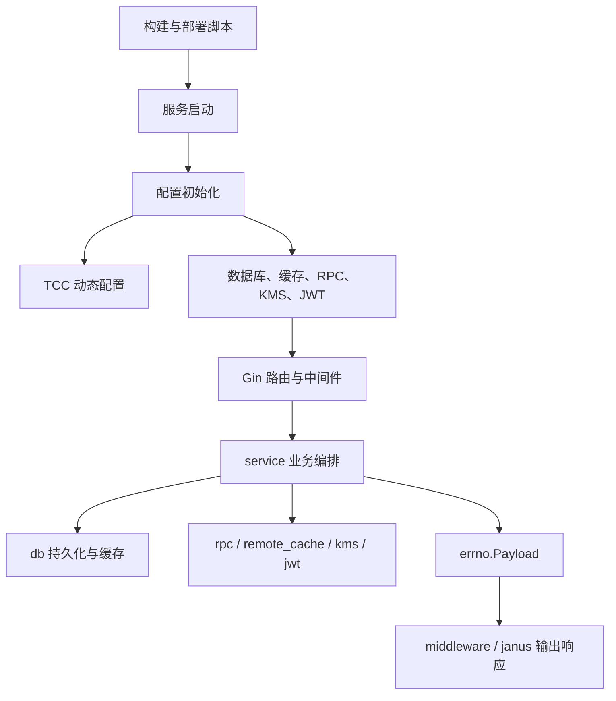

# Other

## 模块概览

`Other` 汇总了 `bktmeta-api` 的工程入口、运行配置、启动初始化、业务编排、响应封装和测试辅助模块。它不是单一业务包，而是服务从“构建产物”到“HTTP 请求处理”再到“外部系统访问”的完整支撑层。

整体上，[README.md](readme.md) 定义对外 API 形态，[service](service.md) 承接 bucket、signature、IDC 代理等业务请求，[middleware](middleware.md) 与 [errno](errno.md) 统一响应协议，[db](db.md)、[rpc](rpc.md)、[remote_cache](remote_cache.md)、[kms](kms.md)、[jwt](jwt.md) 负责落到存储、缓存、TOS、BPM、KMS 等外部依赖。

## 子模块协作

工程生命周期从 [go.mod](go.mod.md)、[build.sh](build.sh.md)、[script](script.md) 和 [test.sh](test.sh.md) 开始：`go.mod` 固定模块身份和依赖版本，`build.sh` 生成 `${PRODUCT}.${SUBSYS}.${MODULE}` 二进制和部署目录，`script/bootstrap.sh` 根据 `settings.py` 拼接运行参数并启动服务，`test.sh` 则以固定环境变量执行包级测试和覆盖率生成。

运行时配置由 [conf](conf.md)、[config](config.md) 和 [tcc](tcc.md) 共同承担。`conf/` 提供 YAML 静态配置，`config.InitConf(...)` 填充全局 `config.Conf`，`tcc.InitConfig()` 在启动后同步运行期动态配置，并影响接口限流、远程缓存、AGW 租户缓存和 [mem_limit](mem_limit.md) 的软内存限制。

业务请求进入 Gin 路由后，通常由 [middleware](middleware.md) 的 `Response` 执行 handler，并把 `mkey` 与 `errno.Payload` 写入上下文。普通路由由 `ResponseMiddleware` 输出 JSON、ETag、日志、指标和 Trace；`/gateway/v1` 路由额外通过 [janus](janus.md) 转换为 `JanusPayload`，适配 Janus 网关格式。

[service](service.md) 是核心编排层。`MetaBucketApi` 和 `IdcProxySettingApi` 负责参数绑定、校验和业务流程组织，再调用 [db](db.md) 的 `DbHandler`、`TosRegionBucketsApi`、`AllTosMetaCache` 读写 MySQL、ByteDoc/Mongo 和 TOS 元数据；需要外部操作时则通过 [rpc](rpc.md) 的 `TosV3Cli`、`BpmCli`，以及 [remote_cache](remote_cache.md)、[kms](kms.md)、[jwt](jwt.md) 等模块完成远程缓存、加解密和 BPM 鉴权。

[util](util.md) 提供跨层能力，包括接口限流、分布式限流、指标上报、缓存时间抖动、按 key 加锁、ETag 和 OpenAPI 加密辅助。它被 `middleware`、`service`、`db`、`tcc`、`remote_cache` 等模块复用，是这些横切能力的公共基础。

## 关键跨模块流程

服务启动流程大致为：`bootstrap.sh` 启动二进制后，主进程初始化 `ginex`、加载 `config.Conf`，再依次初始化指标、KMS、JWT、RPC、DB、ByteDoc、TCC、远程缓存和内存限制。这个顺序保证 `rpc.InitRpc()`、`kms.Init()`、`remote_cache.Init()`、`mem_limit.InitMemLimiter()` 都能读取到稳定的静态配置和动态配置。

请求处理流程大致为：HTTP API 进入路由后由 `middleware.Response` 执行业务 handler；`MetaBucketApi` 或 `IdcProxySettingApi` 协调 `DbHandler`、`TosV3Cli`、`BpmCli`、缓存和 KMS；业务结果统一包装为 `errno.Payload`；最后由普通响应中间件或 Janus 中间件输出给调用方。

测试体系则通过各包 `TestMain` 复用近似启动链路，例如 [config](config.md)、[db](db.md)、[kms](kms.md)、[remote_cache](remote_cache.md)、[rpc](rpc.md)、[tcc](tcc.md) 会先初始化配置和依赖，再执行包内测试。[main_test.go](main_test.go.md) 提供启动冒烟测试，用于发现启动阶段的即时崩溃。