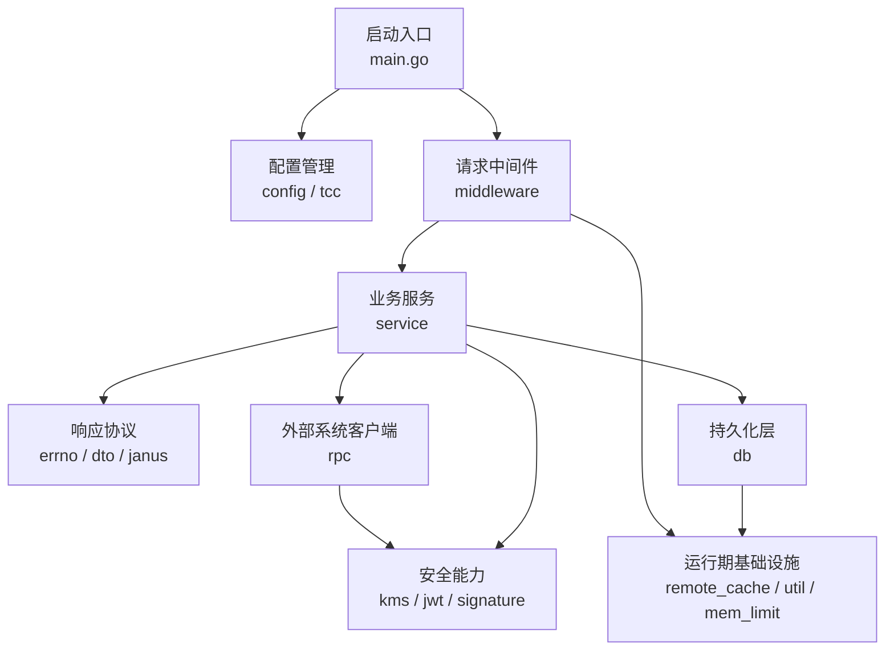

# bktmeta-api — Wiki

# bktmeta-api

`bktmeta-api` 是 Bucket 元数据管理服务，提供创建、查询、更新、删除 Bucket，以及获取签名、管理 IDC 代理配置、对接 BPM 工单和 TOS 平台的 HTTP API。项目模块名为 `code.byted.org/videoarch/bktmeta-api`，基于 Go 1.21 构建。

新开发者可以先把它理解为一个“Bucket 元数据控制面”：HTTP 请求进入 Gin 路由后，由中间件完成鉴权、限流、响应封装和观测；业务层编排 Bucket、IDC、BPM、TOS、Volcengine 等场景；数据最终落到 MySQL、ByteDoc/Mongo、远端缓存和外部平台。

## 主要能力

服务对外暴露的核心接口围绕 Bucket 生命周期展开：

- `POST /v1/buckets`：创建 Bucket
- `GET /v1/buckets`：查询 Bucket 列表
- `GET /v1/buckets/{name}`：查询单个 Bucket
- `PATCH /v1/buckets/{name}`：更新 Bucket
- `DELETE /v1/buckets/{name}`：删除 Bucket
- `GET /v1/signatures/{bucketname}`：获取 Bucket 访问签名

这些接口的主要实现集中在 [Bucket Service](bucket-service.md)。它以 `MetaBucketApi` 为核心，负责解析请求、执行业务校验、读写缓存和数据库，并在需要时调用 TOS、BPM、KMS 等外部能力。和审批、IDC、VSRE 相关的变更链路则主要在 [Workflow and IDC Services](workflow-and-idc-services.md) 中完成。

## 请求如何流动

一次典型的 Bucket 请求从 [Application Bootstrap](application-bootstrap.md) 开始。`main.go` 初始化配置、KMS、RPC、数据库、JWT、缓存和业务 API 实例，然后绑定 Gin 路由并启动服务。

请求进入后，[Middleware](middleware.md) 负责统一入口处理，包括鉴权、限流、Trace、指标、OpenAPI 响应加密和标准 JSON 写出。业务 handler 通常不直接写 HTTP 响应，而是返回 [API DTOs and Responses](api-dtos-and-responses.md) 中约定的 `errno.Payload`，再由中间件统一包装。

业务层执行时会根据场景访问 [Bucket Persistence](bucket-persistence.md) 或 [IDC and Volcengine Persistence](idc-and-volcengine-persistence.md)。底层数据库连接、ByteDoc/Mongo 初始化、ID 生成器和事务辅助由 [Database Layer](database-layer.md) 提供。远端缓存、限流、指标、按 key 互斥和一次性初始化等通用能力在 [Runtime Infrastructure](runtime-infrastructure.md) 中维护。

## 关键端到端流程

创建 Bucket 时，请求先进入 `MetaBucketApi` 的创建 handler。服务会校验参数、检查已有元数据、生成访问密钥和加密配置，必要时调用 TOS 平台创建真实 Bucket，然后把主 Bucket 信息和 IDC 配置写入数据库。这个过程中会用到 [Authentication and Security](authentication-and-security.md) 中的 KMS、AK/SK 生成和签名能力，也会通过 [RPC Clients](rpc-clients.md) 访问 TOS 或 BPM。

更新 Bucket 时，业务入口通常会进入 `updateBucket` 或相关 Janus handler。更新链路会读取当前 Bucket、合并变更、刷新数据库，并通过 `remote_cache.GetCacheInstance()` 触发远端缓存访问。缓存实例使用 `util.Once.Try` 做延迟初始化，避免每个请求重复初始化 Redis-backed cache。

IDC、代理和审批类流程由 `bpm_handler.go`、`idc_proxy_handler.go`、`vsre.go` 协同完成。它们把外部工单或 Janus 管理请求转换为实际元数据变更，并在数据库、TOS、BPM、事件中心之间保持状态一致。

## 配置与启动

项目使用本地 YAML 配置叠加 TCC 动态配置。启动时会先调用 [Configuration Management](configuration-management.md) 中的 `config.InitConf(path)`，加载 `config.Conf`，再初始化 TCC 客户端和运行时动态配置。

本地开发时请先确认：

1. 使用 Go 1.21。
2. 配置文件路径可被 `config.InitConf(path)` 读取。
3. MySQL、ByteDoc/Mongo、TCC、KMS、TOS、BPM 等依赖在当前环境可用，或已切换到测试 / fake 配置。
4. 启动入口为 `main.go`，服务最终通过 Gin `r.Run()` 对外提供 HTTP API。

如果只想理解业务主线，建议按这个顺序阅读：[Application Bootstrap](application-bootstrap.md) → [Middleware](middleware.md) → [Bucket Service](bucket-service.md) → [Bucket Persistence](bucket-persistence.md) → [RPC Clients](rpc-clients.md)。这条路径覆盖了从 HTTP 请求进入服务，到业务编排、缓存访问、数据库落库和外部系统调用的主流程。