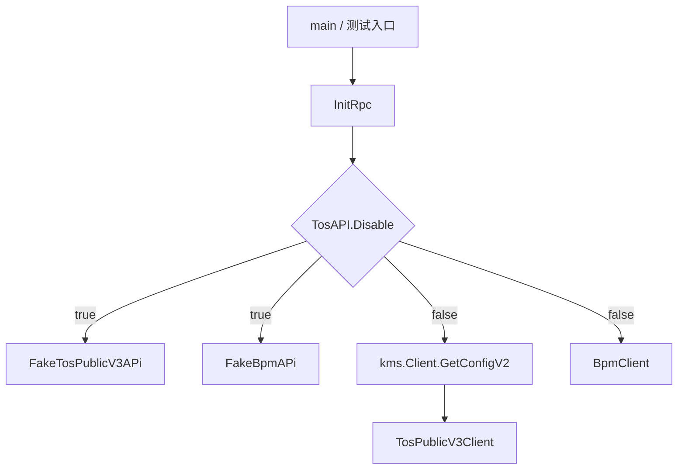

# RPC Clients

## 模块概览

`rpc` 包封装了项目访问外部 TOS 平台和 BPM 工作流系统的 HTTP 客户端。模块对外暴露两个全局接口实例：

- `TosV3Cli TosPublicV3Api`：访问 TOS Public V3 API。
- `BpmCli BpmApi`：访问 BPM 工作流 API。

业务层不直接构造 HTTP 请求，而是依赖这两个接口完成 bucket 查询、创建、追加管理员，以及 BPM 流程创建和取消。`main.go` 和测试入口会调用 `InitRpc()` 初始化这些客户端。



## 初始化流程

`InitRpc()` 是模块的统一初始化入口。

当 `config.Conf.TosAPI.Disable` 为 `true` 时，模块不会访问真实外部服务，而是把全局客户端设置为：

- `TosV3Cli = &FakeTosPublicV3APi{}`
- `BpmCli = &FakeBpmAPi{}`

这些 fake client 的所有方法都会返回 `MethodNotSupported`，用于不支持当前 region 或禁用外部 API 的场景。

当 `config.Conf.TosAPI.Disable` 为 `false` 时，`InitRpc()` 会先通过 `kms.Client.GetConfigV2(config.Conf.TosAPI.IamSecret)` 获取 IAM secret。获取失败时会记录错误并 `panic`，因为真实 TOS 客户端无法在缺少鉴权信息的情况下工作。

成功获取 secret 后，`InitRpc()` 构造：

- `TosPublicV3Client`：使用 `JwtHost`、`IamSecret`、`PSM`、`Cluster`、`PlatformHost` 等配置。
- `BpmClient`：使用 `config.Conf.ModifyTOSBucketBpmConfig.BpmApiUrl`。

## TOS Public V3 客户端

`TosPublicV3Api` 定义了业务层可使用的 TOS 操作：

```go
type TosPublicV3Api interface {
    QueryBucket(ctx context.Context, name string) (*PublicBucket, error)
    GetAllBuckets(ctx context.Context) ([]*AdminBucketV1, error)
    GetAllBucketsWithCache(ctx context.Context) ([]*AdminBucketV1, error)
    CreateBucket(ctx context.Context, createRequest *CreateBucketRequest) (*CreateBucketResponse, error)
    AppendBucketManager(ctx context.Context, appendRequest *AppendBucketManagerRequest) error
}
```

真实实现是 `TosPublicV3Client`。它负责组装 HTTP 请求、添加通用请求头、获取 JWT token，并解析统一响应结构 `PublicBucketResponse`。

### 查询 bucket

`QueryBucket(ctx, name)` 请求：

```text
GET http://{TosPlatPSM}/public/v3/query/bucket?name={name}
```

响应中的 `data` 会被反序列化为 `PublicBucket`。业务层测试和服务逻辑中会使用 `PublicBucket` 表示单个 bucket 的完整元信息，包括 `BucketID`、`BucketName`、`Creator`、`TTL`、`Qos`、`Properties`、`SecurityLevel`、`PSM` 等字段。

### 获取全量 bucket

`GetAllBuckets(ctx)` 请求：

```text
GET http://{TosPlatPSM}/public/v3/buckets/all
```

响应先解析到 `AllBucketsData`，再返回其中的 `Buckets []*AdminBucketV1`。

`GetAllBucketsWithCache(ctx)` 请求：

```text
GET http://{TosPlatPSM}/public/v3/bucketmeta
```

代码注释说明该接口使用 TOS Today+1 缓存的全量 bucket 数据，返回数据中的 `TTL` 字段不为空。它直接把响应 `data` 解析为 `[]*AdminBucketV1`。

`AdminBucketV1` 是项目中更常用的 bucket 列表结构，包含 `ID`、`Name`、`Region`、`Creator`、`ServiceNode`、`BackendID`、`Public`、`TTL`、`S3Info`、`VRegion` 等字段。`db` 包的本地 region bucket 同步测试会直接依赖这个结构。

### 创建 bucket

`CreateBucket(ctx, createRequest)` 请求：

```text
POST http://{TosPlatPSM}/public/v3/bucketbu
```

请求体来自 `CreateBucketRequest`。发送前会做两个本地补全：

- 如果 `createRequest.Qos == nil`，会填充默认 `Qos`：
  - `GetQps: 2000`
  - `PutQps: 2000`
  - `HeadQps: 2000`
  - `DeleteQps: 1000`
  - `PutRate: 3000`
  - `GetRate: 3000`
- 如果 `createRequest.Public == "everyone"`，会强制设置 `createRequest.SecurityLevel = "L1"`，因为公开 bucket 必须是 L1 安全级别。

成功响应会解析为 `CreateBucketResponse`，包含 `BucketID`、`AccessKey`、`SecretKey`、`SysMsg`、`SysTicketID`。

### 追加 bucket 管理员

`AppendBucketManager(ctx, appendRequest)` 请求：

```text
PUT http://{TosPlatPSM}/public/v3/bucket/bucketmanager
```

请求体是 `AppendBucketManagerRequest`：

```go
type AppendBucketManagerRequest struct {
    ServiceAccounts []string
    UserAccounts    []UserAccount
    BucketId        int32
    LoginUserEmail  string
}
```

该方法只关心操作是否成功，调用 `doReq(ctx, req, nil)`，不解析响应 `data`。

## TOS 请求执行与响应解析

所有 `TosPublicV3Client` 的公开方法最终都会调用 `doReq(ctx, req, objPtr)`。

执行流程如下：

1. 设置 `X-TT-FROM: toutiao.videoarch.bktmetaapi`。
2. 从 `ctx.Value("K_LOGID")` 读取 log id；如果不存在或为空，则使用 `logid.GenLogID()` 生成。
3. 设置 `X-TT-LOGID`。
4. 调用 `getJwtToken()` 请求 JWT 服务。
5. 设置 `x-jwt-token`。
6. 使用 `chttp.DefaultClient.Do(req, chttp.WithCluster(cli.TosPlatCluster))` 发送请求。
7. 调用 `handleRes(resp.Body, objPtr)` 解析统一响应。

`getJwtToken()` 会请求：

```text
GET {JwtHost}/auth/api/v1/jwt
Authorization: Bearer {IamSecret}
```

JWT token 从响应头 `X-Jwt-Token` 中读取。响应 body 会被读取并丢弃，当前实现不从 body 解析 token。

`handleRes()` 解析的统一响应结构是：

```go
type PublicBucketResponse struct {
    Status int             `json:"status"`
    Msg    string          `json:"msg"`
    Data   json.RawMessage `json:"data"`
}
```

错误处理规则：

- `Status == statusOK`，认为成功。
- `Status == statusNotFound`，返回 `errors.New("not found")`。
- 其他非 0 状态返回 `fmt.Errorf("res status:%d, msg:%s", res.Status, res.Msg)`。
- `objPtr != nil` 时，把 `Data` 反序列化到目标结构。

## BPM 客户端

`BpmApi` 定义了工作流相关能力：

```go
type BpmApi interface {
    CreateWorkflow(ctx context.Context, workflowConfigID string, config interface{}) (*CreateWorkflowResponse, error)
    CancelWorkflow(ctx context.Context, workflowID string) error
}
```

真实实现是 `BpmClient`，通过 `BpmApiUrl` 访问 BPM HTTP API。

### 创建工作流

`CreateWorkflow(ctx, workflowConfigID, config)` 请求：

```text
POST {BpmApiUrl}/inf/v1/workflow/record
```

请求体格式：

```json
{
  "workflow_config_id": "...",
  "config": {}
}
```

成功响应中的 `data` 会解析为 `CreateWorkflowResponse`。该结构包含 BPM record 的主要字段，例如 `Id`、`Creator`、`Assignee`、`Status`、`WorkflowConfig`、`WorkflowKey`、`WorkflowName`、`CurrentAssignees`、`Ctime`、`Utime`、`Finished` 等。

### 取消工作流

`CancelWorkflow(ctx, workflowID)` 请求：

```text
POST {BpmApiUrl}/inf/v1/workflow/record/{workflowID}/cancel
```

该方法不解析响应 `data`，只返回请求和响应状态错误。

## BPM 请求执行与响应解析

`BpmClient.doReq(ctx, req, objPtr)` 与 TOS 客户端类似，但有几个差异：

- 使用 `http.DefaultClient.Do(req)`，不是 consul HTTP client。
- JWT token 通过 `jwt.BpmGen.Generate(ctx, config.Conf.ModifyTOSBucketBpmConfig.SecretKey)` 生成，不需要额外 HTTP 请求 token 服务。
- 请求头使用 `X-JWT-Token`。
- 明确设置 `Content-Type: application/json`。

BPM 统一响应结构是：

```go
type PublicBpmResponse struct {
    Code    int             `json:"code"`
    Message string          `json:"message"`
    Data    json.RawMessage `json:"data"`
}
```

`handleRes()` 的错误处理规则与 TOS 类似：

- `Code == statusOK` 表示成功。
- `Code == statusNotFound` 返回 `errors.New("not found")`。
- 其他非 0 code 返回 `fmt.Errorf("res code:%d, message:%s", res.Code, res.Message)`。
- `objPtr != nil` 时，把 `Data` 反序列化到目标结构。

## Fake 客户端

`fake_client.go` 提供两个禁用态实现：

- `FakeTosPublicV3APi`
- `FakeBpmAPi`

它们实现真实接口的全部方法，但每个方法都返回同一个错误：

```go
var MethodNotSupported = errors.New("method not supported in this region")
```

这让业务层可以继续依赖 `TosV3Cli` 和 `BpmCli` 接口，而不需要在每个调用点判断当前 region 是否支持外部 TOS/BPM 能力。是否启用真实客户端由 `InitRpc()` 统一控制。

## 与代码库其他模块的关系

`main.go` 通过 `InitRpc()` 建立全局 RPC 客户端。服务层和数据库同步逻辑通过接口类型使用这些客户端和数据结构：

- `service/bpm_handler.go` 使用 `AppendBucketManagerRequest` 处理追加 TOS bucket 管理员的 BPM 请求。
- `service/vsre.go` 使用 `CreateBucketRequest` 创建或更新 TOS bucket。
- 多个 `service` 测试使用 `PublicBucket`、`AdminBucketV1` 模拟 TOS 返回数据。
- `db` 包的本地 bucket 同步测试使用 `AdminBucketV1` 作为远端 TOS bucket 元数据输入。
- `rpc` 包测试覆盖 fake client、`InitRpc()`、`CreateBucket()`、`AppendBucketManager()` 等行为。

## 贡献注意事项

新增 RPC 方法时，应优先扩展对应接口：TOS 能力放入 `TosPublicV3Api`，BPM 能力放入 `BpmApi`。同时需要更新真实 client 和 fake client，避免禁用外部 API 的环境出现编译或运行时不一致。

请求方法应复用现有的 `doReq()` 和 `handleRes()` 模式，以保持 log id、鉴权头、错误格式和响应解析行为一致。只有当目标服务的响应格式不同，才应新增独立的响应结构和解析逻辑。

修改 `CreateBucketRequest`、`AdminBucketV1`、`PublicBucket` 等 IDL 结构时，需要确认服务层和数据库同步逻辑是否依赖对应字段。当前这些结构不仅用于 RPC 响应解析，也被测试和业务逻辑直接构造使用。