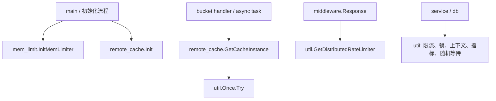
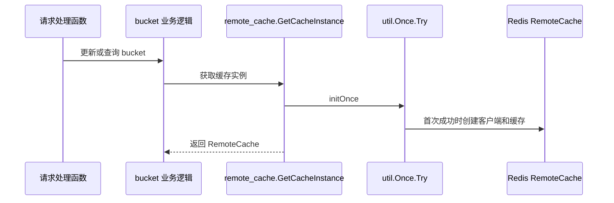

# Runtime Infrastructure

## 模块定位

Runtime Infrastructure 模块提供服务运行期的基础能力：内存软限制、远端缓存初始化、本地与分布式限流、接口级热更新限流、指标上报、上下文派生、按 key 互斥，以及带错误重试语义的一次性初始化工具。

这些能力主要分布在三个包中：

- `mem_limit`：根据 TCC 配置动态设置 Go runtime 内存软限制。
- `remote_cache`：延迟初始化 Redis-backed `RemoteCache`，供 bucket 读写链路使用。
- `util`：承载限流、指标、随机 TTL、上下文、锁和 `Once` 等通用运行期工具。

## 整体关系



模块的设计重点是：启动期尽早建立关键保护能力，业务路径中尽量使用惰性初始化和无锁读快照，避免基础设施不可用时把流量直接压到下游数据库或服务。

## 内存软限制：`mem_limit`

`mem_limit` 包通过 `runtime/debug.SetMemoryLimit` 控制 Go runtime 的软内存上限。入口函数是 `InitMemLimiter()`。

### 初始化流程

`InitMemLimiter()` 会：

1. 创建全局 `*memLimiter`。
2. 立即调用 `l.update()` 读取 TCC 配置并设置内存限制。
3. 启动后台 goroutine，每分钟再次调用 `l.update()`，支持配置热更新。

`update()` 从 `tcc.GetMemLimitPercent(context.Background())` 获取百分比字符串。配置为空时只记录 warn 日志，不修改当前限制；配置非空时调用 `doUpdate(value)`。

### 限制计算

`doUpdate(value string)` 依赖两个输入：

- 环境变量 `MY_MEM_LIMIT`：Pod 内存上限，按十进制 `int64` 解析。
- TCC 配置值 `value`：内存百分比，按十进制 `int64` 解析。

规则如下：

- `MY_MEM_LIMIT < 0`：返回错误。
- `percent > 100`：返回错误。
- `percent < 0`：调用 `debug.SetMemoryLimit(math.MaxInt64)`，相当于恢复接近默认的不限制状态。
- `0 <= percent <= 100`：通过 `getMemBytes(total, percent)` 计算字节数，并调用 `debug.SetMemoryLimit(limitBytes)`。

```go
limitBytes := getMemBytes(podMem, percent)
debug.SetMemoryLimit(limitBytes)
```

`getMemBytes(total, percent)` 的计算方式是整数乘除：

```go
return total * percent / 100
```

因此 `MY_MEM_LIMIT` 必须使用字节单位，否则实际限制会偏离预期。

### 错误处理语义

`InitMemLimiter()` 的首次 `update()` 如果失败，会记录错误并返回，不启动后续更新 goroutine。

但 `update()` 内部调用 `doUpdate()` 失败时会记录 warn 并返回 `nil`。也就是说，解析错误不会向外传播到 `InitMemLimiter()` 的错误判断。这会让初始化流程继续启动后台更新，只是当前配置没有生效。

贡献时需要注意这个语义：如果希望配置错误阻断启动，必须调整 `update()` 对 `doUpdate()` 错误的返回方式。

## 远端缓存：`remote_cache`

`remote_cache` 包封装 Redis 客户端和 `code.byted.org/videoarch/go-remote-cache` 的初始化。核心入口有两个：

- `Init() error`
- `GetCacheInstance() (c.RemoteCache, error)`

### 初始化策略

`Init()` 用于服务启动期：

```go
func Init() error {
    if tcc.GetRemoteCacheConfig().Enable {
        return initOnce()
    }
    return nil
}
```

当 TCC 中远端缓存开启时，启动阶段必须完成初始化。代码注释明确说明：如果启动时连不上 Redis，认为是非预期状态，需要返回错误给上层，避免过大流量穿透到 DB。

`GetCacheInstance()` 用于业务运行期：

```go
func GetCacheInstance() (c.RemoteCache, error) {
    if err := initOnce(); err != nil {
        return nil, err
    }
    return cache, nil
}
```

它支持热启动：即使启动时没有调用 `Init()`，业务路径首次获取缓存时也会触发 `initOnce()`。

### `initOnce()` 的执行内容

`initOnce()` 使用 `util.Once.Try` 保证成功初始化只执行一次：

1. 构造 `goredis.NewOption()`。
2. 从 `config.Conf.RedisConfig` 填充 `ReadTimeout`、`WriteTimeout`、`DialTimeout`。
3. 判断 `config.IsCodebaseCIEnvironment()`：
   - CI 环境使用固定 Redis 地址 `redis://10.37.83.202:6380`。
   - 设置固定密码并关闭 GDPR 校验。
   - 非 CI 环境使用 `config.Conf.RedisConfig.Cluster`。
4. 调用 `goredis.NewClientWithOption(cluster, option)` 创建 Redis 客户端。
5. 用 `c.NewCacheBackend(cli)` 构造 remote-cache backend。
6. 使用 `c.WithDefaultTTL(tcc.GetRemoteCacheConfig().TTL)` 设置默认 TTL。
7. 成功后赋值到包级变量 `cache`。

### 与业务链路的关系

`GetCacheInstance()` 被 bucket 相关路径频繁调用，包括：

- `createBucket`
- `deleteBucket`
- `overwriteBucket`
- `updateBucket`
- `syncBucketNamesWithDB`
- `asyncUpdateAllBktCache`

典型调用链：



如果初始化失败，`util.Once.Try` 不会把 `done` 标记为完成，后续调用仍会重试初始化。

## 一次性初始化：`util.Once`

`util.Once` 是对 `sync.Once` 思路的变体，区别是初始化函数 `f func() error` 可以返回错误。

核心方法：

```go
func (o *Once) Try(f func() error) error
```

语义：

- 第一次成功执行 `f()` 后，`done` 被设置为 `1`。
- 如果 `f()` 返回错误，`done` 不会被设置，下一次 `Try()` 会再次尝试。
- 并发调用时使用 `sync.Mutex` 保证只有一个 goroutine 执行 `f()`。
- 等待中的 goroutine 会等到当前 `f()` 返回后再判断结果，不会在初始化未完成时提前返回成功。

`remote_cache.initOnce()` 依赖这个语义实现“失败可重试，成功只初始化一次”。

## 本地限流：`util.LocalLimiter`

`util/limiter.go` 定义了固定的本地限流器集合，初始化发生在包级 `init()` 中。

全局变量：

```go
var BktMetaLocalLimiter *LocalLimiter
```

内置 key 和默认参数：

- `AllBucketLimiter`：`300 QPS`，`150 burst`
- `GetBucketLimiter`：`3000 QPS`，`3000 burst`
- `AllBucketSimpleLimiter`：`100 QPS`，`50 burst`

`LocalLimiter` 提供两个方法：

```go
func (ht *LocalLimiter) Allow(key string) bool
func (ht *LocalLimiter) Wait(key string, ctx context.Context) error
```

行为规则：

- key 不存在时放行。
- `Allow()` 立即返回是否允许。
- `Wait()` 会阻塞直到获得令牌或 `ctx` 结束。

适合用于进程内保护热点接口或昂贵操作。它不跨实例共享状态。

## 接口级热更新限流：`util/interface_limiter.go`

接口级限流使用 `atomic.Value` 保存不可变快照：

```go
type interfaceLimiterSnapshot struct {
    limiters map[string]*rate.Limiter
}
```

初始化时存入空 map，因此默认所有接口放行。

### 配置入口

提供三层入口：

```go
func InitInterfaceRateLimiter(cfg map[string]config.InterfaceRateLimit) error
func InitInterfaceRateLimiterConfig(cfg config.InterfaceRateLimiterConfig) error
func UpdateInterfaceRateLimiterConfig(cfg config.InterfaceRateLimiterConfig) error
```

最终都会进入：

```go
func UpdateInterfaceRateLimiter(cfg map[string]config.InterfaceRateLimit) error
```

当 `config.InterfaceRateLimiterConfig.Enable == false` 时，会调用 `UpdateInterfaceRateLimiter(nil)`，把限流器集合更新为空，达到关闭限流的效果。

### 更新语义

`UpdateInterfaceRateLimiter()` 每次构造新的 `map[string]*rate.Limiter`，校验通过后整体替换快照：

```go
interfaceLimiter.Store(&interfaceLimiterSnapshot{limiters: limiters})
```

校验规则：

- `limit.QPS <= 0` 返回错误。
- `limit.Burst <= 0` 返回错误。

这种设计让读路径 `AllowInterface(mkey)` 不需要加锁：

```go
snapshot, ok := interfaceLimiter.Load().(*interfaceLimiterSnapshot)
limiter := snapshot.limiters[mkey]
return limiter.Allow()
```

未配置的 `mkey` 默认放行。

贡献时需要注意：每次更新都会创建新的 `rate.Limiter`，旧 limiter 的令牌状态不会保留。

## 分布式限流：`util.GetDistributedRateLimiter`

`util/distributed_limiter.go` 定义统一接口：

```go
type DistributedRateLimiter interface {
    Allow(name string) bool
}
```

`GetDistributedRateLimiter()` 根据配置返回两类实现：

- `config.Conf.RateLimiter.UseDistributedRateLimiter == false`：返回 `nopDistributedRateLimiter`，`Allow()` 永远为 `true`。
- 配置开启：懒加载 `harden.Client`，并返回该客户端。

Harden 客户端初始化参数：

```go
harden.NewClient(
    config.Conf.Meta.PSM,
    harden.WithCluster(cluster),
    harden.UseHTTP(),
    harden.WithTimeout(100*time.Millisecond),
    harden.PassOnErr(),
)
```

如果 `config.Conf.RateLimiter.HardenConfig.Cluster` 为空，默认使用 `"default"`。

`harden.PassOnErr()` 表示限流服务异常时倾向放行，避免基础设施故障直接阻断主业务请求。当前调用方包括 `middleware.Response`。

## 指标上报：`util/metrics.go`

`InitMetrics()` 创建全局 metrics client：

```go
client = m.NewClient(config.Conf.Meta.PSM, m.SetTceTags())
```

模块提供三类上报函数：

```go
func EmitThroughput(key string, tags ...m.T)
func EmitLatency(key string, start time.Time, tags ...m.T)
func EmitError(mkey string, tags ...m.T)
```

### Metric 缓存

每类指标分别使用 `sync.Map` 缓存 `m.Metric`：

- `throughputMetricMap`
- `latencyMetricMap`
- `errorMetricMap`

首次遇到某个 key 时，会从传入 tags 中提取 tag name，并调用 `client.NewMetric(key, tagNames...)`。后续相同 key 复用 metric 对象。

### 上报内容

`EmitThroughput()`：

```go
m.WithSuffix("throughput").IncrCounter(1)
```

`EmitLatency()`：

```go
cost := time.Since(start).Nanoseconds() / 1000
m.WithSuffix("latency").Observe(int(cost))
```

延迟单位是微秒。

`EmitError()`：

```go
m.WithSuffix("error").IncrCounter(1)
```

上报失败只记录 warn 日志，不影响业务流程。

## 随机 TTL 与等待时间：`util/cache.go`

`util/cache.go` 提供两个随机时间工具，主要用于缓存过期时间抖动和延迟执行：

```go
func RandomCacheExpireTime(cacheExpireTime time.Duration) time.Duration
func RandomWaitTime(cacheExpireTime time.Duration) time.Duration
```

`RandomCacheExpireTime()` 使用包级 `randFactor = 0.5`，返回范围约为：

```text
ttl * 0.5 ~ ttl * 1.5
```

它用于避免大量缓存 key 在同一时刻集中失效。

`RandomWaitTime()` 返回范围为：

```text
0 ~ ttl
```

调用方包括 `NewMetaBucketApi`、`getBucket`、`InitConfig`、`InitTosMetaCache` 等，用于在初始化或刷新路径中引入随机等待。

当前实现使用包级 `*rand.Rand`。如果未来在高并发路径中频繁调用，需要注意 `math/rand.Rand` 本身不是并发安全类型。

## 上下文派生：`util.WithoutCancel`

`WithoutCancel(ctx context.Context)` 返回一个不会被取消的 context：

```go
func WithoutCancel(ctx context.Context) context.Context {
    return noCancel{ctx: ctx}
}
```

`noCancel` 的行为：

- `Deadline()` 返回空时间和 `false`。
- `Done()` 返回 `nil`。
- `Err()` 返回 `nil`。
- `Value(key)` 继续透传原始 `ctx.Value(key)`。

这适合用于请求结束后仍需要继承 trace、日志字段或业务值的异步 DB 操作。当前调用方包括：

- `CreateBucket`
- `UpdateBucket`
- `CreateIdc`
- `CreateTempBucket`

使用时要明确：它会切断取消和超时信号。如果下游操作需要独立超时，应在 `WithoutCancel(ctx)` 外再包一层新的 timeout context。

## 按 key 互斥：`util.KeyLock`

`KeyLock` 使用 `sync.Map` 实现轻量的 key 级互斥：

```go
type KeyLock struct {
    m sync.Map
}
```

方法：

```go
func (k *KeyLock) TryLock(key interface{}) bool
func (k *KeyLock) WaitLock(key interface{}, retry int) bool
func (k *KeyLock) UnLock(key interface{})
```

`TryLock()` 通过 `LoadOrStore` 抢占 key，返回是否成功。

`WaitLock()` 会最多重试 `retry` 次，每次失败后 sleep `10 * time.Microsecond`。

`UnLock()` 删除 key。

典型用法：

```go
if !lock.TryLock(bucketName) {
    return
}
defer lock.UnLock(bucketName)

// 这里执行同一个 bucket 只允许一个 goroutine 进入的逻辑
```

该锁没有 owner 校验，也没有自动过期机制。贡献时必须保证所有成功加锁路径都有对应 `defer UnLock()`，否则 key 会永久阻塞后续操作。

## 运行期依赖关系

这个模块依赖多个外部配置和基础设施：

- `config.Conf.Meta.PSM`：用于 metrics client 和 Harden client。
- `config.Conf.RedisConfig`：用于 Redis cluster、超时配置。
- `config.Conf.RateLimiter`：控制是否启用分布式限流以及 Harden cluster。
- `tcc.GetRemoteCacheConfig()`：控制远端缓存开关和默认 TTL。
- `tcc.GetMemLimitPercent()`：控制 Go runtime 内存软限制百分比。
- 环境变量 `MY_MEM_LIMIT`：提供 Pod 内存上限。

启动顺序上，配置和 TCC 应在这些 runtime 能力之前完成初始化。否则 `InitMemLimiter()`、`remote_cache.Init()`、`InitMetrics()` 都可能读到空配置或默认值。

## 贡献注意事项

修改 `remote_cache` 时，需要保留 `util.Once.Try` 的失败可重试语义。Redis 初始化失败不能把 `once` 标记为完成，否则后续业务路径无法恢复。

修改接口限流时，应继续保持“构造新快照后原子替换”的模式，避免读路径加锁。不要原地修改当前 snapshot 的 map。

修改 `mem_limit` 时，要确认错误是否应该阻断初始化。当前 `doUpdate()` 的错误在 `update()` 内被吞掉，只记录日志。

使用 `WithoutCancel()` 时，不要把它当作通用 context 复制工具。它只适合明确需要忽略上游取消的后台任务。

使用 `KeyLock` 时，必须保证解锁路径完整；它不是可重入锁，也没有超时回收。