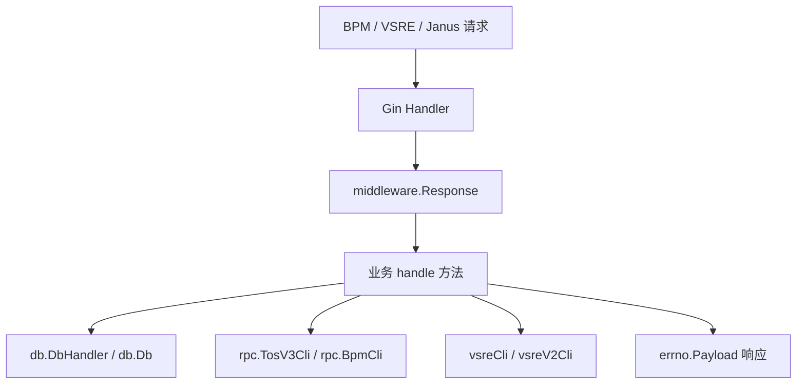

# Workflow and IDC Services

## 模块概览

`Workflow and IDC Services` 模块位于 `service` 包，主要由以下文件组成：

- `service/bpm_handler.go`：处理 BPM 工单侧的 TOS Bucket 创建、注册、查询、变更、取消和回调。
- `service/idc_proxy_handler.go`：管理 IDC 与代理配置，提供 Janus 接口和本地缓存。
- `service/vsre.go`：处理 VSRE / VSRE V2 变更工单，将审批结果落到 Bucket、IDC Proxy、Volc IAM 等实际变更上。

该模块处在 HTTP API、审批系统、TOS 平台、数据库和事件中心之间，核心职责是把“变更请求”转换为可执行的元数据操作：

- 对外通过 `gin.Context` 接收请求。
- 通过 `middleware.Response` 统一包装响应。
- 使用 `errno.Payload` 表达业务结果。
- 通过 `db.DbHandler` / `db.Db` 读写 Bucket、临时 Bucket、IDC Proxy 配置。
- 通过 `rpc.TosV3Cli`、`rpc.BpmCli` 调用 TOS 和 BPM 外部系统。
- 通过 `vsreCli` / `vsreV2Cli` 获取或创建 VSRE 工单。
- 通过 `eCli` 向事件中心上报变更执行结果。



## 入口模式

本模块的 HTTP 方法普遍采用两层结构：

```go
func (api *MetaBucketApi) CreateTOSBucketsBPM(c *gin.Context) {
    middleware.Response(c, "bpm.buckets.tos.create", api.handleCreateTOSBucketsBPMRequest)
}
```

外层方法负责注册统一响应包装和接口名；内层 `handle...Request` 方法负责解析参数、执行业务逻辑并返回 `errno.Payload`。

常见入口包括：

- `CreateBucketBPM` → `handleCreateBucketBPMRequest`
- `CreateTOSBucketsBPM` → `handleCreateTOSBucketsBPMRequest`
- `CreateTOSBucketCallBack` → `handleCreateBucketCallBackRequest`
- `ModifyTOSBucketLimitsBPM` → `handleModifyTOSBucketLimitsBPMRequest`
- `ModifyTOSBucketPropsBPM` → `handleModifyTOSBucketPropsBPMRequest`
- `ModifyTOSBucketPublicLevelBPM` → `handleModifyTOSBucketPublicLevelBPMRequest`
- `AppendTOSBucketManagerBPM` → `handleAppendTOSBucketManagerBPMRequest`
- `VsreTrigger` → `handleVsreTriggerRequest`
- `CreateVsreV2Ticket` → `handleCreateVsreV2TicketRequest`
- `CallbackVsreV2Ticket` → `handleCallbackVsreV2TicketRequest`
- `CreateIdcJanus` → `handleCreateIdcJanus`
- `UpdateIdcJanus` → `handleUpdateIdcProxiesJanus`

## BPM Bucket 创建与注册

### 单 Bucket 注册：`handleCreateBucketBPMRequest`

`handleCreateBucketBPMRequest` 处理 `BPMCreateBucketWorkflow` 请求。请求结构组合了 `meta.Bucket`、`BPMWorkflowBasic` 以及不同后端类型的扩展配置：

- `TobTosBucket *meta.ToBTosBucket`
- `S3Bucket *meta.S3Bucket`
- `FsBucket *meta.FSBucket`
- `Qos *rpc.Qos`
- `CreateTOSBucket bool`

执行流程：

1. 读取并反序列化请求体为 `BPMCreateBucketWorkflow`。
2. 根据 `bucket.Name` 调用 `db.Db.GetBucketByName` 检查是否已注册。
3. 如果已注册，只尝试补充 `Category` 和 `Providers`，必要时调用 `api.updateBucket`。
4. 如果未注册，根据 `BackendType` 填充后端信息：
   - `0` 或 `meta.BackendTos`：调用 `fillBPMTosBucketInfo`。
   - `meta.BackendToBTos`：调用 `bucket.SetBackendToBTosBucket`。
   - `meta.BackendS3`：调用 `bucket.SetBackendS3Bucket`。
   - `meta.BackendFS`：调用 `bucket.SetBackendFSBucket`。
5. 最终调用 `api.createBucket` 注册到 bktmeta。

`fillBPMTosBucketInfo` 是 TOS 后端的关键分支。它会先查 `db.TosMetaCache.GetTosMeta(bucket.Name)`：

- 如果 TOS 元数据已存在：补齐 `IDC`、`BizServiceNode`、`BackendBucket`、`Owner` 等字段。
- 如果 TOS 元数据不存在且 `CreateTOSBucket == true`：构造 `TosBucketCreateReq`，调用 `api.createAndUpdateTosBucket` 创建 TOS Bucket。
- 如果已有有效临时 Bucket 工单：返回 `errno.ErrCreateTosBucketWaitForApprove`。
- 如果不允许创建 TOS Bucket：返回 `errno.ErrBucketNotFound`。

### 多 Bucket 创建：`handleCreateTOSBucketsBPMRequest`

`handleCreateTOSBucketsBPMRequest` 处理 `BPMCreateTOSBucketsWorkflow`，用于按账号和分类批量创建 TOS Bucket。

关键输入字段：

- `AccountName`
- `AccountId`
- `Categories`
- `Description`
- `Qos`
- `TTL`

创建逻辑依赖三个静态映射：

- `bucketNamePattern`：按当前 `env.IDC()` 选择 Bucket 命名格式。
- `categoryShortNameMap`：将 `image`、`object`、`original`、`encoded`、`poster` 转为短分类。
- `sceneTosVRegionMap`：按 `IDC_短分类` 选择 TOS `v_region`。
- `shortCategoryServiceTreeNodeIdMap`：按短分类选择服务树节点。

每个分类会生成一个 `meta.Bucket` 和一个 `TosBucketCreateReq`，其中 `bucket.BackendBucket` 存储序列化后的 `TosBucketCreateReq`。之后调用：

1. `api.createAndUpdateTosBucket`
2. `api.createBucket`

如果 TOS 平台返回异步创建，`api.createAndUpdateTosBucket` 会返回 `errno.ErrCreateTosBucketWaitForApprove`。此时接口不会立即失败，而是：

- 设置 `CreateTosBucketBPMResp.AsyncCreate = true`
- 将 Bucket 名称和分类写入 `BucketsCategories`
- 继续处理后续分类

返回结构：

```go
type CreateTosBucketBPMResp struct {
    BucketsCategories map[string]string `json:"buckets_categories"`
    AsyncCreate       bool              `json:"async_create"`
}
```

### TOS Bucket 创建核心：`createAndUpdateTosBucket`

`createAndUpdateTosBucket` 定义在 `service/vsre.go`，但同时被 BPM 和 VSRE 创建流程复用。

它从 `bucket.BackendBucket` 反序列化 `TosBucketCreateReq`：

```go
type TosBucketCreateReq struct {
    meta.TosBucket
    ServiceNode  int                 `json:"service_node"`
    VRegion      string              `json:"v_region"`
    BackendID    int                 `json:"backend_id,omitempty"`
    CacheControl string              `json:"cache_control"`
    Headers      map[string][]string `json:"headers"`
    Description  string              `json:"description"`
    Applicant    string              `json:"applicant"`
    Qos          *rpc.Qos            `json:"qos"`
}
```

当 `ServiceNode != 0` 时，表示需要创建 TOS Bucket：

1. 构造 `rpc.CreateBucketRequest`。
2. 设置 `CallbackUrl` 为 `http://{config.Conf.TosAPI.CallbackHost}/gateway/v1/bpm/buckets/tos/create_call_back`。
3. 检查是否已有有效 `TempBucket`：
   - `TicketSuccess`：直接成功。
   - `TicketWaitingForApprove`：返回等待审批。
   - `TicketExpired`：重新发起工单。
4. 调用 `rpc.TosV3Cli.CreateBucket`。
5. 如果返回 `AccessKey`，表示同步创建成功，回填 AK/SK 并调用 `bucket.SetBackendTosBucket`。
6. 如果没有返回 `AccessKey`，要求 `SysMsg == "Accepted"`，并创建 `dto.TempBucket` 记录等待回调。

当 `ServiceNode == 0` 时，表示从已有 TOS 元数据更新 Bucket 信息，要求 `TosBucket.AccessKey` 和 `TosBucket.SecretKey` 存在，并尝试通过 `rpc.TosV3Cli.QueryBucket` 刷新 `TTL` 和 `Creator`。

## TOS 创建回调与状态查询

### 回调入口：`handleCreateBucketCallBackRequest`

TOS 异步创建完成后会调用 `CreateTOSBucketCallBack`，请求体为：

```go
type BPMCreateTOSBucketCallBackRequest struct {
    BucketID   uint64 `json:"bucket_id"`
    BucketName string `json:"name"`
    Creator    string `json:"creator"`
    AccessKey  string `json:"ak"`
    SecretKey  string `json:"sk"`
    TimeStamp  int64  `json:"timestamp"`
}
```

处理流程：

1. 根据 `BucketName` 调用 `api.dbh.GetValidTempBucketByName` 查询临时 Bucket。
2. 如果 `TicketStatus == db.TicketSuccess`，直接返回成功，避免重复注册。
3. 调用 `api.dbh.UpdateTicketStatusByName` 将状态更新为 `db.TicketSuccess`。
4. 反序列化 `tempBkt.BackendBucket` 为 `TosBucketCreateReq`。
5. 使用回调里的 AK/SK 更新 `TosBucket`。
6. 调用 `tempBkt.SetBackendTosBucket`。
7. 设置 `tempBkt.TTL`。
8. 调用 `api.createBucket` 完成 bktmeta 注册。

### 注册状态查询：`handleQueryTOSRegisterBucketStatus`

`handleQueryTOSRegisterBucketStatus` 接收：

```json
{
  "buckets": ["bucket-a", "bucket-b"]
}
```

它会逐个 Bucket 判断状态：

- 如果正式 Bucket 已存在：状态为 `db.TicketSuccess`。
- 如果存在有效临时 Bucket：使用临时 Bucket 的 `TicketStatus`。
- 如果都不存在或查询失败：按 `db.TicketExpired` 处理。

整体状态 `WholeStatus` 的规则：

- 任一 Bucket 失败：`db.TicketExpired`
- 全部成功：`db.TicketSuccess`
- 其他情况：默认 `db.TicketWaitingForApprove`

## BPM TOS 变更操作

本模块提供多类 TOS 变更工单入口，但真正的审批工单创建由 `rpc.BpmCli.CreateWorkflow` 或 TOS RPC 完成。

### 限流变更：`handleModifyTOSBucketLimitsBPMRequest`

请求结构为 `BPMModifyTOSBucketLimitsWorkflow`，其中嵌入 `ModifyTOSBucketLimitsBpmConfig`。

处理逻辑：

1. `c.BindJSON(bpm)`。
2. 设置 `bpm.Host = config.Conf.TosAPI.PlatformHost`。
3. 非 IE 机房执行 `testModifyTosBucketBPMPermission(c, bpm.Creator)`。
4. 调用：

```go
rpc.BpmCli.CreateWorkflow(
    c,
    config.Conf.ModifyTOSBucketBpmConfig.ModifyLimitsBpmID,
    bpm.ModifyTOSBucketLimitsBpmConfig,
)
```

当前 `testModifyTosBucketBPMPermission` 是空实现，始终返回 `nil`。

### 属性变更：`handleModifyTOSBucketPropsBPMRequest`

请求结构为 `BPMModifyTOSBucketPropsWorkflow`，核心配置为 `ModifyTOSBucketPropsBpmConfig`，包含：

- `CacheControl`
- `Ttl`
- `CanSetCt`
- `Public`
- `Writable`
- 对应的 `Current...` 字段

它使用 `config.Conf.ModifyTOSBucketBpmConfig.ModifyPropsBpmID` 创建 BPM 工单。

### 公开级别变更：`handleModifyTOSBucketPublicLevelBPMRequest`

请求结构为 `BPMModifyTOSBucketPublicLevelWorkflow`，核心配置为 `ModifyTOSBucketPublicLevelBpmConfig`，包含：

- `SecurityLevel`
- `DataTypeInfoArray`
- `DataSourceInfo`
- `CurrentPublic`
- `Public`
- `CurrentPublicValue`
- `PublicValue`
- `SdlcNum`
- `Enable`
- `Endpoints`

它使用 `config.Conf.ModifyTOSBucketBpmConfig.ModifyPublicLevelBpmID` 创建 BPM 工单。

### 追加 Bucket 管理员：`handleAppendTOSBucketManagerBPMRequest`

`BPMAppendTOSBucketManagerWorkflow` 根据 `Type` 构造不同的 `rpc.AppendBucketManagerRequest`：

- `Type == 1`：追加用户账号，使用 `UserName` 和 `UserEmail`。
- 其他值：追加服务账号，使用 `ServiceAccountName`。

最终调用：

```go
rpc.TosV3Cli.AppendBucketManager(c, req)
```

`LoginUserEmail` 固定由 `BucketCreator + "@bytedance.com"` 生成。

### 查询与取消

- `handleQueryTOSBucketBPMRequest`：读取 query 参数 `name`，调用 `rpc.TosV3Cli.QueryBucket`。
- `handleCancelTOSBucketBPMRequest`：读取 query 参数 `workflow_id`，调用 `rpc.BpmCli.CancelWorkflow`。

## VSRE Bucket 变更

### 初始化

`service/vsre.go` 的 `init` 初始化三个全局客户端：

- `vsreCli = vsre.NewClient(PSM)`
- `vsreV2Cli, _ = vsrev2.NewWithSD()`
- `eCli` 根据 `env.Region()` 选择不同事件中心客户端

`PSM` 固定为：

```go
const PSM = "toutiao.videoarch.bktmetaapi"
```

### VSRE V1 触发：`handleVsreTriggerRequest`

`handleVsreTriggerRequest` 从 query 参数读取 `ticket_id`，通过 `vsreCli.GetTicket` 获取工单，然后调用 `executeVsreBucketAction`。

`executeVsreBucketAction` 按 `ticket.Action` 分发：

- `vsre.CreateAction`
  - 从 `ticket.CreateValue` 反序列化 `meta.Bucket`
  - 如果是 TOS Bucket 且 `rpc.TosV3Cli != nil`，先调用 `createAndUpdateTosBucket`
  - 调用 `api.createBucket`
- `vsre.DeleteAction`
  - 从 `ticket.DeleteValue` 反序列化 `meta.Bucket`
  - 调用 `api.deleteBucket`
- `vsre.UpdateAction`
  - 从 `ticket.TicketChanges[0].NewValue` 反序列化 `meta.Bucket`
  - TOS Bucket：检查 AK/SK，查询 TOS 刷新 TTL，调用 `bucket.SetBackendTosBucket`
  - ToB TOS Bucket：调用 `fillTobTosBucketCredential`
  - 调用 `api.updateBucket`

`fillTobTosBucketCredential` 会从 DB 中读取现有 Bucket，保留原有 ToB TOS 凭证；如果变更里带了新的 AK/SK，则覆盖为新凭证。

## VSRE V2 工单

### 创建工单：`handleCreateVsreV2TicketRequest`

`CreateVsreV2Ticket` 接收一个 VSRE V1 风格的 `vsre.Ticket`，并转换为 VSRE V2 模型。

关键输入：

- Header `x-va-change-application-id`：非降级模式必填。
- Header `X-VA-Change-Degrade`：值为 `"1"` 时跳过审批直接执行。
- Query `module`：必须是 `bktmeta-api` 或 `idc-proxy`。

模块常量：

```go
var (
    VSREPlatform     = "vstorage"
    VSREBucketModule = "bktmeta-api"
    VSREIDCModule    = "idc-proxy"
)
```

执行路径：

1. 检查 `vsreV2Cli` 是否可用。
2. 绑定请求体到 `vsre.Ticket`。
3. 校验 `module`。
4. 如果 `X-VA-Change-Degrade == "1"`：
   - `bktmeta-api`：调用 `executeVsreBucketAction`
   - `idc-proxy`：调用 `api.idcProxySettingApi.executeVsreIdcTicket`
5. 非降级模式要求 `x-va-change-application-id`。
6. Bucket 模块会调用 `GetVsreBucketActionAffectTobAccountID` 获取 ToB 账号影响面。
7. 调用 `convertV1TicketToV2`。
8. 调用 `vsreV2Cli.CreateTicketV2`。

`convertV1TicketToV2` 会保留 V1 工单的 `Group`、`Action`、`Applicant`、`CreateValue`、`DeleteValue` 和 diff。对于 Bucket 模块，它还会设置：

- `quality_inspection_params.all.bucket`
- 如果存在 ToB 账号影响面，设置 `extensions["account_id"]`

### 回调执行：`handleCallbackVsreV2TicketRequest`

VSRE V2 审批完成后调用 `CallbackVsreV2Ticket`。请求体为：

```go
type VsreV2CallBackResponse struct {
    VsreTicketId string `json:"vsre_ticket_id"`
    Approve      string `json:"approve"`
}
```

处理流程：

1. 读取 Header：
   - `X-VA-Change-Item-ID`
   - `X-VA-Change-Event-ID`
   - `X-VA-Change-Application-ID`
2. 调用 `vsreV2Cli.GetTicketByIDV2` 获取 V2 工单。
3. 调用 `convertV2TicketToV1` 转为 V1 工单结构。
4. 根据 `v2Ticket.Module` 执行：
   - `bktmeta-api`：`executeVsreBucketAction`
   - `idc-proxy`：`api.idcProxySettingApi.executeVsreIdcTicket`
5. 根据执行结果调用 `sendChangeSystemEvent` 上报 `EventStatusFinished` 或 `EventStatusFailed`。

`sendChangeSystemEvent` 会构造 `eventModel.ServiceEvent`，其中服务树节点固定为 `30222`，PSM 为 `toutiao.videoarch.bktmetaapi`。

## IDC Proxy 服务

### API 对象：`IdcProxySettingApi`

`IdcProxySettingApi` 管理 IDC 和代理配置：

```go
type IdcProxySettingApi struct {
    cache         *vfast_cache.VFastCache
    allProxyCache *vfast_cache.VFastCache
    dbh           *db.DbHandler
}
```

通过 `NewIdcProxySettingApi(dbh)` 创建实例。构造时会初始化两个缓存：

- `cache`：用于按 IDC 或 `idc_programEnvIdc` 缓存单个配置。
- `allProxyCache`：用于缓存全量 IDC Proxy 列表，key 为 `allIdcProxyCacheKey`。

### 创建 IDC：`createIdc`

`handleCreateIdcJanus` 绑定请求体为 `meta.IdcWithProxies`，然后调用 `createIdc`。

`createIdc` 会执行：

1. `validateIdcMeta(&idcProxyDTO.IdcMeta)`：要求 `IDC` 非空。
2. 遍历 `idcProxyDTO.Proxies`，逐个调用 `validateProxy`。
3. 调用 `api.dbh.CreateIdc(ctx, idcProxyDTO)`。
4. 删除 `api.allProxyCache` 中的 `allIdcProxyCacheKey`。
5. 返回新建记录的 `idcProxyDTO.Id`。

`validateProxy` 要求：

- `proxy.IDC` 非空
- `proxy.Addr` 非空

### 更新 IDC Proxy：`updateIdcProxies`

`handleUpdateIdcProxiesJanus` 绑定 `meta.IdcWithProxies` 后调用 `updateIdcProxies`。

执行流程：

1. 校验所有 `Proxies`。
2. 调用 `api.dbh.UpdateIdcProxies(ctx, idcProxiesDTO)`。
3. 删除单 IDC 缓存：`api.cache.Remove(idcProxiesDTO.IDC)`。
4. 删除全量缓存：`api.allProxyCache.Remove(allIdcProxyCacheKey)`。
5. 返回 `"update success"`。

### 查询接口

`IdcProxySettingApi` 提供以下查询：

- `GetAllIdcsJanus` → `handleGetAllIdcsJanusRequest`
  - 调用 `api.dbh.GetAllIdcProxies`
  - 返回所有 `IDC` 字段
- `GetAllRegionsJanus` → `handleGetAllRegionsRequest`
  - 调用 `api.dbh.GetAllIdcProxies`
  - 过滤空 Region 和 `env.UnknownRegion`
  - 去重并按字典序排序
- `GetIdcProxiesJanus` → `handleGetIdcProxiesJanusRequest`
  - 优先读取 query 参数 `idcName`
  - 兼容 VSRE，缺省时读取 query 参数 `id`
  - 调用 `api.dbh.GetIdcProxies`
- `GetAllIdcProxiesJanus` → `handleGetAllIdcProxiesJanusRequest`
  - 调用 `api.dbh.GetAllIdcProxies`

### 缓存读取

`getIdcProxiesByProgramEnvIdcFromCache` 使用 key：

```go
fmt.Sprintf(proxyGetByProgramEnvIdcCacheKeyPattern, idc, programEnvIdc)
```

缓存未命中时调用 `api.dbh.GetIdcProxiesByProgramEnvIdc`，并将结果 JSON 序列化写入缓存。

`getAllIdcProxiesFromCache` 使用固定 key `allIdcProxyCacheKey`。缓存未命中时调用 `api.dbh.GetAllIdcProxies` 并写入 `allProxyCache`。

创建或更新 IDC Proxy 后必须清理相关缓存，否则后续读取可能拿到旧配置。

## VSRE IDC 变更

IDC Proxy 也支持 VSRE 工单执行。

`VsreIdcTrigger` 使用 `handleVsreIdcTriggerRequest`：

1. 从 query 参数读取 `ticket_id`。
2. 调用 `vsreCli.GetTicket`。
3. 调用 `executeVsreIdcTicket`。

`executeVsreIdcTicket` 支持：

- `vsre.CreateAction`
  - 从 `ticket.CreateValue` 反序列化 `meta.IdcWithProxies`
  - 调用 `createIdc`
- `vsre.UpdateAction`
  - 从 `ticket.TicketChanges[0].NewValue` 反序列化 `meta.IdcWithProxies`
  - 调用 `updateIdcProxies`

不支持删除动作，其他动作会返回 `errno.ErrVsreUnknownAction`。

## 与其他模块的连接

本模块不是独立服务层，而是连接多个已有模块：

- `middleware.Response`：统一 HTTP 响应包装。
- `errno`：统一错误码和响应载体。
- `db.Db` / `api.dbh`：正式 Bucket、临时 Bucket、IDC Proxy 的持久化。
- `dto.TempBucket`：TOS 异步创建时保存待审批状态。
- `meta.Bucket`、`meta.TosBucket`、`meta.IdcWithProxies`：核心元数据模型来自 `bktmeta-sdk-go/meta`。
- `rpc.TosV3Cli`：创建、查询 TOS Bucket，追加 Bucket 管理员。
- `rpc.BpmCli`：创建和取消 BPM 工单。
- `vsreCli`：读取 VSRE V1 工单。
- `vsreV2Cli`：创建和读取 VSRE V2 工单。
- `eventCli.EventClient`：变更执行后上报事件中心。

## 开发注意事项

新增 BPM 或 VSRE 入口时，应保持现有两层 Handler 模式：外层只做 `middleware.Response` 包装，业务逻辑放在 `handle...Request` 中。

涉及 TOS Bucket 创建时，优先复用 `TosBucketCreateReq` 和 `createAndUpdateTosBucket`。该函数已经处理同步创建、异步工单、临时 Bucket、回调注册和 TTL 回填等分支。

修改 IDC Proxy 写路径时，需要同步考虑缓存失效。当前 `createIdc` 会清理 `allProxyCache`，`updateIdcProxies` 会同时清理单 IDC 缓存和全量缓存。

处理 VSRE V2 时，不要绕过 `convertV1TicketToV2` / `convertV2TicketToV1`，否则 diff、模块名、扩展字段和 ToB 账号影响面容易不一致。

`testModifyTosBucketBPMPermission` 当前是空实现。如果未来补充真实权限校验，需要注意 IE 机房在 `handleModifyTOSBucketLimitsBPMRequest` 中有临时兼容逻辑：`env.IDC() != env.DC_IE` 时才执行该校验。

错误返回应继续使用 `errno.Error`、`errno.ErrorWithCode`、`errno.OK` 或已有业务错误，如 `errno.ErrCreateTosBucketWaitForApprove`、`errno.ErrVsreContentInvalid`、`errno.ErrAKSKMissing`，保持调用方对错误码的稳定预期。