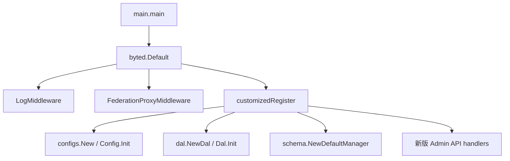

# Admin API and Schema Management

## 模块概览

Admin API and Schema Management 模块位于 `fuxi/fuxi_admin`，负责启动 Fuxi Admin HTTP 服务，并提供两类能力：

1. 旧版 Schema 管理接口：围绕 `schema.Manager` 管理 schema 创建、查询、启用、代码生成和校验。
2. 新版 Scope 配置管理接口：以 `group_type + group_name + schema_name` 为天然键，管理 schema definition、schema binding 和 binding configuration。

服务入口是 `main.main()`。启动时会初始化 Hertz 服务、挂载 `LogMiddleware()` 和 `FederationProxyMiddleware()`，随后通过 `register()` 调用 `customizedRegister()` 注册路由，并在注册阶段完成配置加载、DAL 初始化和业务 handler 构造。



## 启动与路由注册

`main.go` 定义了配置目录环境变量：

- `KITEX_CONF_DIR`：由 `GetConfDir()` 读取，默认值为 `conf`。
- `KITEX_CONF_FILE`、`KITEX_LOG_DIR` 在当前文件中只定义常量，未参与启动逻辑。
- `DefaultConfFile` 为 `kitex.yml`，`DefaultLogDir` 为 `log`。

`customizedRegister(r *server.Hertz)` 是核心路由注册点。它先注册 `/ping`，再加载配置：

```go
cfg := configs.New(GetConfDir())
if err := cfg.Init(); err != nil {
    panic(err)
}

dal := dal.NewDal(cfg)
if err := dal.Init(); err != nil {
    panic(err)
}
```

`cfg.Init()` 会通过 Caesar/TCC 加载配置，并调用 `validateRegisteredFeds()` 校验 TCC key `registered_feds` 不是空列表。`dal.Init()` 会初始化数据库访问层，并在执行流中设置表名前缀、初始化 query 对象和 `AttrSchema` 相关访问对象。

## 接口分组

### 旧版 Schema 接口

旧版接口由 `handler.SchemaService` 提供，底层依赖 `schema.Manager`，默认实现为 `schema.DefaultManager`。

| 方法 | 路径 | Handler | 说明 |
|---|---|---|---|
| `PUT` | `/schemas/:name` | `CreateSchema` | 创建 schema，返回版本号 |
| `GET` | `/schemas/:name/*version` | `QuerySchema` | 按名称和可选版本查询 schema |
| `PUT` | `/spaces/:space/schemas/:name` | `EnableSchema` | 为 space 启用 schema |
| `GET` | `/spaces/:space/schemas` | `QuerySchemaByProvider` | 查询 space 下启用的 schema |
| `GET` | `/spaces/_all/schemas` | `QueryAllSettings` | 查询全部 space/schema 绑定关系 |
| `GET` | `/schemas/_all` | `QueryAllSchemas` | 查询全部 schema |
| `GET` | `/generate/:name/:version` | `GenerateCode` | 从 JSON Schema 生成 Go struct 代码 |
| `POST` | `/validate` | `Validate` | 当前固定返回 `not supported` |

旧版链路的核心模型是 `schema.Schema`。创建时会依次执行：

1. `Schema.Expand()`：当前实现只把 `NativeSchema` 复制到 `FullSchema`。
2. `Schema.SelfValidate()`：校验 `FullSchema` 非空、是合法 JSON，并能反序列化为 `fuxi-schema-validator.Schema`。
3. `Schema.GenVersion()`：使用 `uuid.NewUUID()` 生成 time-based UUID。
4. `DefaultManager.Create()`：写入 `dalModel.AttrSchema`。

`DefaultManager.GenerateCodeFromSchema()` 会先调用 `Query()` 获取目标 schema，再调用 `utils.ConvertJsonSchema2Struct(schema, "model")`，由 `fuxi-schema-generator` 生成 Go 代码。

### 新版 Admin API

新版接口统一使用 `/admin/api/v1/` 前缀，并返回 `adminapi.SuccessResponse` 或 `adminapi.ErrorResponse` 风格的 JSON。注意：这些接口多数业务错误仍使用 HTTP 200 返回，真实结果码放在响应体 `status_code` 中。

| 领域 | 方法 | 路径 | Handler |
|---|---|---|---|
| Schema Definition | `POST` | `/admin/api/v1/create_one_schema_definition` | `CreateSchemaDefinition` |
| Schema Definition | `GET` | `/admin/api/v1/get_one_schema_definition` | `GetSchemaDefinitionByVersion` |
| Schema Definition | `GET` | `/admin/api/v1/list_schema_definitions` | `ListSchemaDefinitions` |
| Schema Binding | `POST` | `/admin/api/v1/create_one_schema_binding` | `CreateSchemaBinding` |
| Schema Binding | `GET` | `/admin/api/v1/get_one_schema_binding` | `GetSchemaBindingByGroup` |
| Schema Binding | `GET` | `/admin/api/v1/list_schema_bindings` | `ListSchemaBindings` |
| Configuration | `POST` | `/admin/api/v1/update_binding_configuration` | `UpdateBindingConfiguration` |
| Configuration | `GET` | `/admin/api/v1/get_one_configuration_history` | `GetConfigurationHistory` |

## Schema Definition

`SchemaDefinitionService` 管理 schema 定义版本。请求和响应类型定义在 `adminapi/types.go`：

- `CreateSchemaDefinitionRequest`
- `SchemaDefinitionResponse`

`CreateSchemaDefinition()` 从 request body 解析 `schema_name` 和 `schema_value`，并从 header `x-vpaas-operator-name` 覆盖 `author`。它只做轻量格式校验：`schema_value` 去空白后必须以 `{` 开始、以 `}` 结束；不会像旧版 `Schema.SelfValidate()` 一样反序列化为 validator schema。

创建成功后写入 `dal.SchemaDefinitions.Create(ctx, schema)`，版本号由 `uuid.NewUUID()` 生成，响应数据只包含：

```json
{
  "id": 123,
  "version": "生成的版本号"
}
```

`GetSchemaDefinitionByVersion()` 支持两种查询方式：

- 优先按 `id` 查询：`dal.SchemaDefinitions.GetByID(ctx, id)`。
- 未提供 `id` 时，按 `schema_name` 查询；如果 `version` 为空，调用 `GetLatestByName()`，否则调用 `GetByNameVersion()`。

`ListSchemaDefinitions()` 支持 `schema_name` 模糊搜索和 `only_latest=true`。`filterLatestVersions()` 在内存中按 `CreatedAt` 选择每个 `schema_name` 的最新版本，并按 `SchemaName` 排序。

## Schema Binding

`SchemaBindingService` 管理 scope 到 schema version 的绑定关系。scope 由 `adminapi.GroupType` 表示：

- `space`
- `account`
- `@all`

`GroupType.IsValid()` 只接受以上三个值。`@all` 是特殊全局 scope，创建和查询时都会把 `group_name` 规范化为 `"all"`。

`CreateSchemaBinding()` 的执行流程：

1. 读取 body 并反序列化为 `CreateSchemaBindingRequest`。
2. 从 `x-vpaas-operator-name` 读取 `Author`。
3. 调用 `validateCreateRequest()` 校验必填字段、`group_type` 合法性和 `Configurations`。
4. 调用 `config.ValidateConfigurations()` 校验配置内容。
5. 调用 `ensureConfiguredCollectionsUnique()` 校验 GSI 全局唯一性和 collection shape 一致性。
6. 构造 `dalModel.SchemaBindings`。
7. 调用 `dal.SchemaBindings.CreateWithConfig(ctx, binding, req.Configurations, req.Author)` 在事务中创建 binding 和首版配置。
8. 返回新 binding 的 `ID`。

`GetSchemaBindingByGroup()` 使用 `group_type + group_name + schema_name` 查询单个 binding，并通过 `getLatestConfigurationsForResponse()` 附带最新配置。配置不存在时如果 DAL 返回 `dal.IsConfigurationNotFound(err)`，接口会返回 `Configurations: nil`，不会把它作为失败处理。

`ListSchemaBindings()` 根据 query 参数选择不同 DAL 查询：

- 三个参数都有：`GetByGroup()`
- 只有 `schema_name`：`ListBySchema()`
- 有 `group_type + group_name`：`ListByGroup()`
- 只有 `group_type`：`ListByGroupType()`
- 都没有：`List()`

## Configuration

`ConfigurationService` 负责更新 binding 配置和读取配置历史。

`UpdateBindingConfiguration()` 使用 `UpdateBindingConfigurationRequest`，要求：

- `id` 非 0。
- `configurations` 非空。
- `author` 非空；通常来自 `x-vpaas-operator-name`。
- `config.ValidateConfigurations(req.Configurations)` 通过。
- `ensureConfiguredCollectionsUniqueForUpdate(ctx, req.ID, req.Configurations)` 通过。

更新配置时不会覆盖旧记录，而是调用 `dal.Configurations.UpdateWithCAS(ctx, req.ID, req.Configurations, req.Author)` 创建新版本。CAS 细节在 DAL 层实现，handler 只负责参数和业务约束校验。

`GetConfigurationHistory()` 从 query 参数 `id` 解析 binding ID，调用 `dal.Configurations.GetHistory(ctx, bindingID)` 获取历史记录和反序列化后的配置列表，然后组装为 `ConfigurationHistoryResponse`。每条历史记录包含 `version`、`created_at`、`author` 和当时的 `configurations`。

## 配置结构与校验规则

`adminapi.Configurations` 是新版配置的核心结构，当前支持：

- `storage_policy`
- `bytedoc_config`
- `abase_config`
- `tos_config`
- `ttl_config`
- `cdc_event`
- `delete_file`
- `gsi_indexes`

`StoragePolicy.IsValid()` 接受 `tos`、`abase`、`oda`、`Bytedoc`。`config.ValidateConfigurations()` 会根据不同存储策略检查对应配置：

- `Bytedoc`：要求 `bytedoc_config`、`route_table_id`、非空 `shard_key`；唯一索引的 `fields` 必须以 `shard_key` 为前缀。
- `abase`：要求 `abase_config`、`route_table_id`、`db_name`、`table_name`。
- `tos`：要求 `tos_config` 和 `tos_config.storage.bucket`。
- `oda`：当前只校验 storage policy 合法，没有专属配置校验。

GSI 校验集中在 `ValidateConfigurations()` 和 `collection_uniqueness.go`：

- `gsi_indexes[i].name` 不能为空，去空白后用于重复判断。
- `columns` 不能为空，列名不能为空，同一索引内不能重复。
- `is_uniq` 和 `bucket_enabled` 互斥。
- 每个索引最多允许一个包含 `*` 的通配列。
- 唯一索引默认不允许通配列；可通过 TCC key `allow_unique_wildcard_gsi` 打开。
- `collection` 必填。
- 同一 pending 配置内 GSI name 不能重复。
- 跨 binding 的 GSI name 不能重复。
- 同一个 `collection` 不能同时被 simple GSI 和 bucketed GSI 使用。

GSI 冲突会通过 `gsiNameConflictError` 暴露结构化错误详情。`adminapi.ErrorResponse()` 会识别实现了 `ErrorDetails() []ErrorDetail` 的错误，并把字段路径、冲突 binding、冲突 group/schema 等信息写入响应体 `details`。

## GSI 唯一性与 Collection Shape

`ensureConfiguredCollectionsUnique()` 用于创建 binding，`ensureConfiguredCollectionsUniqueForUpdate()` 用于更新配置。两者最终都会进入 `ensureConfiguredCollectionsUniqueWithBindings()`。

更新时会先读取当前 binding 的最新 raw configuration，并用 `isRawGSIIndexesModified()` 判断 `GSIIndexes` 是否实际变化。如果没有变化，则跳过全局扫描，避免无意义的冲突检查。

核心检查由 `ensurePendingGSINamesUniqueWithLoader()` 完成：

1. `ensurePendingGSINameSelfUnique()` 检查 pending 配置内 name 重复。
2. `ensureCollectionShapeConsistentSelf()` 检查 pending 内同 collection 的 simple/bucketed 混用。
3. 批量加载其他 binding 的最新 raw configuration。
4. 跨 binding 比较 GSI name。
5. `checkCollectionShapeCrossBinding()` 检查跨 binding 同 collection 的 simple/bucketed 混用。

这里使用的是 raw `adminapi.Configurations`，不是派生后的运行时配置；因此校验与用户提交的管理面配置保持一致。

## 响应与错误模型

新版 Admin API 使用 `adminapi.BaseResponse` 和 `adminapi.DataResponse`：

```json
{
  "data": {},
  "status_code": 0,
  "status_message": "OK"
}
```

`adminapi.ErrorResponse(err)` 会把 `errs.Err` 映射为管理面状态码：

- `errs.Success` → `0`
- `errs.ErrInvalidRequest`、`errs.ErrInvalidSchema`、`errs.ErrInvalidProperty` → `40001`
- `errs.ErrInternal`、cache 错误及未知 5xxxx → `50001`
- `errs.ErrReadDB`、`errs.ErrWriteDB` → `50002`

旧版 `SchemaService` 使用 `errs.StatusCode(err)` 和 `errs.ToBaseResp(err)`，HTTP 状态码会从 `errs.Code` 推导，例如 `40000 / 100 = 400`。新版 Admin API 则通常固定 `errs.StatusCodeOK`，由 body 中的 `status_code` 表达业务失败。

## 联邦代理中间件

`FederationProxyMiddleware()` 只在 `env.Cluster() == "default"` 时生效，并且只处理 `/admin/api/v1/` 前缀的新版 Admin API。

请求带 `?federation=目标集群` 时：

1. 如果目标为空或为 `default`，继续走本地 handler。
2. 如果请求已带 `x-fuxi-proxy-hop`，返回 `proxy loop detected`，防止循环代理。
3. 移除 query 中的 `federation` 参数。
4. 构造到 `http://bytedance.videoarch.fuxi_admin{path}` 的 upstream 请求。
5. 设置 `discovery.WithDestinationCluster(targetCluster)`，通过服务发现路由到目标联邦集群。
6. 显式复制 upstream response 的 header、status code 和 body 到当前响应。

该中间件让 default 集群承担控制面入口，同时把具体联邦的数据写入请求转发到对应集群。

## 与代码库其他部分的关系

本模块本身不直接实现数据库细节，而是通过 `dal` 包访问持久化对象：

- 旧版 schema 使用 `dalModel.AttrSchema` 和 `DefaultManager` 中的 `m.dal.Create()`、`QuerySchemaByName()`、`QueryAllSchemasFromDB()` 等方法。
- 新版 schema definition 使用 `dal.SchemaDefinitions`。
- 新版 binding 使用 `dal.SchemaBindings`。
- 新版配置版本使用 `dal.Configurations`。

配置加载由 `configs.Config` 负责，依赖 TCC/Caesar，并在启动时校验 `registered_feds`。存储策略和 GSI 行为的业务校验放在 `config.ValidateConfigurations()`，handler 在写 DAL 前统一调用它。

贡献这个模块时，应优先保持以下边界：

- Handler 负责 HTTP 参数解析、响应包装、日志和业务前置校验。
- `adminapi` 只放请求/响应结构、枚举和响应转换逻辑。
- `config` 放配置内容的纯校验逻辑。
- `collection_uniqueness.go` 放跨 binding 的 GSI 全局约束。
- `schema` 包维护旧版 `schema.Manager` 抽象和 schema 生命周期逻辑。
- DAL 细节保持在 `fuxi_admin/dal`，不要在 handler 中拼 SQL 或绕过 DAL。