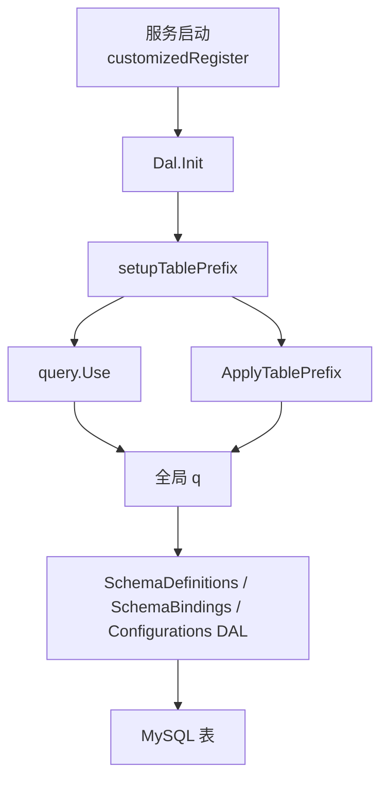

# Admin Persistence Layer

## 管理端持久化层

管理端持久化层位于 `fuxi/fuxi_admin/dal`，负责把 Fuxi Admin 的 Schema、绑定关系和运行配置落到 MySQL。它基于 GORM 和 `gorm.io/gen` 生成的强类型 Query API，对上层 handler/service 暴露较窄的 DAL 方法，对下屏蔽表名、事务、JSON 序列化和错误包装细节。

核心数据包括：

- `AttrSchema`：旧版属性 Schema 表，对应 `attr_schema`。
- `ProviderSetting`：旧版 provider 到 schema 的启用关系，对应 `provider_setting`。
- `SchemaDefinitions`：新版 Schema 定义和版本历史，对应 `schema_definitions`。
- `SchemaBindings`：分组到 Schema 版本的绑定关系，对应 `schema_bindings`。
- `Configurations`：绑定关系上的配置版本历史，对应 `configurations`。



## 初始化与全局 Query

入口是 `NewDal(cfg)` 和 `(*Dal).Init()`：

```go
d := dal.NewDal(cfg)
if err := d.Init(); err != nil {
    return err
}
```

`NewDal` 只保存配置，不建立数据库连接。真正的初始化在 `Init` 中完成：

1. 校验 `cfg`、`cfg.FuxiDB`、`FuxiDB.PSM`、`FuxiDB.DB`。
2. 使用 `bytedgorm.MySQL(dbpsm, dbname)` 构造 MySQL dialector。
3. 设置连接超时、读超时、写超时为 `1 * time.Second`。
4. 调用 `gorm.Open` 建立连接。
5. 调用 `setupTablePrefix(db)` 初始化 `gorm/gen` 的 `query.Query`。
6. 将返回的 Query 同时写入 package 级全局变量 `q` 和当前 `Dal.query`。
7. 记录实际表名日志。
8. 随机 sleep 0-9 秒，用于服务启动时打散请求。

`q` 是这个包里新版 DAL 的主要数据库入口，例如：

```go
q.SchemaDefinitions.WithContext(ctx).Find()
q.SchemaBindings.WithContext(ctx).Where(...).First()
q.Configurations.WithContext(ctx).Create(config)
```

旧版 `Dal` 方法则多数使用 `d.query`：

```go
d.query.AttrSchema.WithContext(ctx).Create(schema)
d.query.ProviderSetting.WithContext(ctx).Find()
```

因此，调用 `SchemaDefinitions`、`SchemaBindings`、`Configurations` 这些 package 级 DAL 单例前，必须确保已经执行过 `Dal.Init()`，否则全局 `q` 不可用。

## 表前缀机制

持久化层支持通过 `cfg.FuxiDB.TablePrefix` 给所有表加前缀。这个逻辑分两层实现：

- `TablePrefixPlugin`：GORM callback 插件，在 Create / Query / Update / Delete / Raw / Row 执行前修改 `db.Statement.Table`。
- `query.ApplyTablePrefix(prefix)`：修改 `gorm/gen` Query 对象中预先绑定的表名和字段限定名。

只依赖 GORM callback 不够，因为 `gorm/gen` 的字段表达式在 `query.Use(db)` 时已经绑定了原始表名。`setupTablePrefix` 因此会先注册插件，再创建 Query，最后对 Query 调用 `ApplyTablePrefix`。

相关函数：

- `(*Dal).setupTablePrefix(db *gorm.DB) (*query.Query, error)`
- `(*TablePrefixPlugin).Initialize(db *gorm.DB) error`
- `(*TablePrefixPlugin).applyTablePrefix(db *gorm.DB)`
- `(*query.Query).ApplyTablePrefix(prefix string) *query.Query`
- `applyPrefix(tableName, prefix string) string`

`ApplyTablePrefix` 会更新以下表：

```go
q.AttrSchema
q.ProviderSetting
q.SchemaDefinitions
q.SchemaBindings
q.Configurations
```

`applyPrefix` 是幂等的：表名为空、前缀为空、或表名已经带前缀时会原样返回。

## SchemaDefinitionsDAL：Schema 定义版本

`SchemaDefinitionsDAL` 操作 `schema_definitions` 表。包内提供单例：

```go
var SchemaDefinitions = &SchemaDefinitionsDAL{}
```

模型是 `dalModel.SchemaDefinitions`，关键字段包括：

- `SchemaName`
- `Version`
- `SchemaValue`
- `Author`
- `CreatedAt`

唯一索引语义由模型 tag 表达为 `(schema_name, version)`。

主要方法：

- `Create(ctx, schema)`：插入一条新的 Schema 定义。
- `GetByName(ctx, name)`：查询某个 schema name 的所有版本。
- `SearchByName(ctx, keyword)`：按 `schema_name LIKE %keyword%` 模糊搜索。
- `GetByNameVersion(ctx, name, version)`：按名称和版本精确查询。
- `List(ctx)`：列出全部定义。
- `GetByID(ctx, id)`：按主键查询。
- `GetLatestByName(ctx, name)`：按 `CreatedAt.Desc()` 取最新定义。

空列表查询会返回空 slice，不返回 not found 错误：

```go
records, err := dal.SchemaDefinitions.GetByName(ctx, "demo")
if err != nil {
    return err
}
// records 可能是空 slice
```

单条查询在 `gorm.ErrRecordNotFound` 时会包装为 `errs.ErrInvalidRequest`：

```go
record, err := dal.SchemaDefinitions.GetByNameVersion(ctx, "demo", "v1")
```

注意 `GetLatestByName` 的“最新”基于 `created_at` 降序，而不是按 `version` 字符串排序。

## SchemaBindingsDAL：分组到 Schema 的绑定

`SchemaBindingsDAL` 操作 `schema_bindings` 表。包内提供单例：

```go
var SchemaBindings = &SchemaBindingsDAL{}
```

模型是 `dalModel.SchemaBindings`，关键字段包括：

- `GroupType`：例如 `space`、`account`、`@all`。
- `GroupName`：分组标识。
- `SchemaName`：绑定的 Schema 名称。
- `SchemaVersion`：绑定的具体版本，或 `@latest`。
- `Author`

唯一索引语义由模型 tag 表达为 `(group_type, group_name, schema_name)`。

### 创建绑定并写入初始配置

`CreateWithConfig(ctx, binding, configurations, author)` 在事务中执行两个动作：

1. 插入 `schema_bindings` 记录。
2. 如果 `configurations != nil`，将 `adminapi.Configurations` 序列化为 JSON，插入 `configurations` 表，版本号为 `1`。

```go
err := dal.SchemaBindings.CreateWithConfig(ctx, binding, initialConfig, author)
```

这个方法使用 `q.Transaction(func(tx *query.Query) error { ... })`，绑定创建和初始配置创建具有原子性。`binding.ID` 会在创建绑定后用于 `Configurations.SchemaBindingID`。

### 查询绑定

常用查询方法：

- `GetByGroup(ctx, groupType, groupName, schemaName)`：按分组和 schema name 获取单条绑定。
- `ListByGroup(ctx, groupType, groupName)`：列出某个分组下的所有绑定。
- `ListByGroupType(ctx, groupType)`：列出某类分组的所有绑定。
- `ListBySchema(ctx, schemaName)`：列出引用某个 schema name 的所有绑定。
- `List(ctx)`：列出全部绑定。

列表查询在无结果时返回空 slice。`GetByGroup` 无结果时返回 `errs.ErrInvalidRequest`。

## ConfigurationsDAL：绑定配置版本

`ConfigurationsDAL` 操作 `configurations` 表。包内提供单例：

```go
var Configurations = &ConfigurationsDAL{}
```

模型是 `dalModel.Configurations`，关键字段包括：

- `SchemaBindingID`
- `Configuration`：JSON 字符串，内容来自 `adminapi.Configurations`。
- `Author`
- `Version`
- `CreatedAt`

这个表的业务语义是追加版本历史。更新配置时不会覆盖旧记录，而是插入一条更高版本的新记录。

### 创建配置

`Create(ctx, schemaBindingID, configurations, author)` 会把 `*adminapi.Configurations` 序列化为 JSON 字符串，写入 `Configuration` 字段，初始 `Version` 为 `1`。

```go
record, err := dal.Configurations.Create(ctx, bindingID, config, author)
```

序列化失败会包装为 `errs.ErrInternal`，写库失败会包装为 `errs.ErrWriteDB`。

### 获取最新配置

`GetLatestByBinding(ctx, schemaBindingID)` 按 `Version.Desc()` 查询最新记录，并反序列化为 `*adminapi.Configurations`：

```go
record, config, err := dal.Configurations.GetLatestByBinding(ctx, bindingID)
```

返回值分为两层：

- `record`：数据库记录，包含 `ID`、`Version`、`Author` 等元信息。
- `config`：反序列化后的业务配置。

如果没有配置，会返回 `ConfigurationNotFoundError`。调用方可用 `IsConfigurationNotFound(err)` 判断：

```go
_, config, err := dal.Configurations.GetLatestByBinding(ctx, bindingID)
if dal.IsConfigurationNotFound(err) {
    // 调用方可按空配置处理
}
```

`ConfigurationNotFoundError` 内部包装的是 `errs.ErrInvalidRequest`，同时保留 `SchemaBindingID`，便于上层区分“没配置”和真实读库错误。

### 批量获取最新配置

`ListLatestByBindings(ctx, schemaBindingIDs)` 用于一次查询多个 binding 的最新配置：

```go
configs, err := dal.Configurations.ListLatestByBindings(ctx, []int64{1, 2, 3})
```

返回值是 `map[int64]*adminapi.Configurations`。没有配置的 binding 不会出现在 map 中，由调用方按空配置处理。

实现上会按 `SchemaBindingID` 和 `Version.Desc()` 排序，然后对每个 `SchemaBindingID` 只保留第一条记录。反序列化失败的记录会记录 warn 日志并跳过，不会让整个批量查询失败。

### 配置历史

`GetHistory(ctx, schemaBindingID)` 返回某个 binding 的全部配置历史，按版本降序：

```go
records, configs, err := dal.Configurations.GetHistory(ctx, bindingID)
```

`records` 和 `configs` 一一对应。反序列化失败的历史记录会被跳过，因此返回的记录数可能少于数据库中的实际行数。

### 追加新版本

`UpdateWithCAS(ctx, schemaBindingID, configurations, author)` 的注释称为 CAS 乐观锁更新，但当前实现没有执行带条件的 update，也没有比较外部传入版本。实际流程是：

1. 调用 `GetLatestByBinding` 获取当前最新记录。
2. 将新配置序列化为 JSON。
3. 用 `current.Version + 1` 创建一条新记录。

```go
newRecord, err := dal.Configurations.UpdateWithCAS(ctx, bindingID, config, author)
```

因此它更准确地说是“基于当前最新版本追加下一版本”。如果并发调用同时读取到相同最新版本，仍可能尝试插入相同的下一版本；最终行为取决于数据库唯一索引约束。

## 旧版 AttrSchema 与 ProviderSetting DAL

`dal.go` 中的 `Dal` 方法是旧版 schema/provider setting 的数据访问入口，主要操作 `attr_schema` 和 `provider_setting`。

### AttrSchema

相关方法：

- `Create(ctx, schema)`：创建 `AttrSchema`。
- `QueryAllSchemasFromDB(ctx)`：查询全部 schema。
- `MQuerySchemaFromDB(ctx, names...)`：按 `Name IN (...)` 批量查询，返回 `map[name][]*AttrSchema`。
- `MQuerySchemaVersionFromDB(ctx, name, versions...)`：按 name 和 version 列表查询。
- `QuerySchemaByName(ctx, name)`：查询单个 name 的所有 schema。
- `QuerySchemaByNameVersion(ctx, name, versions...)`：查询指定 name 下的指定版本。
- `DeleteSchema(ctx, version)`：按 version 删除。

`QuerySchemaByName` 和 `QuerySchemaByNameVersion` 会在 map 中找不到 name 时返回 `errs.ErrInvalidRequest`。

### ProviderSetting

相关方法：

- `EnableSchema(ctx, space, name)`：插入一条 `ProviderSetting`。
- `DisableSchema(ctx, provider)`：按 provider 删除。
- `QueryAllSettings(ctx)`：查询全部设置。
- `MQueryProviderSettingFromDB(ctx, spaces...)`：按 provider 批量查询。
- `MQueryProviderSetting(ctx, spaces...)`：当前只是 `MQueryProviderSettingFromDB` 的薄封装。

需要注意的是，`ProviderSetting` 模型包含 `Version` 和 `UpdatedBy` 非空字段，但 `EnableSchema` 当前只设置了 `Provider` 和 `Name`。如果数据库约束严格要求这些字段非空，调用方需要确认默认值或补齐写入逻辑。

## 缓存代码状态

`cache.go` 中定义了以下缓存相关逻辑：

- `loopUpdateCache`
- `updateCache`
- `QuerySchemaFromCache`
- `queryProviderSettingFromCache`

但整个文件内容目前被注释掉，`Init` 中的缓存刷新和后台 goroutine 也被注释掉：

```go
//err = d.updateCache(context.Background())
//go d.loopUpdateCache()
```

因此当前持久化层实际不启用内存缓存，所有公开查询路径都直接访问数据库。`Dal` 结构体里仍保留了 `cacheLock`、`schemaCache`、`providerSettingCache` 字段，这是历史实现遗留。

## 生成代码与模型

`dal/model/*.gen.go` 是 GORM 模型定义，提供表名、字段 tag 和 JSON tag。`dal/query/*.gen.go` 是 `gorm.io/gen` 生成的强类型查询封装。

典型查询模式如下：

```go
record, err := q.SchemaDefinitions.WithContext(ctx).
    Where(q.SchemaDefinitions.SchemaName.Eq(name)).
    Where(q.SchemaDefinitions.Version.Eq(version)).
    First()
```

`query.Use(db)` 会构造一个 `*query.Query`，其中包含所有表的查询对象：

```go
type Query struct {
    AttrSchema       attrSchema
    ProviderSetting  providerSetting
    SchemaDefinitions schemaDefinitions
    SchemaBindings    schemaBindings
    Configurations    configurations
}
```

事务通过 `(*Query).Transaction` 执行：

```go
err := q.Transaction(func(tx *query.Query) error {
    if err := tx.SchemaBindings.WithContext(ctx).Create(binding); err != nil {
        return err
    }
    return tx.Configurations.WithContext(ctx).Create(config)
})
```

维护生成代码时要注意模型和 Query 字段是否一致。当前 `model.Configurations` 使用 `Configuration` 字段，但 `query/configurations.gen.go` 中暴露的是 `ConfigKey` 和 `ConfigValue` 字段；现有 DAL 没有直接引用 `q.Configurations.Configuration`，所以当前路径仍能工作，但如果后续要按配置内容查询或选择字段，需要先重新生成或修正 query 代码。

## 错误处理约定

这个模块统一用 `errs.New` 包装底层错误，常见分类包括：

- `errs.ErrInternal`：内部错误、序列化失败、部分通用数据库错误。
- `errs.ErrReadDB`：读库失败。
- `errs.ErrWriteDB`：写库失败。
- `errs.ErrInvalidRequest`：请求对象不存在或参数指向无效资源。

单条查询通常把 `gorm.ErrRecordNotFound` 转成 `errs.ErrInvalidRequest`。配置查询是例外：`GetLatestByBinding` 会返回专门的 `ConfigurationNotFoundError`，让上层可以把“未配置”作为正常分支处理。

列表查询通常不会把空结果当错误，而是返回空 slice 或空 map。

## 与上层代码的关系

启动链路中，`main` 经由路由注册进入 `customizedRegister`，再调用 `Dal.Init` 完成数据库初始化。初始化后的全局 `q` 被 handler/service 间接使用。

从测试入口看，上层主要依赖这些 DAL 能力：

- schema definition handler/service 使用 `SchemaDefinitionsDAL` 查询、创建和列出 Schema 定义。
- schema binding handler/service 使用 `SchemaBindingsDAL` 创建绑定、按分组查询绑定、列出绑定。
- configuration handler/service 使用 `ConfigurationsDAL` 获取最新配置、历史配置、批量配置，并通过 `NewConfigurationNotFoundError` / `IsConfigurationNotFound` 区分空配置场景。
- 表前缀相关单测覆盖 `setupTablePrefix`、`TablePrefixPlugin.Initialize`、`query.ApplyTablePrefix` 和 `applyPrefix`。

新增管理端持久化逻辑时，优先沿用现有模式：在 `dal/model` 中维护模型，在 `dal/query` 中使用或更新 `gorm/gen` Query，在 `dal/*_dal.go` 中封装业务粒度的数据访问方法，并用 `errs.New` 做统一错误分类。