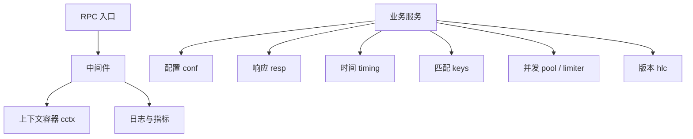

# Common Utilities

## 通用工具模块

通用工具模块覆盖 `fuxi/comm/utils`、部分 `fuxi/core/utils`、`fuxi/comm/midware` 和顶层 `util` 包，提供跨服务复用的基础能力：RPC 中间件、配置读取、指标上报、时间与限流工具、通用集合结构、响应码封装、测试断言、HLC 版本号、属性 key 匹配、异步任务池，以及 Thrift 结构体深拷贝。

该模块不是业务编排层，主要服务于 `handler`、`core/service`、`mdap/service`、`idx`、`storage` 等上层代码，避免这些模块重复处理日志、指标、配置、错误包装和并发控制。

## 整体结构



核心调用关系：

- `LogMidware` 在 RPC 调用结束后记录请求、响应、耗时，并调用 `metrics.ReportAPIStatus`。
- `DownstreamRateLimitMiddleware` 在下游 RPC 调用前预扣带宽额度，调用结束后通过 `bandwidthLimiterCompensation` 按响应体大小补偿。
- `timing.Track` 被 `QueryWithFuxiAttr` 等路径使用，通过 `Recorder.Record` 收集阶段耗时。
- `conf.GetConfig`、`conf.GetWithJSON`、`conf.GetWithYAML` 是 TCC 配置读取入口。
- `resp.ResultBase.NewResp` 注册响应码，`metrics.ReportAPIStatus` 再通过 `resp.GetRespByCode` 把状态码映射为指标 tag。
- `keys.Matcher` 和 `keys.MatcherSet` 用于属性路径通配匹配，是 `Match` 的优化版本。

## RPC 中间件

### `LogMidware[T resp.RespIf]`

`LogMidware` 是 Kitex `endpoint.Middleware`，负责统一记录 RPC 调用结果。

执行流程：

1. 调用 `cctx.WithContainer(ctx)`，确保上下文中存在容器。
2. 通过 `rpcinfo.GetRPCInfo(ctx)` 读取 method 和 caller PSM。
3. 执行下游 `next(ctx, request, response)`。
4. 用 `printsdk.MarshalStringIgnoreError` 序列化请求和响应用于日志。
5. 通过 `getBaseResp[T]` 从响应的 `Success` 字段中提取 `BaseResp`。
6. 根据 `err` 和业务状态码选择 `CtxError`、`CtxWarn` 或 `CtxInfo`。
7. 读取 `cctx.GetContainerOrEmpty(ctx)` 中的 `Space`、`Schema`，调用 `metrics.ReportAPIStatus`。

`getBaseResp` 使用反射查找响应结构体中的 `Success` 字段，并要求该字段实现 `resp.RPCResp[T]`。因此接入该中间件的 RPC 响应需要保持生成代码中常见的 `Success` 响应模式。

### `DownstreamRateLimitMiddleware`

`DownstreamRateLimitMiddleware` 用于下游调用的响应带宽限流。

关键常量：

- `BandwidthPreQuota = int64(50)`：每次调用预扣的默认额度。
- `hardenBandwidthLimiterKey = "bandwidth"`：Harden 限流 key 后缀。

执行流程：

1. 使用 `methodNeedBandwidthLimiter(methodName)` 判断方法是否需要带宽限制；当前实现始终返回 `true`。
2. 调用 `harden.HardenClient.AllowNFallbackShared` 预扣额度。
3. 若被限流，调用 `setRateLimitBaseResp(resp)` 写入 `set_meta_resp.BandwidthLimitExceeded`，并直接返回 `nil`。
4. 若未限流，继续执行 `next`。
5. 调用 `bandwidthLimiterCompensation`，用真实响应大小减去预扣额度，超出的部分通过 `ReserveNFallbackShared` 补偿扣减。

`extractRespSizeFromResponse` 要求响应实现：

```go
interface {
    GetResult() interface{}
}
```

并且 `GetResult()` 返回值实现 `msgp.Sizer`，否则响应大小按 `0` 处理。

`setRateLimitBaseResp` 对响应结构有较强约定：响应必须是指针，包含 `Success` 字段；`Success` 对应的 result 必须实现 `GetOrSetBaseResp() interface{}`，并返回 `*base.BaseResp`。新增 RPC 类型接入该中间件时，需要确认生成结构满足这些反射和接口假设。

## 上下文容器 `cctx`

`fuxi/core/utils/cctx` 在 `context.Context` 中挂载请求级低基数字段，主要供日志和指标使用。

核心函数：

- `WithContainer(ctx)`：若上下文中没有容器，则注入新的 `container`。
- `GetContainerOrEmpty(ctx)`：读取容器；不存在或类型异常时返回空容器。
- `SetStoragePolicy(ctx, storageType, exists)`：写入低基数 `StoragePolicy` tag。
- `JoinStoragePolicies(policies...)`：对多空间查询命中的 storage policy 去重、排序并拼接。

`container` 当前包含：

- `Space`
- `Schema`
- `StoragePolicy`
- `IdxCfg`

`init` 中调用 `comm.AddCusCtxKey(containerKey)`，用于把该 key 纳入通用上下文复制逻辑的预留列表。

## 配置读取 `conf`

`fuxi/comm/utils/conf` 封装 TCC Client V2。

主要入口：

- `GetConfig(ctx, key)`：读取原始字符串配置。
- `GetOrEpt(ctx, key)`：读取失败返回空字符串。
- `GetOrDef(ctx, key, def)`：读取失败返回默认值。
- `GetOrPanic(ctx, key)`：读取失败记录日志并 panic。
- `GetWithJSON[T](ctx, key)`：按 JSON 反序列化配置。
- `GetWithYAML[T](ctx, key)` / `GetWithYAMLOrPanic[T]`：按 YAML 反序列化配置。
- `IsNotFound(err)`：判断是否为 `tccclient.ConfigNotFoundError`。

`getWith[T]` 会为每个 `Key` 缓存一个 `tccclient.Getter`，并使用 `sync.RWMutex` 保护 `getterMap`。同一个配置 key 后续读取会复用 getter。

测试场景通过 `ConfStack` 支持 mock：

- `Mock(t, key, value, err)`：设置当前 mock 批次中的配置。
- `Submit()`：提交当前批次，并准备下一批 mock。
- `Demock(t)`：回退一层 mock。
- `GetConfig(key)`：从最近一次已提交 mock 开始向前查找。

注意：mock 只有在包级 `mockedFlag` 为 `true` 时生效；真实读取路径仍会回落到 TCC client。

## 指标 `metrics`

`metricsV3.go` 是指标基础封装，业务指标文件只声明指标名、tag 和上报函数。

基础类型：

- `Metric`：提供 `WithTags(...) Emitter`。
- `Emitter`：提供 `Emit(values...) error`。
- `valContainer`：封装 suffix、数值和 metrics SDK 构造函数。
- `newMetrics(name, tags...)`：创建 metrics v3 metric。
- `newTag(key, val)`：创建 tag，并通过 `EscapeTagValueSimple` 清洗 tag 值。

支持的 value 构造：

- `counter(n)` / `CounterWithSuf`
- `rate(n)` / `RateWithSuf`
- `timer(n)`

`EscapeTagValueSimple` 会把空字符串变为 `EMPTY_VALUE`，并把非字母、数字、`.`、`-`、`/`、`_`、`:`、`|` 的字符替换为 `-`，避免非法 tag 值污染指标。

业务上报函数包括：

- `ReportAPIStatus`：上报 RPC API 状态、耗时和调用次数。
- `ReportAttrFormatInvalid`：上报属性格式错误。
- `ReportTTL`：上报 TTL 任务状态。
- `RecordShielded`：上报屏蔽命中状态。
- `ReportGSIOps`：上报 GSI 操作状态。
- `ReportGSIQueryBucketCount`：上报 GSI query 遍历 bucket 数。
- `ReportGSIAsyncPoolActive` / `ReportGSIAsyncPoolRejected`：上报异步池水位和拒绝次数。
- `ReportSetAttrStage`：上报 SetAttr 阶段耗时，单位为微秒。
- `ReportMDAPStartProcessing`：上报 MDAP start processing 事件。

测试中可调用 `metrics.Mock()` 进入 mock 模式，`PopRecords(name)` 取出并清空记录。`MetricsRecord` 提供 `AstTagEq`、`AstValIntEq` 等断言辅助方法。

## 响应码封装 `resp`

`resp.Resp[T]` 是业务响应码定义的通用结构：

```go
type Resp[T RespIf] struct {
    ID   Result
    Code int32
    Msg  string
}
```

`RespIf` 描述生成的 `BaseResp` 类型需要具备的读写方法：

```go
type RespIf interface {
    GetStatusMessage() string
    GetStatusCode() int32
    SetStatusMessage(string)
    SetStatusCode(int32)
}
```

常用方法：

- `Clone()`：复制响应定义。
- `WithMsgF(format, args...)`：追加格式化消息。
- `WithMsgE(err, format, args...)`：追加格式化消息和错误内容。
- `ToBaseResp(ctx)`：生成具体 `BaseResp`，非 0 状态码会记录错误日志。
- `AstEqRPCResp` / `AstCodeEq`：测试断言。
- `GetBaseResp`：从 `RPCResp[T]` 中提取 BaseResp。
- `GetRespByCode`：按状态码查找已注册响应。

`ResultBase[T]` 用于集中注册响应码：

- `NewResultBase[T]()` 创建注册表。
- `NewResp(res, code, msg)` 注册响应码。
- `GetResp(res)` 按 `Result` 获取响应定义。

`NewResp` 会检查非成功状态码是否重复注册。由于 `codeMap` 是包级全局 map，不同 `ResultBase` 之间共享状态码注册结果，新增错误码时需要避免冲突。

## 时间工具

### `clock`

`clock` 包用于测试中 mock `time.Now()`。

主要函数：

- `Mock(t)`：用 gomonkey patch `time.Now`。
- `Demock(t)`：重置 offset、freeze 状态并取消 patch。
- `UpdateOffSet(d)` / `ResetOffSet()`：设置或清除时间偏移。
- `FreezeAt(ts, ns)` / `Unfreeze()`：冻结或恢复时间。
- `Overflow2038(times...)`：判断时间戳是否超过 32 位 Unix 秒上限。

`Mock` 中的 `time.Now` 实现优先返回 `fixedAt`，否则基于 `getCurTime()` 计算当前时间，再叠加 `offset`。

### `timing`

`timing` 包用于收集请求内分阶段耗时。

典型用法：

```go
rec := timing.New()
ctx = timing.WithRecorder(ctx, rec)
defer timing.Track(ctx, "SetAttr")()
```

核心对象：

- `Recorder.Record(stage, duration)`：追加阶段耗时。
- `Recorder.Stages()`：返回阶段列表拷贝。
- `Recorder.Total()`：返回所有阶段耗时之和。
- `Recorder.FormatStages()`：生成多行日志文本。
- `Track(ctx, stage)`：返回 defer 闭包；若 ctx 中无 recorder，则返回 noop。

执行流中，`MGetAssetGroups`、`MGetSources` 经 `QueryWithFuxiAttr` 调用 `Track`，最终由 `Recorder.Record` 生成 `Entry`。嵌套阶段会导致 `Total()` 大于真实墙钟时间，因此慢请求判断应优先使用最外层阶段耗时。

## HLC 版本号 `hlc`

`hlc.HLC` 实现混合逻辑时钟，当前支持 V0 兼容解析和 V1 毫秒编码。

结构字段：

- `physicalTime int64`
- `logical uint16`
- `encoding uint8`

编码规则：

- V1 使用低 16 位的 bit `[15:14] == 01` 标识，`v1Tag = 0x4000`。
- V1 的高位保存 Unix 毫秒时间戳，低 14 位保存逻辑计数。
- V0 保留旧编码值，仅用于兼容和 CAS 判等。

主要函数：

- `ParseInt64Str(str)`：从十进制字符串解析 HLC。
- `IsV1Encoding(v)`：判断 int64 是否为合法 V1 编码。
- `New(remoteHLC)`：基于远端 HLC 推进生成新的 V1 HLC。
- `ToInt64()` / `ToInt64Str()`：编码为 int64 或字符串。
- `HLC.NewerThan(other)`：比较两个 HLC。
- `NewerThan(a, b)` / `OlderThan(a, b)`：直接比较 int64 编码。
- `String()`：生成日志可读格式。

跨编码比较时，V1 永远比 V0 新，不能直接比较 int64 数值；V0 的旧纳秒编码可能为正且数值远大于 V1。

## Key 匹配工具

`fuxi/core/utils/keys` 提供属性路径匹配能力，支持普通字面量、`.` 分段、`*` 和数组通配符 `[*]`。

旧接口：

- `HasWildcard(col)`：判断是否包含 `*`。
- `MatchingKeys(pattern, keys)`：返回所有匹配 key，结果排序。
- `IsMatch(wildcard, str)`：只返回是否匹配。
- `Match(wildcard, str)`：返回是否匹配，以及 `*` 捕获的区间。

优化接口：

- `NewMatcher(pattern)`：预编译单个 pattern。
- `NewMatchers(patterns)`：批量预编译。
- `NewMatcherSet(patterns)`：构建支持快速字面量和前缀匹配的集合。
- `Matcher.Match(str)`：匹配单个字符串。
- `MatcherSet.AnyMatch(str)`：判断任一 pattern 是否匹配。
- `SplitByKind(patterns)`：把 pattern 分为 literal、prefix、default 三类。

匹配规则：

- `a.b.c`：精确匹配。
- `a.*`：前缀匹配，匹配 `a` 后至少一个 segment。
- `a.*.c`：中间 `*` 匹配一个 segment。
- `arr[*]`：匹配 `arr[0]`、`arr[12]` 等数组下标格式。
- `*[*]`：数组名前缀也可通配，但下标仍必须是整数。

## 并发与限流

### `pool.Pool`

`Pool` 是轻量级有界异步任务池，基于 buffered channel 实现信号量。

- `New(size)`：创建最大并发为 `size` 的池。
- `Submit(fn)`：非阻塞提交任务；池满返回 `false`。
- `Active()`：返回当前活跃任务数。
- `Wait()`：等待已提交任务完成。

每个任务 goroutine 内部有 `recover()`，可避免 panic 导致信号量泄漏。

### `pool.RetryPool`

`RetryPool` 在 `Pool` 基础上增加失败重试：

- `NewRetryPool(size, maxRetries, baseDelay, maxDelay)`
- `SubmitRetry(fn func() error)`
- `Submit(fn func())`
- `Wait()`

`SubmitRetry` 失败后使用指数退避和 ±25% jitter，并通过 `time.AfterFunc` 重新提交。退避期间不占用并发槽位。`Wait()` 只等待当前正在执行的任务，不等待尚未触发的 timer。

### `limiter.ParallelLimiter`

`NewParallelLimit[T](limit)` 创建可动态调整的并发限制器。

`Run(f)` 返回：

- `executed`：是否实际执行。
- `res`：函数返回值。
- `err`：函数错误。

当当前执行数达到 limit 时，`Run` 直接返回 `executed=false`。`UpdateLimit(n)` 可在运行时调整上限。

### `NewSlidingWinRateLimiter`

滑动窗口百分比限流器按秒维护窗口：

- `Put()`：记录一次输入，并按 `percentage` 计算该秒可释放数量。
- `TryAcquire()`：从当前秒或窗口内更早秒尝试获取释放额度。

内部使用 `maps.SortedMap[int64, *window]` 存储窗口，窗口过期后会被移除。`percentage < 0` 或 `windowSize < 1` 时返回 `nil`。

## 集合、泛型与基础类型

### `maps`

- `MergeInto(dst, srcList...)`：把多个 map 合并到 `dst`。
- `EptIfNil(m)`：nil map 转为空 map。
- `SortedMap[K,V]`：有序 map 接口。
- `NewTreeMap(comparator)`：基于 `redblacktree` 的实现。
- `GetNumComparator[T generic.Number]()`：数字比较器。

`treeMap` 支持 `Floor`、`LowerThan`、`Ceiling`、`GreaterThan` 等范围查询方法，滑动窗口限流器依赖这些能力查找前序窗口。

### `generic`

- `Zero[T]()`：返回类型零值。
- `Init[T]()`：非指针返回零值；指针类型返回指向元素零值的新指针。
- `InitIfNil(t, initFunc)`：若指针为 nil，则调用初始化函数。
- `Number`：数字类型约束。

注意：`Init[T]` 使用 `reflect.ValueOf(t).Kind()` 判断是否为指针，调用方通常传入具体指针类型，例如 `*base.BaseResp`。

### `tuple`

`tuple.Couple[T,R]` 是简单二元组，提供 `Left()`、`Right()` 和 `NewCouple(left, right)`。配置 mock、metrics mock、key 匹配区间都复用该结构。

## 错误、字符串、数字与存储 URI

### `errs`

`errs.New` 和 `errs.Wrap` 会把调用文件、行号和函数名写入错误消息。`Wrap(nil, ...)` 返回 `nil`。

`CausedBy(e, target)` 沿着自定义 `CusErr.Cause()` 链查找目标错误，并同时支持 `errors.Is`。

### `comm`

- `ExtractCaller(ctx)`：从 Kitex `rpcinfo` 提取调用方 PSM，缺失时返回 `EMPTY_CALLER`。
- `IsNil(any)` / `NotNil(any)`：基于 `gvalue.IsNil` 判断 interface、指针等 nil 值。
- `Ctx()`：生成带 `K_LOGID` 的 background context，主要用于本地或测试辅助。
- `AddCusCtxKey(str)`：登记自定义 context key。

### `strs`

- `Idx`、`LastIdx`、`IdxFrom`：字符串索引辅助。
- `MayContainsBinary`：判断字符串是否可能包含非法 UTF-8 字节。
- `BlankPtr`、`IsBlank`、`PrintPtr`：空字符串和字符串指针处理。

`ast.DetailedDiff` 在比较字符串时会调用 `MayContainsBinary`；若疑似二进制内容，会用 base64 输出差异，避免日志不可读。

### `nums`

- `IsInt(s)`
- `ToInt(s)`
- `ToInt64(s)`

这些函数返回解析结果和布尔成功标记，key 匹配中的数组下标校验依赖 `IsInt`。

### `comm.ExtractFromURI`

`ExtractFromURI(uri)` 支持去除 `s3://`、`az://`、`oss://` 前缀，并返回 bucket 和 object。`ExtractBkt(ctx, uri)` 只返回 bucket，解析失败时记录日志并返回空字符串。

## 测试辅助

### `ast`

`fuxi/comm/utils/ast` 是测试断言包。

常用断言：

- `Equal` / `NotEqual`
- `NoErr` / `Err` / `ErrIs`
- `Nil` / `NotNil`
- `True` / `False`
- `EptStr` / `NotEptStr` / `NotEptStrPtr`
- `EptSli` / `EptMap`
- `LenMap` / `LenSli`
- `Zero` / `NotZero`
- `SliceEqIgnOrder`

`Equal` 失败时会调用 `DetailedDiff` 输出结构化差异。`DetailedDiff` 支持 struct、slice、array、map、pointer、interface、`time.Time`，并通过 visited pointer pair 避免循环引用无限递归。

链式断言：

```go
ast.With(value, err).T(t).NoErr().Equal(expect)
ast.WithBool(ok, err).T(t).NoErr().True()
```

### `tst`

- `NewID(t)`：生成 vvid V2 ID。
- `RandByteArray(t, length)`：生成随机字节数组。

## 业务辅助工具

### `core/utils`

- `GetBizSpace(space, schema)`：生成完整 namespace；BOE 环境会追加 IDC。
- `GetSpaceSchema(namespace)`：从 namespace 反解析 space 和 schema。
- `GetSpace(namespace)` / `GetSchema(namespace)`：分别提取单个字段。
- `GetVRegion()`：BOE 返回 IDC，否则返回当前 vregion。
- `GetVDC()`：返回 IDC。
- `ParseID(ctx, id)`：解析 `v` 前缀 vvid，返回 account name 和时间戳；当前 `f` 前缀未实现。

`Fed` 是包级变量，初始化时通过 `conf.GetOrPanic(context.Background(), config.Fed)` 读取配置，因此配置缺失会影响包加载。

### `shield`

`shield.IsShielded(ctx, id, timestamp, metaSpace)` 根据 TCC 配置 `shield_info` 判断数据是否命中屏蔽策略。

判断步骤：

1. 从 `metaSpace` 提取 schema。
2. 读取 `map[string]ShieldInfo` 配置。
3. 按 schema 查找屏蔽配置。
4. 对 id 做 FNV32 hash，并按 `ShieldPercent` 判断灰度命中。
5. 检查 `StartTimestamp` 和 `EndTimestamp`。
6. 通过 `metrics.RecordShielded` 上报每个分支的状态。

`ShieldInfo` 字段：

- `ShieldPercent int32`
- `StartTimestamp *int64`
- `EndTimestamp *int64`

### 顶层 `util`

`HandlerError2BaseRespFunc` 把业务 handler error 转为 BaseResp 写入信息，默认调用 `errno.CodeMsg`，返回 `writeBase=true`。

`DeepCopyThriftStruct[T,P]` 用于 Thrift 生成结构体深拷贝。类型参数 `P` 必须同时是 `*T` 并实现 `DeepCopy(s interface{}) error`。函数会创建新的 `T`，调用新对象的 `DeepCopy(obj)`，并返回新指针；输入为 `nil` 时返回 `nil`。

```go
copied := util.DeepCopyThriftStruct(original)
// copied 是独立副本，修改 copied 不会影响 original
```

## 贡献注意事项

新增通用工具时应优先放在语义明确的小包中，避免继续扩大单个包职责。涉及指标 tag、响应码、配置 key、context value 的改动需要特别关注全局共享状态：`metrics.TagValMap`、`resp.codeMap`、`conf.getterMap`、`cctx.containerKey` 都会跨调用路径复用。

涉及 RPC 响应结构的中间件代码大量依赖生成代码形态和接口断言，修改 `LogMidware`、`getBaseResp`、`setRateLimitBaseResp` 前应补充覆盖具体 Kitex 响应结构的单测。涉及时间、HLC、key 匹配和限流器的改动应优先保持旧编码、旧匹配规则和边界行为兼容。