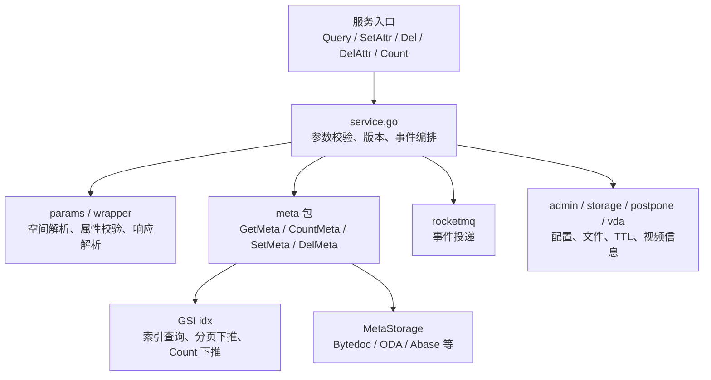

# Core Metadata Service — core

## 模块定位

`fuxi/core/service` 是 Core Metadata Service 的业务编排层，负责把 Kitex 请求转换成元数据读写、索引维护、事件投递、文件副作用和 TTL 任务。它不直接绑定单一存储，而是通过 `fuxi/core/service/meta` 选择底层 `iface.MetaStorage`，并结合 admin 配置决定 schema、索引、分片键、TTL、文件删除策略等运行行为。

核心入口包括：

- `Query` / `QueryWithFuxiAttr`：查询对象元数据并组装 `compound.QueryResp`
- `SetAttr`：创建对象或设置属性
- `Del`：删除对象
- `DelAttr`：删除属性
- `Count`：统计匹配对象数量
- `CopyAttr`：复制属性到另一个对象

## 数据模型与 key 约定

模块内部同时处理两种 key 口径：

- 业务层 key：通常带 `$.` 前缀，例如 `$.title`
- 存储层 key：去掉 `$.` 前缀，例如 `title`

转换由 `entity.StorageKeyToBiz` 和 `entity.BizKeyToStorage` 统一完成。查询、索引、分片键和表达式匹配代码都依赖这个约定，新增逻辑时不要手写字符串裁剪。

系统保留列由 `entity.FuxiAttr` 定义，典型包括 `$._id`、`$._version`、`$._space`、`$._schema`、`$._created_at`、`$._updated_at`。这些字段由系统维护：

- `QueryWithFuxiAttr` 在 `withFuxiAttr=true` 时允许返回系统列。
- `DelAttr` 明确禁止删除 Fuxi 系统列。
- 当系统列被 GSI 索引引用时，`SetAttr` / `Del` 会把相关系统列补进事件，保证索引消费端能正确维护 posting entry。

版本由 `getVersion` 解析和生成。历史对象可能没有版本或存在 V0 版本，事件和索引路径会通过 `vers.NormalizeForIdx` 规整成 V1 编码。

## Query 读路径

`Query` 是 `QueryWithFuxiAttr(ctx, req, req.GetWithFuxiAttr())` 的薄封装。`QueryWithFuxiAttr` 的主要职责是：

1. 根据 `req.Where.Ids` 和 `params.GetSpace` 按 space 分组。
2. 根据是否存在 `Where.Filter` 分流到 `queryWithID` 或 `queryWithFilter`。
3. 对结果做 `Select` 过滤、注册属性匹配和系统列过滤。
4. 按 `compound.QueryResp` 的二维/三维结构组装 `AttrMetas` 与 `AttrVals`。
5. 追加 `vda.GetQueryResp` 返回的视频信息。

`queryWithID` 处理按 ID 查询。它会按 space 分组调用 `meta.GetMeta`，多 space 查询时把 `cctx.Container` 标记为 `_multi`，并汇总各 space 的 storage policy。

`queryWithFilter` 处理带 filter 的查询：

- 如果请求显式带 `Space`，直接调用 `meta.GetMeta`。
- 如果请求没有 `Space`，走跨 space GSI 路径：`meta.QueryIdByIdxCrossSpace` 先按 schema 查询索引，再按 space 分组回表，最后用 `meta.PaginateMetaResultForQuery` 做统一排序和分页。

`QueryWithFuxiAttr` 有两个值得注意的性能优化：

- `isUniversalQuerySelect` 对 `Select == ["$.*"]` 或 `Select == ["*"]` 短路，避免构造 matcher 和逐 key 匹配。
- `regAttrCache` 在单次 Query 请求内缓存 `admin.GetAdminAttrIndex` 结果，避免同 space/schema/schemaVersion 重复查注册属性索引。

返回顺序由 `orderedQueryResultIDs` 维护：

- 有 `Sort.Path` 时按查询结果中的排序字段重新排序。
- 有 `Where.Ids` 时优先保持请求 ID 顺序并去重。
- 否则使用 map key 顺序，不保证业务稳定顺序。

## meta.GetMeta 与 GSI 查询路由

`meta.GetMeta` 是主读路径的核心。它接收 `space`、`schema`、`WhereClause`、排序和分页参数，负责决定走索引还是主表。

当 `where.Filter` 存在且没有显式 ID 时，会先尝试 GSI：

- `queryIdByIdx`：普通 filter-to-index 路由，从表达式中提取 EQ 条件，使用 `selectBestIdxByPrefix` 选择最左前缀匹配的索引。
- `queryIdByIdxOrdered`：分页/排序下推路由。当存在 `orderBy`、`offset` 或显式 `limit` 时，尝试在索引层完成排序和分页，只回表当前页 ID。
- `QueryIdByIdxCrossSpace`：无 space 查询时使用 schema 级索引配置，按返回 entry 的 space 分组。

索引命中后仍会回表复核。`queryIdByIdx` 只返回 posting list 的 oid，不直接作为最终结果；`GetMeta` 会继续调用 `GetMetaByIDWithLimit` 或 `getMetaByIDWithLimitGroupedByShardKeys`，用主表当前数据过滤掉 stale entry。

数组下标路径是特殊情况。`exprNeedsInMemoryFilter` 检测到类似 `$.Arr[0]` 的路径后，避免把原始表达式直接下推给存储，改为回表后使用 `matchBizExpr` 在进程内复核。ordered 下推路径会使用 `matchBizExprDualPath` 同时注入业务 key 和存储 key，避免 filter path 口径不一致导致误删结果。

如果分页相关操作无法在 GSI 下推，`GetMeta` 会检查主表存储能力：

- Bytedoc 支持原生 order/offset/limit，可以回退主表。
- ODA、Abase、TOS 等 KV 存储不支持原生分页，会返回 `ErrPaginationNotSupported`，避免静默返回错误分页结果。

## Count 路径

`Count` 只接受完整的 `Where`、`Schema`、`Space`，然后调用 `meta.CountMeta`。

`CountMeta` 会先执行 `doc.ExprIdHandler` 统一表达式中的 ID/key 口径，再尝试 `countByIdx`。GSI Count 下推是白名单逻辑，只有全部满足才命中：

- `where.Ids` 为空
- filter 是单 leaf，或顶层 AND 且子节点全是 leaf
- 只支持 EQ，以及最多一个范围列上的 GT/GTE/LT/LTE
- filter 所有 path 必须被选中索引列完全覆盖
- 仅支持 simple 索引，bucket 索引回退
- 范围列必须是 `INT` 或 `NUMBER`
- typed value 构造成功

命中后通过 `idx.CountByIndex` 在 posting collection 上计数，不回源，语义是最终一致。未命中或索引查询失败时无损回退到 `storage.Count`，参数通过 `iface.NewQueryFilter` 封装。

## SetAttr 写路径

`SetAttr` 是创建和更新属性的统一入口，整体流程是“先查询当前快照，再构造事件和索引操作，最后 CAS 写主表”。

关键步骤：

1. 用 `params.WrapReq` 解析 ID、space、schema。
2. 用 `wrapper.Set` 构造写入包装器。
3. 依次执行 `ArrCheck`、`RegCheck`、`CharCheck`，校验数组完整性、注册属性和字符合法性。
4. 用 `resolveShardingKeys` 从 `req.Values` 和 `req.Where.Filter` 合并分片键。
5. 在最多 `maxRetryTimes == 3` 次循环内执行读改写。

每次重试内：

- 通过 `buildSetAttrQuerySelect` 预判需要查询的字段。它会包含本次写入字段、被命中索引需要的补充列，以及 Bytedoc 分片键。
- 调用 `QueryWithFuxiAttr(..., true)` 获取当前对象快照。
- 已存在对象禁止修改分片键。
- `WriteMode_InsertOnly` 且对象已存在时返回 `AlreadyExists`，不会触发事件、索引或主表写入。
- 如果 `Where.Filter` 存在且对象已存在，`meta.MatchWhereFilter` 会做内存预判；信息不足时放行，由 Bytedoc 做权威判断。
- `getVersion` 生成 `oldVer` 和 `newVer`。
- `diff` 计算 `Created`、`Updated`、`hasChange` 和被覆盖的旧文件。
- `appendIndexedFuxiAttrChanges` 把被索引的系统列补进事件。
- `HandleEvent` 做事件前置处理。
- `HandleUniqIdx` 预写唯一索引，并返回 `cleanup` 和 `rollback` 函数。
- `wrap.Set` 写主表；如果返回 `iface.WrongVersion`，回滚唯一索引并重试。
- 主表成功后执行唯一索引旧 entry 清理。
- 删除被覆盖的旧文件，受 `admin.GetDelFile` 控制。
- `appendIndexedFuxiTimestampChanges` 用主表写入返回的 `nowTs` 补齐 `$._created_at` / `$._updated_at` 事件值。
- `BuildIdxSnapshot` 预填 GSI 索引快照。
- `rocketmq.QuickSent` 投递事件。
- `handleTTL` 根据 `admin.GetTTL` 创建延期删除任务。

慢请求通过 `timing.New` 记录分阶段耗时。总耗时超过 `slowThreshold == 200ms` 时打印 `[SetAttr slow]`，并通过 `metrics.ReportSetAttrStage` 上报每个阶段。

## Del 与 DelAttr 删除路径

`Del` 删除整个对象。它会先解析 space/schema，处理跨 region 请求，然后调用 `VideoDelete`。如果视频删除已经由下游执行且当前 storage 配置缺失或非法，`Del` 会直接返回成功，避免重复操作主表。

主删除流程：

1. 用 `resolveShardingKeys` 和 `injectShardingKeysIntoWhere` 给 Query/CAS 路由补充分片键。
2. 查询待删除对象完整属性，使用 `wrapper.ParseQueryWithSysID` 保留 `$._id`。
3. 对带 filter 的删除构造包含 ID、version、sharding key 的 OR 表达式。
4. 调用 `meta.DelID` 执行 CAS 删除。
5. 删除文件属性对应的文件，受 `admin.GetDelFile` 控制。
6. 调用 `HandleIdxCleanupForDel` 清理 GSI。
7. 对每个对象发送 `EventType_DEL` 事件。普通 Fuxi 系统列会从 `Deleted` 过滤掉，但被索引的 Fuxi 系统列会保留。

`DelAttr` 删除单个对象上的属性。它和 `Del` 的主要差异是：

- 删除前禁止删除 `entity.FuxiAttr` 系统列。
- 查询后使用 `wrapper.Del(paths).Matches(query).CheckArray()` 计算实际命中的删除属性。
- 禁止删除 Bytedoc 分片键。
- 构造 `EventType_DEL_ATTR` 事件。
- 调用 `HandleUniqIdxForDel` 处理唯一索引删除。
- 调用 `meta.DelMeta` 删除属性。
- 写成功后调用 `BuildIdxSnapshot`，再投递 MQ 事件。

`Del`、`DelAttr`、`SetAttr` 都会在 `iface.WrongVersion` 时最多重试 3 次。`doc.ErrShardingKeyNotSet` 会统一映射为 `InvalidParam`，`iface.ErrObjNotFound` 会映射为 `NotFound`。

## 分片键处理

Bytedoc 分片表要求 Query 和 CAS 写入都带上完整分片键。service 层统一用以下函数处理：

- `resolveShardingKeys`：从写入 kv 和 `Where.Filter` 提取分片键，检测冲突。
- `extractShardingKeysFromFilter`：递归遍历 `compound.Expression`，只收集 EQ 条件。
- `injectShardingKeysIntoWhere`：把解析出的分片键以 AND leaf 形式补进 `where.Filter`。

`resolveShardingKeys` 只在 `admin.GetStorage` 返回 `entity.Bytedoc` 且 `admin.GetBytedocIdx` 配置了分片键时生效。返回的 map 使用存储层 key，例如 `map["tenant_id"]="123"`。如果任一分片键缺失，则返回 nil，让底层存储按原有逻辑处理或返回 `doc.ErrShardingKeyNotSet`。

## 事件与索引一致性

写路径把事件作为索引维护和异步消费的核心契约。`SetAttr`、`DelAttr`、`Del` 发送的事件包含：

- `ID`
- `Type`
- `Version.Before` / `Version.After`
- `Created` / `Updated` / `Deleted`
- `Extras`

索引相关处理分为两类：

- 唯一索引：`HandleUniqIdx` 在主表写入前预写新 entry，失败时 rollback；主表成功后 cleanup 旧 entry。`HandleUniqIdxForDel` 处理删除属性场景。
- GSI：`BuildIdxSnapshot` 在投递前补全索引维护所需字段，降低消费端回源成本；整对象删除使用 `HandleIdxCleanupForDel` 直接清理索引桶。

被索引的 Fuxi 系统列需要特殊处理。`appendIndexedFuxiAttrChanges` 在写主表前能补 `$._id`、`$._version`、`$._space`、`$._schema`；`appendIndexedFuxiTimestampChanges` 必须等主表写成功后，用 `meta.SetMeta` 返回的权威 `nowTs` 补 `$._created_at` 和 `$._updated_at`。

## CopyAttr

`CopyAttr` 复制源对象属性到目标对象：

1. 解析目标 space 和 schema。
2. 根据 `req.CopyKeys` 构造 from-to 映射。
3. 调用 `Query` 查询源属性。
4. 用 `attrMapping` 展开通配符映射，并检测目标 key 冲突。
5. 对文件属性，如果 `FileAttrCopyType_Copy`，通过 `newUri` 生成目标 URI，并调用 `storage.Copy` 复制文件。
6. 最终复用 `SetAttr` 写入目标对象。

`attrMapping` 使用 `keys.Match` 支持通配符路径。目标路径中的 `*` 数量必须和源匹配捕获数量一致，否则返回错误。

跨 region copy 当前实际不可用：代码在 `ToFuxiRegion` 不是当前 region 时直接返回 `not support to copy cross region yet`，后面的远程 `acc_cli.SetAttr` 分支不可达。

## 与底层存储的连接

`meta` 包通过 `CtxStorageSelector` 和 `MetaStorageSelector` 选择底层存储实现。读写参数通过 `iface` 层封装：

- `iface.NewQueryFilter`：封装 ids、filter、注册属性类型表，供 `QueryAttr` 和 `Count` 使用。
- `iface.NewSetParams`：封装 set/del、版本、filter 等写入参数，供 `UpdateAttr` 使用。
- `iface.NewQueryFilterWithID`：用于带 ID 的删除/更新过滤场景。

`GetMetaByIDWithLimit` 会先从 cache 批量读取，再把未命中的 ID 交给 `storage.QueryAttr`。返回前统一调用 `entity.StorageAttrToBiz` 转回业务 key。

## 贡献注意事项

修改读路径时要保留“索引只做候选集，主表负责最终复核”的契约。任何直接消费 `queryIdByIdx` / `queryIdByIdxOrdered` 返回 oid 的新代码，都必须自行做回源校验，否则 stale posting entry 会暴露给调用方。

修改写路径时要保持副作用顺序：唯一索引预写在主表前，主表失败必须 rollback；MQ 事件必须在主表成功并补齐索引快照后发送；文件删除和 TTL 任务不能影响主写入成功语义。

新增 filter、排序或分页能力时，需要同时检查 GSI 下推、Bytedoc 原生能力和 KV 存储不支持分页的失败语义，避免在 ODA/Abase 路径上静默忽略 `offset` 或 `limit`。

新增系统列或 key 转换逻辑时，必须同步考虑 `entity.FuxiAttr`、`QueryWithFuxiAttr`、`appendIndexedFuxiAttrChanges`、`appendIndexedFuxiTimestampChanges`、`DelAttr` 的系统列保护，以及 GSI 事件消费所需字段。