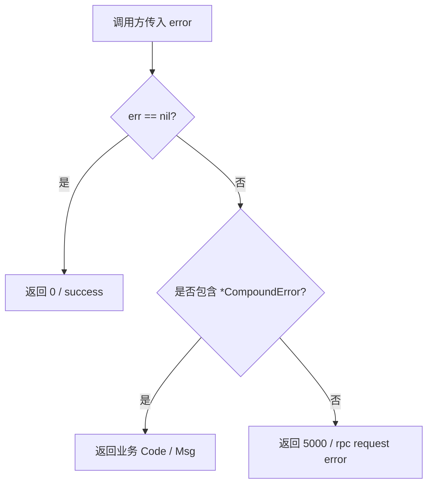

# Core Metadata Service — errno

## errno 模块

`errno` 提供 Core Metadata Service 内部统一的错误码封装与错误消息转换能力。它的职责很窄：把业务错误表示为带 `Code` 和 `Msg` 的 `CompoundError`，并在接口返回前通过 `CodeMsg` 转成稳定的 `(code, message)` 结构。

## 核心类型

```go
type CompoundError struct {
	Code int32
	Msg  string
}
```

`CompoundError` 是模块内唯一的结构化错误类型。它实现了 Go 标准库的 `error` 接口：

```go
func (e *CompoundError) Error() string {
	return fmt.Sprintf("CompoundError: code: %d, msg: %s", e.Code, e.Msg)
}
```

`Error()` 主要用于日志、测试断言或被普通 `error` 链路打印时展示完整错误内容。业务返回时不直接使用这段字符串，而是通过 `CodeMsg` 提取 `Code` 和 `Msg`。

## 错误构造

### `ParamEmpty`

```go
func ParamEmpty(param string) *CompoundError
```

`ParamEmpty` 用于生成参数缺失或参数值为空的业务错误：

```go
return errno.ParamEmpty("user_id")
```

返回的错误内容为：

```go
&CompoundError{
	Code: 4000,
	Msg:  "user_id is missing or the value is empty",
}
```

当前模块中 `4000` 表示请求参数问题。调用方可以直接返回这个错误，也可以包裹后交给 `CodeMsg` 处理；`CodeMsg` 使用 `errors.As` 识别错误链中的 `*CompoundError`。

## RPC 错误兜底

### `RPCErr`

```go
func RPCErr(err error) error
```

`RPCErr` 用于规范化 RPC 调用错误。当 RPC 返回的 `err` 为 `nil`，但调用方仍然需要表达“请求失败”时，它会生成一个普通错误：

```go
func RPCErr(err error) error {
	if err == nil {
		return errors.New("rpc request error")
	}
	return err
}
```

注意：`RPCErr(nil)` 返回的是普通 `error`，不是 `*CompoundError`。因此后续经过 `CodeMsg` 时会被转换为通用 RPC 错误码 `5000`。

## 错误码转换

### `CodeMsg`

```go
func CodeMsg(err error) (int32, string)
```

`CodeMsg` 是模块最重要的出口函数，用于把任意 `error` 转成接口层可返回的错误码和错误消息。

转换规则如下：

| 输入错误 | 返回 code | 返回 message |
|---|---:|---|
| `nil` | `0` | `"success"` |
| 错误链中包含 `*CompoundError` | `CompoundError.Code` | `CompoundError.Msg` |
| 其他普通错误 | `5000` | `"rpc request error: " + err.Error()` |

核心逻辑：

```go
func CodeMsg(err error) (int32, string) {
	if err == nil {
		return 0, "success"
	}

	var e *CompoundError
	if errors.As(err, &e) {
		return e.Code, e.Msg
	}

	return 5000, fmt.Sprintf("rpc request error: %s", err.Error())
}
```

`errors.As` 允许调用方使用标准错误包装方式保留业务错误语义：

```go
err := fmt.Errorf("查询元数据失败: %w", errno.ParamEmpty("vid"))

code, msg := errno.CodeMsg(err)
// code == 4000
// msg == "vid is missing or the value is empty"
```

## 执行路径



## 与代码库的连接

`errno` 不依赖项目内其他包，只使用 Go 标准库的 `errors` 和 `fmt`。这让它可以作为底层公共模块被接口层、业务层或工具函数安全引用。

当前调用关系中，`util/biz_handler_err.go` 会调用 `CodeMsg`，说明该模块承担了业务 handler 错误返回格式化的职责。测试文件 `errno/code_test.go` 覆盖了 `CompoundError.Error`、`ParamEmpty`、`RPCErr` 和 `CodeMsg` 的主要行为。

## 贡献注意事项

新增业务错误时，优先沿用 `CompoundError` 表达明确的业务错误码和用户可读消息。只有无法归类的系统错误、RPC 错误或第三方错误才应走 `CodeMsg` 的 `5000` 兜底路径。

如果新增类似 `ParamEmpty` 的构造函数，应保持返回类型为 `*CompoundError`，这样 `errors.As` 可以继续识别包装后的错误链。不要让业务错误只以普通 `errors.New` 返回，否则接口层会丢失具体业务码并被归类为 `5000`。