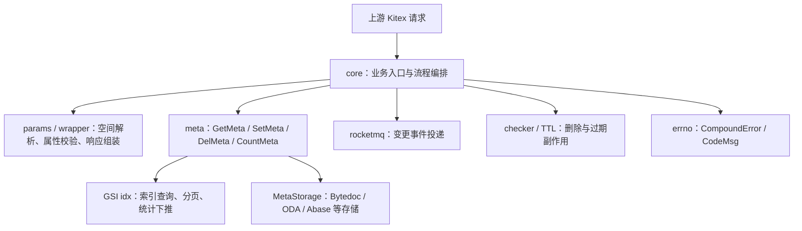

# Core Metadata Service

## 模块概览

Core Metadata Service 是元数据读写的业务编排层，围绕对象属性、索引、存储选择、事件投递和删除副作用组织核心流程。模块组主要由 [core 子模块](core.md) 和 [errno 子模块](errno.md) 协作完成：`core` 负责执行 `Query`、`SetAttr`、`Del`、`DelAttr`、`Count`、`CopyAttr` 等元数据操作，`errno` 负责把参数缺失等业务错误统一表示为 `CompoundError`，并通过 `CodeMsg` 转换成稳定的返回码与消息。

## 子模块协作

[core 子模块](core.md) 是请求进入后的主路径。它先完成参数校验、空间与 schema 解析，再根据请求类型调用 `service/meta` 中的 `GetMeta`、`SetMeta`、`DelMeta`、`CountMeta` 等能力。`meta` 层继续负责选择 `iface.MetaStorage`，并在可用时结合 GSI idx 做索引查询、分页下推或 Count 下推。

[errno 子模块](errno.md) 为这些流程提供统一错误语义。比如参数为空时可构造 `ParamEmpty`，业务层最终通过 `CodeMsg` 输出 `(code, message)`，避免把 Go 的 `error` 字符串直接暴露给接口调用方。

## 跨模块关键流程

查询流程从 `Query` 进入，并委托给 `QueryWithFuxiAttr` 处理属性选择、过滤条件和响应组装。需要索引时，`GetMeta` 会进入 `queryIdByIdxOrdered`、`GetMetaByIdsFromIdx` 等路径，再按分片键组织到 `getMetaByIDWithLimitGroupedByShardKeys`，最后返回 `compound.QueryResp`。

写入流程由 `SetAttr` 编排。它会结合 `MatchWhereFilter`、`SetMeta`、`NewSetParams`、`NewUpdateWrapper` 等组件完成条件匹配、属性更新、分片键注入和存储写入；涉及索引字段时，还会整理 Fuxi 属性变更并触发后续事件。

删除流程由 `Del` 和 `DelAttr` 分别处理对象删除与属性删除。`Del` 会检查存储有效性、读取版本信息，并联动 `checker` 中的 `VideoDelete` / `vDelete` 等副作用；`DelAttr` 则通过 `DelMeta` 落到元数据层。

统计流程由 `Count` 调用 `CountMeta`，在条件可被索引解析时走 `countByIdx` 与 `extractCountConditions`，否则回退到普通过滤与存储查询能力。

整体上，`core` 决定“做什么”和“按什么规则做”，`meta` 与存储、索引系统决定“从哪里读写”，`errno` 保证异常场景对外有一致的错误契约。