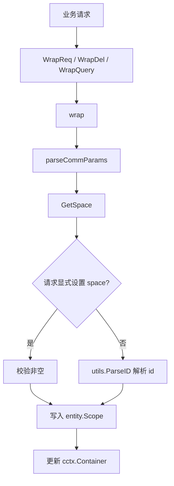
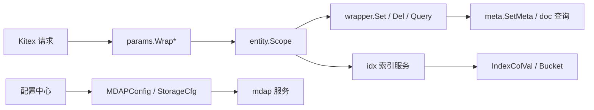

# Domain Models and Parameters

## 模块概览

该模块定义 Fuxi 核心路径共享的领域模型、配置结构、参数归一化逻辑和请求/查询结果包装器。它不负责具体业务执行，而是为 `admin`、`doc`、`meta`、`idx`、`mdap` 等服务层提供稳定的数据结构和边界转换能力。

主要代码分布：

- `fuxi/core/config`：服务配置 key、PSM、`StorageCfg`、`MDAPConfig`。
- `fuxi/core/consts/entity`：系统字段、类型检查、GSI bucket、索引列 typed value、事件、存储类型、scope。
- `fuxi/core/utils/params`：从请求中解析 `space/schema/schema_ver/id`。
- `fuxi/core/utils/vers`：HLC 版本封装和索引路径版本归一化。
- `fuxi/core/utils/wrapper`：Set/Delete/Query 相关的属性展开、校验、序列化辅助。
- `fuxi/core/utils/view`：基于 Vitess 的 SQL 解析实验性工具。

## 配置模型

### 服务常量与配置 key

`config.PSM` 固定为：

```go
const PSM = "bytedance.videoarch.compound"
```

`fuxi/core/config/keys.go` 中的常量使用 `conf.Key` 表示配置中心 key，例如：

- `config.Fed`
- `config.StorageCfgKey`
- `config.MDAP`
- `config.Event`
- `config.DomainTokenCfg`

这些 key 只描述配置入口，不包含加载逻辑。

### StorageCfg

`StorageCfg` 用于按 `space + schema` 选择存储后端：

```go
type StorageCfg struct {
	Filter  []Filter           `json:"filter"`
	Default entity.StorageType `json:"default"`
}
```

`StorageCfg.Get(space, schema string)` 会先扫描 `Filter`，命中完全匹配时返回对应 `Filter.Storage`，否则返回 `Default`。

```go
storage := cfg.Get("default", "media")
```

`Filter` 的匹配条件是严格相等：

```go
type Filter struct {
	Space   string             `json:"space"`
	Schema  string             `json:"schema"`
	Storage entity.StorageType `json:"storage"`
}
```

支持的存储类型定义在 `entity.StorageType`：

- `entity.Tos`
- `entity.Abase2`
- `entity.Oda`
- `entity.Bytedoc`

### MDAPConfig

`MDAPConfig` 是 MDAP 相关服务的配置聚合，覆盖 schema 名称、ArtifactType 映射、处理后端和 Prodia / Transcode Router 参数。

关键字段：

```go
type MDAPConfig struct {
	AssetGroupSchema string `yaml:"asset_group_schema"`
	SourceSchema     string `yaml:"source_schema"`
	ArtifactSchema   string `yaml:"artifact_schema"`

	ArtifactTypes map[string]ArtifactTypeConfig `yaml:"artifact_types"`

	TranscodeRouterStartURL           string `yaml:"transcode_router_start_url"`
	TranscodeRouterDestinationCluster string `yaml:"transcode_router_destination_cluster"`
	TranscodeRouterFallbackTaskListID string `yaml:"transcode_router_fallback_task_list_id"`
	WithSD                            bool   `yaml:"with_sd"`

	DigestTaskParamsByTemplateID map[string]string `yaml:"digest_task_params_by_template_id"`
	DefaultDigestTaskParams      string            `yaml:"default_digest_task_params"`

	ProcessingBackendType string       `yaml:"processing_backend_type"`
	ProdiaConfig          ProdiaConfig `yaml:"prodia_config"`
}
```

默认值通过 getter 集中处理：

- `GetAssetGroupSchema()`：空值返回 `"mdap_asset_group"`。
- `GetSourceSchema()`：空值返回 `"mdap_source"`。
- `GetArtifactSchema()`：空值返回 `"mdap_artifact"`。
- `GetTranscodeRouterStartURL()`：空值返回默认 Transcode Router BOE URL。
- `GetTranscodeRouterFallbackTaskListID()`：`nil` 或空值返回默认 task list id。
- `GetProcessingBackendType()`：`nil` 或空值返回 `"transcode_router"`。
- `GetProdiaCluster()`：`nil` 或空值返回 `"default"`。
- `GetProdiaWorkflowDpName()`：`nil` 或空值返回 `"default"`。

`GetDigestTaskParamsByTemplateID(templateID)` 用于按模板选择下游 JSON 参数：先查 `DigestTaskParamsByTemplateID[templateID]`，未命中或 `templateID` 为空时回退到 `DefaultDigestTaskParams`。

`GetArtifactTypeConfig(typeName)` 从 `ArtifactTypes` 查找配置，未配置时返回 `nil`。调用方需要显式处理不存在的 ArtifactType。

Prodia 相关 getter 都容忍 `MDAPConfig == nil`：

```go
cfg.GetProdiaWorkflowName()
cfg.GetProdiaCallbackTopic()
cfg.GetProdiaSecret()
```

其中大部分空配置返回空字符串，只有 cluster 和 workflow dp name 有 `"default"` 默认值。

## Scope 与公共参数解析

`entity.Scope` 是请求执行时的最小作用域：

```go
type Scope struct {
	Space     string `json:"space"`
	Schema    string `json:"schema"`
	SchemaVer string `json:"schema_ver"`
}
```

`fuxi/core/utils/params` 负责把不同请求形态归一为内部 `param` 接口：

```go
type param interface {
	GetErr() error
	GetSpace(id string) string
	GetSchema(id string) string
	GetScope(id string) entity.Scope
	GetSpaceList() []string
	GetIDsBySpace(space string) []string
}
```

入口函数：

- `WrapReq(ctx, req ParamHolder)`：用于包含 `space/schema/schema_version/id` 的普通请求。
- `WrapDel(ctx, req ScopeIDHolder)`：用于删除请求，不读取 schema version。
- `WrapQuery(ctx, req *compound.QueryReq, ids ...string)`：用于查询请求，会把 `req.Where.Ids` 和额外传入的 `ids` 合并解析。

解析流程：



`GetSpace(ctx, id, holder)` 的规则：

1. 如果 `holder.IsSetSpace()` 为 true，则使用 `holder.GetSpace()`。
2. 显式设置但值为空时返回 `empty space set`。
3. 未显式设置时调用 `utils.ParseID(ctx, id)` 从 id 中解析 space。
4. id 无法解析时返回 `invalid id %s` 包装错误。

`parseCommParams` 还会更新 `cctx.GetContainerOrEmpty(ctx)` 中的 `Space` 和 `Schema`。如果一次请求涉及多个 space，则最终把 `ctn.Space` 置为 `"_multi"`。

注意：`parseCommParams` 要求 schema 非空，空 schema 会设置 `p.err = errs.New("empty schema")`。调用方必须检查 `GetErr()`。

## 系统字段与属性类型

### 字段命名约定

业务层字段带 `$.` 前缀，存储层字段不带前缀：

```go
const KeyPrefix = "$."
```

转换函数：

- `BizKeyToStorage(k string)`：移除 `$.` 前缀。
- `StorageKeyToBiz(k string)`：增加 `$.` 前缀。
- `BizAttrToStorage(m map[string]string)`：批量转换 map key。
- `StorageAttrToBiz(m map[string]string)`：批量转换 map key，`nil` 输入返回 `nil`。
- `BizKeyListToStorage(keys []string)`：批量转换 key 列表。

系统保留列：

```go
const DefaultIdColumn = "$._id"
const VersionColumn = "$._version"
const SpaceColumn = "$._space"
const SchemaColumn = "$._schema"
const CreatedAtColumn = "$._created_at"
const UpdatedAtColumn = "$._updated_at"
```

`FuxiAttr` 定义系统字段的注册类型，系统字段优先级高于 admin 注册属性。`wrapper.setWrapper.RegCheck` 中会先查 `admin.FuxiAttrIndex()`，再查业务注册属性，避免用户注册覆盖系统列。

### 类型检查与值转换

`TypeCheck(ctx, t, s)` 用于 Set 路径校验字符串值是否符合注册类型：

- `compound.AttrType_BLOB`：总是通过。
- `compound.AttrType_INT`：必须能 `strconv.ParseInt`。
- `compound.AttrType_NUMBER`：必须能 `strconv.ParseFloat`。
- `compound.AttrType_FILE`：总是通过。
- `compound.AttrType_BOOL`：只接受 `"true"` 或 `"false"`。
- 未知类型：记录日志并返回 false。

`ConvertAttrValue(raw, typ)` 用于把字符串转换为真实 BSON 值，主要服务 GSI typed index：

- `INT` 转 `int64`，失败返回 error。
- `NUMBER` 转 `float64`，失败返回 error。
- `BOOL` 转 `bool`，只接受 `"true"` / `"false"`。
- `BLOB`、`FILE`、未知类型保持 string。

它和 `TypeCheck` 的区别是：`TypeCheck` 只返回布尔值，`ConvertAttrValue` 返回转换后的原生值，并在失败时带错误原因。

## 版本模型

`fuxi/core/utils/vers` 用 `Ver` 封装 HLC 版本，同时保留两个特殊状态：

```go
type Ver struct {
	notSet   bool
	noExists bool
	h        hlc.HLC
}
```

构造函数：

- `New()`：创建新的 HLC 版本。
- `NewBy(v *Ver)`：基于已有版本创建新版本；`nil` 输入返回 `NotExists()`。
- `NotSet()`：表示未设置，对应 `ToInt64() == 0`、`ToInt64Str() == ""`。
- `NotExists()`：表示不存在，对应 `ToInt64() == -1`、`ToInt64Str() == "-1"`。
- `Parse(str)`：解析字符串，空串为 `NotSet()`，`"-1"` 为 `NotExists()`，其他走 `hlc.ParseInt64Str`。

常用方法：

- `ToInt64Str()`
- `ToInt64()`
- `IsNotSet()`
- `IsNotExists()`
- `NewerThan(other Ver)`
- `String()`

`NormalizeForIdx(raw int64)` 是索引路径的重要边界函数。它把来自主表、事件或修复任务的版本统一成 idx 包可处理的合法 V1 编码：

- 合法 V1：原样返回。
- V0：返回 `entity.VerBoundaryMin`。
- `0`、`-1`、非法值：返回 `entity.VerBoundaryMin`。

该函数不改写主表 `_version` 字段，只用于进入 idx 包前的归一化。`RemoveFromIndex`、`RemoveEntryFromBucket`、`UpdateIndexWithShardingKeys` 等索引流程都会通过边界 normalize 进入 `NormalizeForIdx`。

## GSI 索引模型

### IdxCfg

`IdxCfg` 描述一个 GSI 索引定义：

```go
type IdxCfg struct {
	Name          string
	Space         string
	Schema        string
	Columns       []string
	IsUniq        bool
	BucketEnabled bool
	Collection    string
	TxnSupported  bool
}
```

关键语义：

- `Columns` 是索引列名，通常含 `$.` 前缀，并与 admin 注册属性 key 对齐。
- `BucketEnabled == false` 表示简单模式：每个 `(idx, key)` 一个 posting 文档。
- `BucketEnabled == true` 表示分桶模式：posting list 按版本区间分裂、合并。
- `Collection` 非空时使用自定义 collection；为空时由调用方按 `gsi_posting_{space}_{schema}_{name}` 生成。
- `TxnSupported` 是历史字段，业务路径恒为 true，新代码不应基于它选择并发控制策略。

`HasWildcardColumn()` 判断 `Columns` 中是否存在 `*`，用于识别 `$.tags[*]` 这类通配列。

### IndexColVal

`IndexColVal` 是 GSI typed index 的列值载体：

```go
type IndexColVal struct {
	Typ compound.AttrType
	Val any
	Raw string
}
```

它同时服务写入 doc 和构造查询 filter。核心不变式是：同一组 `(Raw, Typ)` 必须通过同一转换路径得到相同的 `BSONValue()`，这样写入、删除、查询、reconcile 重写才能构造同构的 `colN` 谓词。

构造入口：

- `NewIndexColVal(raw, typ)`：严格按类型转换，失败返回 error。
- `StringCols(raws ...string)`：按 BLOB/string 语义构造，不会失败。
- `BuildIndexColVals(vals, cols, attrMap, strict)`：按列名从注册属性表中取类型并批量构造。

`BuildIndexColVals` 的 `strict` 决定失败策略：

- `strict == true`：写入路径使用，转换失败直接返回 error，拒绝写入脏类型。
- `strict == false`：读取 / Count 路径使用，转换失败回退为 BLOB/string。这样不会匹配 typed 行，语义上等价于“无此值”。

辅助函数：

- `RawCols(cols)`：取原始字符串，用于日志、key 序列化、兼容旧接口。
- `BSONCols(cols)`：取真实 BSON 值，用于 doc/filter 构造。

### Bucket 与 posting list

`Bucket` 是分桶模式下的 GSI posting bucket 文档模型，对应 MongoDB/Bytedoc collection `gsi_posting_{space}_{schema}_{index_name}`。

```go
type Bucket struct {
	ID      interface{}   `bson:"_id,omitempty"`
	Idx     string        `bson:"idx"`
	Space   string        `bson:"space"`
	Schema  string        `bson:"schema"`
	Cols    []string
	IdxVer  int64         `bson:"idx_ver"`
	Cnt     int           `bson:"cnt"`
	MinVer  int64         `bson:"min_ver"`
	MaxVer  int64         `bson:"max_ver"`
	Entries []BucketEntry `bson:"entries"`
}
```

`BucketEntry` 保存主表对象和回表所需信息：

```go
type BucketEntry struct {
	Oid          string            `bson:"oid"`
	Ver          int64             `bson:"ver"`
	ShardingKeys map[string]string `bson:"sk,omitempty"`
}
```

`ShardingKeys` 是为了分片主表回表查询准备的。只拿 `oid` 不一定能路由到正确分片，因此 GSI posting entry 会携带主表查询所需的分片键。历史数据可能没有 `sk` 字段，读取时允许为空。

版本边界使用哨兵值替代旧的 `null` 语义：

- `VerBoundaryMin`：负无穷，所有合法业务 V1 版本都大于它。
- `VerBoundaryMax`：正无穷，也表示活跃桶。

桶状态方法：

- `IsActive()`：`MaxVer == VerBoundaryMax`。
- `IsSealed()`：`MaxVer != VerBoundaryMax`。
- `IsMinBoundary()`：`MinVer == VerBoundaryMin`。
- `IsMaxBoundary()`：等价于活跃桶判断。
- `IsFull()`：活跃桶 `Cnt >= BucketSize`。
- `NeedsSplit()`：封口桶 `Cnt >= BucketSoftMax`。
- `CanSoftAppend()`：封口桶 `Cnt < BucketSoftMax`。
- `NeedsMerge()`：封口桶 `Cnt < BucketMergeThreshold`。

默认阈值：

- `BucketSize = 1000`
- `BucketSoftMax = 1200`
- `BucketMergeThreshold = 250`

### Bucket BSON 序列化

`Bucket.ToBson()` 把 `Bucket` 展开成 `bson.M`。`Cols` 不直接序列化为数组，而是展开成 `col1`、`col2`、`col3`：

```go
bucket := entity.Bucket{
	Idx:    "UserCountry_IsPrivate",
	Space:  "default",
	Schema: "schema_test",
	Cols:   []string{"US", "false"},
}
doc := bucket.ToBson()
```

生成字段包含：

```go
// 示例字段：
// idx, space, schema, col1, col2, idx_ver, cnt, min_ver, max_ver, entries
```

`BucketFromBson(data)` 负责反序列化：

- 动态扫描 `colN` 字段并按 N 排序填充 `Cols`。
- `min_ver` 缺失或为 nil 时使用 `VerBoundaryMin`。
- `max_ver` 缺失或为 nil 时使用 `VerBoundaryMax`。
- `entries` 支持 `bson.M` 和 `bson.D` 两种元素形态。
- `sk` 支持 `map[string]string` 和 `bson.M`。

### GSI filter 构造

列字段名由 `ColKey(i)` 统一生成，`i` 是 0-based，返回 `col1`、`col2` 等。

字符串列 filter：

- `ColsFilter(cols []string)`
- `BaseFilter(idx, space, schema string, cols []string)`
- `BaseFilterCrossSpace(idx, schema string, cols []string)`

typed 列 filter：

- `ColsFilterTyped(cols []IndexColVal)`
- `BaseFilterTyped(idx, space, schema string, cols []IndexColVal)`
- `BaseFilterCrossSpaceTyped(idx, schema string, cols []IndexColVal)`

分桶版本路由使用 `VersionRouteFilter(idx, space, schema, cols, ver)`：

```go
filter := entity.VersionRouteFilter("idx_name", "space_a", "schema_a", []string{"US"}, ver)
```

它构造 V3 形态 filter，把分片键 `idx + col1..colN` 放在 `$and` 数组的独立等值 clause 中：

```go
bson.M{
	"space":  space,
	"schema": schema,
	"$and": bson.A{
		ShardClause(idx, cols),
		bson.M{"min_ver": bson.M{"$lte": ver}},
		bson.M{"max_ver": bson.M{"$gt": ver}},
	},
}
```

这样 Bytedoc 能正确提取分片键，避免路由失败。

跨 space 查询使用 `CrossSpaceEntry` 在内存中把 `Bucket.Space` 和 `BucketEntry` 关联起来：

```go
type CrossSpaceEntry struct {
	Space string
	Entry BucketEntry
}
```

该结构不对应 DB 文档，只用于查询流程的数据搬运。

### RetryLimiter

`RetryLimiter` 是 GSI 分桶写入/删除路径的全局重试比例限制器。它用双窗口加权滑动统计 `retries / calls`，当比例达到 `MaxRetryRatio` 时拒绝新的重试。

全局实例：

```go
var GlobalRetryLimiter = &RetryLimiter{windowStart: time.Now()}
```

使用方式：

```go
entity.GlobalRetryLimiter.RecordCall()

if entity.GlobalRetryLimiter.AllowRetry() {
	// 执行一次重试
}
```

行为要点：

- `RecordCall()` 在重试循环前调用，记录首次调用次数。
- `AllowRetry()` 允许时会自动增加 retry 计数。
- 样本数低于 `retryMinSample` 时直接放行，避免冷启动误判。
- 窗口通过 `rotate()` 惰性轮转，不需要后台定时器。

## Set / Delete / Query 包装器

`fuxi/core/utils/wrapper` 把外部请求中的属性 KV、查询结果和数组路径转换成 meta/doc 层需要的形态。

### SetWrapper

入口：

```go
wrapper.Set(scope, id, kv)
```

其中 `kv` 是 `[]*compound.AttrVal`，内部会转成 `map[string]string`。

推荐调用顺序：

```go
w := wrapper.Set(scope, id, attrs).
	CharCheck().
	RegCheck(ctx).
	ArrCheck()

if resp := w.GetResp(); resp != set_meta_resp.Success {
	return resp
}

nowTs, err := w.Set(ctx, id, oldVer, newVer, filter)
```

各步骤职责：

- `CharCheck()`：当前是占位实现。
- `RegCheck(ctx)`：校验属性是否注册，并用 `entity.TypeCheck` 校验字符串值类型。
- `ArrCheck()`：解析数组字段，校验数组下标从 0 连续。
- `Set(ctx, id, oldVer, newVer, filter)`：调用 `meta.SetMeta` 落库，返回实际写入时间戳 `nowTs`。

`RegCheck` 的注册属性查找顺序：

1. `admin.FuxiAttrIndex().Lookup(key)`
2. `admin.GetAdminAttrIndex(ctx, space, schema, schemaVer).Lookup(key)`

这保证系统字段优先。

数组字段会在 `kv2Set()` 中合并为一个 `prefix+"[]"` 字段，值是 JSON 字符串。例如输入：

```go
// 输入 KV
"items[0].name" = "a"
"items[1].name" = "b"
```

会被合并为：

```go
// 落库 KV
"items[]" = "{\"[0].name\":\"a\",\"[1].name\":\"b\"}"
```

`parseArray()` 支持嵌套数组路径，但数组完整性按每个出现的 prefix 单独检查。下标必须是数字，缺少 `]` 或下标非数字都会设置 `InvalidParam` 响应。

### DelWrapper

入口：

```go
wrapper.Del(paths)
```

调用流程：

```go
w := wrapper.Del(paths).
	Matches(existingMeta).
	CheckArray()

if resp := w.GetResp(); resp != del_attr_resp.Success {
	return resp
}

toDelete := w.GetDel()
```

`Matches(kv)` 使用 `keys.NewMatchers(paths)` 匹配已有属性：

- 命中的属性进入 `matchedKV`。
- 未命中的属性进入 `notDel`。
- `GetDel()` 返回真正要传给 meta 删除的 key 集合。

`CheckArray()` 处理数组删除语义：

- 如果命中 key 包含 `[`，取第一个 `[` 前的 prefix。
- 删除项转换为 `prefix + "[]"`。
- 如果同一数组 prefix 下还有未删除属性，则返回 `del_attr_resp.ArrayIncompleteDelete`。

这意味着数组属性不支持只删除部分元素；一旦删除数组中的任意路径，就必须删除该数组 prefix 下全部数据。

### QueryWrapper

入口：

```go
result := wrapper.Query(kv).GetAll()
```

它把存储层数组字段展开回普通路径：

- 非数组字段原样返回。
- 以 `[]` 结尾的字段会把 JSON 值反序列化为 `map[string]string`，再拼回 prefix。

例如：

```go
// 存储层
"items[]" = "{\"[0].name\":\"a\",\"[1].name\":\"b\"}"
```

展开为：

```go
// 查询结果
"items[0].name" = "a"
"items[1].name" = "b"
```

JSON 反序列化失败时只记录日志，不中断解析。

### QueryResp 解析工具

`key_attr.go` 提供若干 `compound.QueryResp` 解析函数：

- `QueryExists(result, id)`：判断查询结果中是否存在 id。
- `GetVersion(result)`：解析每个 id 的 `$._version`，返回 `map[string]vers.Ver`。
- `ParseQuery(result)`：按 id 分组返回属性 meta。
- `GetIds(result)`：提取首列 id。
- `ParseQueryByID(result, id)`：取单个 id 的属性 map。
- `ParseQueryWithSysID(result)`：与 `ParseQuery` 类似，但额外保留 `$._id`。
- `ParseQueryWithSysIDByID(result, id)`：按 id 取带 `$._id` 的属性 map。

`ParseQuery` 会把首列 `$._id` 作为分组 id，并跳过它，不放入属性 map。这避免 `$._id` 污染普通 diff、CopyAttr、通配路径等逻辑。

`ParseQueryWithSysID` 是 GSI 专用补充：当索引列本身是 `$._id` 时，回源补全和删除清理需要能从查询结果中拿到系统 id。

## 事件与存储辅助模型

事件配置模型：

```go
type EventCfg struct {
	MQ  EventMQCfg  `yaml:"mq"`
	TOS EventTOSCfg `yaml:"tos"`
}
```

其中：

```go
type EventMQCfg struct {
	Cluster string `yaml:"cluster"`
	Topic   string `yaml:"topic"`
}

type EventTOSCfg struct {
	Bucket   string `yaml:"bucket"`
	SizeInKB int    `yaml:"size_in_kb"`
}
```

`EventType` 当前只是 `string` 别名，事件类型常量不在本模块中定义。

存储相关常量：

```go
const (
	FuxiStorageKey = "fuxi_storage_key"

	STORAGE_TOS   = "STORAGE_TOS"
	STORAGE_ABASE = "STORAGE_ABASE"
)
```

它们和 `StorageType` 不同：`StorageType` 是配置层枚举，`STORAGE_TOS` / `STORAGE_ABASE` 是字符串常量，主要用于属性或兼容路径。

## SQL 视图解析工具

`fuxi/core/utils/view/sql.go` 提供未导出的 `parse(sql string)` 和 `handleSelect(stmt)`，基于 `vitess.io/vitess/go/vt/sqlparser` 解析 SQL。

当前能力较窄：

- 只接受 `SELECT`。
- 打印 select 列名、首个 table 名和 where 表达式。
- 解析失败时返回 `errs.Wrap` 包装错误。
- 非 `SELECT` 语句返回错误。

该文件更像视图定义分析的基础工具或实验入口。它直接 `fmt.Print` 输出，不适合作为稳定库 API 暴露给业务路径。

## 与服务层的连接

该模块处在服务层和底层存储之间，承担“边界归一化”和“领域结构定义”的职责。

典型连接关系：



关键调用路径：

- `mdap/service` 通过 `MDAPConfig` getter 获取 source、artifact、processing backend 和 Prodia 配置。
- `service/idx` 通过 `BucketFromBson`、`ToBson`、`BaseFilter`、`VersionRouteFilter` 操作 GSI posting bucket。
- `service/idx/count.go` 使用 `ColKey` 构造 typed 或 string 列查询。
- `wrapper.Set` 最终调用 `meta.SetMeta`，并把 `entity.SpaceColumn`、`entity.SchemaColumn` 注入 set map。
- `params.WrapReq` / `WrapDel` / `WrapQuery` 为上层 handler 提供统一的 `space/schema/id` 分组视图。
- `vers.NormalizeForIdx` 位于 idx 包入口边界，防止 V0、NotSet、NotExists 或非法版本进入 bucket 路由逻辑。

## 贡献注意事项

修改 typed index 相关逻辑时，优先保持 `BuildIndexColVals`、`NewIndexColVal`、`BaseFilterTyped` 的一致性。写入、删除、查询必须使用同构的 `IndexColVal` 构造，否则会出现索引残留或查询 miss。

修改 bucket 字段时，要同步考虑 `ToBson()`、`BucketFromBson()`、`extractCols()` 和历史数据兼容。`min_ver` / `max_ver` 缺失时的哨兵回填是兼容旧数据的重要逻辑，不能随意移除。

新增系统字段时，需要同时更新 `FuxiAttr`、字段常量和相关查询/Set 路径。系统字段应继续优先于 admin 注册属性。

处理数组属性时，要遵守当前“数组整体写入 / 整体删除”的模型。`SetWrapper` 会把数组压成 `prefix[]` JSON，`DelWrapper` 会阻止数组部分删除，`QueryWrapper` 再把 `prefix[]` 展开回路径形式。

新增请求包装入口时，应复用 `parseCommParams` 和 `GetSpace`，避免在 handler 或 service 层重复实现 space 推导、schema 校验和 context container 更新逻辑。