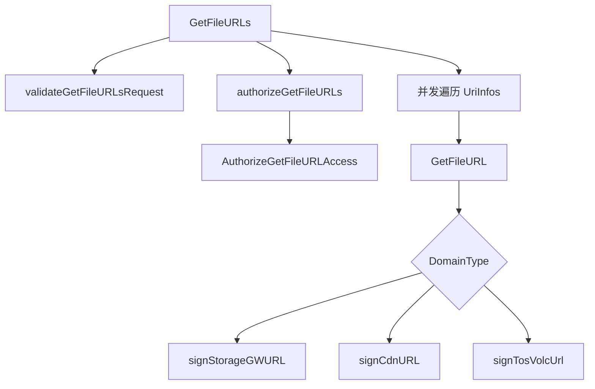
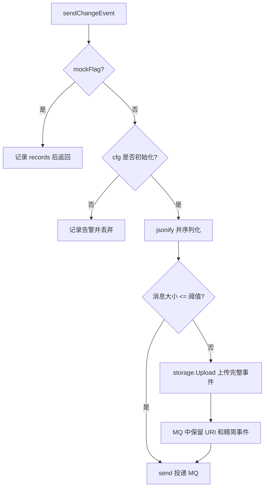

# File URL and Media Operations

## 文件 URL 与媒体操作模块

该模块覆盖两类能力：文件访问 URL 的鉴权与签名，以及媒体/文件变更事件的发送。核心代码位于 `fuxi/core/service/pack_url.go`、`rocketmq/event.go` 和 `rocketmq/syncs.go`。

文件 URL 侧由 `GetFileURLs` 作为批量入口，根据 `mdap.URLParam.DomainType` 选择 Storage Gateway、ByteCDN 或 Volc TOS 的签名路径。事件侧由 `QuickSent` 作为变更事件入口，补齐上下文、时间戳和订阅目标后，经 `sendChangeEvent` 投递到 RocketMQ；超大事件会先上传到 TOS，再在 MQ 消息中只保留指针。

## URL 签名入口

`GetFileURLs(ctx, req)` 是批量生成文件访问 URL 的服务入口，返回 `compound.GetFileURLsResponse`。它的执行顺序是：

1. `validateGetFileURLsRequest` 校验请求。
2. `authorizeGetFileURLs` 调用 `AuthorizeGetFileURLAccess` 做 MDAP 权限校验。
3. 使用 `gopool.NewPool` 并发处理 `req.UriInfos`。
4. 每个 URI 由 `GetFileURL` 生成 `compound.FileInfo`。
5. 单个 URI 失败时不会中断整批请求，而是把错误码和错误消息写入该 URI 对应的 `FileInfo.Status`、`FileInfo.Message`。



请求校验分两层：

- `validateGetFileURLsRequest` 校验 `req`、`UriInfos`、`Provider`。
- `ValidateSignedURLRequest` 校验 `URLParam.DomainType` 和 `Auth`。

`ValidateSignedURLRequest` 要求 `urlParam` 不为空，`DomainType` 落在支持范围内，并且 `auth` 非空。这里的 `auth` 后续会传给 MDAP Auth 客户端解析调用方身份。

## 权限模型

`AuthorizeGetFileURLAccess(ctx, provider, urlParam, auth)` 是 URL 获取权限的统一校验函数。它先通过 `getURLPermissionActionByDomainType` 把 `mdap.DomainType` 映射成权限动作，再调用 MDAP Auth：

- `getMDAPAuthClient` 获取 `mdapauth.Client`。
- `authCli.ExtractPrincipal(ctx, auth)` 从凭证中解析主体。
- `authCli.CheckGetURLPermission(ctx, principal, provider, action)` 判断主体是否拥有当前 provider 下对应 URL 类型的获取权限。

当前支持的权限动作包括：

| DomainType | 权限动作 |
|---|---|
| `mdap.DomainType_VolcS3InternalOrigin` | `mdap.tenant.get_volc_inner_s3_url` |
| `mdap.DomainType_VolcS3ExternalOrigin`、`mdap.DomainType_VolcS3DualStackDomain` | `mdap.tenant.get_volc_pub_s3_url` |
| `mdap.DomainType_ByteInternalAll` | `mdap.tenant.get_byte_inner_all_url` |
| `mdap.DomainType_ByteInternalDev` | `mdap.tenant.get_byte_inner_dev_url` |
| `mdap.DomainType_ByteExternalCDN` | `mdap.tenant.get_byte_cdn_url` |
| `mdap.DomainType_ByteExternalOrigin` | `mdap.tenant.get_byte_origin_url` |

如果鉴权失败且 MDAP Auth 返回了申请链接，错误信息会包含 `apply url`，方便调用方引导用户申请权限。

## 单文件 URL 生成

`GetFileURL(ctx, uriInfo, param, mdapProvider)` 负责单个 URI 的 URL 生成。它依赖两类元数据：

- `bktmeta.GetBucket(ctx, bucketName)`：根据 URI 第一段获取 bucket 元数据。
- `account.GetAccountMDAPDomains(ctx, mdapProvider, param.DomainType)`：获取 provider 在指定域名类型下可用的域名。

URI 的 bucket 名通过 `strings.Split(uriInfo.Uri, "/")[0]` 取得，因此传入的 `uriInfo.Uri` 必须以 bucket 名作为第一段。

过期时间由 `getExpireDuration` 统一处理：

- `Expire == 0` 时使用默认值 `3600` 秒。
- `Expire > maxExpireSec` 时截断到 `2 * 365 * 24 * 3600` 秒。
- 返回值类型为 `time.Duration`。

`GetFileURL` 会把过期时间转换为 `URLExpire`，即当前时间加过期时长后的 Unix 秒级时间戳。

## DomainType 与签名路径

`GetFileURL` 按 `param.DomainType` 选择签名实现：

| DomainType | 签名函数 | 访问形态 |
|---|---|---|
| `ByteExternalOrigin` | `signStorageGWURL` | Byte Storage Gateway 外部源站 |
| `ByteInternalAll` | `signStorageGWURL` | Byte 内网全域 |
| `ByteInternalDev` | `signStorageGWURL` | Byte 内网开发域 |
| `ByteExternalCDN` | `signCdnURL` | ByteCDN |
| `VolcS3ExternalOrigin` | `signTosVolcUrl` | Volc TOS 公网 S3 域 |
| `VolcS3InternalOrigin` | `signTosVolcUrl` | Volc TOS 内网 S3 域 |
| `VolcS3DualStackDomain` | `signTosVolcUrl` | Volc TOS 双栈 S3 域 |

不支持的 `DomainType` 会返回 `pack_url_resp.ErrUnsupportedDomainType`。

## Storage Gateway 签名

`signStorageGWURL(ctx, ssl, domain, objectID, expire)` 用于 Byte 内部域和外部源站域。它先通过 `packStorageGWURL` 拼出原始 URL：

```go
scheme://domain/storage/v1/objectID
```

随后构造 `http.Request`，并通过 `iamsdk.DefaultClient.SignV4` 生成 query 签名 URL。这里使用了：

- `iamsdk.UseQuery()`：签名写入 query。
- `iamsdk.WithCustomQuerySelector(nonSelector)`：不选择额外 query 参与签名。
- `iamsdk.WithExpires(expire)`：设置过期时长。
- `iamsdk.DisableLogger()`：关闭 SDK 内部日志。

`ssl` 为 `true` 时使用 `https`，否则使用 `http`。当前 `GetFileURL` 调用该函数时固定传入 `true`。

## ByteCDN 签名

`signCdnURL(ctx, ssl, mainDomain, objectID, expire)` 用于 `mdap.DomainType_ByteExternalCDN`。流程是：

1. `getCDNToken(ctx, mainDomain)` 从 TCC 配置 `config.DomainTokenCfg` 中读取域名 token。
2. 通过 `cdnClientCache.Fetch` 缓存或创建 `bytecdn.Client`。
3. 非中国区域且非 BOE 环境时，在对象路径前追加 `obj/`。
4. 调用 `client.BuildURLs` 生成带过期时间的 CDN URL。

CDN 客户端缓存 TTL 为 `cdnClientExpire = 2 * time.Hour`。缓存 key 是 `mainDomain`。

`IsCnRegion` 用于判断当前运行区域是否属于中国区域。它检查 `env.Region()` 是否为 `env.R_CN`、`env.R_CNTOB`、`env.R_ChinaEast`，或者 `env.IsBoeCN()` 为真。

## Volc TOS 预签名

`signTosVolcUrl(ctx, uriInfo, bucket, param)` 用于 Volc S3 域名类型。它先从 bucket 元数据中获取 TOS bucket：

```go
tosBkt, err := bucket.GetTosBucket()
```

随后通过 `getTosCli(ctx, tosBkt)` 获取 TOS 客户端，并根据 `param.DomainType` 选择 `TosDomainType`：

- 默认：`gopkgTos.TosInternalS3Domain`
- `VolcS3DualStackDomain`：`gopkgTos.TosDualStackS3Domain`
- `VolcS3ExternalOrigin`：`gopkgTos.TosPublicS3Domain`

`signTosVolcUrl` 使用 `gopkgTos.BatchObjectsPreSignedInput` 构造批量预签名请求。虽然当前只放入一个对象，但仍使用 batch API。对象 key 为 `uriInfo.Uri`。

如果调用方传入了 `uriInfo.Options.TosVolcOptions`，函数会把其中的 `HTTPQuery` 和 `HTTPHeader` 透传给 TOS 预签名对象：

```go
gopkgTos.ObjectToPreSigned{
    Key:    uriInfo.Uri,
    Query:  query,
    Header: header,
}
```

返回前会校验：

- `output` 不能为空。
- `len(output.KeysUrlsMap)` 必须等于请求对象数量。
- 最终返回 `output.KeysUrlsMap[uriInfo.Uri]`。

`getTosCli` 使用 `tosClientCache` 缓存客户端，缓存 TTL 为 `tosClientExpire = 10 * time.Minute`，缓存 key 是 TOS bucket 名。创建客户端时会处理 `IDC == "cn"` 的特殊情况：如果当前 IDC 是 `LF`、`HL` 或 `LQ`，则使用当前 IDC；否则回退到 `LF`。

## 变更事件发送入口

`QuickSent(ctx, event)` 是文件/属性变更后发送事件的入口。它在调用 `sendChangeEvent` 前会补齐事件字段：

- 如果 `event.Space` 为空，从 `cctx.GetContainerOrEmpty(ctx)` 读取 `Space`。
- 如果 `event.Schema` 为空，从同一个 container 读取 `Schema`。
- 如果 `event.TS == 0`，填充当前毫秒时间戳 `time.Now().UnixMilli()`。
- 如果 `event.Syncs` 为空，调用 `detectSyncs(ctx, &event)` 预判内部订阅目标。

`SetAttr`、`Del`、`DelAttr` 等服务逻辑会调用 `QuickSent`，因此这里是变更事件进入 RocketMQ 模块的主要边界。

## Syncs 预判

`detectSyncs(ctx, event)` 当前只识别 GSI 订阅目标。它调用 `hitGSI(ctx, event)` 判断事件变更字段是否命中索引列；命中时追加 `compound.SyncTarget_GSI`。

`hitGSI` 的判断逻辑是：

1. `event.Space` 或 `event.Schema` 为空时直接返回 `false`。
2. 通过 `admin.GetIdxCfg(ctx, event.Space, event.Schema)` 获取索引配置。
3. 把索引列拆成精确列和通配列。
4. 遍历 `event.Created`、`event.Updated`、`event.Deleted` 的 `Path`。
5. 精确列通过 map 判断；通配列通过 `keys.IsMatch` 判断。

如果调用方已经显式设置了 `event.Syncs`，`QuickSent` 不会覆盖它。这一点由 `TestQuickSent_PreservesCallerSyncs` 覆盖。

## RocketMQ 投递与大消息卸载

`sendChangeEvent(ctx, event)` 负责实际发送。它有三种主要路径：



配置在包初始化时从 `conf.GetWithYAML[entity.EventCfg](context.Background(), config.Event)` 读取。如果配置不存在，模块不会 panic，但事件会在 `sendChangeEvent` 中被丢弃并打印告警。如果配置存在但 MQ 或 TOS 必要字段为空，则初始化阶段直接 panic。

消息大小阈值来自 `cfg.TOS.SizeInKB`。事件序列化后：

- 小于等于阈值：直接通过 `send(ctx, event.ID, eventBytes)` 投递 MQ。
- 超过阈值：把完整事件 JSON 上传到 `cfg.TOS.Bucket`，然后在 MQ 消息中写入 `event.URI = bucket/key`，并清空 `Created`、`Updated`、`Deleted`。
- 如果清空 C/U/D 后仍超过阈值，并且 `event.IdxSnapshot != nil`，继续清空 `IdxSnapshot`。

这种分级卸载保证小事件完整走 MQ，大事件通过 TOS 保存完整内容，同时尽量在 MQ 中保留 `IdxSnapshot`，方便消费端在消息体足够小时直接使用。

## 二进制字段 JSON 化

`jsonify(ctx, event)` 在事件序列化前处理可能包含二进制内容的字段。它只处理 `event.URI` 为空的事件；如果 `event.URI` 已存在，会记录告警并返回。

处理范围包括：

- `event.Created[i].Val`
- `event.Updated[i].Before`
- `event.Updated[i].After`
- `event.Deleted[i].Val`

判断函数是 `strs.MayContainsBinary`。命中后会：

- 设置对应元素的 `IsBase64 = true`。
- 使用 `base64.StdEncoding.EncodeToString` 编码字段值。

## 测试辅助模式

`rocketmq/event.go` 提供了两类测试辅助能力：

- `Mock(t)` / `Demock(t)`：开启或关闭 mock 模式。mock 模式下 `sendChangeEvent` 不会真正发送 MQ，只把事件追加到 `records`。
- `PopRecords()`：返回并清空 mock 模式记录。
- `SpyOn(t)` / `SpyOff(t)`：开启或关闭 spy 模式。spy 模式会记录事件，但不阻止正常发送。
- `PopSpyRecords()`：返回并清空 spy 模式记录。

`mockBeforeSerialize` 用于测试序列化前后的事件形态，代码中会在小消息和大消息路径分别把事件写入 `records` 后返回。

## 与代码库其他部分的连接

URL 生成能力不仅被 `GetFileURLs` 使用，也被 MDAP 查询链路复用。调用图显示，`MGetArtifacts`、`queryArtifactsByAssetGroupID` 等 MDAP 服务路径会进入 `AuthorizeGetFileURLAccess`，统一使用同一套 `DomainType -> action -> MDAP Auth` 权限模型。

事件发送能力连接核心服务变更路径。`SetAttr`、`Del`、`DelAttr` 等操作通过 `QuickSent` 发出 `compound.Event`，RocketMQ 消费侧可以依赖 `Event.Syncs` 快速分流到 GSI 等内部订阅系统，而不需要每个 consumer 重复计算索引命中逻辑。

## 修改注意事项

新增 URL 域名类型时，需要同时检查三处：

1. `ValidateSignedURLRequest` 的 `DomainType` 合法范围。
2. `getURLPermissionActionByDomainType` 的权限动作映射。
3. `GetFileURL` 中的签名分发逻辑。

新增事件订阅系统时，优先扩展 `detectSyncs`，保持 `QuickSent` 只负责填充默认字段和调用检测逻辑。具体命中判断应像 `hitGSI` 一样独立成小函数，避免把多个订阅系统的规则混在入口函数里。

修改大消息卸载策略时，需要关注 `sendChangeEvent` 中 MQ 消息大小与 `IdxSnapshot` 保留策略。当前行为是先保留 `IdxSnapshot`，只有精简后仍超阈值才移除；相关测试包括 `Test_sendChangeEvent_TOS_KeepsIdxSnapshot` 和 `Test_sendChangeEvent_TOS_StripIdxSnapshotWhenHuge`。