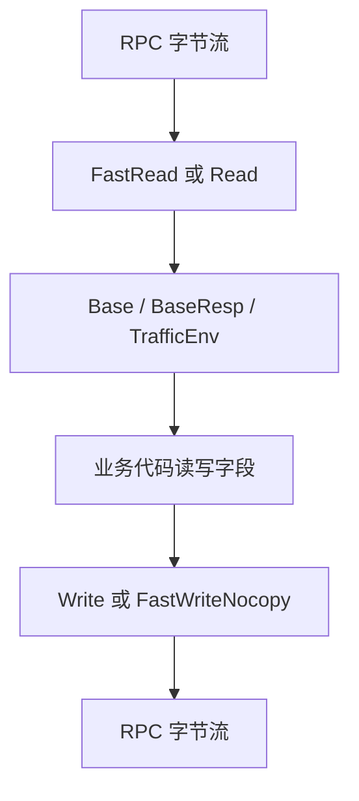

# Generated RPC and Protocol Models — base

## 模块职责

`kitex_gen/base` 是 Kitex/Thrift 生成的基础协议模型包，定义 RPC 请求、响应中通用的基础字段，并提供标准 Thrift 协议与 Kitex 二进制快路径的编解码能力。

该模块包含三个核心结构：

- `TrafficEnv`：流量环境标识，用于描述是否开启特定流量环境以及环境名。
- `Base`：请求侧通用元信息，包含调用链、客户端、地址、透传扩展字段等。
- `BaseResp`：响应侧通用状态信息，包含状态码、状态消息和扩展字段。

代码由 `thriftgo` 与 Kitex 生成，文件头明确标注 `DO NOT EDIT`。业务代码应通过 IDL 变更重新生成，而不是直接修改这些文件。

## 文件结构

`base.go` 提供标准 Thrift 模型定义和基于 `thrift.TProtocol` 的读写逻辑，包括：

- 结构体字段定义
- 构造函数：`NewTrafficEnv`、`NewBase`、`NewBaseResp`
- 默认值初始化：`InitDefault`
- Getter / Setter
- 可选字段判断：`IsSetTrafficEnv`、`IsSetExtra`
- 标准协议读写：`Read`、`Write`
- 字段级读写：`ReadFieldN`、`writeFieldN`
- 字符串表示：`String`

`k-base.go` 提供 Kitex 生成的高性能二进制编解码逻辑，包括：

- `FastRead`
- `FastWrite`
- `FastWriteNocopy`
- `BLength`
- `DeepCopy`
- 字段级快路径读写与长度计算函数

`k-consts.go` 只包含 `KitexUnusedProtection`，用于避免生成代码中的 unused import 问题。

## 数据模型

### `TrafficEnv`

`TrafficEnv` 描述流量环境信息。

```go
type TrafficEnv struct {
	Open bool   `thrift:"Open,1" frugal:"1,default,bool" json:"Open"`
	Env  string `thrift:"Env,2" frugal:"2,default,string" json:"Env"`
}
```

字段含义：

| 字段 | Thrift ID | 类型 | 默认值 | 说明 |
|---|---:|---|---|---|
| `Open` | `1` | `bool` | `false` | 是否启用流量环境 |
| `Env` | `2` | `string` | `""` | 流量环境名称 |

`NewTrafficEnv` 会创建带默认值的对象：

```go
env := base.NewTrafficEnv()
env.SetOpen(true)
env.SetEnv("boe")
```

### `Base`

`Base` 是请求侧通用上下文结构。

```go
type Base struct {
	LogID      string            `thrift:"LogID,1" frugal:"1,default,string" json:"LogID"`
	Caller     string            `thrift:"Caller,2" frugal:"2,default,string" json:"Caller"`
	Addr       string            `thrift:"Addr,3" frugal:"3,default,string" json:"Addr"`
	Client     string            `thrift:"Client,4" frugal:"4,default,string" json:"Client"`
	TrafficEnv *TrafficEnv       `thrift:"TrafficEnv,5,optional" frugal:"5,optional,TrafficEnv" json:"TrafficEnv,omitempty"`
	Extra      map[string]string `thrift:"Extra,6,optional" frugal:"6,optional,map<string:string>" json:"Extra,omitempty"`
}
```

字段含义：

| 字段 | Thrift ID | 类型 | 是否可选 | 默认值 | 说明 |
|---|---:|---|---|---|---|
| `LogID` | `1` | `string` | 否 | `""` | 请求日志或链路 ID |
| `Caller` | `2` | `string` | 否 | `""` | 调用方标识 |
| `Addr` | `3` | `string` | 否 | `""` | 调用来源地址 |
| `Client` | `4` | `string` | 否 | `""` | 客户端标识 |
| `TrafficEnv` | `5` | `*TrafficEnv` | 是 | `nil` | 流量环境信息 |
| `Extra` | `6` | `map[string]string` | 是 | `nil` | 额外透传字段 |

可选字段通过 `nil` 判断是否存在：

```go
b := base.NewBase()

if !b.IsSetTrafficEnv() {
	b.SetTrafficEnv(base.NewTrafficEnv())
}

if !b.IsSetExtra() {
	b.SetExtra(map[string]string{})
}

b.Extra["scene"] = "delete_video"
```

`GetTrafficEnv` 和 `GetExtra` 在字段未设置时返回包级默认变量：

- `Base_TrafficEnv_DEFAULT`
- `Base_Extra_DEFAULT`

这两个默认变量在当前代码中未初始化，因此未设置时通常返回 `nil`。

### `BaseResp`

`BaseResp` 是响应侧通用状态结构。

```go
type BaseResp struct {
	StatusMessage string            `thrift:"StatusMessage,1" frugal:"1,default,string" json:"StatusMessage"`
	StatusCode    int32             `thrift:"StatusCode,2" frugal:"2,default,i32" json:"StatusCode"`
	Extra         map[string]string `thrift:"Extra,3,optional" frugal:"3,optional,map<string:string>" json:"Extra,omitempty"`
}
```

字段含义：

| 字段 | Thrift ID | 类型 | 是否可选 | 默认值 | 说明 |
|---|---:|---|---|---|---|
| `StatusMessage` | `1` | `string` | 否 | `""` | 状态描述 |
| `StatusCode` | `2` | `int32` | 否 | `0` | 状态码 |
| `Extra` | `3` | `map[string]string` | 是 | `nil` | 额外响应信息 |

典型使用方式：

```go
resp := base.NewBaseResp()
resp.SetStatusCode(0)
resp.SetStatusMessage("success")
resp.SetExtra(map[string]string{
	"trace": "enabled",
})
```

业务代码中可以看到对 `BaseResp` 的直接使用，例如 `core/service/checker.go` 中通过 `SetStatusCode` 和 `GetStatusCode` 读写视频删除相关状态。

## 编解码路径

该模块同时支持两套编解码接口：

- 标准 Thrift 协议路径：`Read` / `Write`
- Kitex 二进制快路径：`FastRead` / `FastWriteNocopy`



### 标准 Thrift 协议路径

`base.go` 中的 `Read` 和 `Write` 通过 `github.com/cloudwego/kitex/pkg/protocol/bthrift/apache.TProtocol` 工作。

读取流程以 `Base.Read` 为例：

1. 调用 `apache_warning.WarningApache("Base")`。
2. 调用 `iprot.ReadStructBegin()` 进入结构体。
3. 循环调用 `iprot.ReadFieldBegin()` 读取字段类型和字段 ID。
4. 根据字段 ID 分发到 `ReadField1` 到 `ReadField6`。
5. 如果字段类型不匹配，调用 `iprot.Skip(fieldTypeId)` 跳过未知或不兼容字段。
6. 读到 `thrift.STOP` 后调用 `iprot.ReadStructEnd()` 结束。

字段读取函数只负责读取单个字段并赋值。例如：

- `Base.ReadField1` 读取 `LogID`
- `Base.ReadField5` 创建 `TrafficEnv` 并调用 `_field.Read(iprot)`
- `Base.ReadField6` 读取 `map<string,string>` 并赋给 `Extra`

写入流程以 `Base.Write` 为例：

1. 调用 `apache_warning.WarningApache("Base")`。
2. 调用 `oprot.WriteStructBegin("Base")`。
3. 按字段写入 `writeField1` 到 `writeField6`。
4. 可选字段在字段级函数中判断是否设置。
5. 调用 `oprot.WriteFieldStop()`。
6. 调用 `oprot.WriteStructEnd()`。

`TrafficEnv` 和 `BaseResp` 使用相同模式。

### Kitex 快路径

`k-base.go` 中的快路径基于 `github.com/cloudwego/gopkg/protocol/thrift.Binary`，直接在 `[]byte` 上读写，避免完整 `TProtocol` 抽象带来的额外开销。

核心方法：

| 方法 | 说明 |
|---|---|
| `FastRead(buf []byte) (int, error)` | 从二进制缓冲区读取结构体，返回消费的字节数 |
| `FastWrite(buf []byte) int` | 写入二进制缓冲区，不使用 nocopy writer |
| `FastWriteNocopy(buf []byte, w thrift.NocopyWriter) int` | 写入二进制缓冲区，并支持字符串 nocopy 写入 |
| `BLength() int` | 计算当前对象序列化后的二进制长度 |
| `DeepCopy(s interface{}) error` | 从同类型对象深拷贝字段 |

典型快路径写入顺序：

```go
b := base.NewBase()
b.SetLogID("log-id")

buf := make([]byte, b.BLength())
n := b.FastWrite(buf)
_ = n
```

`BLength` 必须与 `FastWrite` / `FastWriteNocopy` 的实际写入逻辑保持一致。调用方通常先用 `BLength` 分配缓冲区，再调用快路径写入。

## 字段处理细节

### 可选字段

`Base.TrafficEnv`、`Base.Extra` 和 `BaseResp.Extra` 是 optional 字段。

判断函数：

```go
func (p *Base) IsSetTrafficEnv() bool {
	return p.TrafficEnv != nil
}

func (p *Base) IsSetExtra() bool {
	return p.Extra != nil
}

func (p *BaseResp) IsSetExtra() bool {
	return p.Extra != nil
}
```

写入时，optional 字段只有在 `IsSet...` 返回 `true` 时才会序列化：

- `Base.writeField5`
- `Base.writeField6`
- `BaseResp.writeField3`
- `Base.fastWriteField5`
- `Base.fastWriteField6`
- `BaseResp.fastWriteField3`

这意味着空 map 和 nil map 行为不同：

```go
resp := base.NewBaseResp()

// 不会写出 Extra 字段
resp.SetExtra(nil)

// 会写出 Extra 字段，长度为 0
resp.SetExtra(map[string]string{})
```

### 默认字段

非 optional 字段总会被写出：

- `TrafficEnv.Open`
- `TrafficEnv.Env`
- `Base.LogID`
- `Base.Caller`
- `Base.Addr`
- `Base.Client`
- `BaseResp.StatusMessage`
- `BaseResp.StatusCode`

即使它们是零值，也会进入序列化结果。

### map 字段

`Extra` 字段是 `map[string]string`。

标准协议路径中：

- `ReadField6` / `ReadField3` 使用 `ReadMapBegin`
- 循环读取 key 和 value
- 最后调用 `ReadMapEnd`

快路径中：

- `FastReadField6` / `FastReadField3` 使用 `thrift.Binary.ReadMapBegin`
- 循环读取 key 和 value
- 不需要显式 `ReadMapEnd`

写入 map 时，快路径会先预留 map header 长度，再遍历 map 统计真实元素数量，最后回填 `WriteMapBegin`：

```go
mapBeginOffset := offset
offset += thrift.Binary.MapBeginLength()

var length int
for k, v := range p.Extra {
	length++
	offset += thrift.Binary.WriteStringNocopy(buf[offset:], w, k)
	offset += thrift.Binary.WriteStringNocopy(buf[offset:], w, v)
}

thrift.Binary.WriteMapBegin(buf[mapBeginOffset:], thrift.STRING, thrift.STRING, length)
```

Go map 遍历顺序不稳定，因此 `Extra` 的序列化字段顺序不保证稳定。协议语义不依赖 map 顺序，测试中不要断言完整二进制字节序等价。

## 深拷贝行为

`DeepCopy` 在 `k-base.go` 中生成，用于同类型对象之间复制字段。

`TrafficEnv.DeepCopy` 直接复制标量字段。

`Base.DeepCopy` 会：

- 复制 `LogID`、`Caller`、`Addr`、`Client`
- 如果 `src.TrafficEnv != nil`，创建新的 `TrafficEnv` 并调用其 `DeepCopy`
- 如果 `src.Extra != nil`，创建新的 map 并复制 key/value

`BaseResp.DeepCopy` 会：

- 复制 `StatusMessage`
- 复制 `StatusCode`
- 如果 `src.Extra != nil`，创建新的 map 并复制 key/value

类型不匹配时返回错误：

```go
dst := base.NewBaseResp()
err := dst.DeepCopy(base.NewBase())
```

该调用会返回类似 `%T's type not matched %T` 的错误。

## 错误处理

生成代码使用 `goto` 标签集中包装错误。错误会通过 `thrift.PrependError` 增加上下文信息，例如：

- 结构体开始读取失败：`read struct begin error`
- 字段读取失败：`read field <id> '<name>' error`
- 字段类型不匹配且跳过失败：`skip type <type> error`
- 字段写入失败：`write field <id> error`

字段名来自这些映射：

- `fieldIDToName_TrafficEnv`
- `fieldIDToName_Base`
- `fieldIDToName_BaseResp`

这让协议层错误能定位到具体字段，便于排查 IDL 不兼容、字段类型变更或上游返回异常数据。

## 与代码库其他部分的连接

该模块是多个生成服务和业务路径的基础依赖。

请求侧 `Base` 被服务生成代码使用，例如：

- `compound/mdap/mdap_service.go` 的 `ReadField255`
- `compound/mdap/k-mdap_service.go` 的 `GetOrSetBase`
- `kitex_gen/abase/abase.go` 的 `ReadField255`
- `kitex_gen/abase/k-abase.go` 的 `GetOrSetBase`

响应侧 `BaseResp` 被客户端、服务和测试使用，例如：

- `client/video_delete/video_delete.go` 中多个删除接口创建 `NewBaseResp`
- `core/service/checker.go` 中 `VideoDelete` 通过 `GetStatusCode` / `SetStatusCode` 处理状态
- `compound/mdap/k-mdap_service.go` 和 `kitex_gen/abase/k-abase.go` 中的 `GetOrSetBaseResp`
- `client/oda/oda_test.go` 和 `comm/midware/downstream_ratelimit_test.go` 中构造测试响应

这些调用说明 `base` 包不是业务实现层，而是 RPC 边界上的公共数据模型。业务代码通常只需要构造、读取和设置字段；协议读写由 Kitex 框架或生成服务代码调用。

## 维护注意事项

不要手动编辑 `kitex_gen/base/base.go`、`kitex_gen/base/k-base.go` 或 `kitex_gen/base/k-consts.go`。字段、类型、optional 语义、Thrift ID 等都应从 IDL 修改后重新生成。

变更 IDL 时需要特别关注：

- 字段 ID 必须保持兼容，不能随意复用已有 ID。
- 修改字段类型会导致旧数据被 `Skip`，或在强依赖场景中产生协议兼容问题。
- optional 字段的 `nil` 与空值语义不同。
- `Base` 和 `BaseResp` 是跨服务公共模型，变更会影响生成代码、客户端、服务端和测试。
- 快路径的 `BLength`、`FastWriteNocopy`、`FastRead` 由生成器保证一致，人工修改很容易破坏序列化长度计算。