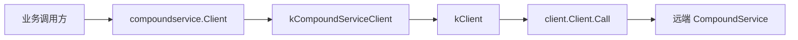

# Generated RPC and Protocol Models — bytedance

## 模块定位

`kitex_gen/bytedance/videoarch/compound` 是 Kitex 根据 Thrift IDL 生成的 RPC 接入层和协议模型代码，主要提供两类能力：

1. `compoundservice` 包：`CompoundService` 的客户端、服务端注册、Invoker 和 Kitex `ServiceInfo` 元数据。
2. `mdap` 包：MDAP 相关请求/响应结构的 Thrift 编解码、字段访问、深拷贝和默认构造逻辑。

这些文件带有 `Code generated by Kitex ... DO NOT EDIT.` 标记，业务逻辑不应在这里修改。服务实现、参数校验、查询构造和处理流程位于 `handler/`、`mdap/service/`、`core/service/` 等业务包中；本模块负责把这些业务方法暴露为 Kitex 可调用的 RPC 接口，并把 Thrift 二进制数据转换为 Go 结构体。

## RPC 服务包装

`compoundservice.Client` 定义了 `CompoundService` 的完整客户端接口，方法覆盖资产组、来源、产物、属性、查询、删除、TTL、文件 URL、处理任务以及内部索引维护：

```go
type Client interface {
	CreateAssetGroup(ctx context.Context, req *mdap.CreateAssetGroupRequest, callOptions ...callopt.Option) (*mdap.CreateAssetGroupResponse, error)
	QueryAssetGroups(ctx context.Context, req *mdap.QueryAssetGroupsRequest, callOptions ...callopt.Option) (*mdap.QueryAssetGroupsResponse, error)
	SetAttr(ctx context.Context, req *compound.SetAttrReq, callOptions ...callopt.Option) (*compound.SetAttrResp, error)
	GetFileURLs(ctx context.Context, request *compound.GetFileURLsRequest, callOptions ...callopt.Option) (*compound.GetFileURLsResponse, error)
	UpdateIdxWithEventForInternal(ctx context.Context, req *compound.UpdateIdxWithEventReq, callOptions ...callopt.Option) (*compound.UpdateIdxWithEventResp, error)
}
```

`NewClient` 和 `NewClientWithBytedConfig` 创建客户端时会注入 ByteDance Kitex 套件：

- `client.WithDestService(destService)` 指定目标服务名。
- `byted.ClientSuiteWithConfig(serviceInfo(), config)` 或 `byted.ClientSuiteWithConfig(serviceInfoForClient(), config)` 注入内部治理、编解码和服务元信息。
- `client.NewClient(serviceInfoForClient(), options...)` 创建底层 Kitex client。
- 返回值包装为 `kCompoundServiceClient`，对外暴露带 `callopt.Option` 的 IDL 兼容方法。

每个客户端方法的执行模式一致：先通过 `client.NewCtxWithCallOptions(ctx, callOptions)` 把调用选项写入 `context.Context`，再委托给内部 `kClient`。内部 `kClient` 构造对应的 `CompoundServiceXXXArgs` 和 `CompoundServiceXXXResult`，通过 `p.c.Call(ctx, "MethodName", &_args, &_result)` 发起真实 RPC，并返回 `_result.GetSuccess()`。



## 服务端注册和本地 Invoker

服务端入口在 `compoundservice/server.go`：

- `NewServer(handler compound.CompoundService, opts ...server.Option)` 创建 Kitex `server.Server`。
- `NewServerWithBytedConfig(handler, config, opts...)` 使用显式 `byted.ServerConfig`。
- `RegisterService(svr, handler, opts...)` 把已有 server 与 `CompoundService` handler 绑定。

`NewServer` 会按顺序添加：

1. `byted.ServerSuite(serviceInfo())`
2. 调用方传入的 `server.Option`
3. `server.WithCompatibleMiddlewareForUnary()`

随后执行 `svr.RegisterService(serviceInfo(), handler)`。如果注册失败会直接 `panic`，这符合生成代码常见模式：服务启动阶段失败应立即暴露。

`invoker.go` 提供 `NewInvoker` 和 `NewInvokerWithBytedConfig`，用于创建 `server.Invoker`。它们同样注册 `serviceInfo()`，并在 `RegisterService` 后调用 `s.Init()`。该入口通常用于测试、本地执行或框架内部直接调用链路，例如 `core/test/test_common.go` 中的 `localRun` 会使用 `NewServer` / `NewClient` 搭建本地调用环境。

## ServiceInfo 和方法分发

`compoundservice.go` 中的 `serviceMethods` 是 Kitex 方法表。每个 RPC 方法通过 `kitex.NewMethodInfo` 绑定三类信息：

- handler 函数，例如 `createAssetGroupHandler`
- args 构造函数，例如 `newCompoundServiceCreateAssetGroupArgs`
- result 构造函数，例如 `newCompoundServiceCreateAssetGroupResult`
- streaming 配置，当前全部为 `kitex.StreamingNone`

`newServiceInfo` 组装最终的 `kitex.ServiceInfo`：

```go
svcInfo := &kitex.ServiceInfo{
	ServiceName:     "CompoundService",
	HandlerType:     (*compound.CompoundService)(nil),
	Methods:         methods,
	PayloadCodec:    kitex.Thrift,
	KiteXGenVersion: "v1.22.0",
	Extra:           map[string]interface{}{"PackageName": "compound"},
}
```

服务端收到请求后，Kitex 根据方法名找到 `MethodInfo`，创建 args/result，调用对应 handler。handler 再把泛型 `handler interface{}` 断言为 `compound.CompoundService`，把反序列化后的请求字段传给业务实现：

```go
func queryAssetGroupsHandler(ctx context.Context, handler interface{}, arg, result interface{}) error {
	realArg := arg.(*compound.CompoundServiceQueryAssetGroupsArgs)
	realResult := result.(*compound.CompoundServiceQueryAssetGroupsResult)
	success, err := handler.(compound.CompoundService).QueryAssetGroups(ctx, realArg.Req)
	if err != nil {
		return err
	}
	realResult.Success = success
	return nil
}
```

这个分发层不做业务校验。以 `QueryAssetGroups` 为例，真实业务调用链会进入 `handler/handler.go` 和 `mdap/service/mdap.go`，再通过生成的 `GetSpace()`、`GetMediaTypes()`、`IsSetSpace()` 等访问器读取请求字段。

## MDAP 协议模型

`mdap/k-mdap_service.go` 是高性能 Thrift 编解码实现。它围绕每个请求/响应结构生成以下方法族：

- `FastRead(buf []byte) (int, error)`：从 Thrift binary buffer 读取结构体。
- `FastReadFieldN(buf []byte) (int, error)`：读取指定字段。
- `FastWrite(buf []byte) int`：写入 Thrift binary buffer。
- `FastWriteNocopy(buf []byte, w thrift.NocopyWriter) int`：支持 nocopy writer 的写入路径。
- `BLength() int`：计算序列化后所需 buffer 长度。
- `fieldNLength()`：计算单个字段长度。
- `DeepCopy(s interface{}) error`：结构体深拷贝。

典型读取流程会循环读取 field begin，根据 `fieldId` 和 `fieldTypeId` 分派到字段读取函数。类型不匹配时调用 `thrift.Binary.Skip` 跳过未知或不兼容字段；必填字段缺失时返回 `thrift.NewProtocolException(thrift.INVALID_DATA, ...)`。

例如 `CreateAssetGroupRequest.FastRead` 要求以下字段必须存在：

- `Space`，field id `1`
- `Name`，field id `2`
- `MediaTypes`，field id `3`
- `SourceConfigs`，field id `4`
- `Base`，field id `255`

可选字段使用指针表示，例如 `Description *string`、`Creator *string`、`ArtifactConfig *mdap_model.ArtifactConfig`，写入时通过 `IsSetDescription()`、`IsSetCreator()`、`IsSetArtifactConfig()` 判断是否输出字段。

## 基础字段和模型依赖

MDAP 请求普遍依赖 `kitex_gen/base` 和 `kitex_gen/mdap_model`：

- 请求结构通常包含 `Base *base.Base`，字段号为 `255`。
- 响应结构通常包含 `BaseResp *base.BaseResp`，字段号为 `255`。
- 资产组、来源、产物等实体来自 `mdap_model`，例如 `AssetGroup`、`Source`、`Artifact`、`SourceConfig`、`ArtifactConfig`。

读取嵌套结构时，生成代码会调用对应模型构造函数和编解码方法：

```go
_field := mdap_model.NewArtifactConfig()
l, err := _field.FastRead(buf[offset:])
p.ArtifactConfig = _field
```

对于列表和 map，代码会预分配容器并逐项读取。列表中的结构体常见优化模式是先创建连续 value slice，再把元素地址 append 到目标 slice：

```go
_field := make([]*mdap_model.SourceConfig, 0, size)
values := make([]mdap_model.SourceConfig, size)
for i := 0; i < size; i++ {
	_elem := &values[i]
	_elem.InitDefault()
	_elem.FastRead(buf[offset:])
	_field = append(_field, _elem)
}
```

这种模式减少了逐元素堆分配，但调用方仍应把返回结构视为普通指针对象使用。

## 与业务代码的连接点

本模块是业务代码和 RPC 框架之间的边界层。常见入口关系如下：

- `client/compound/compound.go` 初始化远端客户端时调用 `compoundservice.NewClient`。
- `core/test/test_common.go` 的本地测试链路调用 `compoundservice.NewServer` 和 `compoundservice.NewClient`。
- `handler/handler.go` 实现对外 RPC handler，并返回生成的响应结构，例如 `CreateSourceResponse`、`QuerySourcesResponse`、`UpdateAssetGroupResponse`。
- `mdap/service/mdap.go` 使用生成模型的 getter 和 isset 方法读取请求参数，例如 `GetCreator()`、`GetArtifactConfig()`、`GetIDs()`、`GetMediaTypes()`。
- `mdap/service/mdap_validator.go` 使用同一批访问器做参数校验，例如 `ValidateCreateAssetGroupRequest`、`ValidateQueryAssetGroupsRequest`。
- `core/service/pack_url.go` 在 `MGetArtifacts` 链路中通过生成模型的 `GetDomainType()` 判断文件 URL 权限。

因此，新增或变更 RPC 字段时，不能只看生成代码。需要同步关注 IDL、业务校验、handler、service 实现、测试用例以及调用方字段访问。

## 维护注意事项

这些文件应通过 Kitex/IDL 重新生成，而不是手写修改。手动改动会在下一次生成时丢失，也容易破坏字段号、必填约束或 Thrift 兼容性。

字段兼容性主要由 Thrift 字段号决定。已有字段的 field id 不应复用或改变；新增可选字段应优先使用新的 field id，并确保业务层通过 `IsSetXxx()` 或 getter 处理缺省值。

`Base` 和 `BaseResp` 是请求/响应的基础上下文字段，许多生成结构把 field `255` 作为必填字段处理。构造请求或响应时如果遗漏这些字段，反序列化或调用链路可能返回 required field not set 错误。

`MustNewClient`、`MustNewClientWithBytedConfig`、`NewServer`、`NewInvoker` 等入口会在初始化失败时 `panic`。业务启动代码可以使用这些函数快速失败；需要显式处理错误的客户端初始化场景应使用 `NewClient` 或 `NewClientWithBytedConfig`。