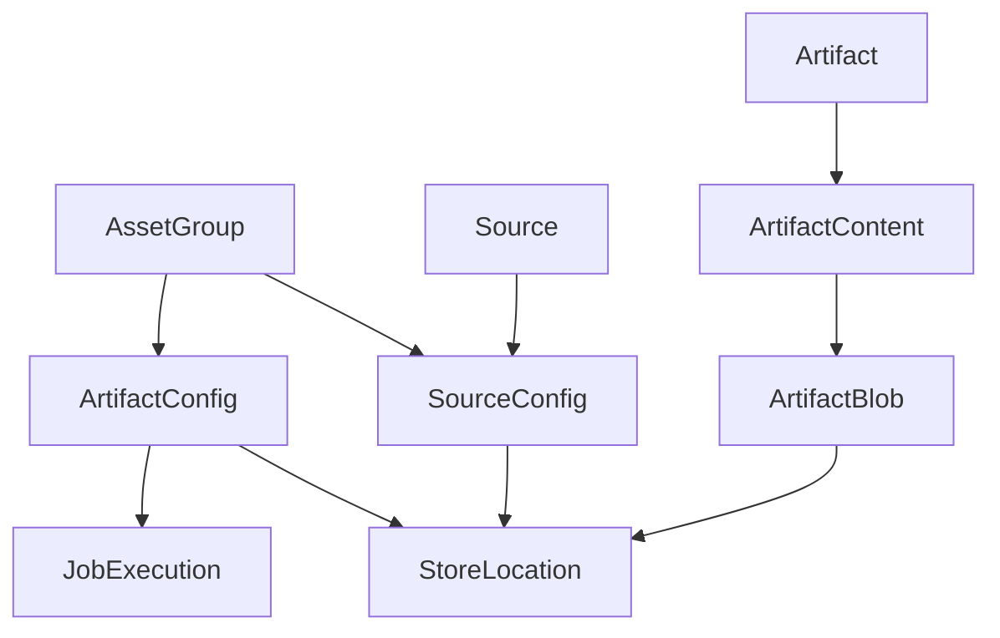

# Generated RPC and Protocol Models — mdap_model

## 模块定位

`kitex_gen/mdap_model` 是 MDAP 领域模型的生成代码包，承载 RPC 层、Thrift 协议层和服务层之间共享的数据结构。它定义了资产组、源文件、衍生产物、媒体元信息、存储位置、任务执行配置等模型，并为这些模型生成序列化、反序列化、拷贝和可选字段判断方法。

该包由生成器维护：

- `mdap_model.go`：由 `thriftgo` 生成，包含枚举、结构体、`Read` / `Write`、`GetXxx`、`IsSetXxx`、`NewXxx` 等常规 Thrift 代码。
- `k-mdap_model.go`：由 Kitex 生成，包含高性能二进制编解码方法，如 `FastRead`、`FastWriteNocopy`、`BLength`、`DeepCopy`。
- `k-consts.go`：仅提供 `KitexUnusedProtection`，用于避免生成代码中的 unused import 问题。

这些文件头部都标记了 `DO NOT EDIT`。需要调整字段、枚举或协议时，应修改上游 IDL 并重新生成代码，而不是手工改生成文件。

## 核心数据模型

### 媒体元信息

媒体元信息用于描述源文件或产物的基础属性。服务层会根据 `Source.MediaType` 校验 `Source.Meta` 能否反序列化为对应结构：

- `"video"` → `VideoMeta`
- `"image"` → `ImageMeta`
- `"audio"` → `AudioMeta`
- `"text"` → `TextMeta`

`VideoMeta` 是容器级视频元信息，包含 `Duration`、`Width`、`Height`、`Codec`、`FPS`、`Bitrate`、`Size`，并可包含多路 `VideoStreams` 和 `AudioStreams`。

`ImageMeta`、`AudioMeta`、`TextMeta` 中部分字段是 optional 指针字段。例如：

```go
bitDepth := int32(8)
meta := &mdap_model.ImageMeta{
	Width:    1920,
	Height:   1080,
	Format:   "jpeg",
	Size:     1024,
	BitDepth: &bitDepth,
}
```

读取 optional 字段时，如果需要区分“未设置”和“设置为零值”，使用生成的 `IsSetBitDepth`、`IsSetHasAlpha`、`IsSetEncoding` 等方法。`GetXxx` 方法会在字段未设置时返回类型零值。

### 存储与输入配置

`StoreLocation` 表示一个文件位置：

- `Type`：`StoreType_TOS`、`StoreType_HDFS`、`StoreType_NAS`
- `Path`：实际 URI 或路径
- `DownloadURL`：optional 字段，主要由查询接口在需要签名 URL 时填充

`SourceConfig` 描述源文件如何进入系统：

- `Type`：`SourceType_VDA`、`SourceType_MessEngine`、`SourceType_TOS`、`SourceType_URL`、`SourceType_HDFS`
- `NeedFetch`：是否需要拉取
- `FetchStatus`：拉取状态
- `Locations`：可用存储位置列表
- `Config`：binary 字段，服务层按 JSON 字节处理

`Config` 的具体 JSON 结构由 `Type` 决定：

- `SourceType_VDA` → `SourceConfigVDA`，要求 `VodSpace` 非空
- `SourceType_TOS` → `SourceConfigTOS`，要求 `Bucket` 非空
- `SourceType_URL` → `SourceConfigURL`
- `SourceType_MessEngine`、`SourceType_HDFS` 当前没有专用配置结构

服务层的 `validateSourceConfigConfig` 使用 `sonic.Unmarshal` 校验这些 `Config` 字节。

### 资产组、源和资产

`AssetGroup` 是 MDAP 的组织单元，包含：

- 标识字段：`ID`、`Space`、`Name`
- 媒体范围：`MediaTypes`
- 统计字段：`SourceCount`、`Size`
- 创建信息：`Creator`、`CreateTime`、`UpdateTime`
- 输入配置：`SourceConfigs`
- 产物配置：`ArtifactConfig`
- optional 描述：`Description`

`Source` 表示一个接入的源文件，包含 `BizID`、`AssetGroupID`、`MediaType`、`Format`、`Meta`、`Config`、`Tags` 等字段。`CreateSource` 会把 `Source.Meta` 和 `Source.Config` 持久化到属性系统中，`parseSourceFromQuery` 再从属性路径恢复为 `Source`。

`Asset` 是更轻量的业务资产模型，当前字段包括 `ID`、`BizID`、`Name`、`AssetGroupID`、`Tags`、创建更新时间。

### 产物模型

`Artifact` 表示由 `Source` 或其他 `Artifact` 衍生出的结果：

- `DeriveType`：`DeriveType_Source` 或 `DeriveType_Artifact`
- `DeriveID`：来源对象 ID
- `Contents`：一个或多个 `ArtifactContent`
- `AssetGroupID`：所属资产组

`ArtifactContent` 按 `Type` 区分 payload：

- `ArtifactType_Snapshots`：`Contents` 中的每个元素是 JSON 序列化后的 `ArtifactSnapshots`
- `ArtifactType_Audio`：`Contents` 中的每个元素是 JSON 序列化后的 `ArtifactAudio`
- `ArtifactType_Image`：`Contents` 中的每个元素是 JSON 序列化后的 `ArtifactImage`

`ArtifactBlob` 是产物外部文件的索引信息，包含 `Location`、`Size` 和 optional `ContentType`。服务层的 `buildArtifactAttrs` 会把 `ArtifactContent.Contents` 做 base64 编码后写入属性系统；`parseArtifactFromQuery` 读取时再 base64 解码回 `[]byte`。

## 模型关系



## 生成方法的使用方式

每个结构体通常都有以下生成方法：

- `NewXxx()`：创建对象并调用 `InitDefault()`。
- `InitDefault()`：初始化默认值。当前多数模型没有复杂默认值，但读取嵌套结构时生成代码仍会调用它。
- `GetXxx()`：nil-safe getter。optional 字段未设置时返回零值。
- `IsSetXxx()`：仅为 optional 字段生成，用于判断字段是否真实存在。
- `Read(iprot thrift.TProtocol)` / `Write(oprot thrift.TProtocol)`：常规 Apache Thrift 协议读写。
- `FastRead(buf []byte)` / `FastWrite(buf []byte)` / `FastWriteNocopy(buf []byte, w thrift.NocopyWriter)`：Kitex fast codec 路径。
- `BLength()`：计算 fast codec 写入所需字节长度。
- `DeepCopy(s interface{}) error`：按字段深拷贝同类型对象。

`FastWrite` 只是 `FastWriteNocopy(buf, nil)` 的包装。字符串和二进制字段在 `FastWriteNocopy` 中会走 `WriteStringNocopy` 或 `WriteBinaryNocopy`，用于减少拷贝。

`FastRead` 按 Thrift field id 读取字段，类型不匹配时调用 `thrift.Binary.Skip` 跳过未知或不兼容字段。这保证了新增字段在旧客户端上通常可以被跳过，但字段 id 和类型仍必须保持兼容。

## 序列化执行流

常规 RPC 编解码走 `Read` / `Write`，Kitex 高性能路径走 `FastRead` / `FastWriteNocopy`。嵌套结构会递归调用子结构的读写方法，例如：

- `AssetGroup.FastReadField11` 读取 `[]*SourceConfig`，每个元素继续调用 `SourceConfig.FastRead`。
- `AssetGroup.FastReadField12` 读取 `ArtifactConfig`，继续调用 `ArtifactConfig.FastRead`。
- `ArtifactConfig.FastWriteNocopy` 写 `StoreLocations` 和 `JobExecution` 时，会调用元素的 `FastWriteNocopy`。
- `BLength` 会递归调用嵌套对象的 `BLength`，用于提前计算缓冲区大小。

生成代码的写字段顺序不一定等于字段编号顺序。例如一些 `FastWriteNocopy` 会先写数值字段，再写字符串字段。Thrift 依赖 field id 识别字段，调用方不应依赖二进制输出中的字段顺序。

## 与服务层的连接

`mdap/service/mdap.go` 是该模型包的主要业务消费者：

- `CreateAssetGroup` 构造 `AssetGroup`，通过 `buildAssetGroupAttrs` 展开成属性路径。
- `parseAssetGroupFromQuery` 从属性查询结果恢复 `AssetGroup`。
- `CreateSource` 构造 `Source`，通过 `buildSourceAttrs` 写入属性系统。
- `parseSourceFromQuery` 从属性路径恢复 `Source`，并校验 `Source.ID` 与 `AssetGroupID` 的身份一致性。
- `CreateArtifact` 构造 `Artifact`，通过 `buildArtifactAttrs` 写入属性系统。
- `parseArtifactFromQuery` 从属性路径恢复 `Artifact`，并解码 `ArtifactContent.Contents`。
- `convertMediaDigestToArtifact`、`convertSnapshotDigestToArtifactSnapshots`、`convertAudioTrackDigestToArtifactAudio` 将外部 digest DTO 转换为 `Artifact` payload。
- `populateArtifactDownloadURLs` 会反序列化 `ArtifactContent.Contents`，填充内部 `StoreLocation.DownloadURL` 后重新序列化回 payload。

`mdap/service/mdap_validator.go` 定义了业务层约束。生成类型本身只表达协议结构，真正的请求合法性由这些校验函数保证，例如：

- `validateStoreLocationsUnique` 要求同一组 `StoreLocation` 中每种 `StoreType` 最多出现一次。
- `ValidateCreateSourceRequest` 要求 `AssetGroupID`、`BizID`、`MediaType`、`Format`、`Config`、`Meta` 存在。
- `validateSourceMeta` 按 `MediaType` 校验 `Meta` JSON。
- `ValidateCreateArtifactRequest` 要求 `DeriveID`、`Name`、`AssetGroupID`、`Contents` 有效。
- `validateArtifactContentPayload` 按 `ArtifactType` 校验 payload 能否反序列化成对应产物结构。
- `validateArtifactBlobs` 要求 blob 的 `Location.Path` 非空，`Size` 非负。

`mdap/service/start_processing.go` 也会直接构造 `SourceConfig` 和 `StoreLocation`。例如 `resolveStartProcessingInput` 中会为 VDA 输入创建 `SourceConfig{Type: SourceType_VDA, Locations: []*StoreLocation{{Type: StoreType_TOS}}}`。

## 属性路径映射

服务层会把模型展开为 Compound 属性路径。常见映射如下：

| 模型字段 | 属性路径示例 |
|---|---|
| `AssetGroup.Space` | `$.space` |
| `AssetGroup.MediaTypes[i]` | `$.media_types[0]` |
| `AssetGroup.SourceConfigs[i].Type` | `$.source_configs[0].type` |
| `Source.Config.FetchStatus` | `$.config.fetch_status` |
| `Source.Config.Locations[i].Path` | `$.config.locations[0].path` |
| `Artifact.Contents[i].Type` | `$.contents[0].type` |
| `Artifact.Contents[i].Contents[j]` | `$.contents[0].contents[0]`，值为 base64 |
| `ArtifactBlob.Location.Path` | `$.contents[0].blobs[0].location.path` |

注意 `StoreLocation.DownloadURL` 通常不是持久化字段。它由 `populateStoreLocationDownloadURL` 在查询返回阶段按需填充。

## 枚举约定

枚举类型包括：

- `SourceType`
- `FetchStatus`
- `DeriveType`
- `ArtifactType`
- `StoreType`

每个枚举都生成：

- `String()`：转换为协议字符串名；未知值返回 `"<UNSET>"`。
- `XxxFromString(s string)`：从字符串解析枚举，非法字符串返回 error。
- `XxxPtr(v Xxx)`：返回枚举指针。
- `Scan(value interface{})` / `Value()`：用于数据库 `sql.Scanner` 和 `driver.Valuer` 兼容。

服务层持久化枚举时一般使用整数值字符串，例如 `strconv.FormatInt(int64(source.Config.Type), 10)`；解析时再转回对应枚举类型。

## 贡献注意事项

不要手工编辑 `kitex_gen/mdap_model/*.go`。字段、枚举、required/optional 语义需要从 IDL 修改并重新生成。

新增 optional 字段时，调用方应使用 `IsSetXxx` 判断是否设置，避免把“未传字段”和“传了零值”混在一起。

新增 `ArtifactType` 时，需要同步更新至少这些业务函数：

- `validateArtifactContentPayload`
- `artifactPayloadSize`
- `populateArtifactDownloadURLs`
- `convertDigestInfoToContent`，如果该类型来自 digest 转换
- `artifactMIMEType`，如果影响 ID 生成中的 MIME 类型编码

新增 `SourceType` 时，需要同步更新 `validateSourceConfigConfig`，并明确 `SourceConfig.Config` 对应的 JSON 结构。

涉及 `ArtifactContent.Contents` 的代码需要记住两层序列化：业务 payload 先用 JSON 编码为 `[]byte`，写入属性系统时再由 `buildArtifactAttrs` base64 编码。直接读取属性值时不能把它当作原始 JSON 使用。