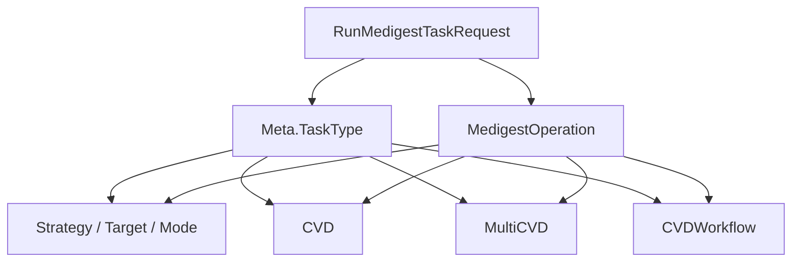

# Generated RPC and Protocol Models — medigest

## 模块定位

`proto_gen/medigest/medigest.pb.go` 是由 `medigest.proto` 生成的 Go Protocol Buffers 模型文件，包名为 `medigest`。它定义了 Medigest 任务的请求、响应、输入媒体、上传目标、截图策略、CVD 摘要任务和工作流编排等数据结构。

该文件只提供协议模型和 protobuf 运行时元信息，不包含业务执行逻辑、参数校验、RPC client/server 方法或服务定义。生成信息显示：

- `protoc-gen-go v1.36.11`
- `protoc v7.35.0`
- `NumServices: 0`
- 外部依赖：`code.byted.org/videoarch/compound/proto_gen/params` 中的 `params.DigestTaskParams`

## 请求模型主干

核心入口类型是 `RunMedigestTaskRequest`，它把输入、上传配置、元信息和任务操作组合成一次 Medigest 调用。

```go
type RunMedigestTaskRequest struct {
	Input      *Input
	MultiInput []*Input
	Upload     *Upload
	Meta       *Meta
	Operation  *MedigestOperation
}
```

字段语义：

- `Input`：单输入媒体。
- `MultiInput`：多输入媒体，支持一次指定多个输入。
- `Upload`：输出文件或摘要结果的存储配置。
- `Meta`：任务元信息，例如任务类型、账号、触发来源和视频 ID。
- `Operation`：具体执行什么任务，由 `Meta.TaskType` 决定使用哪个子字段。

`Input` 描述媒体来源及基础媒体信息：

```go
type Input struct {
	Uri           string
	Headers       *Headers
	Duration      int32
	Size          int32
	Width         int32
	Height        int32
	VideoDuration float32
	AudioDuration float32
	AvgFps        float32
	HdrType       int32
}
```

`Uri` 支持注释中声明的多种形态，例如 `vid://${vid}`、`tos://${bucket}/${key}`、`http(s)://${url}`。`Headers` 可携带访问授权、解密信息和自定义头。

`Meta.TaskType` 是请求分流的关键字段，注释中列出的取值包括：

- `Snapshot`：截图任务。
- `CVD`：单个摘要任务。
- `MultiCVD`：一次输入执行多个摘要任务。
- `CVDWorkflow`：多个 CVD 任务按节点依赖编排执行。

## Operation 的任务形态

`MedigestOperation` 同时承载 Snapshot 和 CVD 系列任务参数：

```go
type MedigestOperation struct {
	Strategy    *Strategy
	Target      *Target
	Mode        string
	IndexOption *IndexOption
	CVD         *CVDTaskOperation
	MultiCVD    []*CVDTaskOperation
	CVDWorkflow *CVDWorkflowOperation
}
```

使用时应按 `Meta.TaskType` 选择对应字段：

- `Snapshot` 使用 `Strategy`、`Target`、`Mode`、`IndexOption`。
- `CVD` 使用 `CVD`。
- `MultiCVD` 使用 `MultiCVD`。
- `CVDWorkflow` 使用 `CVDWorkflow`。

该生成模型不会强制这些组合关系；错误组合需要在调用方或业务层校验。



## Snapshot 参数模型

截图任务由 `Strategy` 和 `Target` 描述抽帧方式与输出规格。

`Strategy.Type` 使用字符串表示策略类型，注释列出：

- `TimeInterval`：按时间间隔抽帧。
- `SpecifiedTime`：按指定时间点抽帧。
- `SpecifiedFrames`：按指定帧号抽帧。
- `SceneChange`：按场景变化抽帧。

对应参数类型分别是：

- `TimeInterval{Interval, Limit}`：`Interval` 单位为毫秒，`Limit` 为最大抽帧数量。
- `SpecifiedTime{Times}`：`Times` 是毫秒级时间偏移。
- `SpecifiedFrames{Frames}`：`Frames` 是帧号列表。
- `SceneChange{Threshold, Limit}`：`Threshold` 取值注释为 `(0, 1)`，`Limit` 为最大抽帧数量。

`Target` 控制输出图片尺寸和雪碧图配置：

```go
type Target struct {
	ScaleLong    int32
	ScaleShort   int32
	SpriteConfig *SpriteConfig
}
```

当 `SpriteConfig` 非空且 `Enable` 为 true 时，表示生成雪碧图。`ImgYLen` 和 `ImgXLen` 分别表示垂直和水平方向的小图数量。

## CVD 摘要任务模型

`CVDTaskOperation` 是摘要任务的核心结构：

```go
type CVDTaskOperation struct {
	DigestType string
	DigestName string
	Params     *params.DigestTaskParams
	Force      bool
	UserData   string
	IdempKey   string
	RawParams  string
	ClipParams *CVDClipParams
}
```

字段要点：

- `DigestType`：摘要类型，注释列出 `Snapshot`、`AudioTrack`、`BetterFrames`、`VOCR`。
- `DigestName`：摘要名称，用于区分不同结果集。
- `Params`：结构化摘要参数，类型来自 `proto_gen/params`。
- `RawParams`：保留字符串参数传递能力，注释说明优先级低于 `Params`，会被解析为 `Params`。
- `Force`：是否强制执行。
- `IdempKey`：幂等标识；注释说明当前主要用于记录标识。
- `ClipParams.MaxSliceDuration`：可选分片参数，单位为秒。

CVD 工作流使用 `CVDWorkflowOperation`、`CVDNode` 和 `NodePolicy` 表达节点编排：

```go
type CVDWorkflowOperation struct {
	Nodes []*CVDNode
}

type CVDNode struct {
	Name      string
	Operation *CVDTaskOperation
	Depencies []string
	Policy    *NodePolicy
}
```

注意字段名是生成代码中的实际拼写 `Depencies`，不是 `Dependencies`。业务代码引用时必须使用 `GetDepencies()` 或 `Depencies` 字段名。

`NodePolicy.NodeFail` 使用字符串表示失败处理规则，注释列出 `Ignore` 和默认的 `Abort`。

## 上传与输出位置

`Upload` 描述产物写到哪里：

```go
type Upload struct {
	Filename string
	Storage  *UploadStorage
	Fuxi     *UploadFuxi
}
```

`UploadStorage` 面向对象存储：

```go
type UploadStorage struct {
	Space   string
	Bucket  string
	Headers *Headers
}
```

`UploadFuxi` 面向 Fuxi：

```go
type UploadFuxi struct {
	Cluster string
	Space   string
	Schema  string
	ID      string
}
```

`RunMedigestTaskRequest` 的注释说明 `Upload.Filename` 和 `UploadFuxi.ID` 等字段支持模板变量，例如：

- `{{Vid}}`
- `{{DigestType}}`
- `{{DigestName}}`
- `{{IdempKey}}`
- `{{Input.Uri}}`
- `{{Snapshot.FrameNo}}`
- `{{BlobIndex}}`
- `{{Meta.Id}}`

这些变量只在协议注释中定义；替换逻辑不在本生成文件内。

## 响应模型

`RunMedigestTaskResponse` 同时覆盖 Snapshot 和 CVD 结果：

```go
type RunMedigestTaskResponse struct {
	Mode       string
	Index      string
	Files      []*MediaFileInfo
	Number     int32
	CVDOutputs []*CVDOutput
}
```

Snapshot 结果主要使用：

- `Mode`：输出返回模式。
- `Index`：当 `Mode=Index` 时有效，表示具体 FuxiID。
- `Files`：抽帧文件列表。
- `Number`：抽帧结果数量。

CVD 结果使用 `CVDOutputs`。注释说明 `CVDOutputs` 与 `Input` 一一对应；非 `MultiInput` 场景通常取第一个元素。

CVD 结果层级为：

```go
type CVDOutput struct {
	Results *CVDResults
}

type CVDResults struct {
	Results []*CVDResult
}

type CVDResult struct {
	DigestID     string
	DigestSchema string
	Position     string
	BlobCount    int32
	NBFrames     int32
	Files        []*MediaFileInfo
	Code         int32
	Message      string
	URN          *DigestURN
}
```

`CVDResult` 中：

- `DigestID` 是摘要存储 key。
- `DigestSchema` 当前注释说明仅支持 `media_digest`。
- `Position` 表示摘要存储位置，例如 `tos://...` 或 `fuxi://...`。
- `Files` 保存文件型产物信息。
- `Code` 和 `Message` 表示单个摘要结果状态。
- `URN` 使用 `DigestURN{DigestType, DigestName}` 标识摘要类型和名称。

## 生成代码行为

每个消息类型都实现了标准 protobuf 方法：

- `Reset()`
- `String()`
- `ProtoMessage()`
- `ProtoReflect()`
- `Descriptor()`，已标记废弃，应使用 `ProtoReflect().Descriptor()`
- `GetXxx()` 形式的 nil 安全访问器

访问器遵循 proto3 默认值语义。例如：

- `GetUri()` 在接收者为 nil 时返回空字符串。
- `GetForce()` 在接收者为 nil 时返回 `false`。
- `GetHeaders()` 在接收者为 nil 时返回 `nil`。
- `GetMultiInput()` 在接收者为 nil 时返回 `nil`。

这意味着调用方不能仅凭 getter 返回零值区分“字段未设置”和“字段显式设置为零值”。需要区分时，应直接检查指针字段是否为 nil，或在上层协议中引入显式状态。

文件初始化流程由 protobuf runtime 管理：

- `init()` 调用 `file_medigest_proto_init()`。
- `file_medigest_proto_init()` 使用 `protoimpl.TypeBuilder` 构建 `File_medigest_proto`。
- `file_medigest_proto_rawDescGZIP()` 通过 `sync.Once` 懒加载压缩后的 raw descriptor。
- `file_medigest_proto_goTypes` 和 `file_medigest_proto_depIdxs` 在构建完成后置为 nil。

这些逻辑只服务于 protobuf 反射、序列化和描述符访问，业务代码通常不需要直接调用。

## 与代码库其他部分的连接

调用图显示，该模块主要被 `mdap/service/start_processing_prodia.go` 和相关测试使用。

`buildRunMedigestTaskRequest` 会构造这些类型：

- `RunMedigestTaskRequest`
- `Input`
- `MedigestOperation`
- `CVDTaskOperation`
- `UploadStorage`
- `UploadFuxi`

测试文件 `mdap/service/start_processing_test.go` 会直接构造或断言这些模型，例如：

- 使用 `Input` 构造输入媒体。
- 使用 `RunMedigestTaskRequest` 检查 Prodia 请求结构。
- 调用 `GetInput()`、`GetUri()`、`GetOperation()`、`GetCVD()`、`GetForce()` 验证生成访问器返回值。

因此，本模块在代码库中的角色是 Prodia / Medigest 请求响应的协议边界。上游服务负责把内部请求转换成这些 protobuf 模型；下游 RPC 或序列化层负责传输；业务规则、参数兼容、任务组合校验和模板变量替换都应在本文件之外实现。

## 贡献注意事项

不要手动编辑 `medigest.pb.go`。文件头已经声明 `Code generated by protoc-gen-go. DO NOT EDIT.`。需要变更字段、注释或协议结构时，应修改源 `.proto` 文件并重新生成代码。

新增字段时需要注意：

- 保持字段编号兼容，不能复用已发布字段号。
- 字符串枚举目前没有生成 Go enum 类型，调用方仍会以字符串判断。
- JSON tag 保留了 proto 字段名大小写，例如 `Uri`、`TaskType`、`DigestType`。
- 结构化参数应优先放入 `params.DigestTaskParams`；`RawParams` 是兼容入口，不应成为新功能的首选扩展点。
- `CVDNode.Depencies` 是既有协议拼写，修正拼写会影响生成字段名和 wire/schema 兼容策略，不能只在 Go 代码中改名。