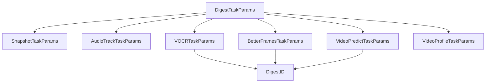

# Generated RPC and Protocol Models — params

## 模块概览

`proto_gen/params/digest_params.pb.go` 是由 `params/digest_params.proto` 生成的 Go Protobuf 模型，包名为 `params`。它定义摘要处理相关 RPC 参数的数据结构，覆盖截图摘要、音频轨提取、VOCR、优帧选择、视频预测和视频 Profile 等任务。

该文件是生成代码，不应手动修改。字段、枚举和 wire tag 的权威来源是 `.proto` 文件；需要调整协议时应修改 `params/digest_params.proto` 后重新生成。

## 核心入口

`DigestTaskParams` 是任务参数的聚合入口：

```go
type DigestTaskParams struct {
    SnapshotParams     *SnapshotTaskParams
    AudioTrackParams   *AudioTrackTaskParams
    VOCRParams         *VOCRTaskParams
    BetterFramesParams *BetterFramesTaskParams
    VideoPredictParams *VideoPredictTaskParams
    VideoProfileParams *VideoProfileTaskParams
}
```

注释中称其为 “union 转换为 oneof 结构”，但当前生成结果不是 Go Protobuf `oneof`，而是多个可选指针字段。调用方需要自行保证同一次请求中只设置符合业务语义的任务参数，避免同时设置多个任务分支造成下游歧义。



## 枚举与字符串字段

文件中生成了 10 个枚举类型：

- `EnumScaleMode`：`Stretch`、`Fit`、`Adaptive`
- `EnumOrientationMode`：`Original`、`Landscape`、`Portrait`
- `ImageFormat`：`JPG`、`PNG`、`WEBP`
- `SnapshotSampleOption`：`ByFps`、`ByOffsetTimes`、`BySceneChange`、`ByKeyFrames`、`ByFrameNos`、`ByFpsLimitNBFrames`
- `ImageFeatureExtractionMethod`：`LBP`、`histogram`
- `EnumSnapshotFilterMethod`：`FilterByFrameSift`
- `EnumSnapshotAggregationMethod`：`AggrAsSpriteImage`、`AggrAsTosZip`
- `AudioCodec`：`pcm_s16le`
- `VideoPredictMethod`：`PredictImages`
- `DigestType`：`Snapshot`、`AudioTrack`、`VOCR`、`BetterFrames`、`VideoPredict`、`VideoProfile`

需要注意：不少业务字段实际是 `string`，注释中要求传入对应枚举名，例如：

- `LayoutConfig.ScaleMode` 使用 `"Stretch"`、`"Fit"` 或 `"Adaptive"`
- `LayoutConfig.OrientationMode` 使用 `"Original"`、`"Landscape"` 或 `"Portrait"`
- `SnapshotSampleParams.Option` 使用 `"ByFps"` 等 `SnapshotSampleOption` 名称
- `SnapshotAggregationParams.Method` 使用 `"AggrAsSpriteImage"` 或 `"AggrAsTosZip"`
- `AudioPlaybackParams.Codec` 使用 `"pcm_s16le"`
- `DigestID.DigestType` 使用 `"Snapshot"`、`"AudioTrack"` 等名称

因此业务代码在组装参数时通常应使用枚举的 `String()` 结果或统一常量，避免手写字符串漂移。

## 截图摘要参数

`SnapshotTaskParams` 描述截图类摘要任务，是本模块结构最丰富的分支：

```go
type SnapshotTaskParams struct {
    PlaybackParams   *VideoPlaybackParams
    SampleParams     []*SnapshotSampleParams
    TTLParams        *DigestTTLParams
    FeatureExtParams []*ImageFeatureExtractionParams
    FilterParams     []*SnapshotFilterParams
    AggrParams       *SnapshotAggregationParams
    EnableHDRTonemap bool
}
```

截图任务的典型执行语义可以理解为：先按 `VideoPlaybackParams` 限定回放片段和输出帧格式，再按一个或多个 `SnapshotSampleParams` 采样，随后可做特征提取、过滤，最后按 `SnapshotAggregationParams` 聚合输出。

`VideoPlaybackParams` 包含：

- `StartOffset`：起始偏移，字符串格式由调用方和下游解释
- `DurationLimit`：处理时长限制
- `Resolution`：`PlaybackResolution`，通过 `ScaleShort`、`ScaleLong` 限制短边和长边
- `Format`：图片格式，注释指向 `ImageFormat`
- `FrameSelectParams`：格式为 `${vsync_method}_${max_fps}`，约束形如 `(vfr|cfr)_\d+(\.\d*)?`

`SnapshotSampleParams` 支持多种采样策略：

- `Option` 指定策略，例如 `"ByFps"`、`"ByOffsetTimes"`、`"BySceneChange"`
- `Fps` 支持浮点数或 `${float}/duration`
- `OffsetTimes` 指定时间点列表
- `SceneChangeThreshold` 用于场景变化采样
- `FrameNos` 当前注释说明仅支持 `1` 和 `-1`，表示首帧和尾帧
- `FrameLimit`、`MinFrameLimit`、`MaxFrameLimit` 控制帧数限制，其中 `MinFrameLimit` 和 `MaxFrameLimit` 在 `Option=ByFpsLimitNBFrames` 时生效
- `BlackFrameParams` 使用 `BlackFrameDetectionParams` 描述黑帧过滤阈值
- `Jitter`、`IsRequired` 提供采样扰动和必要性标记

`SnapshotFilterParams` 表示截图结果过滤。注释强调过滤是“对已有集合做减法”，不会改变存储结构，并且多个过滤方法串行执行。当前支持的具体参数是 `FilterByFrameSiftParams`，通过 `FrameSiftParams.Strategy` 传递策略。

`SnapshotAggregationParams` 描述聚合方式。聚合会改变最终存储内容：

- `AggrAsSpriteImageParams` 使用 `SpriteParams` 聚合为雪碧图
- `AggrAsTosZipParams` 使用 `AsZipParams` 聚合为 TOS zip 文件

雪碧图布局由 `LayoutConfig` 控制，包括 `GridCols`、`GridRows`、`Spacing`、`ScaleMode`、`CellWidth`、`CellHeight` 和 `OrientationMode`。zip 聚合参数 `AsZipParams` 包含 `CompressMethod`、`MaxCount`、`MaxSize`。

## 音频轨参数

`AudioTrackTaskParams` 由三部分组成：

```go
type AudioTrackTaskParams struct {
    PlaybackParams *AudioPlaybackParams
    SampleParams   *AudioSampleParams
    TTLParams      *DigestTTLParams
}
```

`AudioPlaybackParams` 控制音频片段、编码和通道数：

- `StartOffset`
- `DurationLimit`
- `Codec`，注释指向 `AudioCodec`，当前枚举值为 `"pcm_s16le"`
- `Channels`

`AudioSampleParams.SampleRate` 指定采样率。`DigestTTLParams` 与截图任务复用，用于配置创建时间和访问时间维度的 TTL。

## 派生摘要任务

`VOCRTaskParams`、`BetterFramesTaskParams` 和 `VideoPredictTaskParams` 都通过 `SourceDigestID` 指向已有摘要结果，再携带各自的业务参数：

```go
type DigestID struct {
    DigestType string
    DigestName string
    IdempKey   string
}
```

`DigestID` 用于标识输入摘要，`DigestType` 应使用 `DigestType` 枚举名称字符串，例如 `"Snapshot"`。

`VOCRTaskParams` 包含：

- `SourceDigestID`
- `Params *VOCRParams`

`VOCRParams` 通过 `Service` 和 `Cluster` 指定视频 OCR 服务位置。

`VideoPredictTaskParams` 包含：

- `SourceDigestID`
- `Params *VideoPredictParams`

`VideoPredictParams` 包含 `Service`、`Method` 和 `TagID`。`Method` 注释对应 `VideoPredictMethod`，当前枚举值为 `"PredictImages"`。

## BetterFrames 参数版本

`BetterFramesParams` 是优帧选择参数的版本容器：

```go
type BetterFramesParams struct {
    V1Params *BFParamsV1
    V2Params *BFParamsV2
    V3Params *BFParamsV3
    V4Params *BFParamsV4
}
```

和 `DigestTaskParams` 类似，这里也不是 Go `oneof`，调用方需要按业务版本只填充一个版本参数。

各版本字段如下：

- `BFParamsV1.FeatureMethod`：注释说明仅支持 `LBP`
- `BFParamsV2.FeatureMethod`：注释说明仅支持 `LBP`
- `BFParamsV3.FeatureMethod`：注释说明仅支持 `Histogram`
- `BFParamsV3.BeamSize`、`MaxPrecomputes`、`MaxBatchSize`：控制 MEKS v3 搜索规模
- `BFParamsV3.StopConfig`：使用 `MEKSStopConfig` 配置 `MaxCuts`、`MinClip`、`Abs`、`Rel`
- `BFParamsV4.EmbeddingMethod`：默认 `colorhist`
- `BFParamsV4.MaxSelection`：支持 `"10"` 或 `"$duration*0.5"` 这类选择数量表达式
- `BFParamsV4.SearchMethod`：默认 `prompt`
- `BFParamsV4.Kwargs`：`map[string]string` 扩展参数

## Video Profile 参数

`VideoProfileTaskParams` 是独立任务分支，不依赖 `DigestID`：

```go
type VideoProfileTaskParams struct {
    Depackage    bool
    Decode       bool
    TaskNameList []string
}
```

`Depackage` 和 `Decode` 用于控制是否执行解封装和解码相关 Profile，`TaskNameList` 限定具体任务名称集合。

## 生成代码运行机制

每个 message 类型都包含 Protobuf 运行时字段：

- `state protoimpl.MessageState`
- `unknownFields protoimpl.UnknownFields`
- `sizeCache protoimpl.SizeCache`

每个结构体都有一组标准生成方法：

- `Reset()`：将结构体清零，并把对应的 `protoimpl.MessageInfo` 写入 message state
- `String()`：通过 `protoimpl.X.MessageStringOf(x)` 生成字符串表示
- `ProtoMessage()`：标记该类型是 Protobuf message
- `ProtoReflect()`：返回 `protoreflect.Message`
- `Descriptor()`：已废弃，保留兼容；新代码应使用 `ProtoReflect().Descriptor()`
- `GetXxx()`：空指针安全 getter，接收者为 `nil` 时返回字段零值

枚举类型也有标准生成方法：

- `Enum()`：返回枚举指针
- `String()`：返回枚举名
- `Descriptor()`、`Type()`、`Number()`：提供反射信息
- `EnumDescriptor()`：已废弃，保留兼容

文件级描述符由 `File_params_digest_params_proto` 暴露。包初始化时执行：

```go
func init() { file_params_digest_params_proto_init() }
```

`file_params_digest_params_proto_init()` 使用 `protoimpl.TypeBuilder` 注册枚举、消息、Go 类型映射和依赖索引。旧式 `Descriptor()` / `EnumDescriptor()` 会调用 `file_params_digest_params_proto_rawDescGZIP()`，该函数通过 `sync.Once` 对 raw descriptor 做一次 GZIP 压缩缓存。

## 使用注意事项

不要直接编辑 `digest_params.pb.go`。任何协议变更都应从 `params/digest_params.proto` 发起，并保持字段编号兼容。

使用 getter 时要区分“字段未设置”和“字段设置为零值”。例如 `GetPlaybackParams()` 返回 `nil` 可以判断 message 字段未设置；但 `GetFrameLimit()` 返回 `0` 既可能表示未设置，也可能表示业务上显式传入 `0`。当前 proto3 标量字段没有 presence 信息。

多个“版本容器”或“任务容器”不是强 oneof。`DigestTaskParams`、`BetterFramesParams` 允许同时填多个指针字段，业务层需要在构造、校验或消费时明确互斥规则。

大量策略字段使用字符串承载枚举名。调用方应统一使用已有枚举常量的 `String()` 或集中定义常量，避免 `"AggrAsSpriteImage"`、`"ByFpsLimitNBFrames"`、`"pcm_s16le"` 等值拼写不一致。

`Descriptor()` 和 `EnumDescriptor()` 已标记废弃。新代码需要反射信息时，应优先使用 `ProtoReflect().Descriptor()` 或枚举的 `Descriptor()` 方法。