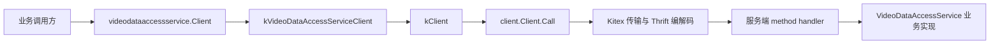

# Generated RPC and Protocol Models — toutiao

## 模块概览

`kitex_gen/toutiao/videoarch/video_data_access` 是 Toutiao 侧 `VideoDataAccessService` 的 Kitex/Thrift 生成代码。它提供两类能力：

- 协议模型：请求、响应、枚举、复合结构体，以及 Thrift `Read`/`Write`、Kitex fast codec、`DeepCopy` 等序列化辅助代码。
- RPC 绑定：客户端 `videodataaccessservice.Client`、服务端注册函数、`server.Invoker`、`kitex.ServiceInfo` 和方法分发 handler。

该模块不包含业务实现。真实读写 DB、缓存、视频元信息处理等逻辑应由实现 `video_data_access.VideoDataAccessService` 的业务 handler 提供。

## 包结构

```text
kitex_gen/toutiao/videoarch/video_data_access/
├── video_data_access.go                  # Thrift 模型、服务接口、Args/Result、apache thrift 读写
├── k-video_data_access.go                # Kitex fast codec、BLength、DeepCopy 等生成代码
├── k-consts.go                           # KitexUnusedProtection
└── videodataaccessservice/
    ├── client.go                         # 对外 RPC Client 和 NewClient 系列构造函数
    ├── server.go                         # NewServer、RegisterService
    ├── invoker.go                        # NewInvoker，用于 invoker 场景
    └── videodataaccessservice.go         # ServiceInfo、method table、handler、内部 kClient
```

## 整体调用关系



客户端方法的路径基本一致：例如 `Client.MGetVideoInfo` 先调用 `client.NewCtxWithCallOptions(ctx, callOptions)` 注入单次调用选项，再转发到内部 `kClient.MGetVideoInfo`；`kClient` 创建 `VideoDataAccessServiceMGetVideoInfoArgs`、调用 `p.c.Call(ctx, "MGetVideoInfo", &_args, &_result)`，最后从 result 中返回 `_result.GetSuccess()`。

服务端方向也保持统一：`NewServer` 或 `NewServerWithBytedConfig` 通过 `serviceInfo()` 注册业务 handler；请求进入后，由 `mGetVideoInfoHandler` 这类生成 handler 将通用 `arg/result` 断言为具体 Args/Result 类型，然后调用业务实现的 `MGetVideoInfo(ctx, realArg.Req)`。

## 服务接口

核心接口是 `video_data_access.VideoDataAccessService`。业务服务端必须实现其中所有方法，例如：

- 视频元信息写入与更新：`CreateVideoInfo`、`UpdateVideoInfo`、`CreateEncodedVideoInfo`、`CopyVideoInfo`
- 视频查询：`MGetVideoInfo`、`PlayerMGetVideoInfo`、`MGetVideoInfoFromDB`、`GetVideoInfoByVidFid`
- 状态与扩展字段：`UpdateVideoPlayStatus`、`UpdateUserAction`、`UpdateVideoExtra`、`MUpdateVideoExtra`
- 上传与原视频：`CreateUploadRecord`、`UpdateUploadRecord`、`MCreateOriginalVideo`
- 海报与动态 Logo：`CreatePosterCandidates`、`MGetPosterCandidates`、`CreateDynamicLogoInfo`、`GetDynamicLogoInfo`
- URI/SHA256 引用索引：`QueryUriReference`、`UpsertUriReference`、`DeleteURIReference`、`QuerySHA256Reference`
- 属性元数据：`CreateAttrMeta`、`UpdateAttrMeta`、`GetAttrMetas`、`SetObjAttr`、`MGetObjAttr`
- 原始表级读写：`ReadRawVideo`、`WriteRawVideo`

注意代码中存在历史拼写：方法名是 `MGetVideoIDByUserRerefence`，请求/响应类型是 `MGetVideoIDByUserReferenceRequest` 和 `MGetVideoIDByUserReferenceResponse`。调用方和 handler 都必须使用生成出的实际方法名。

## 客户端使用方式

`videodataaccessservice.NewClient(destService, opts...)` 创建普通客户端；`NewClientWithBytedConfig(destService, config, opts...)` 允许传入 `*byted.ClientConfig`。两个函数都会设置 `client.WithDestService(destService)`，并接入 `byted.ClientSuiteWithConfig(...)`。

`MustNewClient` 和 `MustNewClientWithBytedConfig` 只是 panic 版本，适合初始化阶段失败即退出的场景，不适合请求链路中动态创建。

单次调用选项通过可变参数传入，例如超时、重试等 Kitex `callopt.Option`。生成包装层会把这些 option 写入 context，再调用内部 `kClient`。

```go
cli, err := videodataaccessservice.NewClient("目标服务名")
if err != nil {
    return err
}

resp, err := cli.MGetVideoInfo(ctx, &video_data_access.MGetVideoInfoRequest{
    VIDs: []string{"v1", "v2"},
    Auth: "调用方鉴权标识",
    Base: baseReq,
})
```

## 服务端接入方式

业务实现需要满足 `video_data_access.VideoDataAccessService`。注册方式有三种：

- `NewServer(handler, opts...)`：创建并注册一个完整 Kitex `server.Server`
- `NewServerWithBytedConfig(handler, config, opts...)`：带 `*byted.ServerConfig`
- `RegisterService(svr, handler, opts...)`：把 handler 注册到已有 server
- `NewInvoker` / `NewInvokerWithBytedConfig`：创建 `server.Invoker`，用于 invoker 模式

`NewServer` 会追加 `server.WithCompatibleMiddlewareForUnary()`；`NewInvoker` 会在注册后调用 `s.Init()`。注册失败或初始化失败会 panic，这是生成代码的固定行为。

## 协议模型约定

所有请求/响应结构体都带 Thrift field id、frugal tag 和 JSON tag。`Base` 通常使用 field id `255`，响应中对应 `BaseResp`。业务代码应通过 `base.Base` 和 `base.BaseResp` 传递通用上下文、状态码和错误信息。

生成结构体一般提供以下方法：

- `NewXxx()`：构造对象，并为有默认值的字段设置默认值
- `InitDefault()`：重置默认值
- `GetXxx()`：读取字段；未设置 optional 字段时返回生成的默认值
- `SetXxx()`：设置字段
- `IsSetXxx()`：判断 optional 字段或非默认值字段是否应被序列化
- `Read` / `Write`：Apache Thrift 协议读写
- `FastRead` / `FastWrite` / `BLength`：Kitex fast codec 路径
- `DeepCopy`：生成的深拷贝辅助逻辑

一个容易踩坑的点是 optional bool 在 Go 中有两种生成形式。`MGetVideoInfoRequest.NeedVideoFileInfo` 是 `bool`，但用“是否等于默认值”判断是否 set；默认值为 `true`。如果直接字面量构造且不填该字段，Go 零值是 `false`，语义上会覆盖默认值。需要默认行为时优先使用 `NewMGetVideoInfoRequest()` 或显式设置字段。

## 关键模型分组

`VideoGroupInfo` 是通用查询返回的聚合视图，包含 `Provider`、`VideoStatus`、`UserReference`、`UserAction`、`OriginalVideoInfo`、`EncodedVideoInfos`、`Posters`、`Extra`、`LogoEncodedVideoInfos`、`PosterURI` 等字段。它依赖 `videoarch_common.VideoCommonInfo`、`EncodedVideoInfo` 和 `PosterCandidate`。

`PlayerVideoGroupInfo` 和 `PlayerEncodedVideoInfo` 是播放侧裁剪后的视图。它保留播放需要的 `MetaInfo`、`FileHash`、`EncodedType`、`Codec`、`LogoType`、`FileExtra`、`PosterURI`、`CurrentLocation` 等字段，避免直接暴露完整写入模型。

`VideoUpload`、`VideoInfo`、`VideoExtra` 和 `RawVideo` 表示更接近存储表结构的原始数据。`ReadRawVideoRequest.RequiredTables` 使用 `RawVideoTable` 控制读取 `VideoUpload`、`VideoInfo`、`VideoExtra` 中哪些部分；`WriteRawVideoRequest.Video` 则提交完整或部分 `RawVideo`。

`AttrMeta`、`Annotation`、`AnnotationSchema` 用于对象属性体系。`SetObjAttrRequest`、`GetObjAttrRequest`、`MGetObjAttrRequest` 以 `Name`/`Names`、`SpaceID`、`AttrNames` 操作对象属性；`CreateAttrMetaRequest`、`UpdateAttrMetaRequest`、`GetAttrMetasRequest` 管理属性定义。

`VidFid`、`URIReferences` 和 `SHA256Reference` 用于反查引用关系。URI 相关接口围绕 `URI`、`URIType`、`VideoID`、`FileID` 建索引；SHA256 相关接口围绕 `SHA256`、`Provider`、`UserID`、`VideoCreatedTime` 建索引。

## 枚举

本模块定义了少量本地枚举，并都实现了 `String()`、`FromString()`、`Ptr()`、`Scan()` 和 `Value()`：

- `VideoIdFlag`：`RDONLY`、`WRONLY`、`RDWR`、`NOPERM`
- `AnnotationAction`：`SKIP`、`WARN`、`DENY`
- `CacheOptions`：`redis`、`abase`、`localcache`
- `ConsistencyLevel`：`DEFAULT`、`WEAKEST`、`WEAK`、`STRONG`、`STRONGEST`
- `URIReplaceType`：`DEFAULT`、`ALL`、`NONE`
- `RawVideoTable`：`VideoUpload`、`VideoInfo`、`VideoExtra`

`Scan` 和 `Value` 让这些枚举可以直接参与 `database/sql` 的读写转换，但枚举值本身仍由 IDL 决定。

## ServiceInfo 与方法分发

`videodataaccessservice.go` 中的 `serviceMethods` 是 Kitex 方法表。每个方法通过 `kitex.NewMethodInfo` 绑定四部分：handler、Args 构造函数、Result 构造函数、streaming 标记。当前方法都使用 `kitex.WithStreamingMode(kitex.StreamingNone)`，也就是普通 unary RPC。

`NewServiceInfo()` 用于服务端，`NewServiceInfoForClient()` 用于非流式客户端，`NewServiceInfoForStreamClient()` 保留流式客户端入口。实际构造逻辑在 `newServiceInfo`，其中固定：

- `ServiceName`: `VideoDataAccessService`
- `HandlerType`: `(*video_data_access.VideoDataAccessService)(nil)`
- `PayloadCodec`: `kitex.Thrift`
- `KiteXGenVersion`: `v1.22.0`
- `Extra["PackageName"]`: `video_data_access`

## 维护注意事项

这些文件顶部均标记 `DO NOT EDIT`，应视为 IDL 生成产物。新增字段、接口或修改字段 id 时，应修改上游 Thrift IDL 并重新生成，而不是直接改 `kitex_gen`。手改生成代码会在下次生成时丢失，也容易破坏客户端、服务端、Args/Result 和 fast codec 之间的一致性。

贡献业务逻辑时，通常只需要引用这些类型、实现 `VideoDataAccessService`，或通过 `videodataaccessservice.Client` 发起调用。不要在生成包内加入业务判断、默认鉴权、缓存策略或兼容分支。