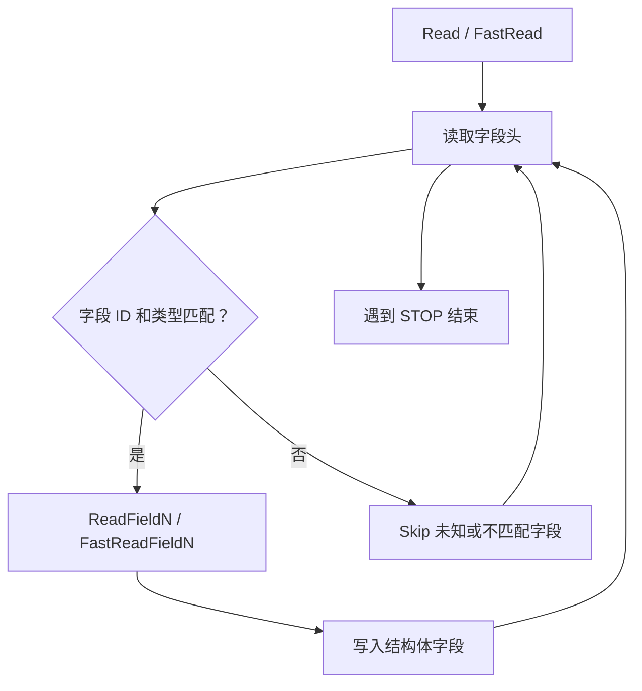
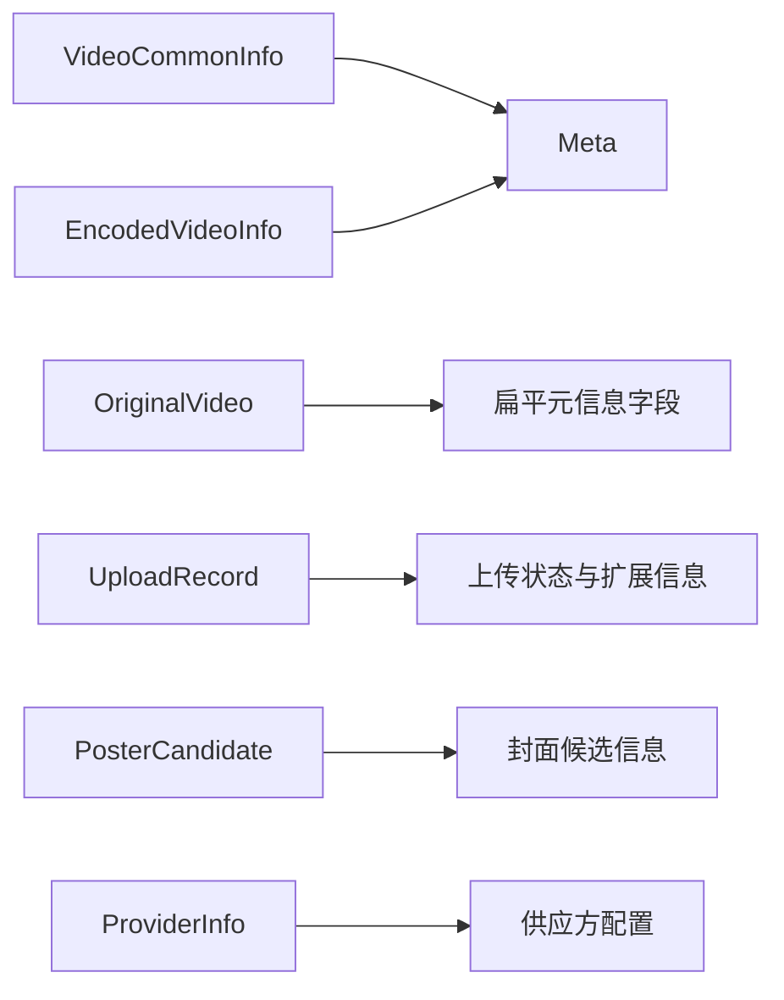

# Generated RPC and Protocol Models — videoarch_common

## 模块定位

`kitex_gen/videoarch_common` 是由 Thrift/Kitex 生成的公共视频协议模型包，包名为 `videoarch_common`。它提供视频归档链路中跨 RPC 边界传输的枚举、结构体、Apache Thrift 协议读写实现，以及 Kitex fast codec 二进制编解码实现。

该目录内代码均为生成代码：`video_common.go` 由 `thriftgo` 生成，`k-video_common.go` 由 Kitex 生成，`k-consts.go` 只提供 `KitexUnusedProtection` 防止空导入。业务代码应消费这些类型，不应手写修改生成文件；字段变更应回到对应 Thrift IDL 后重新生成。

## 文件职责

| 文件 | 职责 |
|---|---|
| `video_common.go` | 定义枚举、结构体、构造器、getter/setter、`IsSetXxx`、Apache Thrift `Read`/`Write`、SQL `Scan`/`Value` |
| `k-video_common.go` | 为同一批结构体生成 Kitex fast codec：`FastRead`、`FastWrite`、`FastWriteNocopy`、`BLength`、`DeepCopy` |
| `k-consts.go` | 定义 `KitexUnusedProtection`，仅用于生成代码导入保护 |

## 核心模型

### 枚举

`UserAction` 表示用户侧视频动作，包含 `UserAction_NoAction`、`UserAction_Shield`、`UserAction_MarkDeleted`、`UserAction_PermanentDeleted`、`UserAction_Available`、`UserAction_SoftDeleted`、`UserAction_VL0` 到 `UserAction_VL4`。配套方法包括 `String()`、`UserActionFromString()`、`UserActionPtr()`、`Scan()`、`Value()`，同时提供 `UserActionIDMap` 做字符串到数值 ID 的映射。

`VideoStatus` 表示视频状态，包含 `VideoStatus_Unknown`、`VideoStatus_Uploading`、`VideoStatus_UploadFailed`、`VideoStatus_WaitingForUploading`、`VideoStatus_UploadSuccess`、`VideoStatus_EncodeSuccess`、`VideoStatus_EncodeFailed`、`VideoStatus_Encoding`、`VideoStatus_NonExist`。配套方法与 `UserAction` 相同，并提供 `VideoStatusIDMap`。

`EnumURIType` 表示不同 URI 类型，例如 `EnumURIType_VideoURI`、`EnumURIType_PosterURI`、`EnumURIType_RemoteStoreURI`、`EnumURIType_PostCandidateURI`、`EnumURIType_AnimatedImageURI`、`EnumURIType_DynpostURI`、`EnumURIType_PosterURIEx`、`EnumURIType_CrcURI`、`EnumURIType_DrsChoiceURI`。

这些枚举实现了 `database/sql.Scanner` 和 `database/sql/driver.Valuer`，因此可以直接参与数据库读写。`FromString` 方法只接受生成代码中列出的精确字符串，未知字符串会返回错误。

### 结构体

`Meta` 是可复用的视频元信息模型，字段全部为 optional 指针：`Height`、`Width`、`Format`、`Duration`、`Size`、`StoreURI`、`Definition`、`Bitrate`。

`VideoCommonInfo` 表示通用视频信息，包含默认字段 `ID`、`FileID`、`FileName`、`CreateTime`、`UpdateTime`，以及 optional 字段 `MetaInfo`、`FileStatus`、`FileHash`、`Extra`、`Codec`、`LogoType`、`FileExtra`。

`EncodedVideoInfo` 表示转码后视频信息，包含 `ID`、`OriginalID`、`EncodedID`、`FileName`、`CreateTime`、`UpdateTime` 等默认字段，以及 `OriginalInt64ID`、`MetaInfo`、`FileHash`、`EncodedType`、`EncodedTime`、`EncodedHost`、`FileStatus`、`Extra`、`Codec`、`LogoType`、`FileExtra` 等 optional 字段。

`UploadRecord` 表示上传记录，默认字段包括 `VideoID`、`Provider`、`UploadInfo`、`UserReference`、`UserAction`、`VideoStatus`，optional 字段为 `Extra`、`PosterURI`。

`ProviderInfo` 表示供应方配置，包含 `ProviderName`、`FileLimit`、`StorageQuota`、`CallbackURL`、`UserKey`、`WorkFlowName`、`WorkFlowVersion`、`CdnPreload`、`Transcode`、`GetMeta`、`CoverSnapshot`、`ID`，以及 optional 字符串字段 `Extra`。

`PosterCandidate` 表示候选封面图，默认字段包括 `VideoID`、`Width`、`Height`、`URI`，optional 字段为 `SrcURI`、`Offset`、`Score`。

`OriginalVideo` 是原始视频的扁平模型，默认字段包括 `VideoID`、`Provider`、`PosterURI`、`UserReference`、`UserAction`、`VideoStatus`、`StoreURI`、`Height`、`Width`、`Duration`、`Format`、`Hash`、`Name`、`Definition`、`Bitrate`、`Size`、`Extra`，optional 字段为 `FileExtra`、`Codec`。

## 可选字段语义

生成代码用 Go 指针或 nil map 表达 optional 字段。判断字段是否真的由调用方传入，应使用 `IsSetXxx()`，不要只依赖 `GetXxx()`：

```go
info := videoarch_common.NewEncodedVideoInfo()

if info.IsSetEncodedTime() {
	// 字段确实出现在请求或对象中
	encodedTime := info.GetEncodedTime()
	_ = encodedTime
}
```

`GetXxx()` 对未设置 optional 字段会返回对应的包级默认值，例如空字符串、`0`、`nil` map 或 `nil` 结构体指针。这会掩盖“未设置”和“设置为空/零值”的区别。写入 optional 字段时应传入指针或非 nil map，例如 `SetCodec(&codec)`、`SetExtra(extra)`。

## 协议读写路径

`video_common.go` 中每个结构体都有标准 Apache Thrift 协议方法：

- `Read(iprot thrift.TProtocol)`：读取 struct begin，循环读取字段头，根据 field id 和 thrift 类型分发到 `ReadFieldN`，未知字段或类型不匹配字段通过 `iprot.Skip` 跳过。
- `ReadFieldN(iprot thrift.TProtocol)`：读取单个字段并写入结构体字段。嵌套结构如 `MetaInfo` 会通过 `NewMeta()` 创建后调用 `Meta.Read()`。
- `Write(oprot thrift.TProtocol)`：写 struct begin，按生成顺序调用 `writeFieldN`，最后写 field stop 和 struct end。
- `writeFieldN(oprot thrift.TProtocol)`：写单个字段。optional 字段会先调用 `IsSetXxx()` 判断是否需要输出。



`k-video_common.go` 中每个结构体还实现 Kitex fast codec：

- `FastRead(buf []byte) (int, error)`：基于 `thrift.Binary.ReadFieldBegin` 直接从二进制 buffer 解码，返回已消费字节数。
- `FastReadFieldN(buf []byte) (int, error)`：解码单字段，例如 `ReadI64`、`ReadString`、`ReadDouble`、`ReadMapBegin`。
- `FastWrite(buf []byte) int`：调用 `FastWriteNocopy(buf, nil)`。
- `FastWriteNocopy(buf []byte, w thrift.NocopyWriter) int`：按生成顺序写字段，字符串通过 `WriteStringNocopy` 支持 nocopy 写入。
- `BLength() int`：预估二进制编码长度，通常用于调用方提前分配 buffer。
- `DeepCopy(s interface{}) error`：把同类型对象深拷贝到接收者，嵌套 `Meta` 和 `map[string]string` 会重新分配，指针标量会复制底层值。

## 读写顺序与兼容性

Thrift 兼容性依赖 field id，而不是 Go 字段顺序。生成代码中的写入顺序可能与结构体声明顺序不同，例如 `EncodedVideoInfo.FastWriteNocopy` 会先写部分数值字段，再写字符串和 map 字段；这不影响协议兼容性，因为每个字段都会写入自己的 thrift field id。

新增字段时应使用新的 field id，并保持旧字段 id、类型和含义不变。删除字段时也要考虑旧数据或旧服务仍可能发送该字段；当前 `Read` 和 `FastRead` 对未知字段会跳过，因此新增字段对旧读端通常是可跳过的。

## map 字段处理

`Extra` 和 `FileExtra` 多处定义为 `map[string]string`。在标准协议路径中，`writeFieldN` 会写 `WriteMapBegin(thrift.STRING, thrift.STRING, len(map))` 后逐项写 key/value；在 fast codec 中，会先预留 map header 长度，再遍历 map 计算实际元素数量并回填 `WriteMapBegin`。

需要注意 nil map 和空 map 的语义不同：

- nil optional map：`IsSetExtra()` 或 `IsSetFileExtra()` 为 false，不会写出字段。
- 空但非 nil map：`IsSetXxx()` 为 true，会写出一个 size 为 0 的 map。
- `OriginalVideo.Extra` 是 default 字段，不是 optional；`writeField17` 会始终写出该字段，即使 map 为 nil，也会以长度 0 写出。

## 嵌套模型关系

`Meta` 是 `VideoCommonInfo.MetaInfo` 和 `EncodedVideoInfo.MetaInfo` 的嵌套结构；`OriginalVideo` 则把类似元信息字段直接铺平为 `Height`、`Width`、`Duration`、`Format`、`Definition`、`Bitrate`、`Size`、`StoreURI` 等字段。



## 常见使用模式

创建模型时使用生成构造器可以保持调用风格一致：

```go
meta := videoarch_common.NewMeta()
height := int64(1080)
format := "mp4"
meta.SetHeight(&height)
meta.SetFormat(&format)

info := videoarch_common.NewVideoCommonInfo()
info.SetID(123)
info.SetFileID("file_id")
info.SetFileName("demo.mp4")
info.SetMetaInfo(meta)

if info.IsSetMetaInfo() && info.GetMetaInfo().IsSetHeight() {
	_ = info.GetMetaInfo().GetHeight()
}
```

枚举和数据库交互时可以使用 `String()`、`FromString()`、`Scan()`、`Value()`：

```go
status, err := videoarch_common.VideoStatusFromString("EncodeSuccess")
if err != nil {
	return err
}

dbValue, err := videoarch_common.VideoStatusPtr(status).Value()
if err != nil {
	return err
}
_ = dbValue
```

需要复制生成模型时，优先使用对应结构体的 `DeepCopy`，尤其当对象包含 optional 指针、嵌套 `Meta` 或 map 字段时：

```go
src := videoarch_common.NewEncodedVideoInfo()
dst := videoarch_common.NewEncodedVideoInfo()

if err := dst.DeepCopy(src); err != nil {
	return err
}
```

## 与代码库其他部分的连接方式

这个包通常位于 Kitex RPC 生成代码边界，供服务端 handler、客户端调用代码、数据转换层和测试夹具引用。业务代码一般不直接调用 `Read`、`Write`、`FastRead` 或 `FastWriteNocopy`；这些方法由 Kitex/Thrift runtime 在 RPC 编解码时调用。业务层主要使用结构体字段、`NewXxx()`、`GetXxx()`、`SetXxx()`、`IsSetXxx()`、枚举转换函数和必要时的 `DeepCopy()`。

贡献者排查 RPC 字段缺失、optional 字段零值、或跨版本兼容问题时，应重点检查三类信息：结构体 tag 中的 thrift field id，`IsSetXxx()` 对应的 nil 判断，以及 `Read`/`FastRead` 中字段类型分发是否与发送端 IDL 一致。