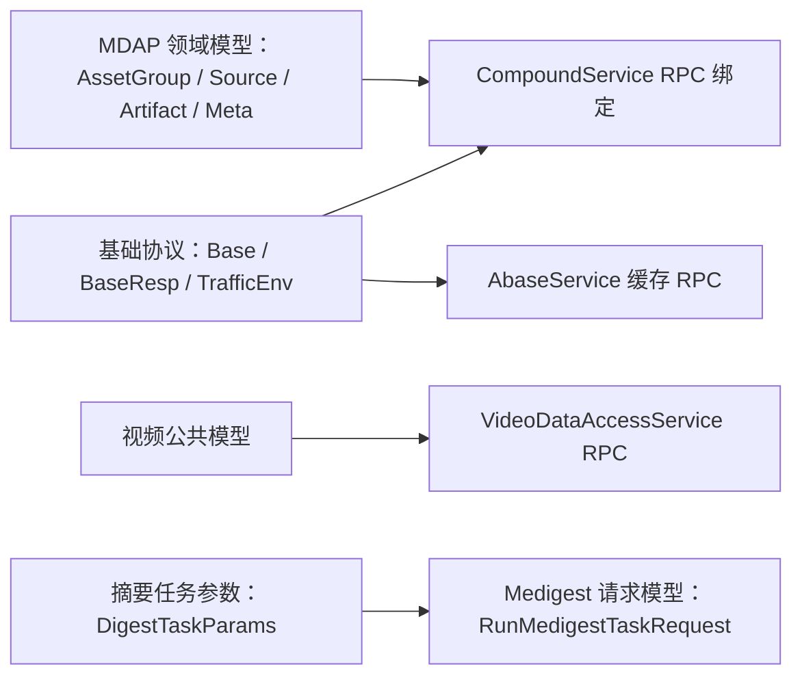

# Generated RPC and Protocol Models

## 模块概览

Generated RPC and Protocol Models 汇总了仓库中的生成式协议层代码：Kitex/Thrift 模型位于 `kitex_gen/`，Protobuf 模型位于 `proto_gen/`。这些子模块共同负责定义 RPC 边界上的请求、响应、枚举、领域实体、服务接口、Args/Result 包装类型，以及序列化、反序列化、深拷贝和 fast codec 能力。

这些代码不承载业务实现。字段、枚举、方法签名和 wire tag 的权威来源是对应的 Thrift IDL 或 `.proto` 文件；需要调整协议时应修改上游协议定义后重新生成。

## 子模块关系

[base](base.md) 提供请求和响应的公共信封，例如 `Base`、`BaseResp` 和 `TrafficEnv`。这些通用字段会被 Kitex 生成的服务参数和结果结构复用，例如 [abase](abase.md) 中的 `GetRequest`、`SetRequest`、`BatchGetRequest` 等请求，以及 [bytedance](bytedance.md) 中 CompoundService 相关请求的基础字段。

[mdap_model](mdap_model.md) 是 MDAP 领域对象的共享模型层，定义 `AssetGroup`、`Source`、`Artifact`、`ArtifactBlob`、`VideoMeta`、`ImageMeta`、`AudioMeta`、`TextMeta` 等结构。[bytedance](bytedance.md) 的 `compoundservice.Client` 和服务端注册代码把这些模型包装进 `CreateAssetGroupRequest`、`QueryAssetGroupsRequest`、`UpdateAssetGroupRequest` 等 RPC 方法中，对外暴露为 `CompoundService`。

[videoarch_common](videoarch_common.md) 提供视频归档链路中的公共枚举和结构体，[toutiao](toutiao.md) 则围绕 `VideoDataAccessService` 生成客户端、服务端、Invoker、`ServiceInfo` 和方法分发逻辑。前者偏共享数据定义，后者偏 RPC 接入绑定。

[params](params.md) 与 [medigest](medigest.md) 构成 Protobuf 侧的摘要任务协议。`params.DigestTaskParams` 聚合 `SnapshotTaskParams`、`AudioTrackTaskParams`、`VOCRTaskParams`、`BetterFramesTaskParams`、`VideoPredictParams`、`VideoProfileParams` 等任务参数；`medigest.RunMedigestTaskRequest` 再把输入媒体、上传配置、任务元信息和 `MedigestOperation` 组合为一次 Medigest 调用。

## 关键跨模块流程

### Compound MDAP RPC

调用方通过 [bytedance](bytedance.md) 中的 `compoundservice.Client` 发起 `CreateAssetGroup`、`QueryAssetGroups`、`CreateArtifact`、`GetFileURL` 等 RPC。请求和响应结构承载 [mdap_model](mdap_model.md) 中的资产组、来源、产物和媒体元信息，并通过 [base](base.md) 的 `Base` / `BaseResp` 传递通用调用上下文和响应状态。

### Abase 缓存访问

[abase](abase.md) 定义 `AbaseService`，覆盖 `Get`、`Set`、`Del`、`BatchGet`、`BatchSet`、`BatchDel`、`IncrBy`、`Expire` 等缓存类 RPC。生成代码中的 Args/Result、`FastRead`、`FastWrite`、`DeepCopy` 和 `GetOrSetBaseResp` 会与 [base](base.md) 的 `BaseResp` 协同，统一请求上下文与错误状态承载方式。

### 视频数据访问

[toutiao](toutiao.md) 生成 `VideoDataAccessService` 的协议模型和 RPC 绑定，用于把视频数据访问能力暴露给 Kitex 客户端和服务端实现。[videoarch_common](videoarch_common.md) 提供跨服务复用的视频公共类型，使调用方和服务实现可以共享一致的枚举、结构体和 Thrift 编解码语义。

### Medigest 摘要任务

[medigest](medigest.md) 的 `RunMedigestTaskRequest` 是摘要任务入口，组合 `Input`、`MultiInput`、`Upload`、`Meta` 和 `MedigestOperation`。[params](params.md) 的 `DigestTaskParams` 提供具体任务参数分支，调用方需要按业务语义选择合适的任务参数，避免同一次请求中设置互相冲突的分支。