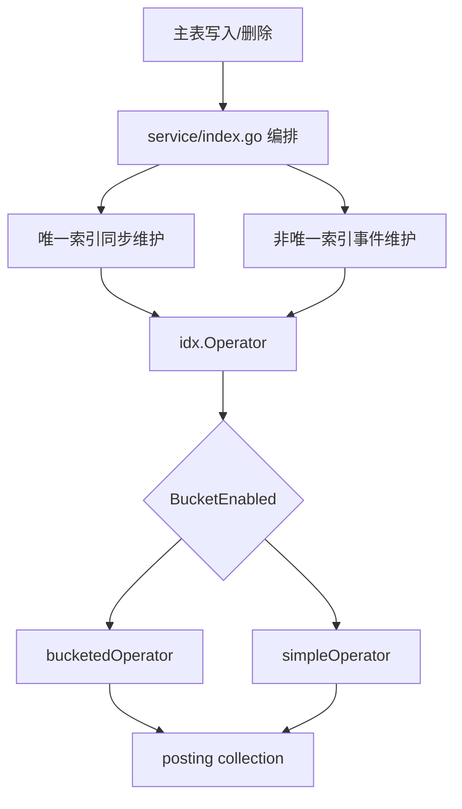

# Global Secondary Indexing

## 全局二级索引（GSI）

全局二级索引模块负责把主表对象属性映射到 posting collection 中，使查询可以先按索引列命中 `oid`，再由上层回表读取主表数据。核心代码分两层：

- `fuxi/core/service/index.go`：service 编排层，处理唯一索引、非唯一索引事件维护、快照补齐、Refresh、删除清理和分片键透传。
- `fuxi/core/service/idx/*`：posting 存储层，通过 `idx.Operator` 统一暴露写入、删除、更新、查询和桶级维护能力。



### 数据模型

每个索引默认对应一个 posting collection，名称由 `getIdxCollection` 决定：

- `cfg.Collection` 非空时直接使用。
- 否则生成 `gsi_posting_{space}_{schema}_{name}`。

旧版把复合索引列编码到单个 `key` 字段；当前存储已拆为 `col1/col2/...` 这类独立字段，具体字段名由 `entity.ColKey`、`entity.ColsFilter`、`entity.BaseFilter` 和 `entity.BaseFilterTyped` 统一生成。`EncodeIdxKey` / `DecodeIdxKey` 仅保留给外部对账和测试辅助，内部写入、删除、查询路径不再依赖字符串 key 中转。

posting entry 记录至少包含：

- `oid`：主表对象 ID。
- `ver`：该 entry 对应的主表版本。
- `sk`：可选的主表分片键，来自 `idxAddWithShardingKeys` / `idxUpdateWithShardingKeys`，用于索引命中后稳定回表。

分桶模式的桶文档还包含：

- `idx`、`space`、`schema`、`colN`：索引路由字段。
- `idx_ver`：桶内乐观锁版本。
- `cnt`：桶内 entry 数。
- `min_ver`、`max_ver`：版本区间。
- `entries`：`entity.BucketEntry` 数组。

### Operator 路由

`idx.Operator` 是 posting 层统一接口。调用方通过 `idx.GetOperator(cfg)` 路由：

- `cfg.BucketEnabled=true`：使用 `bucketedOperator`，支持版本桶、split、merge 和桶级维护。
- `cfg.BucketEnabled=false`：使用 `simpleOperator`，按行级 posting 存储，支持 typed 查询、ordered 下推和 `CountByIndex`。

service 层不直接分支判断模式，而是通过 `idxAdd`、`idxRemove`、`idxUpdateWithShardingKeys` 等 helper 统一调用 `Operator`。这些 helper 还负责版本归一、typed 列值构造和分片键清洗。

### typed 索引列构造

写路径使用 `buildIdxColVals`：

- 读取 `admin.GetRegAttrMap(ctx, cfg.Space, cfg.Schema, "")`。
- 调用 `entity.BuildIndexColVals(cols, cfg.Columns, attrMap, true)`。
- `strict=true`，类型转换失败直接返回错误，避免把脏类型写入索引。

读路径使用 `buildIdxColValsBestEffort`：

- `strict=false`。
- 转换失败时退回 string 值，不中断查询。
- 如果 posting 中是 typed 行，错误类型不会命中，语义等价于“无此索引值”。

删除和写入必须使用同一套构造逻辑。`idxRemove`、`idxUpdateWithShardingKeys` 对 old/new cols 都调用 `buildIdxColVals`，保证删除 filter 与历史写入行精确同构造。

### 版本语义

GSI 使用主表版本做 per-oid 收敛控制。service helper 入口先调用 `vers.NormalizeForIdx`，`idx.Operator` 公开方法入口再通过 `normalizeAtBoundary` 做边界归一。

关键约束：

- 非 V1、缺失或非法版本会归一到 `entity.VerBoundaryMin`。
- `RemoveFromIndex` 使用上界删除语义：删除满足 `entry.ver <= upperVer` 的 entry。
- `UpdateIndexWithShardingKeys` 本质是先 add 新 key，再 remove 旧 key。
- add/remove 不做跨 key 事务；短暂双索引或旧 entry 残留由回表过滤与对账链路收敛。
- `Refresh` 是 non-regressive upsert：只补当前 key，不清理旧 key，也不做唯一性冲突检测。

### 主表分片键透传

索引命中后回表可能需要主表分片键。service 层用两组函数处理：

- `buildMainTableShardingKeys(ctx, space, schema, bizAttrs)` 从业务属性 map 中提取完整分片键。
- `sanitizePostingShardingKeys(ctx, space, schema, in)` 在写 posting 前做白名单和完整性检查。

分片键口径：

- `admin.GetBytedocIdx` 返回的是存储层 key，不带 `$.`。
- 事件和主表属性使用业务 key，通常带 `$.`。
- `entity.StorageKeyToBiz` 用于存储层 key 到业务 key 的转换。

`sanitizePostingShardingKeys` 的行为是保守的：

- nil 或空 map 返回 nil。
- 非分片 schema 返回 nil。
- 缺任一白名单 key 或值为空返回 nil。
- 白名单外 key 会被丢弃并打日志。
- 完整命中时返回仅包含白名单 key 的新 map。

业务路径应优先走 `idxAddWithShardingKeys` 和 `idxUpdateWithShardingKeys`，不要绕过 service helper 直接调用 `Operator.AddToIndexWithShardingKeys`，否则会跳过这层防御。

### 查询路径

`QueryIdx` 和 `QueryIdxWithLimit` 是原始 posting 查询：

- 只返回 posting 层 oid。
- 不回源主表。
- 不过滤脏 entry。
- 适合唯一索引冲突检测和对账扫描。

业务查询不能直接把 `QueryIdx` 结果返回给用户。用户可见查询应走 meta 层索引查询路径，再通过主表查询做二次校验。代码注释中明确要求业务查询经过 `meta.queryIdByIdx → GetMetaByIDWithLimit`，由主表 filter 完成隐式回源过滤。

ordered 下推只适合 simple 模式。`bucketedOperator.QueryByIndexOrdered` 和 `QueryEntriesByIndexOrdered` 固定返回 `ErrOrderedNotSupported`，因为桶分页按 `min_ver` 游标遍历，无法表达业务索引列排序和 offset。

`CountByIndex` 只在 simple 模式 posting collection 上按“等值前缀 + 可选单范围列”直接计数，不回源主表，因此接受最终一致误差。

### 唯一索引同步维护

唯一索引由写主表前的同步路径维护，不走事件异步路径。

`HandleUniqIdx(ctx, space, schema, id, ver, set, exists)` 用于 SetAttr 前：

1. 读取 `admin.GetIdxCfg`。
2. 过滤 `cfg.IsUniq`。
3. 用 `uniqIdxTouched` 判断本次变更是否命中唯一索引列。
4. 对新 key 调 `QueryIdxWithLimit(..., 2)` 做冲突检测。
5. 无冲突时通过 `idxAddWithShardingKeys` 预写新 entry。
6. 返回 `cleanup` 和 `rollback`：
   - 主表写入成功后调用 `cleanup` 删除旧 entry。
   - 主表写入失败时调用 `rollback` 删除本次预写 entry。

通配唯一索引用 `wildcardComboMap` 展开 old/new 组合，按集合差分决定新增和清理。非通配唯一索引用 `gmap.LoadAll` 按 `cfg.Columns` 顺序取完整列值，列不全会返回错误。

`HandleUniqIdxForDel` 用于 DelAttr 前。它只在删除命中唯一索引列时生成 cleanup。非通配索引禁止删除完整唯一索引中的部分列；如果主表本来就缺列，则允许继续删除。

### 非唯一索引事件维护

非唯一索引由事件驱动维护，入口是 `HandleEvent(ctx, event, dryRun)`。

执行流程：

1. `fillEventScopeFromCtx` 补齐 `event.Space` / `event.Schema`。
2. `admin.GetIdxCfg` 获取索引配置。
3. 将 `event.Created`、`event.Updated`、`event.Deleted` 转成按 path 查找的 map。
4. 调用 `handleNonUniqIdxForEvent`。
5. 唯一索引在事件路径中跳过，只打印诊断日志。

`handleNonUniqIdxForEvent` 对每个受影响的非唯一索引推导 old/new 完整性：

- old 完整、new 完整、key 变更：`idxUpdateWithShardingKeys`
- old 完整、new 不完整：`idxRemove`
- old 不完整、new 完整：`idxAddWithShardingKeys`
- old 和 new 都不完整：no-op

列值来源按优先级取：

1. 事件中的 Created / Updated / Deleted。
2. `event.IdxSnapshot`。
3. 惰性 `queryFn` 回源主表。

`queryFn` 会一次性查询所有非唯一索引列，并在分片表中要求完整分片键。若索引列包含 `entity.FuxiAttr` 中的系统列，`selectContainsFuxiAttr` 会让回源 `QueryReq` 带上 `WithFuxiAttr=true`，否则系统列会被查询层过滤掉。

### IdxSnapshot

`BuildIdxSnapshot(ctx, event, existingData)` 在事件发送前预填 `event.IdxSnapshot`，用于减少消费端回源。

它只处理非唯一索引，并且只补充非通配列。通配列需要消费端根据具体路径展开。补齐来源包括：

- 事件当前值：`eventCurrentVals` 收集 Created.Val 和 Updated.After。
- 调用方已持有的 `existingData`。
- 必要时用 `Query` 定向补查缺失索引列。

分片键处理是“尽量补齐”：

- 如果事件或 `existingData` 已包含完整分片键，则写入 snapshot。
- 不会为了单纯补分片键额外触发 Query。
- 只有在确实需要回源补查索引列时，才强制校验分片键完整性；缺失时返回 `doc.ErrShardingKeyNotSet` 包装错误。

### 通配索引

通配索引由 `cfg.HasWildcardColumn()` 识别，事件维护入口是 `handleWildcardIdxForEvent`。

当前实现会找到第一个包含通配符的列作为 `wcIdx` 和 `wcPattern`，然后：

1. 从事件路径中筛选匹配通配模式的具体路径。
2. 判断非通配列是否变更。
3. 对 create-only 且没有命中通配路径的场景直接跳过，避免不必要回源。
4. 非通配列变更时，回源收集当前所有匹配通配路径。
5. 为每个具体路径生成 `wildcardBinding`。
6. 对每个 binding 组合完整索引列，执行 add/remove/update。

`expandWildcardAttrs(columns, attrs)` 是通配展开的通用 helper，用于唯一索引组合差分、Refresh 和整对象删除 cleanup。它要求非通配列完整存在，否则返回 nil。

### Refresh 与删除清理

`Refresh(ctx, space, schema, id)` 用于按主表当前快照补写索引：

1. 读取全部索引配置。
2. 收集所有索引列。
3. 回源查询对象当前值。
4. 解析 `entity.VersionColumn` 并归一化版本。
5. 对每个索引执行 `idxAddWithShardingKeys`。
6. 通配索引用 `expandWildcardAttrs` 展开多条 entry。

`Refresh` 不清理旧 key，也不检查唯一冲突。它适合 backfill、缺失补写和幂等重放。

`HandleIdxCleanupForDel(ctx, space, schema, id, ver, attrs)` 用于整对象删除成功后清理所有 GSI entry，包括唯一和非唯一索引。它按传入 attrs 构造索引 key，调用 `idxRemove`，删除上界为对象删除前版本。失败只打日志和指标，并提交 `uniqIdxRetryPool` 做异步退避重试，不阻塞主删除流程。

### 分桶模式写入与查询

`bucketedOperator.AddToIndexWithShardingKeys` 是分桶写入口：

- 先把 typed cols 退化为 raw string cols。
- 调用 `normalizeAtBoundary` 归一版本。
- 通过 `retrySimple` 包住 `addToIndexCore`。

`addToIndexCore` 有快慢两条路径：

- 快路径：单次 `RawUpdate`，filter 包含版本区间、容量守卫和 `entries.oid != oid`，命中时直接 `$push` entry。
- 慢路径：`txnFindBucketByVersion` 读取桶后决策：
  - 无桶：创建覆盖全区间的活跃桶。
  - oid 已存在且版本不旧：no-op。
  - 活跃桶满：`txnSplitActiveBucket`。
  - 封口桶需要拆分：`txnSplitSealedBucket`。
  - 否则：`txnUpsertEntry`。

分裂操作使用 `WithBulkTransaction` 保证多桶文档原子提交；普通 upsert 使用 `idx_ver` CAS 和 `expectedMatched=&1` 防并发覆盖。

`RemoveFromIndex` 是条件直写：

- filter 匹配 `min_ver <= dataVer < max_ver`。
- entry 匹配 `oid` 且 `ver <= dataVer`。
- update 使用 `$pull` 删除 entry，并递减 `cnt`、递增 `idx_ver`。
- 删除成功后触发 `goTryMerge`，生产环境异步合并小桶。

`UpdateIndexWithShardingKeys` 先 add 新 key，再 remove 旧 key。两步不包跨桶事务，这是有意设计；失败时可能留下双索引中间态，由查询回表和对账修复兜底。

查询使用 `queryByIndexPaged` / `queryEntriesByIndexPaged`：

- 通过 `forEachBucketPaged` 按 `_id` 游标分页遍历桶。
- `QueryByIndex` 返回去重后的 oid。
- `QueryEntriesByIndex` 返回去重后的 `BucketEntry`，同一 oid 同时存在有 sk 和无 sk entry 时优先保留有 sk 的版本。
- 超过 `entity.MaxBucketsPerQuery` 返回 `ErrMaxBucketsExceeded` 并打日志。

### 桶级维护

分桶模式提供一组运维和修复接口：

- `ReadBucket`：按 `_id` 读取桶。
- `DeleteBucket`：删除封口桶，拒绝删除活跃桶。
- `SealBucket`：把活跃桶封口，并校验 `maxVer` 大于桶最小版本和桶内最大 entry 版本。
- `DedupBucketEntries`：按 oid 去重并重算 `cnt`。
- `RemoveEntryFromBucket`：按桶 `_id` 删除指定 oid 的 entry。
- `MergeBucketInto`：把 source 桶合入 target 桶。
- `TryMergeBucket`：尝试与相邻小封口桶合并。

simple 模式不支持这些桶级操作，误调会返回 `ErrNotSupportedInSimpleMode`。

测试如果需要确定性观测删除后的 merge，应调用：

```go
// 测试 setup 中使用，同步执行删除后的桶合并
idx.SetGoTryMerge(idx.SyncMergeHook)
```

### 修复接口

`index_repair.go` 实现 internal-only 修复 RPC 的 service 层。

`RepairIdxEntry(ctx, req)` 用于修复可疑 posting entry：

- 索引配置不存在：`skipped`。
- 通配索引：当前统一 `skipped`。
- 主表无 oid：`removed`，删除孤儿 entry。
- 主表有 oid 但当前列值与 `item.Cols` 不一致：`removed`，删除旧 key 残留。
- 主表版本大于 entry 版本：`added`，按当前列值补写新 entry。
- 其他情况：`skipped`。

`repairFetchMain` 通过 `Query` 回源主表，`repairDecideEntry` 实现决策树。补写时同样调用 `idxAddWithShardingKeys`，并通过 `buildMainTableShardingKeys` 补齐主表分片键。

`RepairIdxBucket(ctx, req)` 用于修复桶：

- 桶不存在：`skipped`。
- 活跃桶：`skipped`，拒绝删除。
- 非空封口桶：`skipped`，拒绝删除。
- 空封口桶：调用 `DeleteBucket`，返回 `deleted`。

### 与其他模块的连接

GSI 模块依赖 admin 配置和主表查询能力：

- `admin.GetIdxCfg`：读取索引配置。
- `admin.GetRegAttrMap`：读取属性注册类型，用于 typed 索引列构造。
- `admin.GetBytedocIdx`：读取主表分片键配置。
- `Query`：回源主表补齐索引列、Refresh 当前快照、修复入口判定。
- `doc.FindWithLimit`、`doc.RawUpdate`、`doc.CountBson`：posting 存储层最终落到 Bytedoc 操作。
- `metrics.ReportGSIOps`：索引 add/remove/update/query 结果和耗时上报。

业务查询应通过 meta 层使用 `idx.GetOperator(cfg)` 的查询能力，再回表过滤。对账和修复链路可以直接处理 raw posting entry，但必须理解其最终一致语义。