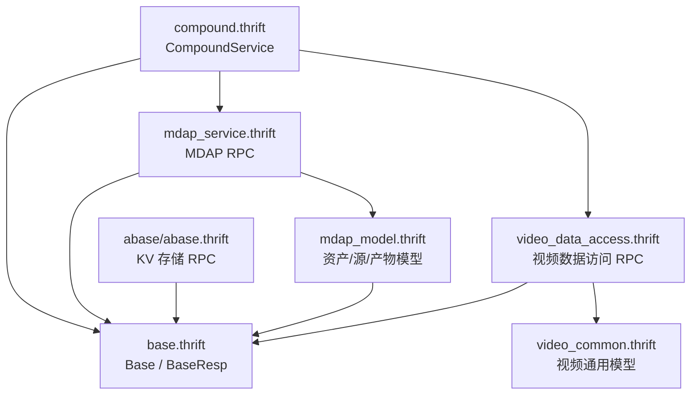
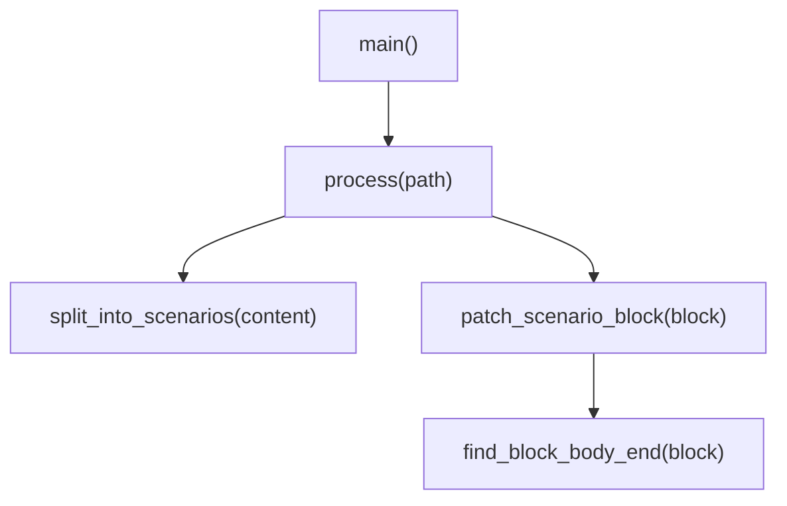

# Interface Definitions and Tooling

## 模块概览

`Interface Definitions and Tooling` 模块集中维护 Compound 的 Thrift 接口契约和少量文档/测试辅助脚本。它不包含服务实现逻辑，主要职责是定义跨服务通信的数据结构、RPC 方法、公共元信息，以及支撑仓库工程流程的脚本工具。

模块由两类文件组成：

- `idl/*.thrift`：Compound、MDAP、VDA、Abase 等服务和模型的接口定义。
- `script/*.py`：仓库级配置、living spec 覆盖字段补齐、远程单测结果分析工具。

## IDL 组织



`base.thrift` 是所有主要接口的公共依赖。业务 IDL 通过 `include` 引入它，并在请求/响应中使用字段号 `255` 承载 `base.Base` 或 `base.BaseResp`，这是本模块中最稳定的跨接口模式。

## 公共请求与响应元信息

`idl/base.thrift` 定义通用调用上下文：

- `TrafficEnv`：用于流量环境透传，包含 `Open` 和 `Env`。
- `Base`：请求侧元信息，包括 `LogID`、`Caller`、`Addr`、`Client`、可选 `TrafficEnv` 和 `Extra`。
- `BaseResp`：响应侧状态信息，包括 `StatusMessage`、`StatusCode` 和可选 `Extra`。

大多数 Compound、MDAP、VDA 接口都要求请求中携带 `Base`，响应中返回 `BaseResp`。新增接口时应保持字段号 `255` 的约定，避免破坏已有生成代码和调用习惯。

## CompoundService 接口

`idl/compound.thrift` 是 Compound 对外暴露的主接口，命名空间为：

```thrift
namespace go bytedance.videoarch.compound
```

它聚合了几组能力：

- MDAP 资产管理代理：`CreateAssetGroup`、`MGetAssetGroups`、`QueryAssetGroups`、`UpdateAssetGroup`、`DeleteAssetGroup`。
- MDAP Source 管理：`CreateSource`、`MGetSources`、`QuerySources`、`UpdateSource`。
- MDAP Artifact 管理：`CreateArtifact`、`MGetArtifacts`、`QueryArtifacts`。
- Fuxi 属性读写：`SetAttr`、`CopyAttr`、`DelAttr`、`Query`、`Del`、`Count`。
- 文件 URL 签发：`GetFileURLs`。
- 数据处理任务：`StartProcessing`。
- 内部索引维护：`TTL`、`UpdateIdxWithEventForInternal`、`RefreshIdxForInternal`。
- GSI 修复接口：`RepairIdxEntryForInternal`、`RepairIdxBucketForInternal`。

### 事件模型

`Event` 是 Compound 内部变更事件的核心结构，描述对象在某个 `Space`、`Schema`、`ID` 下发生的变更：

- `Type` 使用 `EventType` 表示 `CREATE`、`SET_ATTR`、`DEL_ATTR`、`DEL`。
- `Version` 使用 `Version.Before` 和 `Version.After` 表示版本推进。
- `Created`、`Updated`、`Deleted` 分别记录创建、更新、删除的属性路径和值。
- `Syncs` 使用 `SyncTarget` 标识命中的内部订阅系统，例如 `GSI`。
- `IdxSnapshot` 保存 GSI 构建索引键所需的补充列快照，减少消费端回源主表查询。

该结构服务于事件驱动链路：生产端在发送前预判内部订阅命中情况，并尽量补全索引所需字段；消费端根据 `Syncs` 和 `IdxSnapshot` 分流处理。

### Fuxi 属性接口

Fuxi 相关结构定义了对象属性的写入、复制、删除、查询和计数能力。

`SetAttrReq` 的核心字段包括：

- `Schema`、`ID`：定位对象。
- `Space`、`SchemaVersion`：可选空间和 schema 版本。
- `Values`：待写入的 `AttrVal` 列表。
- `Where`：可选条件写入。
- `WriteMode`：写模式，默认 `WriteMode.Upsert`。

`WriteMode.InsertOnly` 表示仅插入：对象已存在时返回 `AlreadyExists`，且不触发事件、唯一索引或主表写入副作用。新增调用方需要明确判断自身是否依赖历史 upsert 行为。

查询条件通过递归表达式树建模：

- `WhereClause` 可按 `Ids` 或 `Expression` 过滤。
- `Expression` 可以是叶子条件 `LeafCondition`，也可以是带 `LogicType` 的子表达式列表。
- `Operator` 支持 `EQ`、`NEQ`、`GT`、`LT`、`GTE`、`LTE`、`IN`、`NOT_IN`。

`QueryReq` 使用 `Select`、`From`、`Where`、`Sort`、`Limit`、`Offset` 描述查询；`QueryResp` 返回 `AttrMetas` 和三层列表结构 `AttrVals`。

### GSI 修复接口

`RepairIdxEntryForInternal` 和 `RepairIdxBucketForInternal` 是事务模式 GSI 的离线修复接口，只适用于 `IdxCfg.TxnSupported = true` 的索引。

`RepairIdxEntryReq` 接收最多 100 个 `RepairIdxEntryItem`。服务端根据 `Oid`、`Idx`、`Cols`、`Ver` 回源主表后自行决定修复动作，返回 `RepairIdxEntryResult.Action`：

- `"added"`：补写索引 entry。
- `"removed"`：删除错误 entry。
- `"skipped"`：无需处理或被跳过。
- `"failed"`：修复失败。

`RepairIdxBucketReq` 仅用于清理“空封口桶”。活跃桶和非空桶必须返回 skipped，不应被删除。

## MDAP 模型与服务

`idl/mdap_model.thrift` 定义 MDAP 的领域对象，`idl/mdap_service.thrift` 定义这些对象的 CRUD 接口。

核心模型包括：

- `AssetGroup`：资产组，包含 `Space`、`Name`、`MediaTypes`、`SourceConfigs`、`ArtifactConfig` 等。
- `Asset`：一组相关 Source 的集合。
- `Source`：原始媒体输入，包含 `MediaType`、`Format`、二进制 `Meta` 和 `SourceConfig`。
- `Artifact`：处理产物，支持从 Source 或 Artifact 派生。
- `ArtifactContent`：按 `ArtifactType` 保存截图、音频、图片等内容，并可通过 `ArtifactBlob` 管理二进制对象引用。

媒体元信息按类型拆分为 `VideoMeta`、`ImageMeta`、`AudioMeta`、`TextMeta`。其中 `VideoMeta` 可包含多路 `VideoStreamMeta` 和 `AudioStreamMeta`。

`mdap_service.thrift` 中的接口按资源分组：

- AssetGroup：`CreateAssetGroup`、`MGetAssetGroups`、`QueryAssetGroups`、`UpdateAssetGroup`、`DeleteAssetGroup`。
- Source：`CreateSource`、`MGetSources`、`QuerySources`、`UpdateSource`。
- Artifact：`CreateArtifact`、`MGetArtifacts`、`QueryArtifacts`。

Artifact 查询和批量获取支持签发 URL：

- `WithSignedURLs = true` 时启用 URL 签发。
- `URLParam` 指定 `DomainType` 和过期时间。
- `Auth` 在签发 URL 时必填。

## 视频数据访问 IDL

`idl/video_common.thrift` 定义视频领域通用结构，`idl/video_data_access.thrift` 定义 VDA 服务接口。

常用通用模型包括：

- `VideoCommonInfo`：原视频或文件信息，包含 `FileID`、`FileName`、`MetaInfo`、`FileHash`、`Extra`、`FileExtra`。
- `EncodedVideoInfo`：转码视频信息，包含 `OriginalID`、`EncodedID`、`EncodedType`、`Codec`、`LogoType` 等。
- `UploadRecord`：上传记录。
- `PosterCandidate`：候选封面。
- `OriginalVideo`：创建原视频时的一体化字段集合。
- `UserAction`、`VideoStatus`：播放状态和视频状态枚举，并通过 `UserActionIDMap`、`VideoStatusIDMap` 提供字符串到 ID 的常量映射。

`VideoDataAccessService` 覆盖视频数据的写入、读取、缓存、状态更新、URI 引用和迁移场景。典型接口包括：

- 写入原视频：`MCreateOriginalVideo`、`CreateUploadRecord`、`CreateVideoInfo`、`CreateEncodedVideoInfo`。
- 读取视频组信息：`MGetVideoInfo`、`PlayerMGetVideoInfo`、`MGetVideoInfoFromDB`。
- 缓存刷新：`MRefreshVideoInfo`、`GetVideoInfoFromCache`。
- 属性更新：`UpdateVideoExtra`、`MUpdateVideoExtra`、`UpsertVideoExtras`。
- URI 引用：`QueryUriReference`、`MQueryUriReferences`、`UpsertUriReference`、`DeleteURIReference`。
- 数据层读写：`InsertVideoUploadExtras`、`InsertVideoInfosExtras`、`ReadRawVideo`、`WriteRawVideo`。

需要注意读取接口的一致性差异：

- `MGetVideoInfo` 是默认推荐接口，但可能和后端数据库有 1 到 3 秒延迟。
- `PlayerMGetVideoInfo` 使用本地缓存，QPS 更高，但可能有 1 到 10 秒延迟。
- `MGetVideoInfoFromDB` 直接访问 MySQL，提供最强一致性，但不推荐常规业务直接使用。

## Abase KV 接口

`idl/abase/abase.thrift` 定义 Abase KV 服务接口，命名空间覆盖 `cpp`、`go`、`py`、`java`。该文件相对独立，但同样依赖 `base.thrift`。

主要能力包括：

- 单 key 操作：`Get`、`Set`、`Del`、`IncrBy`、`Append`、`Expire`。
- 批量操作：`BatchGet`、`BatchSet`、`BatchDel`、`BatchIncrBy`、`BatchAppend`、`BatchExpire`。
- CAS 风格操作：`XGet`、`XSet`、`BatchXGet`、`BatchXSet`。
- 扫描：`ScanRow`。

关键约束：

- `ttl = 0` 表示永不过期。
- `SetRequest` 中 `ttl_type` 和 `ttl` 必须同时设置才生效，否则按永不过期处理。
- `XSetRequest` 中 `ttl_type` 和 `ttl` 必须同时设置，否则返回错误。
- `XGet` 即使 key 不存在也可能返回 `Success`，调用方应使用返回的 `generation` 做 CAS。
- 批量响应通过 `BatchResponseCode` 表示整体状态；即使整体为 `Error`，调用方也必须逐条检查子响应的 `errCode`。

## 工具脚本

### `script/settings.py`

`settings.py` 是仓库级元配置：

```python
PRODUCT = "bytedance"
SUBSYSTEM = "videoarch"
MODULE = "compound"
APP_TYPE = "binary"
```

其他工程工具可以读取这些常量识别仓库归属和模块类型。

### `script/spec-add-coverage-tbd.py`

该脚本用于批量给 living spec 或 spec-delta 中缺少覆盖测试字段的 Scenario 补充：

```markdown
**覆盖测试**: TBD(待补全：归档前由 Owner 替换为真实测试路径)
```

执行入口是 `main()`，处理流程是：



关键函数职责：

- `split_into_scenarios(content)`：按 `#### Scenario:` 切分文档，并保留 Scenario header。
- `patch_scenario_block(block)`：如果 Scenario 内没有 `**覆盖测试**` 字段，就在段落尾部插入 TBD 行。
- `find_block_body_end(block)`：定位 Scenario 内容结束位置，遇到 `##` 或 `###` 标题时停止。
- `process(path)`：读取文件、逐个 Scenario patch，并在内容变化时写回。
- `main()`：遍历命令行参数中的 spec 文件并输出处理统计。

脚本只识别以 `#### Scenario:` 开头的场景块；如果文档使用其他标题格式，不会被处理。

### `script/utd_analyze.py`

`utd_analyze.py` 用于分析远程 UT 结果，将状态文件、日志和结构化报告汇总为 JSON 和文本树。

主流程由 `main()` 编排：

1. 解析命令行参数。
2. 通过 `_read_json_file()` 读取 `status.json`。
3. 优先从 `--utd-log` 中调用 `_extract_go_test_failures_from_utd_log()` 提取 Go test JSON 失败信息。
4. 如果日志中没有失败信息，再调用 `_maybe_structured_failures_from_result_dir()` 从结果目录解析 XML、JSONL、NDJSON。
5. 调用 `_to_report()` 生成结构化 report。
6. 调用 `_format_tree()` 生成可读文本。
7. 通过 `_safe_write_json()` 和 `_safe_write_text()` 写出结果。

主要解析函数：

- `_parse_go_test_json_events(text)`：逐行解析 Go test JSON event。
- `_extract_go_test_failures_from_utd_log(path)`：按 package 和 test 聚合 `run`、`pass`、`fail`、`skip`、`output` 事件，生成失败列表。
- `_parse_junit_xml(path)`：解析 JUnit XML 中的 `failure` 和 `error` 节点。
- `_maybe_structured_failures_from_result_dir(result_dir)`：遍历报告目录，跳过 `status.json`、`exception.json`、`pipeline_meta.json`，解析 XML 和 JSONL/NDJSON。
- `_to_report(repo_root, status, result_dir, failures)`：生成标准 report，并通过 `_sanitize_url()` 移除远程 job URL 查询参数中的 `token`。
- `_format_tree(report, max_failures_per_pkg, max_detail_lines)`：将 report 转为面向终端阅读的失败树。

`_extract_file_line(text, repo_root)` 会从失败详情中提取第一个 `*.go:line` 位置；如果路径是绝对路径且提供了 `repo_root`，会转成相对路径，便于开发者定位失败。

## 维护建议

新增或修改 Thrift 接口时，应优先保持已有模式：

- 请求/响应继续使用 `255: required base.Base Base` 或 `255: required base.BaseResp BaseResp`，除非历史接口已经是 optional。
- 新字段使用新的字段号，不复用已删除字段号。
- 对外语义变化必须写在 struct、enum 或 service 方法旁的注释中。
- 对批量接口，响应中保留逐条结果，避免只返回整体成功/失败。
- 对内部接口，在方法名或注释中明确 `ForInternal`、调用方范围和使用约束。

修改脚本时，应保留当前执行流的幂等性：

- `spec-add-coverage-tbd.py` 已存在 `**覆盖测试**` 时不重复插入。
- `utd_analyze.py` 读取失败时倾向返回空结果而不是中断，以便 CI 后处理流程尽量产出报告。
- 输出远程 URL 前必须继续调用 `_sanitize_url()`，避免泄露 `token`。